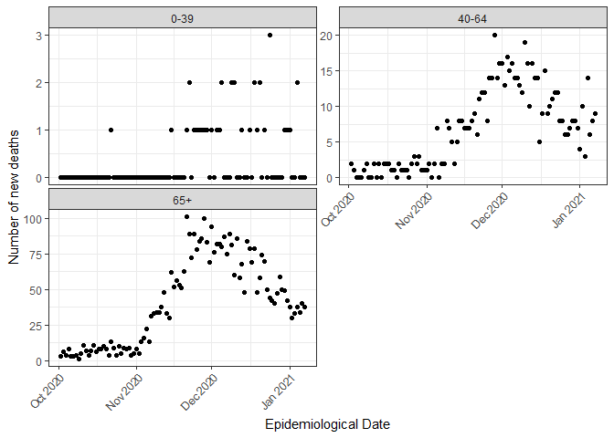

<!-- README.md is generated from README.Rmd. Please edit that file -->

# Bernadette 

<!-- badges: start -->

[](https://github.com/bernadette-eu/Bernadette/actions)
[](https://cran.r-project.org/package=Bernadette)
[](https://Bernadette.r-universe.dev/ui/#package:Bernadette)
[](https://github.com/bernadette-eu/Bernadette/commits/main)
[](https://lifecycle.r-lib.org/articles/stages.html#stable)
[](https://shinyus.ipub.com/cranview/)
[](https://shinyus.ipub.com/cranview/)
<!-- badges: end -->

NOTE: This documentation is work in progress.

## Contribution

This R package is provided for use under the
[GPL-3.0](https://www.gnu.org/licenses/gpl-3.0.en.html) License by the
author. Please use the [issue
tracker](https://github.com/bernadette-eu/Bernadette/issues) for bug
reports and feature requests. All contributions are welcome, in
particular those that improve the approach or the robustness of the code
base. We also welcome additions and extensions to the underlying model
either in the form of options or improvements.

## Overview

The **Bernadette** (“Bayesian inference and model selection for
stochastic epidemics”) R package provides a framework for Bayesian
analysis of infectious disease transmission dynamics via diffusion
driven multi-type epidemic models with time-varying coefficients, with a
particular focus on Coronavirus Disease 2019 (COVID-19). For models fit
using Markov chain Monte Carlo, it allows for computation of approximate
leave-one-out cross-validation (LOO, LOOIC) or the Widely Applicable
Information Criterion (WAIC) using the **loo** package for model
checking and comparison.

## Website

The website for the BERNADETTE Marie Sklodowska-Curie Action (MSCA) is
available at: <https://bernadette-eu.github.io/>.

## Installation

Installation of the package requires you to have a working C++
toolchain. To ensure that this is working, please first install
**rstan** by following these [installation
instructions](https://github.com/stan-dev/rstan/wiki/RStan-Getting-Started)
from the Rstan wiki.

The following must return `TRUE` before continuing:

    if (!require("pkgbuild")) {
      install.packages("pkgbuild")
    }
    pkgbuild::has_build_tools(debug = TRUE)

Having installed **rstan**, you can then install the latest development
version of **Bernadette** (requires the
[devtools](https://github.com/r-lib/devtools) package) from
[GitHub](https://github.com/) with:

``` r
if (!require("devtools")) {
  install.packages("devtools")
}
devtools::install_github("bernadette-eu/Bernadette", dependencies = TRUE, build_vignettes = FALSE)
```

or the latest version on CRAN

``` r
install.packages("Bernadette")
```

## Load any required libraries

``` r
lib <- c("stats",
         "ggplot2",
         "rstan",
         "bayesplot",
         "Bernadette",
         "loo")
lapply(lib, require, character.only = TRUE)
```

## Example - COVID-19 in Greece

The time series of new daily age-specific mortality and incidence counts
are ordered by epidemiological date. The time horizon in the example
datasets for Greece spans from 2020-08-31 to 2021-03-28 (210 days).

``` r
Sys.setlocale("LC_ALL", "English")
data(age_specific_mortality_counts)
data(age_specific_infection_counts)
```

<!-- -->

The model described below can be computationally expensive to implement
and so we restrict the analysis to a shorter time horizon. We analyse
the subset from 2020-10-02 to 2021-01-07 (98 days):

``` r
age_specific_mortality_counts <- subset(age_specific_mortality_counts, Date >= "2020-10-02" & Date <= "2021-01-07")
age_specific_infection_counts <- subset(age_specific_infection_counts, Date >= "2020-10-02" & Date <= "2021-01-07")
```

<!-- -->

Let’s import the rest of the datasets required for model fitting. First,
import and plot the age distribution for Greece in 2020:

``` r
age_distr <- age_distribution(country = "Greece", year = 2020)
plot_age_distribution(age_distr)
```

<!-- -->

Information is available for sixteen 5-year age groups, with the last
one being “75+”. We shall consider three age groups, {0-39, 40-64, 65+},
by providing the following lookup table:

``` r
lookup_table <- data.frame(Initial = age_distr$AgeGrp,
                           Mapping = c(rep("0-39",  8),
                                       rep("40-64", 5),
                                       rep("65+"  , 3)))
aggr_age <- aggregate_age_distribution(age_distr, lookup_table)
plot_age_distribution(aggr_age)
```

<!-- -->

Next, import the projected contact matrix for Greece:

``` r
conmat <- contact_matrix(country = "GRC")
plot_contact_matrix(conmat)
```

<!-- -->

Aggregate the contact matrix to the age groups {0-39, 40-64, 65+}:

``` r
aggr_cm <- aggregate_contact_matrix(conmat, lookup_table, aggr_age)
plot_contact_matrix(aggr_cm)
```

<!-- -->

Obtain estimates of the age-specific infection-fatality-ratio:

``` r
ifr_mapping <- c(rep("0-39", 8), rep("40-64", 5), rep("65+", 3))
aggr_age_ifr <- aggregate_ifr_react(age_distr, ifr_mapping, age_specific_infection_counts)
```

Provide the infection-to-death distribution with a mean of 24.19 days:

``` r
ditd <- itd_distribution(ts_length  = nrow(age_specific_mortality_counts),
                         gamma_mean = 24.19231,
                         gamma_cv   = 0.3987261)
```

## Modeling framework

The aforementioned data streams and expert knowledge are integrated into
a coherent modeling framework via a Bayesian evidence synthesis
approach. Τhe modeling process is separated into a latent epidemic
process and an observation process in an effort to reduce sensitivity to
observation noise and to allow for more flexibility in modeling
different forms of data.

### Diffusion-driven multi-type transmission process

The transmission of COVID-19 is modeled through an age-stratified
deterministic Susceptible-Exposed-Infectious-Removed (SEIR)
compartmental model with Erlang-distributed latent and infectious
periods. In particular, we introduce Erlang-distributed stage durations
in the Exposed and Infected compartments and relax the mathematically
convenient but unrealistic assumption of exponential stage durations by
assuming that each of the Exposed and Infected compartments are defined
by two stages, with the same rate of loss of latency
() and
infectiousness
() in
both stages. Removed individuals are assumed to be immune to reinfection
for at least the duration of the study period.

The population is stratified into

age groups and the total size of the age group is denoted by
,
where

represents the number of susceptible,

represents the number of exposed but not yet infectious,

is the number of infected and

is the number of removed individuals at time
 at age group
. The
number of individuals in each compartment is scaled by the total
population
,
so that the sum of all compartments equals to one. The latent epidemic
process is expressed by the following non-linear system of ordinary
differential equations (ODEs)

![\begin{cases}
\frac{dS^{\alpha}\_{t}}{dt}   & = -\lambda\_{\alpha}(t) S^{\alpha}\_{t},
\\\\
\frac{dE^{\alpha}\_{1,t}}{dt} & = \lambda\_{\alpha}(t) S^{\alpha}\_{t} - \tau E^{\alpha}\_{1,t},
\\\\
\frac{dE^{\alpha}\_{2,t}}{dt} & = \tau \left( E^{\alpha}\_{1,t} - E^{\alpha}\_{2,t}\right),
\\\\
\frac{dI^{\alpha}\_{1,t}}{dt} & = \tau E^{\alpha}\_{2,t} - \gamma I^{\alpha}\_{1,t},
\\\\
\frac{dI^{\alpha}\_{2,t}}{dt} & = \gamma \left( I^{\alpha}\_{1,t} - I^{\alpha}\_{2,t}\right),
\\\\
\frac{dR^{\alpha}\_{t}}{dt}   & = \gamma I^{\alpha}\_{2,t},
\end{cases}](https://latex.codecogs.com/png.latex?%5Cbegin%7Bcases%7D%0A%5Cfrac%7BdS%5E%7B%5Calpha%7D_%7Bt%7D%7D%7Bdt%7D%20%20%20%26%20%3D%20-%5Clambda_%7B%5Calpha%7D%28t%29%20S%5E%7B%5Calpha%7D_%7Bt%7D%2C%0A%5C%5C%0A%5Cfrac%7BdE%5E%7B%5Calpha%7D_%7B1%2Ct%7D%7D%7Bdt%7D%20%26%20%3D%20%5Clambda_%7B%5Calpha%7D%28t%29%20S%5E%7B%5Calpha%7D_%7Bt%7D%20-%20%5Ctau%20E%5E%7B%5Calpha%7D_%7B1%2Ct%7D%2C%0A%5C%5C%0A%5Cfrac%7BdE%5E%7B%5Calpha%7D_%7B2%2Ct%7D%7D%7Bdt%7D%20%26%20%3D%20%5Ctau%20%5Cleft%28%20E%5E%7B%5Calpha%7D_%7B1%2Ct%7D%20-%20E%5E%7B%5Calpha%7D_%7B2%2Ct%7D%5Cright%29%2C%0A%5C%5C%0A%5Cfrac%7BdI%5E%7B%5Calpha%7D_%7B1%2Ct%7D%7D%7Bdt%7D%20%26%20%3D%20%5Ctau%20E%5E%7B%5Calpha%7D_%7B2%2Ct%7D%20-%20%5Cgamma%20I%5E%7B%5Calpha%7D_%7B1%2Ct%7D%2C%0A%5C%5C%0A%5Cfrac%7BdI%5E%7B%5Calpha%7D_%7B2%2Ct%7D%7D%7Bdt%7D%20%26%20%3D%20%5Cgamma%20%5Cleft%28%20I%5E%7B%5Calpha%7D_%7B1%2Ct%7D%20-%20I%5E%7B%5Calpha%7D_%7B2%2Ct%7D%5Cright%29%2C%0A%5C%5C%0A%5Cfrac%7BdR%5E%7B%5Calpha%7D_%7Bt%7D%7D%7Bdt%7D%20%20%20%26%20%3D%20%5Cgamma%20I%5E%7B%5Calpha%7D_%7B2%2Ct%7D%2C%0A%5Cend%7Bcases%7D "\begin{cases}
\frac{dS^{\alpha}_{t}}{dt}   & = -\lambda_{\alpha}(t) S^{\alpha}_{t},
\\
\frac{dE^{\alpha}_{1,t}}{dt} & = \lambda_{\alpha}(t) S^{\alpha}_{t} - \tau E^{\alpha}_{1,t},
\\
\frac{dE^{\alpha}_{2,t}}{dt} & = \tau \left( E^{\alpha}_{1,t} - E^{\alpha}_{2,t}\right),
\\
\frac{dI^{\alpha}_{1,t}}{dt} & = \tau E^{\alpha}_{2,t} - \gamma I^{\alpha}_{1,t},
\\
\frac{dI^{\alpha}_{2,t}}{dt} & = \gamma \left( I^{\alpha}_{1,t} - I^{\alpha}_{2,t}\right),
\\
\frac{dR^{\alpha}_{t}}{dt}   & = \gamma I^{\alpha}_{2,t},
\end{cases}")

where the mean latent and infectious periods are
,
,
respectively. The number of new infections in age group
 at day
 is


The time-dependent force of infection
")
for age group

is expressed as

![\lambda\_{\alpha}(t) = \sum\_{\alpha'=1}^{A}\left\[ m\_{\alpha,\alpha'}(t) \frac{\left(I^{\alpha'}\_{1,t} + I^{\alpha'}\_{2,t}\right)}{\mathbb{N}\_{\alpha'}}\right\],](https://latex.codecogs.com/png.latex?%5Clambda_%7B%5Calpha%7D%28t%29%20%3D%20%5Csum_%7B%5Calpha%27%3D1%7D%5E%7BA%7D%5Cleft%5B%20m_%7B%5Calpha%2C%5Calpha%27%7D%28t%29%20%5Cfrac%7B%5Cleft%28I%5E%7B%5Calpha%27%7D_%7B1%2Ct%7D%20%2B%20I%5E%7B%5Calpha%27%7D_%7B2%2Ct%7D%5Cright%29%7D%7B%5Cmathbb%7BN%7D_%7B%5Calpha%27%7D%7D%5Cright%5D%2C "\lambda_{\alpha}(t) = \sum_{\alpha'=1}^{A}\left[ m_{\alpha,\alpha'}(t) \frac{\left(I^{\alpha'}_{1,t} + I^{\alpha'}_{2,t}\right)}{\mathbb{N}_{\alpha'}}\right],")

which is a function of the proportion of infectious individuals in each
age group
,
via the compartments
,

divided by the total size of the age group
,
and the time-varying person-to-person transmission rate from group
 to
group
,
").
We parameterize the transmission rate between different age groups
 \in \{1,\ldots,A\}^2")
by

 = \beta^{\alpha\alpha'}_{t} \cdot C_{\alpha,\alpha'},")

breaking down the transmission rate matrix into its biological and
social components: the social component is represented by the average
number of contacts between individuals of age group
 and
age group

via the contact matrix element
;

is the time-varying transmissibility of the virus, the probability that
a contact between an infectious person in age group
 and a
susceptible person in age group

leads to transmission at time
.

The formulation below may be viewed as a stochastic extension to the
deterministic multi-type SEIR model, using diffusion processes for the
coefficients
,
driven by independent Brownian motions

, 
\\
x^{\alpha\alpha'}_{t} \mid x^{\alpha\alpha'}_{t - 1}, \sigma^{\alpha\alpha'}_x & \sim \operatorname{N}(x^{\alpha\alpha'}_{t - 1}, (\sigma^{\alpha\alpha'})^2_x), 
\\
dx^{\alpha\alpha'}_{t} & = \sigma^{\alpha\alpha'}_{x}dW^{\alpha\alpha'}_{t},
\\
dW^{\alpha\alpha'}_{t} & \sim \operatorname{N}(0,d_{t}),
\end{cases}")

with volatilities
,
corresponding to the case of little information on the shape of
.
The volatility

plays the role of the regularizing factor: higher values of

lead to greater changes in
.
The exponential transformation avoids negative values which have no
biological meaning.

A major advantage of considering a diffusion process for modeling

is its ability to capture and quantify the randomness of the underlying
transmission dynamics, which is particularly useful when the dynamics
are not completely understood. The diffusion process accounts for
fluctuations in transmission that are influenced by non-modeled
phenomena, such as new variants, mask-wearing propensity, etc. The
diffusion process also allows for capturing the effect of unknown
extrinsic factors on the age-stratified force of infection, for
monitoring of the temporal evolution of the age-specific transmission
rate without the implicit inclusion of external variables and for
tackling non-stationarity in the data.

We propose a diffusion-driven multi-type latent transmission model which
assigns independent Brownian motions to
, \log(\beta^{22}_{t}), \ldots, \log(\beta^{AA}_{t})")
with respective age-stratified volatility parameters
,
for reasons of parsimony and interpretability. The contact matrix is
scaled by the age-stratified transmissibility in order to obtain the
transmission rate matrix process

 = \beta^{\alpha\alpha'}_{t}
\cdot
C_{\alpha,\alpha'}
\equiv 
\beta^{\alpha\alpha}_{t}
\cdot
C_{\alpha,\alpha'}")

under the assumption
.

### Observation process

Denote the number of observed deaths on day

in age group

by
.
A given infection may lead to observation events (i.e deaths) in the
future. A link between

and the expected number of new age-stratified infections is established
via the function

![\begin{equation}
d\_{t,\alpha} = \mathbb{E}\[y\_{t,\alpha}\] = \widehat{\text{IFR}}\_{\alpha} \times \sum\_{s = 1}^{t-1}h\_{t-s} \Delta^{\text{infec}}\_{s, \alpha}
\end{equation}](https://latex.codecogs.com/png.latex?%5Cbegin%7Bequation%7D%0Ad_%7Bt%2C%5Calpha%7D%20%3D%20%5Cmathbb%7BE%7D%5By_%7Bt%2C%5Calpha%7D%5D%20%3D%20%5Cwidehat%7B%5Ctext%7BIFR%7D%7D_%7B%5Calpha%7D%20%5Ctimes%20%5Csum_%7Bs%20%3D%201%7D%5E%7Bt-1%7Dh_%7Bt-s%7D%20%5CDelta%5E%7B%5Ctext%7Binfec%7D%7D_%7Bs%2C%20%5Calpha%7D%0A%5Cend%7Bequation%7D "\begin{equation}
d_{t,\alpha} = \mathbb{E}[y_{t,\alpha}] = \widehat{\text{IFR}}_{\alpha} \times \sum_{s = 1}^{t-1}h_{t-s} \Delta^{\text{infec}}_{s, \alpha}
\end{equation}")

on the new expected age-stratified mortality counts,
,
the estimated age-stratified infection fatality rate,
,
and the infection-to-death distribution
, where
 gives the
probability the death occurs on the

day after infection, is assumed to be gamma distributed with mean 24.2
days and coefficient of variation 0.39, that is

.
\end{equation}")

We allow for over-dispersion in the observation processes to account for
noise in the underlying data streams, for example due to day-of-week
effects on data collection, and link

to

through an over-dispersed count model

,
\end{equation}")

where
,
such that
![\mathbb{V}\[y\_{t,\alpha}\] = d\_{t,\alpha}(1+\phi)](https://latex.codecogs.com/png.latex?%5Cmathbb%7BV%7D%5By_%7Bt%2C%5Calpha%7D%5D%20%3D%20d_%7Bt%2C%5Calpha%7D%281%2B%5Cphi%29 "\mathbb{V}[y_{t,\alpha}] = d_{t,\alpha}(1+\phi)").
The log-likelihood of the observed deaths is given by

 = \sum_{t=1}^{T}\sum_{\alpha=1}^{A}\text{logNegBin}\left(y_{t,\alpha}\mid d_{t,\alpha}, \xi_{t,\alpha}\right),
\end{equation}")

where

are the surveillance data on deaths for all time-points.

### Prior specification

The unknown quantities that need to be inferred are
")
for

for
 \in \{1,\ldots,A\}^2")

The proposed prior distributions for the model parameters are:

## Model fitting

Find the number of cores in your machine and indicate how many will be
used for parallel processing:

``` r
parallel::detectCores()
rstan_options(auto_write = TRUE)

# Here we sample from four Markov chains in parallel:
chains <- 6

options(mc.cores = chains)
```

Sample from the posterior distribution of the parameters using the
Hamiltonian Monte Carlo algorithm implemented in Stan - Note that a
longer time horizon and/or a greater number of age groups in `y_data`
will lead to increased CPU time:

``` r
igbm_fit <- stan_igbm(y_data                     = age_specific_mortality_counts,
                      contact_matrix              = aggr_cm,
                      age_distribution_population = aggr_age,
                      age_specific_ifr            = aggr_age_ifr[[3]],
                      itd_distr                   = ditd,
                      incubation_period           = 3,
                      infectious_period           = 4,
                      likelihood_variance_type    = "linear",
                      prior_scale_x0              = 5,
                      prior_scale_contactmatrix   = 0.05,
                      pi_perc                     = 0.1,
                      prior_volatility            = normal(location = 0, scale = 4),
                      prior_nb_dispersion         = exponential(rate = 1/5),
                      algorithm_inference         = "sampling",
                      nBurn                       = 500,
                      nPost                       = 500,
                      nThin                       = 1,
                      chains                      = chains,
                      adapt_delta                 = 0.8,
                      max_treedepth               = 14,
                      seed                        = 1,
                      init                        = sampler_init)
```

## Summarise the distributions of estimated parameters and derived quantities using the posterior draws.

``` r
print_summary <- summary(object = igbm_fit,
                         y_data = age_specific_mortality_counts)
round(print_summary$summary, 3)
```

## MCMC diagnostic plots

Example - Pairs plots between some parameters:

``` r
volatilities_names <- paste0("volatilities","[", 1:ncol(age_specific_mortality_counts[,-c(1:5)]),"]")
posterior_1        <- as.array(igbm_fit)
```

``` r
bayesplot::mcmc_pairs(posterior_1,
                      pars          = volatilities_names,
                      off_diag_args = list(size = 1.5))
```

## Plot the posterior estimates of epidemiological quantities

Visualise the posterior distribution of the random contact matrix:

``` r
plot_posterior_cm(igbm_fit, y_data = age_specific_mortality_counts)
```

Visualise the posterior distribution (age-specific or aggregated daily
estimates) of the infection counts:

``` r
post_inf_summary <- posterior_infections(object = igbm_fit,
                                         y_data = age_specific_mortality_counts)
```

``` r
plot_posterior_infections(post_inf_summary, type = "age-specific")
```

``` r
plot_posterior_infections(post_inf_summary, type = "aggregated")
```

Visualise the posterior distribution (age-specific or aggregated daily
estimates) of the mortality counts:

``` r
post_mortality_summary <- posterior_mortality(object = igbm_fit,
                                              y_data = age_specific_mortality_counts)
```

``` r
plot_posterior_mortality(post_mortality_summary, type = "age-specific")
```

``` r
plot_posterior_mortality(post_mortality_summary, type = "aggregated")
```

Visualise the posterior distribution of the effective reproduction
number:

``` r
post_rt_summary <- posterior_rt(object                      = igbm_fit,
                                y_data                      = age_specific_mortality_counts,
                                age_distribution_population = aggr_age,
                                infectious_period           = 4)
plot_posterior_rt(post_rt_summary)
```

Visualise the posterior distribution of the age-specific transmission
rate:

``` r
post_transmrate_summary <- posterior_transmrate(object = igbm_fit,
                                                y_data = age_specific_mortality_counts)
plot_posterior_transmrate(post_transmrate_summary)
```

## Model checking and comparison with loo

For more information about the **loo** package visit the [dedicated
website](https://mc-stan.org/loo/).

``` r
# (for bigger models use as many cores as possible)
log_lik_1 <- loo::extract_log_lik(igbm_fit, merge_chains = FALSE)
r_eff_1   <- loo::relative_eff(exp(log_lik_1), cores = 4)
```

The estimated LOO Information Criterion and the respective estimated
effective number of parameters are given by

``` r
loo_1 <- loo::loo(log_lik_1, r_eff = r_eff_1, cores = 4)
print(loo_1)
```

The estimated Widely Applicable Information Criterion and the respective
estimated effective number of parameters are given by

``` r
waic_1 <- loo::waic(log_lik_1)
print(waic_1)
```
