<!-- README.md is generated from README.Rmd. Please edit that file -->

# Bernadette 

<!-- badges: start -->

[](https://github.com/bernadette-eu/Bernadette/actions)
[](https://cran.r-project.org/package=Bernadette)
[](https://Bernadette.r-universe.dev/ui/#package:Bernadette)
[](https://github.com/bernadette-eu/Bernadette/commits/main)
[](https://lifecycle.r-lib.org/articles/stages.html#stable)
[](https://shinyus.ipub.com/cranview/)
[](https://shinyus.ipub.com/cranview/)
[](https://joss.theoj.org/papers/8ee5ffed37ccbd0a8de519553da6ceea)

<!-- badges: end -->

## Contribution

This R package is provided for use under the
[GPL-3.0](https://www.gnu.org/licenses/gpl-3.0.en.html) License by the
author. Please use the [issue
tracker](https://github.com/bernadette-eu/Bernadette/issues) for bug
reports and feature requests. All contributions are welcome, in
particular those that improve the approach or the robustness of the code
base. We also welcome additions and extensions to the underlying model
either in the form of options or improvements.

## Overview

The **Bernadette** (“Bayesian inference and model selection for
stochastic epidemics”) R package provides a framework for Bayesian
analysis of infectious disease transmission dynamics via diffusion
driven multi-type epidemic models with time-varying coefficients, with a
particular focus on Coronavirus Disease 2019 (COVID-19). For models fit
using Markov chain Monte Carlo, it allows for computation of approximate
leave-one-out cross-validation (LOO, LOOIC) or the Widely Applicable
Information Criterion (WAIC) using the **loo** package for model
checking and comparison.

## Website

The website for the BERNADETTE Marie Sklodowska-Curie Action (MSCA) is
available at: <https://bernadette-eu.github.io/>.

## Installation

Installation of the package requires you to have a working C++
toolchain. To ensure that this is working, please first install
**rstan** by following these [installation
instructions](https://github.com/stan-dev/rstan/wiki/RStan-Getting-Started)
from the Rstan wiki.

The following must return `TRUE` before continuing:

    if (!require("pkgbuild")) {
      install.packages("pkgbuild")
    }
    pkgbuild::has_build_tools(debug = TRUE)

Having installed **rstan**, you can then install the latest development
version of **Bernadette** (requires the
[devtools](https://github.com/r-lib/devtools) package) from
[GitHub](https://github.com/) with:

``` r
if (!require("devtools")) {
  install.packages("devtools")
}
devtools::install_github("bernadette-eu/Bernadette", dependencies = TRUE, build_vignettes = FALSE)
```

or the latest version on CRAN

``` r
install.packages("Bernadette")
```

## Load any required libraries

``` r
lib <- c("stats",
         "ggplot2",
         "rstan",
         "bayesplot",
         "Bernadette",
         "loo")
lapply(lib, require, character.only = TRUE)
```

## Example - COVID-19 in Greece

The time series of new daily age-specific mortality and incidence counts
are ordered by epidemiological date. The time horizon in the example
datasets for Greece spans from 2020-08-31 to 2021-03-28 (210 days).

``` r
Sys.setlocale("LC_ALL", "English")
data(age_specific_mortality_counts)
data(age_specific_cusum_infection_counts)
```

<!-- -->

Let’s import the rest of the datasets required for model fitting. First,
import and plot the age distribution for Greece in 2020:

``` r
age_distr <- age_distribution(country = "Greece", year = 2020)
plot_age_distribution(age_distr)
```

<!-- -->

Information is available for sixteen 5-year age groups, with the last
one being “75+”. We shall consider three age groups, {0-39, 40-64, 65+},
by providing the following lookup table:

``` r
lookup_table <- data.frame(Initial = age_distr$AgeGrp,
                           Mapping = c(rep("0-39",  8),
                                       rep("40-64", 5),
                                       rep("65+"  , 3)))
aggr_age <- aggregate_age_distribution(age_distr, lookup_table)
plot_age_distribution(aggr_age)
```

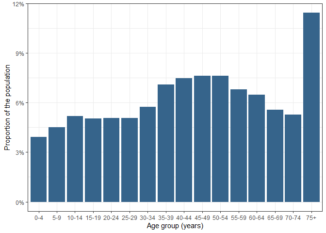<!-- -->

Next, import the projected contact matrix for Greece:

``` r
conmat <- contact_matrix(country = "GRC")
plot_contact_matrix(conmat)
```

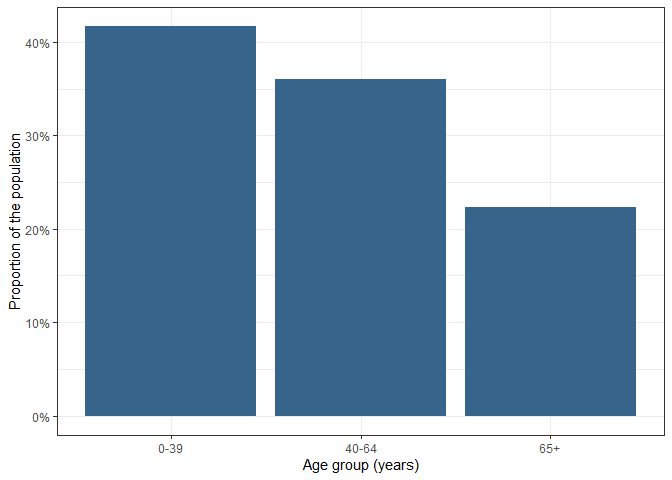<!-- -->

Aggregate the contact matrix to the age groups {0-39, 40-64, 65+}:

``` r
aggr_cm <- aggregate_contact_matrix(conmat, lookup_table, aggr_age)
plot_contact_matrix(aggr_cm)
```

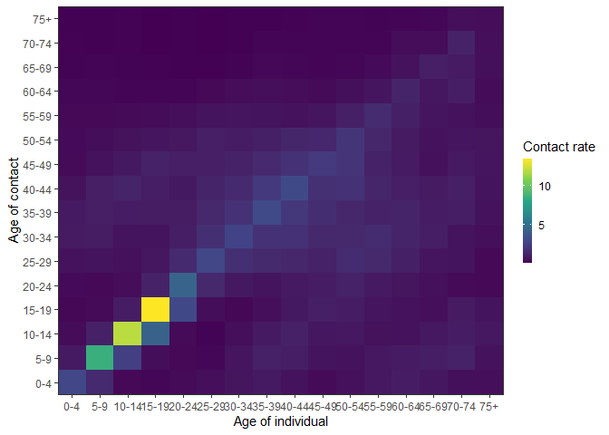<!-- -->

Obtain estimates of the age-specific infection-fatality-ratio:

``` r
ifr_mapping <- c(rep("0-39", 8), rep("40-64", 5), rep("65+", 3))
aggr_age_ifr <- aggregate_ifr_react(age_distr, ifr_mapping, age_specific_infection_counts)
```

Provide the infection-to-death distribution with a mean of 24.19 days:

``` r
ditd <- itd_distribution(ts_length  = nrow(age_specific_mortality_counts),
                         gamma_mean = 24.19231,
                         gamma_cv   = 0.3987261)
```

## Modeling framework

The aforementioned data streams and expert knowledge are integrated into
a coherent modeling framework via a Bayesian evidence synthesis
approach. Τhe modeling process is separated into a latent epidemic
process and an observation process in an effort to reduce sensitivity to
observation noise and to allow for more flexibility in modeling
different forms of data.

### Diffusion-driven multi-type transmission process

The transmission of COVID-19 is modeled through an age-stratified
deterministic Susceptible-Exposed-Infectious-Removed (SEIR)
compartmental model with Erlang-distributed latent and infectious
periods. In particular, we introduce Erlang-distributed stage durations
in the Exposed and Infected compartments and relax the mathematically
convenient but unrealistic assumption of exponential stage durations by
assuming that each of the Exposed and Infected compartments are defined
by two stages, with the same rate of loss of latency
() and
infectiousness
() in
both stages. Removed individuals are assumed to be immune to reinfection
for at least the duration of the study period.

The population is stratified into

age groups and the total size of the age group is denoted by
,
where

represents the number of susceptible,

represents the number of exposed but not yet infectious,

is the number of infected and

is the number of removed individuals at time
 at age group
. The
number of individuals in each compartment is scaled by the total
population
,
so that the sum of all compartments equals to one. The latent epidemic
process is expressed by the following non-linear system of ordinary
differential equations (ODEs)

![\begin{cases}
\frac{dS^{\alpha}\_{t}}{dt}   & = -\lambda\_{\alpha}(t) S^{\alpha}\_{t}
\\\\
\frac{dE^{\alpha}\_{1,t}}{dt} & = \lambda\_{\alpha}(t) S^{\alpha}\_{t} - \tau E^{\alpha}\_{1,t}
\\\\
\frac{dE^{\alpha}\_{2,t}}{dt} & = \tau \left( E^{\alpha}\_{1,t} - E^{\alpha}\_{2,t}\right)
\\\\
\frac{dI^{\alpha}\_{1,t}}{dt} & = \tau E^{\alpha}\_{2,t} - \gamma I^{\alpha}\_{1,t}
\\\\
\frac{dI^{\alpha}\_{2,t}}{dt} & = \gamma \left( I^{\alpha}\_{1,t} - I^{\alpha}\_{2,t}\right)
\\\\
\frac{dR^{\alpha}\_{t}}{dt}   & = \gamma I^{\alpha}\_{2,t},
\end{cases}](https://latex.codecogs.com/png.latex?%5Cbegin%7Bcases%7D%0A%5Cfrac%7BdS%5E%7B%5Calpha%7D_%7Bt%7D%7D%7Bdt%7D%20%20%20%26%20%3D%20-%5Clambda_%7B%5Calpha%7D%28t%29%20S%5E%7B%5Calpha%7D_%7Bt%7D%0A%5C%5C%0A%5Cfrac%7BdE%5E%7B%5Calpha%7D_%7B1%2Ct%7D%7D%7Bdt%7D%20%26%20%3D%20%5Clambda_%7B%5Calpha%7D%28t%29%20S%5E%7B%5Calpha%7D_%7Bt%7D%20-%20%5Ctau%20E%5E%7B%5Calpha%7D_%7B1%2Ct%7D%0A%5C%5C%0A%5Cfrac%7BdE%5E%7B%5Calpha%7D_%7B2%2Ct%7D%7D%7Bdt%7D%20%26%20%3D%20%5Ctau%20%5Cleft%28%20E%5E%7B%5Calpha%7D_%7B1%2Ct%7D%20-%20E%5E%7B%5Calpha%7D_%7B2%2Ct%7D%5Cright%29%0A%5C%5C%0A%5Cfrac%7BdI%5E%7B%5Calpha%7D_%7B1%2Ct%7D%7D%7Bdt%7D%20%26%20%3D%20%5Ctau%20E%5E%7B%5Calpha%7D_%7B2%2Ct%7D%20-%20%5Cgamma%20I%5E%7B%5Calpha%7D_%7B1%2Ct%7D%0A%5C%5C%0A%5Cfrac%7BdI%5E%7B%5Calpha%7D_%7B2%2Ct%7D%7D%7Bdt%7D%20%26%20%3D%20%5Cgamma%20%5Cleft%28%20I%5E%7B%5Calpha%7D_%7B1%2Ct%7D%20-%20I%5E%7B%5Calpha%7D_%7B2%2Ct%7D%5Cright%29%0A%5C%5C%0A%5Cfrac%7BdR%5E%7B%5Calpha%7D_%7Bt%7D%7D%7Bdt%7D%20%20%20%26%20%3D%20%5Cgamma%20I%5E%7B%5Calpha%7D_%7B2%2Ct%7D%2C%0A%5Cend%7Bcases%7D "\begin{cases}
\frac{dS^{\alpha}_{t}}{dt}   & = -\lambda_{\alpha}(t) S^{\alpha}_{t}
\\
\frac{dE^{\alpha}_{1,t}}{dt} & = \lambda_{\alpha}(t) S^{\alpha}_{t} - \tau E^{\alpha}_{1,t}
\\
\frac{dE^{\alpha}_{2,t}}{dt} & = \tau \left( E^{\alpha}_{1,t} - E^{\alpha}_{2,t}\right)
\\
\frac{dI^{\alpha}_{1,t}}{dt} & = \tau E^{\alpha}_{2,t} - \gamma I^{\alpha}_{1,t}
\\
\frac{dI^{\alpha}_{2,t}}{dt} & = \gamma \left( I^{\alpha}_{1,t} - I^{\alpha}_{2,t}\right)
\\
\frac{dR^{\alpha}_{t}}{dt}   & = \gamma I^{\alpha}_{2,t},
\end{cases}")

where the mean latent and infectious periods are
,
,
respectively. The number of new infections in age group
 at day
 is


The time-dependent force of infection
")
for age group

is expressed as

![\lambda\_{\alpha}(t) = \sum\_{\alpha'=1}^{A}\left\[ m\_{\alpha,\alpha'}(t) \frac{\left(I^{\alpha'}\_{1,t} + I^{\alpha'}\_{2,t}\right)}{\mathbb{N}\_{\alpha'}}\right\],](https://latex.codecogs.com/png.latex?%5Clambda_%7B%5Calpha%7D%28t%29%20%3D%20%5Csum_%7B%5Calpha%27%3D1%7D%5E%7BA%7D%5Cleft%5B%20m_%7B%5Calpha%2C%5Calpha%27%7D%28t%29%20%5Cfrac%7B%5Cleft%28I%5E%7B%5Calpha%27%7D_%7B1%2Ct%7D%20%2B%20I%5E%7B%5Calpha%27%7D_%7B2%2Ct%7D%5Cright%29%7D%7B%5Cmathbb%7BN%7D_%7B%5Calpha%27%7D%7D%5Cright%5D%2C "\lambda_{\alpha}(t) = \sum_{\alpha'=1}^{A}\left[ m_{\alpha,\alpha'}(t) \frac{\left(I^{\alpha'}_{1,t} + I^{\alpha'}_{2,t}\right)}{\mathbb{N}_{\alpha'}}\right],")

which is a function of the proportion of infectious individuals in each
age group
,
via the compartments
,

divided by the total size of the age group
,
and the time-varying person-to-person transmission rate from group
 to
group
,
").
We parameterize the transmission rate between different age groups
 \in \{1,\ldots,A\}^2")
by

 = \beta^{\alpha\alpha'}_{t} \cdot C_{\alpha,\alpha'},")

breaking down the transmission rate matrix into its biological and
social components: the social component is represented by the average
number of contacts between individuals of age group
 and
age group

via the contact matrix element
;

is the time-varying transmissibility of the virus, the probability that
a contact between an infectious person in age group
 and a
susceptible person in age group

leads to transmission at time
.

The formulation below may be viewed as a stochastic extension to the
deterministic multi-type SEIR model, using diffusion processes for the
coefficients
,
driven by independent Brownian motions


\\
x^{\alpha\alpha'}_{t} \mid x^{\alpha\alpha'}_{t - 1}, \sigma^{\alpha\alpha'}_x & \sim \operatorname{N}(x^{\alpha\alpha'}_{t - 1}, (\sigma^{\alpha\alpha'})^2_x)
\\
dx^{\alpha\alpha'}_{t} & = \sigma^{\alpha\alpha'}_{x}dW^{\alpha\alpha'}_{t}
\\
dW^{\alpha\alpha'}_{t} & \sim \operatorname{N}(0,d_{t}),
\end{cases}")

with volatilities
,
corresponding to the case of little information on the shape of
.
The volatility

plays the role of the regularizing factor: higher values of

lead to greater changes in
.
The exponential transformation avoids negative values which have no
biological meaning.

A major advantage of considering a diffusion process for modeling

is its ability to capture and quantify the randomness of the underlying
transmission dynamics, which is particularly useful when the dynamics
are not completely understood. The diffusion process accounts for
fluctuations in transmission that are influenced by non-modeled
phenomena, such as new variants, mask-wearing propensity, etc. The
diffusion process also allows for capturing the effect of unknown
extrinsic factors on the age-stratified force of infection, for
monitoring of the temporal evolution of the age-specific transmission
rate without the implicit inclusion of external variables and for
tackling non-stationarity in the data.

We propose a diffusion-driven multi-type latent transmission model which
assigns independent Brownian motions to
, \log(\beta^{22}_{t}), \ldots, \log(\beta^{AA}_{t})")
with respective age-stratified volatility parameters
,
for reasons of parsimony and interpretability. The contact matrix is
scaled by the age-stratified transmissibility in order to obtain the
transmission rate matrix process

 = \beta^{\alpha\alpha'}_{t}
\cdot
C_{\alpha,\alpha'}
\equiv 
\beta^{\alpha\alpha}_{t}
\cdot
C_{\alpha,\alpha'}")

under the assumption
.

### Observation process

Denote the number of observed deaths on day

in age group

by
.
A given infection may lead to observation events (i.e deaths) in the
future. A link between

and the expected number of new age-stratified infections is established
via the function

![d\_{t,\alpha} = \mathbb{E}\[y\_{t,\alpha}\] = \widehat{\text{IFR}}\_{\alpha} \times \sum\_{s = 1}^{t-1}h\_{t-s} \Delta^{\text{infec}}\_{s, \alpha}](https://latex.codecogs.com/png.latex?d_%7Bt%2C%5Calpha%7D%20%3D%20%5Cmathbb%7BE%7D%5By_%7Bt%2C%5Calpha%7D%5D%20%3D%20%5Cwidehat%7B%5Ctext%7BIFR%7D%7D_%7B%5Calpha%7D%20%5Ctimes%20%5Csum_%7Bs%20%3D%201%7D%5E%7Bt-1%7Dh_%7Bt-s%7D%20%5CDelta%5E%7B%5Ctext%7Binfec%7D%7D_%7Bs%2C%20%5Calpha%7D "d_{t,\alpha} = \mathbb{E}[y_{t,\alpha}] = \widehat{\text{IFR}}_{\alpha} \times \sum_{s = 1}^{t-1}h_{t-s} \Delta^{\text{infec}}_{s, \alpha}")

on the new expected age-stratified mortality counts,
,
the estimated age-stratified infection fatality rate,
,
and the infection-to-death distribution
, where
 gives the
probability the death occurs on the

day after infection, is assumed to be gamma distributed with mean 24.2
days and coefficient of variation 0.39, that is

.")

We allow for over-dispersion in the observation processes to account for
noise in the underlying data streams, for example due to day-of-week
effects on data collection, and link

to

through an over-dispersed count model

,")

where
,
such that
![\mathbb{V}\[y\_{t,\alpha}\] = d\_{t,\alpha}(1+\phi)](https://latex.codecogs.com/png.latex?%5Cmathbb%7BV%7D%5By_%7Bt%2C%5Calpha%7D%5D%20%3D%20d_%7Bt%2C%5Calpha%7D%281%2B%5Cphi%29 "\mathbb{V}[y_{t,\alpha}] = d_{t,\alpha}(1+\phi)").
The log-likelihood of the observed deaths is given by

 = \sum_{t=1}^{T}\sum_{\alpha=1}^{A}\text{logNegBin}\left(y_{t,\alpha}\mid d_{t,\alpha}, \xi_{t,\alpha}\right),")

where

are the surveillance data on deaths for all time-points.

### Prior specification

The unknown quantities that need to be inferred are
")
for
 \in \{1,\ldots,A\}^2").
 expresses
the initial proportion of exposed (at time
).

is the Cholesky factor of the observed contact matrix and
 is the Cholesky factor
of the random contact matrix
, see \[1\]. The prior
distributions for the model parameters that are considered in this
example are:

![\begin{aligned}
\rho& \sim \operatorname{Beta}(\mathbb{E}\[\rho\] = 0.1, \mathbb{V}\[\rho\] = 0.05\cdot\mathbb{E}\[\rho\])
\\\\
\tilde{L}\_{i,j} & \sim \operatorname{Normal}(0,1),\~(i,j) \in \\{1, \ldots, A\\}^2, i \leq j
\\\\
L\_{i,j} & = L^{synth}\_{i,j} + (0.05\cdot L^{synth}\_{i,j})\cdot \tilde{L}\_{i,j},\~(i,j) \in \\{1, \ldots, A\\}^2, i \leq j
\\\\
x^{\alpha,\alpha}\_{0} & \sim \operatorname{N}(0,1)
\\\\
x^{\alpha,\alpha}\_{1} & \sim \operatorname{N}(0,1)
\\\\
\sigma\_{x,\alpha} & \sim \operatorname{N}\_+(0,1)
\\\\
\phi & \sim \operatorname{Exp}(0.2).
\end{aligned}](https://latex.codecogs.com/png.latex?%5Cbegin%7Baligned%7D%0A%5Crho%26%20%5Csim%20%5Coperatorname%7BBeta%7D%28%5Cmathbb%7BE%7D%5B%5Crho%5D%20%3D%200.1%2C%20%5Cmathbb%7BV%7D%5B%5Crho%5D%20%3D%200.05%5Ccdot%5Cmathbb%7BE%7D%5B%5Crho%5D%29%0A%5C%5C%0A%5Ctilde%7BL%7D_%7Bi%2Cj%7D%20%26%20%5Csim%20%5Coperatorname%7BNormal%7D%280%2C1%29%2C~%28i%2Cj%29%20%5Cin%20%5C%7B1%2C%20%5Cldots%2C%20A%5C%7D%5E2%2C%20i%20%5Cleq%20j%0A%5C%5C%0AL_%7Bi%2Cj%7D%20%26%20%3D%20L%5E%7Bsynth%7D_%7Bi%2Cj%7D%20%2B%20%280.05%5Ccdot%20L%5E%7Bsynth%7D_%7Bi%2Cj%7D%29%5Ccdot%20%5Ctilde%7BL%7D_%7Bi%2Cj%7D%2C~%28i%2Cj%29%20%5Cin%20%5C%7B1%2C%20%5Cldots%2C%20A%5C%7D%5E2%2C%20i%20%5Cleq%20j%0A%5C%5C%0Ax%5E%7B%5Calpha%2C%5Calpha%7D_%7B0%7D%20%26%20%5Csim%20%5Coperatorname%7BN%7D%280%2C1%29%0A%5C%5C%0Ax%5E%7B%5Calpha%2C%5Calpha%7D_%7B1%7D%20%26%20%5Csim%20%5Coperatorname%7BN%7D%280%2C1%29%0A%5C%5C%0A%5Csigma_%7Bx%2C%5Calpha%7D%20%26%20%5Csim%20%5Coperatorname%7BN%7D_%2B%280%2C1%29%0A%5C%5C%0A%5Cphi%20%26%20%5Csim%20%5Coperatorname%7BExp%7D%280.2%29.%0A%5Cend%7Baligned%7D "\begin{aligned}
\rho& \sim \operatorname{Beta}(\mathbb{E}[\rho] = 0.1, \mathbb{V}[\rho] = 0.05\cdot\mathbb{E}[\rho])
\\
\tilde{L}_{i,j} & \sim \operatorname{Normal}(0,1),~(i,j) \in \{1, \ldots, A\}^2, i \leq j
\\
L_{i,j} & = L^{synth}_{i,j} + (0.05\cdot L^{synth}_{i,j})\cdot \tilde{L}_{i,j},~(i,j) \in \{1, \ldots, A\}^2, i \leq j
\\
x^{\alpha,\alpha}_{0} & \sim \operatorname{N}(0,1)
\\
x^{\alpha,\alpha}_{1} & \sim \operatorname{N}(0,1)
\\
\sigma_{x,\alpha} & \sim \operatorname{N}_+(0,1)
\\
\phi & \sim \operatorname{Exp}(0.2).
\end{aligned}")

## Model fitting

Find the number of cores in your machine and indicate how many will be
used for parallel processing:

``` r
parallel::detectCores()
rstan_options(auto_write = TRUE)

# Here we sample from six Markov chains in parallel:
chains <- 6

options(mc.cores = chains)
```

The current functionality of the package allows the end-user to define
the number of changes of the effective contact rate during the course of
7 days. Modeling the time evolution of the effective contact rate at a
more granular time-scale (i.e. at the time-points of the observations)
would require setting `ecr_changes = 1` in the main function
`stan_igbm`. In an effort to reduce the cost of the computational
effort, we allow for changes every 7 days, setting `ecr_changes = 7`.

The following is an optional step. We perform maximization of the joint
posterior distribution. The resulting point estimates are, then, used to
define the initial points that will be fed to the MCMC sampler.

``` r
igbm_fit_init <- stan_igbm(y_data                      = age_specific_mortality_counts,
                           contact_matrix              = aggr_cm,
                           age_distribution_population = aggr_age,
                           age_specific_ifr            = aggr_age_ifr[[3]],
                           itd_distr                   = ditd,
                           incubation_period           = 3,
                           infectious_period           = 4,
                           likelihood_variance_type    = "linear",
                           ecr_changes                 = 7,
                           prior_scale_x0              = 1,
                           prior_scale_x1              = 1,
                           prior_scale_contactmatrix   = 0.05,
                           pi_perc                     = 0.1,
                           prior_volatility            = normal(location = 0, scale = 1),
                           prior_nb_dispersion         = exponential(rate = 1/5),
                           algorithm_inference         = "optimizing",
                           seed                        = 1,
                           hessian                     = TRUE)
```

``` r
sampler_init <- function(){
  list(x0          = igbm_fit_init$par[names(igbm_fit_init$par) %in% "x0"],
       x_init      = igbm_fit_init$par[grepl("x_init",   names(igbm_fit_init$par), fixed = TRUE)],
       x_noise     = igbm_fit_init$par[grepl("x_noise[", names(igbm_fit_init$par), fixed = TRUE)],
       L_raw       = igbm_fit_init$par[grepl("L_raw[",   names(igbm_fit_init$par), fixed = TRUE)],
       pi          = igbm_fit_init$par[names(igbm_fit_init$par) %in% "pi"],
       volatilities= igbm_fit_init$par[grepl("volatilities",  names(igbm_fit_init$par), fixed = TRUE)],
       phiD        = igbm_fit_init$par[names(igbm_fit_init$par) %in% "phiD"]
  )
}
```

We sample from the posterior distribution of the parameters using the
Hamiltonian Monte Carlo algorithm implemented in Stan - Note that a
longer time horizon and/or a greater number of age groups in `y_data`
will lead to increased CPU time:

``` r
igbm_fit <- stan_igbm(y_data                      = age_specific_mortality_counts,
                      contact_matrix              = aggr_cm,
                      age_distribution_population = aggr_age,
                      age_specific_ifr            = aggr_age_ifr[[3]],
                      itd_distr                   = ditd,
                      incubation_period           = 3,
                      infectious_period           = 4,
                      likelihood_variance_type    = "linear",
                      ecr_changes                 = 7,
                      prior_scale_x0              = 1,
                      prior_scale_x1              = 1,
                      prior_scale_contactmatrix   = 0.05,
                      pi_perc                     = 0.1,
                      prior_volatility            = normal(location = 0, scale = 1),
                      prior_nb_dispersion         = exponential(rate = 1/5),
                      algorithm_inference         = "sampling",
                      nBurn                       = 500,
                      nPost                       = 500,
                      nThin                       = 1,
                      chains                      = chains,
                      adapt_delta                 = 0.80,
                      max_treedepth               = 19,
                      seed                        = 1,
                      init                        = sampler_init)
```

``` r
# Import the saved object:
giturl <- "https://github.com/bernadette-eu/Bernadette/blob/master/Example_files/Experiment_v112.RData?raw=true"
load(url(giturl))
```

The implementation of MCMC under this setting took about 5.4 hours:

``` r
time_run <- get_elapsed_time(igbm_fit)
apply(time_run, 1, sum)
```

    ##  chain:1  chain:2  chain:3  chain:4  chain:5  chain:6 
    ## 19492.19 18442.77 19479.26 19100.47 19574.13 19081.68

## Summarise the distributions of estimated parameters and derived quantities using the posterior draws.

``` r
print_summary <- summary(object = igbm_fit,
                         y_data = age_specific_mortality_counts)
round(print_summary$summary, 3)
```

    ##                               mean  se_mean         sd        2.5%         25%
    ## pi                           0.004    0.000      0.001       0.003       0.003
    ## phiD                         0.410    0.001      0.085       0.259       0.350
    ## volatilities[1]              0.351    0.010      0.392       0.007       0.081
    ## volatilities[2]              0.193    0.004      0.119       0.025       0.111
    ## volatilities[3]              0.426    0.004      0.124       0.242       0.336
    ## cm_sample[1,1]               6.890    0.010      0.699       5.567       6.410
    ## cm_sample[1,2]               0.743    0.001      0.053       0.643       0.707
    ## cm_sample[1,3]               0.204    0.000      0.014       0.177       0.194
    ## cm_sample[2,1]               0.860    0.001      0.061       0.743       0.817
    ## cm_sample[2,2]               3.029    0.005      0.302       2.466       2.819
    ## cm_sample[2,3]               0.292    0.000      0.019       0.257       0.278
    ## cm_sample[3,1]               0.381    0.000      0.027       0.330       0.363
    ## cm_sample[3,2]               0.472    0.001      0.030       0.416       0.450
    ## cm_sample[3,3]               1.083    0.003      0.120       0.864       0.996
    ## beta0                        1.646    0.040      1.973       0.142       0.528
    ## beta_trajectory[1,1]         0.019    0.000      0.008       0.008       0.013
    ## beta_trajectory[1,2]         0.026    0.000      0.007       0.014       0.022
    ## beta_trajectory[1,3]         0.076    0.000      0.024       0.036       0.058
    ## beta_trajectory[2,1]         0.019    0.000      0.008       0.008       0.013
    ## beta_trajectory[2,2]         0.026    0.000      0.007       0.014       0.022
    ## beta_trajectory[2,3]         0.076    0.000      0.024       0.036       0.058
    ## beta_trajectory[3,1]         0.019    0.000      0.008       0.008       0.013
    ## beta_trajectory[3,2]         0.026    0.000      0.007       0.014       0.022
    ## beta_trajectory[3,3]         0.076    0.000      0.024       0.036       0.058
    ## beta_trajectory[4,1]         0.019    0.000      0.008       0.008       0.013
    ## beta_trajectory[4,2]         0.026    0.000      0.007       0.014       0.022
    ## beta_trajectory[4,3]         0.076    0.000      0.024       0.036       0.058
    ## beta_trajectory[5,1]         0.019    0.000      0.008       0.008       0.013
    ## beta_trajectory[5,2]         0.026    0.000      0.007       0.014       0.022
    ## beta_trajectory[5,3]         0.076    0.000      0.024       0.036       0.058
    ## beta_trajectory[6,1]         0.019    0.000      0.008       0.008       0.013
    ## beta_trajectory[6,2]         0.026    0.000      0.007       0.014       0.022
    ## beta_trajectory[6,3]         0.076    0.000      0.024       0.036       0.058
    ## beta_trajectory[7,1]         0.019    0.000      0.008       0.008       0.013
    ## beta_trajectory[7,2]         0.026    0.000      0.007       0.014       0.022
    ## beta_trajectory[7,3]         0.076    0.000      0.024       0.036       0.058
    ## beta_trajectory[8,1]         0.013    0.000      0.005       0.003       0.010
    ## beta_trajectory[8,2]         0.025    0.000      0.007       0.013       0.021
    ## beta_trajectory[8,3]         0.081    0.000      0.023       0.040       0.065
    ## beta_trajectory[9,1]         0.013    0.000      0.005       0.003       0.010
    ## beta_trajectory[9,2]         0.025    0.000      0.007       0.013       0.021
    ## beta_trajectory[9,3]         0.081    0.000      0.023       0.040       0.065
    ## beta_trajectory[10,1]        0.013    0.000      0.005       0.003       0.010
    ## beta_trajectory[10,2]        0.025    0.000      0.007       0.013       0.021
    ## beta_trajectory[10,3]        0.081    0.000      0.023       0.040       0.065
    ## beta_trajectory[11,1]        0.013    0.000      0.005       0.003       0.010
    ## beta_trajectory[11,2]        0.025    0.000      0.007       0.013       0.021
    ## beta_trajectory[11,3]        0.081    0.000      0.023       0.040       0.065
    ## beta_trajectory[12,1]        0.013    0.000      0.005       0.003       0.010
    ## beta_trajectory[12,2]        0.025    0.000      0.007       0.013       0.021
    ## beta_trajectory[12,3]        0.081    0.000      0.023       0.040       0.065
    ## beta_trajectory[13,1]        0.013    0.000      0.005       0.003       0.010
    ## beta_trajectory[13,2]        0.025    0.000      0.007       0.013       0.021
    ## beta_trajectory[13,3]        0.081    0.000      0.023       0.040       0.065
    ## beta_trajectory[14,1]        0.013    0.000      0.005       0.003       0.010
    ## beta_trajectory[14,2]        0.025    0.000      0.007       0.013       0.021
    ## beta_trajectory[14,3]        0.081    0.000      0.023       0.040       0.065
    ## beta_trajectory[15,1]        0.013    0.000      0.005       0.002       0.009
    ## beta_trajectory[15,2]        0.027    0.000      0.007       0.013       0.022
    ## beta_trajectory[15,3]        0.130    0.001      0.036       0.073       0.105
    ## beta_trajectory[16,1]        0.013    0.000      0.005       0.002       0.009
    ## beta_trajectory[16,2]        0.027    0.000      0.007       0.013       0.022
    ## beta_trajectory[16,3]        0.130    0.001      0.036       0.073       0.105
    ## beta_trajectory[17,1]        0.013    0.000      0.005       0.002       0.009
    ## beta_trajectory[17,2]        0.027    0.000      0.007       0.013       0.022
    ## beta_trajectory[17,3]        0.130    0.001      0.036       0.073       0.105
    ## beta_trajectory[18,1]        0.013    0.000      0.005       0.002       0.009
    ## beta_trajectory[18,2]        0.027    0.000      0.007       0.013       0.022
    ## beta_trajectory[18,3]        0.130    0.001      0.036       0.073       0.105
    ## beta_trajectory[19,1]        0.013    0.000      0.005       0.002       0.009
    ## beta_trajectory[19,2]        0.027    0.000      0.007       0.013       0.022
    ## beta_trajectory[19,3]        0.130    0.001      0.036       0.073       0.105
    ## beta_trajectory[20,1]        0.013    0.000      0.005       0.002       0.009
    ## beta_trajectory[20,2]        0.027    0.000      0.007       0.013       0.022
    ## beta_trajectory[20,3]        0.130    0.001      0.036       0.073       0.105
    ## beta_trajectory[21,1]        0.013    0.000      0.005       0.002       0.009
    ## beta_trajectory[21,2]        0.027    0.000      0.007       0.013       0.022
    ## beta_trajectory[21,3]        0.130    0.001      0.036       0.073       0.105
    ## beta_trajectory[22,1]        0.012    0.000      0.006       0.001       0.009
    ## beta_trajectory[22,2]        0.029    0.000      0.008       0.014       0.024
    ## beta_trajectory[22,3]        0.188    0.001      0.058       0.106       0.148
    ## beta_trajectory[23,1]        0.012    0.000      0.006       0.001       0.009
    ## beta_trajectory[23,2]        0.029    0.000      0.008       0.014       0.024
    ## beta_trajectory[23,3]        0.188    0.001      0.058       0.106       0.148
    ## beta_trajectory[24,1]        0.012    0.000      0.006       0.001       0.009
    ## beta_trajectory[24,2]        0.029    0.000      0.008       0.014       0.024
    ## beta_trajectory[24,3]        0.188    0.001      0.058       0.106       0.148
    ## beta_trajectory[25,1]        0.012    0.000      0.006       0.001       0.009
    ## beta_trajectory[25,2]        0.029    0.000      0.008       0.014       0.024
    ## beta_trajectory[25,3]        0.188    0.001      0.058       0.106       0.148
    ## beta_trajectory[26,1]        0.012    0.000      0.006       0.001       0.009
    ## beta_trajectory[26,2]        0.029    0.000      0.008       0.014       0.024
    ## beta_trajectory[26,3]        0.188    0.001      0.058       0.106       0.148
    ## beta_trajectory[27,1]        0.012    0.000      0.006       0.001       0.009
    ## beta_trajectory[27,2]        0.029    0.000      0.008       0.014       0.024
    ## beta_trajectory[27,3]        0.188    0.001      0.058       0.106       0.148
    ## beta_trajectory[28,1]        0.012    0.000      0.006       0.001       0.009
    ## beta_trajectory[28,2]        0.029    0.000      0.008       0.014       0.024
    ## beta_trajectory[28,3]        0.188    0.001      0.058       0.106       0.148
    ## beta_trajectory[29,1]        0.012    0.000      0.006       0.001       0.009
    ## beta_trajectory[29,2]        0.031    0.000      0.009       0.015       0.025
    ## beta_trajectory[29,3]        0.185    0.001      0.050       0.103       0.151
    ## beta_trajectory[30,1]        0.012    0.000      0.006       0.001       0.009
    ## beta_trajectory[30,2]        0.031    0.000      0.009       0.015       0.025
    ## beta_trajectory[30,3]        0.185    0.001      0.050       0.103       0.151
    ## beta_trajectory[31,1]        0.012    0.000      0.006       0.001       0.009
    ## beta_trajectory[31,2]        0.031    0.000      0.009       0.015       0.025
    ## beta_trajectory[31,3]        0.185    0.001      0.050       0.103       0.151
    ## beta_trajectory[32,1]        0.012    0.000      0.006       0.001       0.009
    ## beta_trajectory[32,2]        0.031    0.000      0.009       0.015       0.025
    ## beta_trajectory[32,3]        0.185    0.001      0.050       0.103       0.151
    ## beta_trajectory[33,1]        0.012    0.000      0.006       0.001       0.009
    ## beta_trajectory[33,2]        0.031    0.000      0.009       0.015       0.025
    ## beta_trajectory[33,3]        0.185    0.001      0.050       0.103       0.151
    ## beta_trajectory[34,1]        0.012    0.000      0.006       0.001       0.009
    ## beta_trajectory[34,2]        0.031    0.000      0.009       0.015       0.025
    ## beta_trajectory[34,3]        0.185    0.001      0.050       0.103       0.151
    ## beta_trajectory[35,1]        0.012    0.000      0.006       0.001       0.009
    ## beta_trajectory[35,2]        0.031    0.000      0.009       0.015       0.025
    ## beta_trajectory[35,3]        0.185    0.001      0.050       0.103       0.151
    ## beta_trajectory[36,1]        0.013    0.000      0.006       0.001       0.009
    ## beta_trajectory[36,2]        0.034    0.000      0.010       0.017       0.027
    ## beta_trajectory[36,3]        0.203    0.001      0.055       0.104       0.166
    ## beta_trajectory[37,1]        0.013    0.000      0.006       0.001       0.009
    ## beta_trajectory[37,2]        0.034    0.000      0.010       0.017       0.027
    ## beta_trajectory[37,3]        0.203    0.001      0.055       0.104       0.166
    ## beta_trajectory[38,1]        0.013    0.000      0.006       0.001       0.009
    ## beta_trajectory[38,2]        0.034    0.000      0.010       0.017       0.027
    ## beta_trajectory[38,3]        0.203    0.001      0.055       0.104       0.166
    ## beta_trajectory[39,1]        0.013    0.000      0.006       0.001       0.009
    ## beta_trajectory[39,2]        0.034    0.000      0.010       0.017       0.027
    ## beta_trajectory[39,3]        0.203    0.001      0.055       0.104       0.166
    ## beta_trajectory[40,1]        0.013    0.000      0.006       0.001       0.009
    ## beta_trajectory[40,2]        0.034    0.000      0.010       0.017       0.027
    ## beta_trajectory[40,3]        0.203    0.001      0.055       0.104       0.166
    ## beta_trajectory[41,1]        0.013    0.000      0.006       0.001       0.009
    ## beta_trajectory[41,2]        0.034    0.000      0.010       0.017       0.027
    ## beta_trajectory[41,3]        0.203    0.001      0.055       0.104       0.166
    ## beta_trajectory[42,1]        0.013    0.000      0.006       0.001       0.009
    ## beta_trajectory[42,2]        0.034    0.000      0.010       0.017       0.027
    ## beta_trajectory[42,3]        0.203    0.001      0.055       0.104       0.166
    ## beta_trajectory[43,1]        0.014    0.000      0.006       0.002       0.010
    ## beta_trajectory[43,2]        0.037    0.000      0.012       0.019       0.029
    ## beta_trajectory[43,3]        0.315    0.001      0.073       0.186       0.266
    ## beta_trajectory[44,1]        0.014    0.000      0.006       0.002       0.010
    ## beta_trajectory[44,2]        0.037    0.000      0.012       0.019       0.029
    ## beta_trajectory[44,3]        0.315    0.001      0.073       0.186       0.266
    ## beta_trajectory[45,1]        0.014    0.000      0.006       0.002       0.010
    ## beta_trajectory[45,2]        0.037    0.000      0.012       0.019       0.029
    ## beta_trajectory[45,3]        0.315    0.001      0.073       0.186       0.266
    ## beta_trajectory[46,1]        0.014    0.000      0.006       0.002       0.010
    ## beta_trajectory[46,2]        0.037    0.000      0.012       0.019       0.029
    ## beta_trajectory[46,3]        0.315    0.001      0.073       0.186       0.266
    ## beta_trajectory[47,1]        0.014    0.000      0.006       0.002       0.010
    ## beta_trajectory[47,2]        0.037    0.000      0.012       0.019       0.029
    ## beta_trajectory[47,3]        0.315    0.001      0.073       0.186       0.266
    ## beta_trajectory[48,1]        0.014    0.000      0.006       0.002       0.010
    ## beta_trajectory[48,2]        0.037    0.000      0.012       0.019       0.029
    ## beta_trajectory[48,3]        0.315    0.001      0.073       0.186       0.266
    ## beta_trajectory[49,1]        0.014    0.000      0.006       0.002       0.010
    ## beta_trajectory[49,2]        0.037    0.000      0.012       0.019       0.029
    ## beta_trajectory[49,3]        0.315    0.001      0.073       0.186       0.266
    ## beta_trajectory[50,1]        0.015    0.000      0.007       0.002       0.011
    ## beta_trajectory[50,2]        0.040    0.000      0.013       0.021       0.030
    ## beta_trajectory[50,3]        0.428    0.002      0.103       0.274       0.357
    ## beta_trajectory[51,1]        0.015    0.000      0.007       0.002       0.011
    ## beta_trajectory[51,2]        0.040    0.000      0.013       0.021       0.030
    ## beta_trajectory[51,3]        0.428    0.002      0.103       0.274       0.357
    ## beta_trajectory[52,1]        0.015    0.000      0.007       0.002       0.011
    ## beta_trajectory[52,2]        0.040    0.000      0.013       0.021       0.030
    ## beta_trajectory[52,3]        0.428    0.002      0.103       0.274       0.357
    ## beta_trajectory[53,1]        0.015    0.000      0.007       0.002       0.011
    ## beta_trajectory[53,2]        0.040    0.000      0.013       0.021       0.030
    ## beta_trajectory[53,3]        0.428    0.002      0.103       0.274       0.357
    ## beta_trajectory[54,1]        0.015    0.000      0.007       0.002       0.011
    ## beta_trajectory[54,2]        0.040    0.000      0.013       0.021       0.030
    ## beta_trajectory[54,3]        0.428    0.002      0.103       0.274       0.357
    ## beta_trajectory[55,1]        0.015    0.000      0.007       0.002       0.011
    ## beta_trajectory[55,2]        0.040    0.000      0.013       0.021       0.030
    ## beta_trajectory[55,3]        0.428    0.002      0.103       0.274       0.357
    ## beta_trajectory[56,1]        0.015    0.000      0.007       0.002       0.011
    ## beta_trajectory[56,2]        0.040    0.000      0.013       0.021       0.030
    ## beta_trajectory[56,3]        0.428    0.002      0.103       0.274       0.357
    ## beta_trajectory[57,1]        0.017    0.000      0.009       0.004       0.012
    ## beta_trajectory[57,2]        0.042    0.000      0.013       0.023       0.032
    ## beta_trajectory[57,3]        0.243    0.001      0.053       0.153       0.207
    ## beta_trajectory[58,1]        0.017    0.000      0.009       0.004       0.012
    ## beta_trajectory[58,2]        0.042    0.000      0.013       0.023       0.032
    ## beta_trajectory[58,3]        0.243    0.001      0.053       0.153       0.207
    ## beta_trajectory[59,1]        0.017    0.000      0.009       0.004       0.012
    ## beta_trajectory[59,2]        0.042    0.000      0.013       0.023       0.032
    ## beta_trajectory[59,3]        0.243    0.001      0.053       0.153       0.207
    ## beta_trajectory[60,1]        0.017    0.000      0.009       0.004       0.012
    ## beta_trajectory[60,2]        0.042    0.000      0.013       0.023       0.032
    ## beta_trajectory[60,3]        0.243    0.001      0.053       0.153       0.207
    ## beta_trajectory[61,1]        0.017    0.000      0.009       0.004       0.012
    ## beta_trajectory[61,2]        0.042    0.000      0.013       0.023       0.032
    ## beta_trajectory[61,3]        0.243    0.001      0.053       0.153       0.207
    ## beta_trajectory[62,1]        0.017    0.000      0.009       0.004       0.012
    ## beta_trajectory[62,2]        0.042    0.000      0.013       0.023       0.032
    ## beta_trajectory[62,3]        0.243    0.001      0.053       0.153       0.207
    ## beta_trajectory[63,1]        0.017    0.000      0.009       0.004       0.012
    ## beta_trajectory[63,2]        0.042    0.000      0.013       0.023       0.032
    ## beta_trajectory[63,3]        0.243    0.001      0.053       0.153       0.207
    ## beta_trajectory[64,1]        0.018    0.000      0.010       0.007       0.013
    ## beta_trajectory[64,2]        0.040    0.000      0.011       0.023       0.033
    ## beta_trajectory[64,3]        0.142    0.001      0.031       0.087       0.119
    ## beta_trajectory[65,1]        0.018    0.000      0.010       0.007       0.013
    ## beta_trajectory[65,2]        0.040    0.000      0.011       0.023       0.033
    ## beta_trajectory[65,3]        0.142    0.001      0.031       0.087       0.119
    ## beta_trajectory[66,1]        0.018    0.000      0.010       0.007       0.013
    ## beta_trajectory[66,2]        0.040    0.000      0.011       0.023       0.033
    ## beta_trajectory[66,3]        0.142    0.001      0.031       0.087       0.119
    ## beta_trajectory[67,1]        0.018    0.000      0.010       0.007       0.013
    ## beta_trajectory[67,2]        0.040    0.000      0.011       0.023       0.033
    ## beta_trajectory[67,3]        0.142    0.001      0.031       0.087       0.119
    ## beta_trajectory[68,1]        0.018    0.000      0.010       0.007       0.013
    ## beta_trajectory[68,2]        0.040    0.000      0.011       0.023       0.033
    ## beta_trajectory[68,3]        0.142    0.001      0.031       0.087       0.119
    ## beta_trajectory[69,1]        0.018    0.000      0.010       0.007       0.013
    ## beta_trajectory[69,2]        0.040    0.000      0.011       0.023       0.033
    ## beta_trajectory[69,3]        0.142    0.001      0.031       0.087       0.119
    ## beta_trajectory[70,1]        0.018    0.000      0.010       0.007       0.013
    ## beta_trajectory[70,2]        0.040    0.000      0.011       0.023       0.033
    ## beta_trajectory[70,3]        0.142    0.001      0.031       0.087       0.119
    ## beta_trajectory[71,1]        0.016    0.000      0.007       0.006       0.012
    ## beta_trajectory[71,2]        0.036    0.000      0.008       0.023       0.030
    ## beta_trajectory[71,3]        0.111    0.001      0.025       0.068       0.094
    ## beta_trajectory[72,1]        0.016    0.000      0.007       0.006       0.012
    ## beta_trajectory[72,2]        0.036    0.000      0.008       0.023       0.030
    ## beta_trajectory[72,3]        0.111    0.001      0.025       0.068       0.094
    ## beta_trajectory[73,1]        0.016    0.000      0.007       0.006       0.012
    ## beta_trajectory[73,2]        0.036    0.000      0.008       0.023       0.030
    ## beta_trajectory[73,3]        0.111    0.001      0.025       0.068       0.094
    ## beta_trajectory[74,1]        0.016    0.000      0.007       0.006       0.012
    ## beta_trajectory[74,2]        0.036    0.000      0.008       0.023       0.030
    ## beta_trajectory[74,3]        0.111    0.001      0.025       0.068       0.094
    ## beta_trajectory[75,1]        0.016    0.000      0.007       0.006       0.012
    ## beta_trajectory[75,2]        0.036    0.000      0.008       0.023       0.030
    ## beta_trajectory[75,3]        0.111    0.001      0.025       0.068       0.094
    ## beta_trajectory[76,1]        0.016    0.000      0.007       0.006       0.012
    ## beta_trajectory[76,2]        0.036    0.000      0.008       0.023       0.030
    ## beta_trajectory[76,3]        0.111    0.001      0.025       0.068       0.094
    ## beta_trajectory[77,1]        0.016    0.000      0.007       0.006       0.012
    ## beta_trajectory[77,2]        0.036    0.000      0.008       0.023       0.030
    ## beta_trajectory[77,3]        0.111    0.001      0.025       0.068       0.094
    ## beta_trajectory[78,1]        0.014    0.000      0.005       0.004       0.011
    ## beta_trajectory[78,2]        0.032    0.000      0.007       0.020       0.027
    ## beta_trajectory[78,3]        0.120    0.000      0.028       0.072       0.100
    ## beta_trajectory[79,1]        0.014    0.000      0.005       0.004       0.011
    ## beta_trajectory[79,2]        0.032    0.000      0.007       0.020       0.027
    ## beta_trajectory[79,3]        0.120    0.000      0.028       0.072       0.100
    ## beta_trajectory[80,1]        0.014    0.000      0.005       0.004       0.011
    ## beta_trajectory[80,2]        0.032    0.000      0.007       0.020       0.027
    ## beta_trajectory[80,3]        0.120    0.000      0.028       0.072       0.100
    ## beta_trajectory[81,1]        0.014    0.000      0.005       0.004       0.011
    ## beta_trajectory[81,2]        0.032    0.000      0.007       0.020       0.027
    ## beta_trajectory[81,3]        0.120    0.000      0.028       0.072       0.100
    ## beta_trajectory[82,1]        0.014    0.000      0.005       0.004       0.011
    ## beta_trajectory[82,2]        0.032    0.000      0.007       0.020       0.027
    ## beta_trajectory[82,3]        0.120    0.000      0.028       0.072       0.100
    ## beta_trajectory[83,1]        0.014    0.000      0.005       0.004       0.011
    ## beta_trajectory[83,2]        0.032    0.000      0.007       0.020       0.027
    ## beta_trajectory[83,3]        0.120    0.000      0.028       0.072       0.100
    ## beta_trajectory[84,1]        0.014    0.000      0.005       0.004       0.011
    ## beta_trajectory[84,2]        0.032    0.000      0.007       0.020       0.027
    ## beta_trajectory[84,3]        0.120    0.000      0.028       0.072       0.100
    ## beta_trajectory[85,1]        0.013    0.000      0.005       0.003       0.010
    ## beta_trajectory[85,2]        0.030    0.000      0.006       0.018       0.025
    ## beta_trajectory[85,3]        0.134    0.001      0.032       0.082       0.112
    ## beta_trajectory[86,1]        0.013    0.000      0.005       0.003       0.010
    ## beta_trajectory[86,2]        0.030    0.000      0.006       0.018       0.025
    ## beta_trajectory[86,3]        0.134    0.001      0.032       0.082       0.112
    ## beta_trajectory[87,1]        0.013    0.000      0.005       0.003       0.010
    ## beta_trajectory[87,2]        0.030    0.000      0.006       0.018       0.025
    ## beta_trajectory[87,3]        0.134    0.001      0.032       0.082       0.112
    ## beta_trajectory[88,1]        0.013    0.000      0.005       0.003       0.010
    ## beta_trajectory[88,2]        0.030    0.000      0.006       0.018       0.025
    ## beta_trajectory[88,3]        0.134    0.001      0.032       0.082       0.112
    ## beta_trajectory[89,1]        0.013    0.000      0.005       0.003       0.010
    ## beta_trajectory[89,2]        0.030    0.000      0.006       0.018       0.025
    ## beta_trajectory[89,3]        0.134    0.001      0.032       0.082       0.112
    ## beta_trajectory[90,1]        0.013    0.000      0.005       0.003       0.010
    ## beta_trajectory[90,2]        0.030    0.000      0.006       0.018       0.025
    ## beta_trajectory[90,3]        0.134    0.001      0.032       0.082       0.112
    ## beta_trajectory[91,1]        0.013    0.000      0.005       0.003       0.010
    ## beta_trajectory[91,2]        0.030    0.000      0.006       0.018       0.025
    ## beta_trajectory[91,3]        0.134    0.001      0.032       0.082       0.112
    ## beta_trajectory[92,1]        0.013    0.000      0.005       0.002       0.009
    ## beta_trajectory[92,2]        0.029    0.000      0.006       0.018       0.025
    ## beta_trajectory[92,3]        0.127    0.001      0.030       0.077       0.106
    ## beta_trajectory[93,1]        0.013    0.000      0.005       0.002       0.009
    ## beta_trajectory[93,2]        0.029    0.000      0.006       0.018       0.025
    ## beta_trajectory[93,3]        0.127    0.001      0.030       0.077       0.106
    ## beta_trajectory[94,1]        0.013    0.000      0.005       0.002       0.009
    ## beta_trajectory[94,2]        0.029    0.000      0.006       0.018       0.025
    ## beta_trajectory[94,3]        0.127    0.001      0.030       0.077       0.106
    ## beta_trajectory[95,1]        0.013    0.000      0.005       0.002       0.009
    ## beta_trajectory[95,2]        0.029    0.000      0.006       0.018       0.025
    ## beta_trajectory[95,3]        0.127    0.001      0.030       0.077       0.106
    ## beta_trajectory[96,1]        0.013    0.000      0.005       0.002       0.009
    ## beta_trajectory[96,2]        0.029    0.000      0.006       0.018       0.025
    ## beta_trajectory[96,3]        0.127    0.001      0.030       0.077       0.106
    ## beta_trajectory[97,1]        0.013    0.000      0.005       0.002       0.009
    ## beta_trajectory[97,2]        0.029    0.000      0.006       0.018       0.025
    ## beta_trajectory[97,3]        0.127    0.001      0.030       0.077       0.106
    ## beta_trajectory[98,1]        0.013    0.000      0.005       0.002       0.009
    ## beta_trajectory[98,2]        0.029    0.000      0.006       0.018       0.025
    ## beta_trajectory[98,3]        0.127    0.001      0.030       0.077       0.106
    ## beta_trajectory[99,1]        0.012    0.000      0.006       0.001       0.009
    ## beta_trajectory[99,2]        0.030    0.000      0.007       0.019       0.026
    ## beta_trajectory[99,3]        0.117    0.001      0.029       0.068       0.097
    ## beta_trajectory[100,1]       0.012    0.000      0.006       0.001       0.009
    ## beta_trajectory[100,2]       0.030    0.000      0.007       0.019       0.026
    ## beta_trajectory[100,3]       0.117    0.001      0.029       0.068       0.097
    ## beta_trajectory[101,1]       0.012    0.000      0.006       0.001       0.009
    ## beta_trajectory[101,2]       0.030    0.000      0.007       0.019       0.026
    ## beta_trajectory[101,3]       0.117    0.001      0.029       0.068       0.097
    ## beta_trajectory[102,1]       0.012    0.000      0.006       0.001       0.009
    ## beta_trajectory[102,2]       0.030    0.000      0.007       0.019       0.026
    ## beta_trajectory[102,3]       0.117    0.001      0.029       0.068       0.097
    ## beta_trajectory[103,1]       0.012    0.000      0.006       0.001       0.009
    ## beta_trajectory[103,2]       0.030    0.000      0.007       0.019       0.026
    ## beta_trajectory[103,3]       0.117    0.001      0.029       0.068       0.097
    ## beta_trajectory[104,1]       0.012    0.000      0.006       0.001       0.009
    ## beta_trajectory[104,2]       0.030    0.000      0.007       0.019       0.026
    ## beta_trajectory[104,3]       0.117    0.001      0.029       0.068       0.097
    ## beta_trajectory[105,1]       0.012    0.000      0.006       0.001       0.009
    ## beta_trajectory[105,2]       0.030    0.000      0.007       0.019       0.026
    ## beta_trajectory[105,3]       0.117    0.001      0.029       0.068       0.097
    ## beta_trajectory[106,1]       0.012    0.000      0.006       0.001       0.009
    ## beta_trajectory[106,2]       0.031    0.000      0.007       0.019       0.026
    ## beta_trajectory[106,3]       0.116    0.000      0.031       0.064       0.096
    ## beta_trajectory[107,1]       0.012    0.000      0.006       0.001       0.009
    ## beta_trajectory[107,2]       0.031    0.000      0.007       0.019       0.026
    ## beta_trajectory[107,3]       0.116    0.000      0.031       0.064       0.096
    ## beta_trajectory[108,1]       0.012    0.000      0.006       0.001       0.009
    ## beta_trajectory[108,2]       0.031    0.000      0.007       0.019       0.026
    ## beta_trajectory[108,3]       0.116    0.000      0.031       0.064       0.096
    ## beta_trajectory[109,1]       0.012    0.000      0.006       0.001       0.009
    ## beta_trajectory[109,2]       0.031    0.000      0.007       0.019       0.026
    ## beta_trajectory[109,3]       0.116    0.000      0.031       0.064       0.096
    ## beta_trajectory[110,1]       0.012    0.000      0.006       0.001       0.009
    ## beta_trajectory[110,2]       0.031    0.000      0.007       0.019       0.026
    ## beta_trajectory[110,3]       0.116    0.000      0.031       0.064       0.096
    ## beta_trajectory[111,1]       0.012    0.000      0.006       0.001       0.009
    ## beta_trajectory[111,2]       0.031    0.000      0.007       0.019       0.026
    ## beta_trajectory[111,3]       0.116    0.000      0.031       0.064       0.096
    ## beta_trajectory[112,1]       0.012    0.000      0.006       0.001       0.009
    ## beta_trajectory[112,2]       0.031    0.000      0.007       0.019       0.026
    ## beta_trajectory[112,3]       0.116    0.000      0.031       0.064       0.096
    ## beta_trajectory[113,1]       0.012    0.000      0.006       0.001       0.008
    ## beta_trajectory[113,2]       0.032    0.000      0.007       0.019       0.027
    ## beta_trajectory[113,3]       0.127    0.001      0.032       0.073       0.104
    ## beta_trajectory[114,1]       0.012    0.000      0.006       0.001       0.008
    ## beta_trajectory[114,2]       0.032    0.000      0.007       0.019       0.027
    ## beta_trajectory[114,3]       0.127    0.001      0.032       0.073       0.104
    ## beta_trajectory[115,1]       0.012    0.000      0.006       0.001       0.008
    ## beta_trajectory[115,2]       0.032    0.000      0.007       0.019       0.027
    ## beta_trajectory[115,3]       0.127    0.001      0.032       0.073       0.104
    ## beta_trajectory[116,1]       0.012    0.000      0.006       0.001       0.008
    ## beta_trajectory[116,2]       0.032    0.000      0.007       0.019       0.027
    ## beta_trajectory[116,3]       0.127    0.001      0.032       0.073       0.104
    ## beta_trajectory[117,1]       0.012    0.000      0.006       0.001       0.008
    ## beta_trajectory[117,2]       0.032    0.000      0.007       0.019       0.027
    ## beta_trajectory[117,3]       0.127    0.001      0.032       0.073       0.104
    ## beta_trajectory[118,1]       0.012    0.000      0.006       0.001       0.008
    ## beta_trajectory[118,2]       0.032    0.000      0.007       0.019       0.027
    ## beta_trajectory[118,3]       0.127    0.001      0.032       0.073       0.104
    ## beta_trajectory[119,1]       0.012    0.000      0.006       0.001       0.008
    ## beta_trajectory[119,2]       0.032    0.000      0.007       0.019       0.027
    ## beta_trajectory[119,3]       0.127    0.001      0.032       0.073       0.104
    ## beta_trajectory[120,1]       0.012    0.000      0.006       0.001       0.008
    ## beta_trajectory[120,2]       0.032    0.000      0.008       0.019       0.027
    ## beta_trajectory[120,3]       0.155    0.001      0.040       0.091       0.128
    ## beta_trajectory[121,1]       0.012    0.000      0.006       0.001       0.008
    ## beta_trajectory[121,2]       0.032    0.000      0.008       0.019       0.027
    ## beta_trajectory[121,3]       0.155    0.001      0.040       0.091       0.128
    ## beta_trajectory[122,1]       0.012    0.000      0.006       0.001       0.008
    ## beta_trajectory[122,2]       0.032    0.000      0.008       0.019       0.027
    ## beta_trajectory[122,3]       0.155    0.001      0.040       0.091       0.128
    ## beta_trajectory[123,1]       0.012    0.000      0.006       0.001       0.008
    ## beta_trajectory[123,2]       0.032    0.000      0.008       0.019       0.027
    ## beta_trajectory[123,3]       0.155    0.001      0.040       0.091       0.128
    ## beta_trajectory[124,1]       0.012    0.000      0.006       0.001       0.008
    ## beta_trajectory[124,2]       0.032    0.000      0.008       0.019       0.027
    ## beta_trajectory[124,3]       0.155    0.001      0.040       0.091       0.128
    ## beta_trajectory[125,1]       0.012    0.000      0.006       0.001       0.008
    ## beta_trajectory[125,2]       0.032    0.000      0.008       0.019       0.027
    ## beta_trajectory[125,3]       0.155    0.001      0.040       0.091       0.128
    ## beta_trajectory[126,1]       0.012    0.000      0.006       0.001       0.008
    ## beta_trajectory[126,2]       0.032    0.000      0.008       0.019       0.027
    ## beta_trajectory[126,3]       0.155    0.001      0.040       0.091       0.128
    ## beta_trajectory[127,1]       0.012    0.000      0.006       0.001       0.008
    ## beta_trajectory[127,2]       0.033    0.000      0.008       0.019       0.028
    ## beta_trajectory[127,3]       0.181    0.001      0.048       0.107       0.148
    ## beta_trajectory[128,1]       0.012    0.000      0.006       0.001       0.008
    ## beta_trajectory[128,2]       0.033    0.000      0.008       0.019       0.028
    ## beta_trajectory[128,3]       0.181    0.001      0.048       0.107       0.148
    ## beta_trajectory[129,1]       0.012    0.000      0.006       0.001       0.008
    ## beta_trajectory[129,2]       0.033    0.000      0.008       0.019       0.028
    ## beta_trajectory[129,3]       0.181    0.001      0.048       0.107       0.148
    ## beta_trajectory[130,1]       0.012    0.000      0.006       0.001       0.008
    ## beta_trajectory[130,2]       0.033    0.000      0.008       0.019       0.028
    ## beta_trajectory[130,3]       0.181    0.001      0.048       0.107       0.148
    ## beta_trajectory[131,1]       0.012    0.000      0.006       0.001       0.008
    ## beta_trajectory[131,2]       0.033    0.000      0.008       0.019       0.028
    ## beta_trajectory[131,3]       0.181    0.001      0.048       0.107       0.148
    ## beta_trajectory[132,1]       0.012    0.000      0.006       0.001       0.008
    ## beta_trajectory[132,2]       0.033    0.000      0.008       0.019       0.028
    ## beta_trajectory[132,3]       0.181    0.001      0.048       0.107       0.148
    ## beta_trajectory[133,1]       0.012    0.000      0.006       0.001       0.008
    ## beta_trajectory[133,2]       0.033    0.000      0.008       0.019       0.028
    ## beta_trajectory[133,3]       0.181    0.001      0.048       0.107       0.148
    ## beta_trajectory[134,1]       0.012    0.000      0.006       0.000       0.008
    ## beta_trajectory[134,2]       0.035    0.000      0.009       0.020       0.029
    ## beta_trajectory[134,3]       0.187    0.001      0.047       0.110       0.155
    ## beta_trajectory[135,1]       0.012    0.000      0.006       0.000       0.008
    ## beta_trajectory[135,2]       0.035    0.000      0.009       0.020       0.029
    ## beta_trajectory[135,3]       0.187    0.001      0.047       0.110       0.155
    ## beta_trajectory[136,1]       0.012    0.000      0.006       0.000       0.008
    ## beta_trajectory[136,2]       0.035    0.000      0.009       0.020       0.029
    ## beta_trajectory[136,3]       0.187    0.001      0.047       0.110       0.155
    ## beta_trajectory[137,1]       0.012    0.000      0.006       0.000       0.008
    ## beta_trajectory[137,2]       0.035    0.000      0.009       0.020       0.029
    ## beta_trajectory[137,3]       0.187    0.001      0.047       0.110       0.155
    ## beta_trajectory[138,1]       0.012    0.000      0.006       0.000       0.008
    ## beta_trajectory[138,2]       0.035    0.000      0.009       0.020       0.029
    ## beta_trajectory[138,3]       0.187    0.001      0.047       0.110       0.155
    ## beta_trajectory[139,1]       0.012    0.000      0.006       0.000       0.008
    ## beta_trajectory[139,2]       0.035    0.000      0.009       0.020       0.029
    ## beta_trajectory[139,3]       0.187    0.001      0.047       0.110       0.155
    ## beta_trajectory[140,1]       0.012    0.000      0.006       0.000       0.008
    ## beta_trajectory[140,2]       0.035    0.000      0.009       0.020       0.029
    ## beta_trajectory[140,3]       0.187    0.001      0.047       0.110       0.155
    ## beta_trajectory[141,1]       0.012    0.000      0.007       0.000       0.008
    ## beta_trajectory[141,2]       0.036    0.000      0.009       0.021       0.030
    ## beta_trajectory[141,3]       0.187    0.001      0.048       0.106       0.154
    ## beta_trajectory[142,1]       0.012    0.000      0.007       0.000       0.008
    ## beta_trajectory[142,2]       0.036    0.000      0.009       0.021       0.030
    ## beta_trajectory[142,3]       0.187    0.001      0.048       0.106       0.154
    ## beta_trajectory[143,1]       0.012    0.000      0.007       0.000       0.008
    ## beta_trajectory[143,2]       0.036    0.000      0.009       0.021       0.030
    ## beta_trajectory[143,3]       0.187    0.001      0.048       0.106       0.154
    ## beta_trajectory[144,1]       0.012    0.000      0.007       0.000       0.008
    ## beta_trajectory[144,2]       0.036    0.000      0.009       0.021       0.030
    ## beta_trajectory[144,3]       0.187    0.001      0.048       0.106       0.154
    ## beta_trajectory[145,1]       0.012    0.000      0.007       0.000       0.008
    ## beta_trajectory[145,2]       0.036    0.000      0.009       0.021       0.030
    ## beta_trajectory[145,3]       0.187    0.001      0.048       0.106       0.154
    ## beta_trajectory[146,1]       0.012    0.000      0.007       0.000       0.008
    ## beta_trajectory[146,2]       0.036    0.000      0.009       0.021       0.030
    ## beta_trajectory[146,3]       0.187    0.001      0.048       0.106       0.154
    ## beta_trajectory[147,1]       0.012    0.000      0.007       0.000       0.008
    ## beta_trajectory[147,2]       0.036    0.000      0.009       0.021       0.030
    ## beta_trajectory[147,3]       0.187    0.001      0.048       0.106       0.154
    ## beta_trajectory[148,1]       0.012    0.000      0.007       0.000       0.008
    ## beta_trajectory[148,2]       0.039    0.000      0.010       0.022       0.032
    ## beta_trajectory[148,3]       0.204    0.001      0.049       0.121       0.169
    ## beta_trajectory[149,1]       0.012    0.000      0.007       0.000       0.008
    ## beta_trajectory[149,2]       0.039    0.000      0.010       0.022       0.032
    ## beta_trajectory[149,3]       0.204    0.001      0.049       0.121       0.169
    ## beta_trajectory[150,1]       0.012    0.000      0.007       0.000       0.008
    ## beta_trajectory[150,2]       0.039    0.000      0.010       0.022       0.032
    ## beta_trajectory[150,3]       0.204    0.001      0.049       0.121       0.169
    ## beta_trajectory[151,1]       0.012    0.000      0.007       0.000       0.008
    ## beta_trajectory[151,2]       0.039    0.000      0.010       0.022       0.032
    ## beta_trajectory[151,3]       0.204    0.001      0.049       0.121       0.169
    ## beta_trajectory[152,1]       0.012    0.000      0.007       0.000       0.008
    ## beta_trajectory[152,2]       0.039    0.000      0.010       0.022       0.032
    ## beta_trajectory[152,3]       0.204    0.001      0.049       0.121       0.169
    ## beta_trajectory[153,1]       0.012    0.000      0.007       0.000       0.008
    ## beta_trajectory[153,2]       0.039    0.000      0.010       0.022       0.032
    ## beta_trajectory[153,3]       0.204    0.001      0.049       0.121       0.169
    ## beta_trajectory[154,1]       0.012    0.000      0.007       0.000       0.008
    ## beta_trajectory[154,2]       0.039    0.000      0.010       0.022       0.032
    ## beta_trajectory[154,3]       0.204    0.001      0.049       0.121       0.169
    ## beta_trajectory[155,1]       0.014    0.000      0.008       0.000       0.009
    ## beta_trajectory[155,2]       0.042    0.000      0.011       0.023       0.034
    ## beta_trajectory[155,3]       0.243    0.001      0.058       0.147       0.203
    ## beta_trajectory[156,1]       0.014    0.000      0.008       0.000       0.009
    ## beta_trajectory[156,2]       0.042    0.000      0.011       0.023       0.034
    ## beta_trajectory[156,3]       0.243    0.001      0.058       0.147       0.203
    ## beta_trajectory[157,1]       0.014    0.000      0.008       0.000       0.009
    ## beta_trajectory[157,2]       0.042    0.000      0.011       0.023       0.034
    ## beta_trajectory[157,3]       0.243    0.001      0.058       0.147       0.203
    ## beta_trajectory[158,1]       0.014    0.000      0.008       0.000       0.009
    ## beta_trajectory[158,2]       0.042    0.000      0.011       0.023       0.034
    ## beta_trajectory[158,3]       0.243    0.001      0.058       0.147       0.203
    ## beta_trajectory[159,1]       0.014    0.000      0.008       0.000       0.009
    ## beta_trajectory[159,2]       0.042    0.000      0.011       0.023       0.034
    ## beta_trajectory[159,3]       0.243    0.001      0.058       0.147       0.203
    ## beta_trajectory[160,1]       0.014    0.000      0.008       0.000       0.009
    ## beta_trajectory[160,2]       0.042    0.000      0.011       0.023       0.034
    ## beta_trajectory[160,3]       0.243    0.001      0.058       0.147       0.203
    ## beta_trajectory[161,1]       0.014    0.000      0.008       0.000       0.009
    ## beta_trajectory[161,2]       0.042    0.000      0.011       0.023       0.034
    ## beta_trajectory[161,3]       0.243    0.001      0.058       0.147       0.203
    ## beta_trajectory[162,1]       0.015    0.000      0.009       0.001       0.009
    ## beta_trajectory[162,2]       0.046    0.000      0.013       0.025       0.037
    ## beta_trajectory[162,3]       0.266    0.001      0.062       0.161       0.224
    ## beta_trajectory[163,1]       0.015    0.000      0.009       0.001       0.009
    ## beta_trajectory[163,2]       0.046    0.000      0.013       0.025       0.037
    ## beta_trajectory[163,3]       0.266    0.001      0.062       0.161       0.224
    ## beta_trajectory[164,1]       0.015    0.000      0.009       0.001       0.009
    ## beta_trajectory[164,2]       0.046    0.000      0.013       0.025       0.037
    ## beta_trajectory[164,3]       0.266    0.001      0.062       0.161       0.224
    ## beta_trajectory[165,1]       0.015    0.000      0.009       0.001       0.009
    ## beta_trajectory[165,2]       0.046    0.000      0.013       0.025       0.037
    ## beta_trajectory[165,3]       0.266    0.001      0.062       0.161       0.224
    ## beta_trajectory[166,1]       0.015    0.000      0.009       0.001       0.009
    ## beta_trajectory[166,2]       0.046    0.000      0.013       0.025       0.037
    ## beta_trajectory[166,3]       0.266    0.001      0.062       0.161       0.224
    ## beta_trajectory[167,1]       0.015    0.000      0.009       0.001       0.009
    ## beta_trajectory[167,2]       0.046    0.000      0.013       0.025       0.037
    ## beta_trajectory[167,3]       0.266    0.001      0.062       0.161       0.224
    ## beta_trajectory[168,1]       0.015    0.000      0.009       0.001       0.009
    ## beta_trajectory[168,2]       0.046    0.000      0.013       0.025       0.037
    ## beta_trajectory[168,3]       0.266    0.001      0.062       0.161       0.224
    ## beta_trajectory[169,1]       0.016    0.000      0.011       0.000       0.010
    ## beta_trajectory[169,2]       0.049    0.000      0.014       0.025       0.039
    ## beta_trajectory[169,3]       0.244    0.001      0.057       0.150       0.205
    ## beta_trajectory[170,1]       0.016    0.000      0.011       0.000       0.010
    ## beta_trajectory[170,2]       0.049    0.000      0.014       0.025       0.039
    ## beta_trajectory[170,3]       0.244    0.001      0.057       0.150       0.205
    ## beta_trajectory[171,1]       0.016    0.000      0.011       0.000       0.010
    ## beta_trajectory[171,2]       0.049    0.000      0.014       0.025       0.039
    ## beta_trajectory[171,3]       0.244    0.001      0.057       0.150       0.205
    ## beta_trajectory[172,1]       0.016    0.000      0.011       0.000       0.010
    ## beta_trajectory[172,2]       0.049    0.000      0.014       0.025       0.039
    ## beta_trajectory[172,3]       0.244    0.001      0.057       0.150       0.205
    ## beta_trajectory[173,1]       0.016    0.000      0.011       0.000       0.010
    ## beta_trajectory[173,2]       0.049    0.000      0.014       0.025       0.039
    ## beta_trajectory[173,3]       0.244    0.001      0.057       0.150       0.205
    ## beta_trajectory[174,1]       0.016    0.000      0.011       0.000       0.010
    ## beta_trajectory[174,2]       0.049    0.000      0.014       0.025       0.039
    ## beta_trajectory[174,3]       0.244    0.001      0.057       0.150       0.205
    ## beta_trajectory[175,1]       0.016    0.000      0.011       0.000       0.010
    ## beta_trajectory[175,2]       0.049    0.000      0.014       0.025       0.039
    ## beta_trajectory[175,3]       0.244    0.001      0.057       0.150       0.205
    ## beta_trajectory[176,1]       0.016    0.000      0.010       0.001       0.010
    ## beta_trajectory[176,2]       0.048    0.000      0.013       0.025       0.038
    ## beta_trajectory[176,3]       0.207    0.001      0.048       0.126       0.175
    ## beta_trajectory[177,1]       0.016    0.000      0.010       0.001       0.010
    ## beta_trajectory[177,2]       0.048    0.000      0.013       0.025       0.038
    ## beta_trajectory[177,3]       0.207    0.001      0.048       0.126       0.175
    ## beta_trajectory[178,1]       0.016    0.000      0.010       0.001       0.010
    ## beta_trajectory[178,2]       0.048    0.000      0.013       0.025       0.038
    ## beta_trajectory[178,3]       0.207    0.001      0.048       0.126       0.175
    ## beta_trajectory[179,1]       0.016    0.000      0.010       0.001       0.010
    ## beta_trajectory[179,2]       0.048    0.000      0.013       0.025       0.038
    ## beta_trajectory[179,3]       0.207    0.001      0.048       0.126       0.175
    ## beta_trajectory[180,1]       0.016    0.000      0.010       0.001       0.010
    ## beta_trajectory[180,2]       0.048    0.000      0.013       0.025       0.038
    ## beta_trajectory[180,3]       0.207    0.001      0.048       0.126       0.175
    ## beta_trajectory[181,1]       0.016    0.000      0.010       0.001       0.010
    ## beta_trajectory[181,2]       0.048    0.000      0.013       0.025       0.038
    ## beta_trajectory[181,3]       0.207    0.001      0.048       0.126       0.175
    ## beta_trajectory[182,1]       0.016    0.000      0.010       0.001       0.010
    ## beta_trajectory[182,2]       0.048    0.000      0.013       0.025       0.038
    ## beta_trajectory[182,3]       0.207    0.001      0.048       0.126       0.175
    ## beta_trajectory[183,1]       0.017    0.000      0.012       0.001       0.010
    ## beta_trajectory[183,2]       0.045    0.000      0.013       0.024       0.036
    ## beta_trajectory[183,3]       0.182    0.001      0.048       0.099       0.150
    ## beta_trajectory[184,1]       0.017    0.000      0.012       0.001       0.010
    ## beta_trajectory[184,2]       0.045    0.000      0.013       0.024       0.036
    ## beta_trajectory[184,3]       0.182    0.001      0.048       0.099       0.150
    ## beta_trajectory[185,1]       0.017    0.000      0.012       0.001       0.010
    ## beta_trajectory[185,2]       0.045    0.000      0.013       0.024       0.036
    ## beta_trajectory[185,3]       0.182    0.001      0.048       0.099       0.150
    ## beta_trajectory[186,1]       0.017    0.000      0.012       0.001       0.010
    ## beta_trajectory[186,2]       0.045    0.000      0.013       0.024       0.036
    ## beta_trajectory[186,3]       0.182    0.001      0.048       0.099       0.150
    ## beta_trajectory[187,1]       0.017    0.000      0.012       0.001       0.010
    ## beta_trajectory[187,2]       0.045    0.000      0.013       0.024       0.036
    ## beta_trajectory[187,3]       0.182    0.001      0.048       0.099       0.150
    ## beta_trajectory[188,1]       0.017    0.000      0.012       0.001       0.010
    ## beta_trajectory[188,2]       0.045    0.000      0.013       0.024       0.036
    ## beta_trajectory[188,3]       0.182    0.001      0.048       0.099       0.150
    ## beta_trajectory[189,1]       0.017    0.000      0.012       0.001       0.010
    ## beta_trajectory[189,2]       0.045    0.000      0.013       0.024       0.036
    ## beta_trajectory[189,3]       0.182    0.001      0.048       0.099       0.150
    ## beta_trajectory[190,1]       0.019    0.000      0.017       0.000       0.010
    ## beta_trajectory[190,2]       0.046    0.000      0.016       0.021       0.035
    ## beta_trajectory[190,3]       0.176    0.001      0.065       0.069       0.129
    ## beta_trajectory[191,1]       0.019    0.000      0.017       0.000       0.010
    ## beta_trajectory[191,2]       0.046    0.000      0.016       0.021       0.035
    ## beta_trajectory[191,3]       0.176    0.001      0.065       0.069       0.129
    ## beta_trajectory[192,1]       0.019    0.000      0.017       0.000       0.010
    ## beta_trajectory[192,2]       0.046    0.000      0.016       0.021       0.035
    ## beta_trajectory[192,3]       0.176    0.001      0.065       0.069       0.129
    ## beta_trajectory[193,1]       0.019    0.000      0.017       0.000       0.010
    ## beta_trajectory[193,2]       0.046    0.000      0.016       0.021       0.035
    ## beta_trajectory[193,3]       0.176    0.001      0.065       0.069       0.129
    ## beta_trajectory[194,1]       0.019    0.000      0.017       0.000       0.010
    ## beta_trajectory[194,2]       0.046    0.000      0.016       0.021       0.035
    ## beta_trajectory[194,3]       0.176    0.001      0.065       0.069       0.129
    ## beta_trajectory[195,1]       0.019    0.000      0.017       0.000       0.010
    ## beta_trajectory[195,2]       0.046    0.000      0.016       0.021       0.035
    ## beta_trajectory[195,3]       0.176    0.001      0.065       0.069       0.129
    ## beta_trajectory[196,1]       0.019    0.000      0.017       0.000       0.010
    ## beta_trajectory[196,2]       0.046    0.000      0.016       0.021       0.035
    ## beta_trajectory[196,3]       0.176    0.001      0.065       0.069       0.129
    ## beta_trajectory[197,1]       0.021    0.001      0.027       0.000       0.010
    ## beta_trajectory[197,2]       0.046    0.000      0.020       0.018       0.033
    ## beta_trajectory[197,3]       0.188    0.002      0.105       0.046       0.113
    ## beta_trajectory[198,1]       0.021    0.001      0.027       0.000       0.010
    ## beta_trajectory[198,2]       0.046    0.000      0.020       0.018       0.033
    ## beta_trajectory[198,3]       0.188    0.002      0.105       0.046       0.113
    ## beta_trajectory[199,1]       0.021    0.001      0.027       0.000       0.010
    ## beta_trajectory[199,2]       0.046    0.000      0.020       0.018       0.033
    ## beta_trajectory[199,3]       0.188    0.002      0.105       0.046       0.113
    ## beta_trajectory[200,1]       0.021    0.001      0.027       0.000       0.010
    ## beta_trajectory[200,2]       0.046    0.000      0.020       0.018       0.033
    ## beta_trajectory[200,3]       0.188    0.002      0.105       0.046       0.113
    ## beta_trajectory[201,1]       0.021    0.001      0.027       0.000       0.010
    ## beta_trajectory[201,2]       0.046    0.000      0.020       0.018       0.033
    ## beta_trajectory[201,3]       0.188    0.002      0.105       0.046       0.113
    ## beta_trajectory[202,1]       0.021    0.001      0.027       0.000       0.010
    ## beta_trajectory[202,2]       0.046    0.000      0.020       0.018       0.033
    ## beta_trajectory[202,3]       0.188    0.002      0.105       0.046       0.113
    ## beta_trajectory[203,1]       0.021    0.001      0.027       0.000       0.010
    ## beta_trajectory[203,2]       0.046    0.000      0.020       0.018       0.033
    ## beta_trajectory[203,3]       0.188    0.002      0.105       0.046       0.113
    ## beta_trajectory[204,1]       0.023    0.001      0.035       0.000       0.010
    ## beta_trajectory[204,2]       0.048    0.000      0.025       0.016       0.033
    ## beta_trajectory[204,3]       0.207    0.005      0.214       0.032       0.103
    ## beta_trajectory[205,1]       0.023    0.001      0.035       0.000       0.010
    ## beta_trajectory[205,2]       0.048    0.000      0.025       0.016       0.033
    ## beta_trajectory[205,3]       0.207    0.005      0.214       0.032       0.103
    ## beta_trajectory[206,1]       0.023    0.001      0.035       0.000       0.010
    ## beta_trajectory[206,2]       0.048    0.000      0.025       0.016       0.033
    ## beta_trajectory[206,3]       0.207    0.005      0.214       0.032       0.103
    ## beta_trajectory[207,1]       0.023    0.001      0.035       0.000       0.010
    ## beta_trajectory[207,2]       0.048    0.000      0.025       0.016       0.033
    ## beta_trajectory[207,3]       0.207    0.005      0.214       0.032       0.103
    ## beta_trajectory[208,1]       0.023    0.001      0.035       0.000       0.010
    ## beta_trajectory[208,2]       0.048    0.000      0.025       0.016       0.033
    ## beta_trajectory[208,3]       0.207    0.005      0.214       0.032       0.103
    ## beta_trajectory[209,1]       0.023    0.001      0.035       0.000       0.010
    ## beta_trajectory[209,2]       0.048    0.000      0.025       0.016       0.033
    ## beta_trajectory[209,3]       0.207    0.005      0.214       0.032       0.103
    ## beta_trajectory[210,1]       0.023    0.001      0.035       0.000       0.010
    ## beta_trajectory[210,2]       0.048    0.000      0.025       0.016       0.033
    ## beta_trajectory[210,3]       0.207    0.005      0.214       0.032       0.103
    ## E_casesByAge[1,1]         3398.667    9.057    487.589    2512.425    3054.474
    ## E_casesByAge[1,2]         2939.314    7.833    421.688    2172.854    2641.642
    ## E_casesByAge[1,3]         1817.368    4.843    260.728    1343.468    1633.318
    ## E_casesByAge[2,1]         3398.667    9.057    487.589    2512.425    3054.474
    ## E_casesByAge[2,2]         2939.314    7.833    421.688    2172.854    2641.642
    ## E_casesByAge[2,3]         1817.368    4.843    260.728    1343.468    1633.318
    ## E_casesByAge[3,1]         2927.506    7.211    405.226    2172.802    2641.434
    ## E_casesByAge[3,2]         2483.873    6.301    344.502    1854.185    2241.197
    ## E_casesByAge[3,3]         1524.220    3.814    208.686    1151.144    1378.476
    ## E_casesByAge[4,1]         2495.712    6.030    350.095    1853.392    2248.362
    ## E_casesByAge[4,2]         2034.838    4.669    265.227    1546.135    1846.515
    ## E_casesByAge[4,3]         1228.434    2.678    153.233     958.237    1121.689
    ## E_casesByAge[5,1]         2207.549    6.817    367.091    1604.633    1959.288
    ## E_casesByAge[5,2]         1703.123    3.489    210.366    1317.591    1553.899
    ## E_casesByAge[5,3]         1003.914    1.834    114.192     797.837     925.262
    ## E_casesByAge[6,1]         2042.736    8.970    437.438    1420.663    1752.460
    ## E_casesByAge[6,2]         1482.847    2.921    184.324    1146.866    1354.836
    ## E_casesByAge[6,3]          850.180    1.463     97.422     673.466     783.340
    ## E_casesByAge[7,1]         1958.667   11.445    529.713    1280.937    1618.642
    ## E_casesByAge[7,2]         1341.272    2.861    179.598    1012.365    1219.113
    ## E_casesByAge[7,3]          748.200    1.515     97.593     573.710     680.170
    ## E_casesByAge[8,1]         1920.732   13.986    630.005    1173.760    1527.556
    ## E_casesByAge[8,2]         1248.386    3.077    185.909     915.987    1120.677
    ## E_casesByAge[8,3]          679.459    1.723    104.989     498.021     605.778
    ## E_casesByAge[9,1]         1906.934   16.581    735.482    1084.590    1458.524
    ## E_casesByAge[9,2]         1183.405    3.415    196.646     834.568    1043.164
    ## E_casesByAge[9,3]          630.632    1.961    113.738     439.268     550.474
    ## E_casesByAge[10,1]        1757.865   12.340    588.154    1009.675    1389.352
    ## E_casesByAge[10,2]        1111.238    3.286    180.307     780.660     985.005
    ## E_casesByAge[10,3]         596.040    1.730     95.623     421.718     526.667
    ## E_casesByAge[11,1]        1637.433    9.332    501.700     924.407    1309.208
    ## E_casesByAge[11,2]        1050.987    3.344    174.650     729.407     927.507
    ## E_casesByAge[11,3]         566.266    1.687     90.993     393.754     504.004
    ## E_casesByAge[12,1]        1542.471    7.802    467.675     836.340    1229.844
    ## E_casesByAge[12,2]         998.853    3.473    174.673     679.037     875.964
    ## E_casesByAge[12,3]         539.169    1.733     93.186     361.862     473.857
    ## E_casesByAge[13,1]        1466.253    7.415    463.460     763.848    1157.700
    ## E_casesByAge[13,2]         952.183    3.608    176.817     632.028     826.386
    ## E_casesByAge[13,3]         513.842    1.805     97.300     332.544     445.425
    ## E_casesByAge[14,1]        1402.802    7.449    471.933     685.771    1089.309
    ## E_casesByAge[14,2]         909.337    3.715    179.460     584.010     781.645
    ## E_casesByAge[14,3]         489.926    1.876    101.429     306.298     417.362
    ## E_casesByAge[15,1]        1347.834    7.629    484.586     617.631    1027.089
    ## E_casesByAge[15,2]         869.371    3.799    182.032     541.482     741.155
    ## E_casesByAge[15,3]         467.286    1.940    105.096     278.657     393.261
    ## E_casesByAge[16,1]        1298.576    7.856    498.103     552.187     972.978
    ## E_casesByAge[16,2]         831.757    3.866    184.384     502.370     703.146
    ## E_casesByAge[16,3]         445.863    1.997    108.278     253.581     369.279
    ## E_casesByAge[17,1]        1245.609    7.249    459.531     521.006     937.913
    ## E_casesByAge[17,2]         821.841    3.722    173.434     511.993     699.903
    ## E_casesByAge[17,3]         475.555    1.683     90.600     306.582     412.405
    ## E_casesByAge[18,1]        1196.543    7.027    442.184     482.916     895.619
    ## E_casesByAge[18,2]         806.617    3.644    168.577     503.803     685.421
    ## E_casesByAge[18,3]         492.522    1.600     87.205     326.321     433.309
    ## E_casesByAge[19,1]        1152.368    7.063    437.081     448.239     849.189
    ## E_casesByAge[19,2]         788.305    3.614    167.000     490.348     670.019
    ## E_casesByAge[19,3]         500.269    1.637     91.040     328.668     438.125
    ## E_casesByAge[20,1]        1113.011    7.204    437.442     424.662     807.647
    ## E_casesByAge[20,2]         768.926    3.609    167.002     473.418     649.481
    ## E_casesByAge[20,3]         502.521    1.726     97.763     321.317     436.513
    ## E_casesByAge[21,1]        1077.909    7.346    439.839     400.334     770.207
    ## E_casesByAge[21,2]         749.752    3.615    167.820     454.100     629.299
    ## E_casesByAge[21,3]         501.921    1.841    105.769     309.160     429.145
    ## E_casesByAge[22,1]        1046.379    7.472    442.867     380.983     735.545
    ## E_casesByAge[22,2]         731.433    3.627    169.169     433.651     609.283
    ## E_casesByAge[22,3]         500.051    1.975    114.584     296.501     419.297
    ## E_casesByAge[23,1]        1017.800    7.581    446.057     358.284     704.865
    ## E_casesByAge[23,2]         714.230    3.644    170.970     414.397     590.695
    ## E_casesByAge[23,3]         497.759    2.124    124.071     282.310     410.593
    ## E_casesByAge[24,1]        1004.047    7.187    422.637     372.046     703.750
    ## E_casesByAge[24,2]         726.845    3.392    160.822     449.657     610.561
    ## E_casesByAge[24,3]         543.993    1.720    101.853     367.477     473.356
    ## E_casesByAge[25,1]         989.380    6.995    410.905     376.716     696.352
    ## E_casesByAge[25,2]         733.959    3.246    156.936     461.687     621.665
    ## E_casesByAge[25,3]         579.281    1.695     98.888     404.377     510.891
    ## E_casesByAge[26,1]         975.810    6.915    406.062     377.473     687.173
    ## E_casesByAge[26,2]         738.175    3.167    156.548     461.001     627.757
    ## E_casesByAge[26,3]         607.645    1.912    107.686     417.415     532.504
    ## E_casesByAge[27,1]         964.564    6.891    405.021     374.531     671.439
    ## E_casesByAge[27,2]         741.718    3.132    158.299     459.873     631.049
    ## E_casesByAge[27,3]         632.770    2.280    123.148     422.707     545.631
    ## E_casesByAge[28,1]         956.148    6.900    406.455     373.109     661.405
    ## E_casesByAge[28,2]         745.962    3.118    161.858     456.871     633.743
    ## E_casesByAge[28,3]         657.072    2.833    143.425     421.374     554.646
    ## E_casesByAge[29,1]         950.655    6.941    410.105     368.431     657.159
    ## E_casesByAge[29,2]         751.623    3.142    167.412     455.901     634.733
    ## E_casesByAge[29,3]         681.928    3.537    168.179     421.674     563.168
    ## E_casesByAge[30,1]         948.010    7.023    416.336     364.667     651.606
    ## E_casesByAge[30,2]         759.042    3.236    175.384     453.329     637.286
    ## E_casesByAge[30,3]         708.082    4.358    197.622     417.009     571.620
    ## E_casesByAge[31,1]         941.059    6.905    397.400     383.845     653.416
    ## E_casesByAge[31,2]         770.042    2.903    162.250     484.785     655.763
    ## E_casesByAge[31,3]         723.784    3.323    155.129     484.018     614.822
    ## E_casesByAge[32,1]         936.700    6.913    388.532     390.377     650.830
    ## E_casesByAge[32,2]         781.174    2.725    157.440     505.807     670.471
    ## E_casesByAge[32,3]         740.968    2.547    136.027     517.113     644.736
    ## E_casesByAge[33,1]         935.296    6.985    385.930     388.960     651.158
    ## E_casesByAge[33,2]         792.960    2.606    157.750     512.967     680.979
    ## E_casesByAge[33,3]         760.482    2.308    135.666     529.977     665.341
    ## E_casesByAge[34,1]         936.726    7.086    386.962     389.344     656.748
    ## E_casesByAge[34,2]         805.739    2.553    161.192     520.272     692.674
    ## E_casesByAge[34,3]         782.351    2.403    146.766     540.372     680.437
    ## E_casesByAge[35,1]         940.733    7.207    390.384     394.065     662.043
    ## E_casesByAge[35,2]         819.710    2.574    166.991     524.837     702.423
    ## E_casesByAge[35,3]         806.365    2.647    164.608     536.613     694.373
    ## E_casesByAge[36,1]         947.076    7.348    395.763     396.975     666.024
    ## E_casesByAge[36,2]         834.991    2.671    175.013     522.303     712.129
    ## E_casesByAge[36,3]         832.323    2.989    187.119     529.052     705.877
    ## E_casesByAge[37,1]         955.580    7.513    403.055     398.324     671.701
    ## E_casesByAge[37,2]         851.667    2.832    185.399     522.367     721.156
    ## E_casesByAge[37,3]         860.106    3.409    213.584     517.810     717.088
    ## E_casesByAge[38,1]         974.908    7.385    389.773     434.970     698.245
    ## E_casesByAge[38,2]         886.150    2.813    173.740     579.430     766.822
    ## E_casesByAge[38,3]         905.802    2.769    168.058     615.719     790.205
    ## E_casesByAge[39,1]         993.740    7.394    385.867     459.005     718.874
    ## E_casesByAge[39,2]         918.206    2.941    172.301     618.306     801.846
    ## E_casesByAge[39,3]         948.578    2.642    153.999     662.383     843.077
    ## E_casesByAge[40,1]        1013.597    7.489    387.896     474.342     736.949
    ## E_casesByAge[40,2]         949.596    3.113    177.088     639.020     827.145
    ## E_casesByAge[40,3]         990.948    2.871    163.040     689.613     880.870
    ## E_casesByAge[41,1]        1035.497    7.638    393.715     485.143     758.969
    ## E_casesByAge[41,2]         981.770    3.299    185.905     657.456     853.591
    ## E_casesByAge[41,3]        1034.739    3.287    185.004     680.265     908.763
    ## E_casesByAge[42,1]        1059.977    7.829    402.433     494.531     777.355
    ## E_casesByAge[42,2]        1015.645    3.530    198.039     666.632     879.616
    ## E_casesByAge[42,3]        1081.004    3.809    214.500     676.320     929.863
    ## E_casesByAge[43,1]        1087.284    8.059    413.863     507.732     795.698
    ## E_casesByAge[43,2]        1051.753    3.812    213.475     675.064     904.370
    ## E_casesByAge[43,3]        1130.310    4.409    249.601     669.071     959.011
    ## E_casesByAge[44,1]        1117.543    8.332    428.153     510.029     819.320
    ## E_casesByAge[44,2]        1090.414    4.146    232.442     675.605     927.675
    ## E_casesByAge[44,3]        1182.981    5.085    289.812     659.298     982.425
    ## E_casesByAge[45,1]        1225.646    8.148    418.378     630.660     936.537
    ## E_casesByAge[45,2]        1227.110    4.145    221.279     832.039    1073.819
    ## E_casesByAge[45,3]        1428.159    4.994    253.970     952.089    1254.636
    ## E_casesByAge[46,1]        1324.895    8.198    421.469     714.092    1035.699
    ## E_casesByAge[46,2]        1351.610    4.372    226.889     944.586    1195.822
    ## E_casesByAge[46,3]        1646.030    5.579    264.603    1131.770    1462.569
    ## E_casesByAge[47,1]        1425.427    8.426    433.933     791.635    1128.576
    ## E_casesByAge[47,2]        1475.898    4.749    243.462    1030.756    1308.184
    ## E_casesByAge[47,3]        1856.321    6.559    304.094    1254.399    1647.938
    ## E_casesByAge[48,1]        1534.796    8.810    454.486     864.315    1226.895
    ## E_casesByAge[48,2]        1609.153    5.317    269.277    1106.988    1425.714
    ## E_casesByAge[48,3]        2075.320    7.821    364.469    1330.614    1829.764
    ## E_casesByAge[49,1]        1657.729    9.352    483.541     923.249    1331.999
    ## E_casesByAge[49,2]        1757.205    6.050    305.146    1182.111    1548.938
    ## E_casesByAge[49,3]        2313.766    9.370    444.814    1413.524    2010.491
    ## E_casesByAge[50,1]        1797.296   10.074    522.551     986.288    1451.961
    ## E_casesByAge[50,2]        1923.849    6.965    353.020    1254.292    1684.725
    ## E_casesByAge[50,3]        2578.651   11.241    546.992    1493.236    2204.915
    ## E_casesByAge[51,1]        1955.885   11.009    573.606    1060.971    1579.749
    ## E_casesByAge[51,2]        2111.989    8.081    415.315    1337.587    1830.131
    ## E_casesByAge[51,3]        2875.106   13.485    673.966    1568.086    2417.626
    ## E_casesByAge[52,1]        2274.498   10.437    560.629    1423.781    1897.998
    ## E_casesByAge[52,2]        2490.820    6.738    368.904    1805.808    2244.570
    ## E_casesByAge[52,3]        3538.213    8.941    495.313    2582.525    3198.802
    ## E_casesByAge[53,1]        2603.919   10.467    580.195    1725.490    2221.340
    ## E_casesByAge[53,2]        2881.407    6.349    364.057    2215.349    2640.786
    ## E_casesByAge[53,3]        4208.958    7.168    419.957    3394.514    3923.090
    ## E_casesByAge[54,1]        2970.211   10.858    620.937    2036.277    2557.877
    ## E_casesByAge[54,2]        3314.274    6.584    384.358    2612.676    3052.507
    ## E_casesByAge[54,3]        4940.133    7.160    435.381    4099.891    4648.193
    ## E_casesByAge[55,1]        3393.852   11.578    681.809    2360.709    2950.649
    ## E_casesByAge[55,2]        3813.464    7.364    430.530    3019.977    3522.971
    ## E_casesByAge[55,3]        5773.758    9.534    551.585    4726.828    5402.335
    ## E_casesByAge[56,1]        3891.104   12.785    769.455    2721.148    3391.086
    ## E_casesByAge[56,2]        4398.038    9.060    515.835    3449.094    4045.737
    ## E_casesByAge[56,3]        6742.391   15.173    779.454    5299.967    6208.195
    ## E_casesByAge[57,1]        4476.988   14.916    896.038    3078.239    3883.277
    ## E_casesByAge[57,2]        5085.526   12.256    658.817    3871.412    4632.073
    ## E_casesByAge[57,3]        7874.690   23.591   1128.420    5881.808    7090.269
    ## E_casesByAge[58,1]        5167.391   18.159   1077.759    3463.501    4444.809
    ## E_casesByAge[58,2]        5894.378   17.756    878.184    4334.994    5275.041
    ## E_casesByAge[58,3]        9199.406   34.999   1615.013    6507.915    8074.204
    ## E_casesByAge[59,1]        5388.624   17.390   1023.802    3806.030    4711.966
    ## E_casesByAge[59,2]        6072.050   13.083    691.965    4829.001    5586.170
    ## E_casesByAge[59,3]        8972.541   23.363   1083.444    7178.348    8227.295
    ## E_casesByAge[60,1]        5744.074   18.820   1089.842    4092.684    5046.309
    ## E_casesByAge[60,2]        6409.163   10.682    611.282    5302.247    5982.863
    ## E_casesByAge[60,3]        9024.762   15.244    740.385    7712.926    8514.780
    ## E_casesByAge[61,1]        6198.237   21.647   1235.789    4375.325    5433.555
    ## E_casesByAge[61,2]        6862.027   10.342    615.549    5732.157    6434.128
    ## E_casesByAge[61,3]        9305.213   11.877    645.426    8106.432    8861.014
    ## E_casesByAge[62,1]        6718.652   25.558   1439.092    4662.369    5848.645
    ## E_casesByAge[62,2]        7388.447   11.158    676.775    6172.364    6906.658
    ## E_casesByAge[62,3]        9737.292   13.045    761.349    8282.289    9221.590
    ## E_casesByAge[63,1]        7286.805   30.656   1696.855    4985.221    6288.529
    ## E_casesByAge[63,2]        7963.015   12.806    780.036    6601.081    7424.506
    ## E_casesByAge[63,3]       10264.421   17.018    985.632    8406.964    9623.167
    ## E_casesByAge[64,1]        7895.067   36.944   2015.892    5291.515    6739.716
    ## E_casesByAge[64,2]        8573.974   15.185    921.198    6965.897    7946.481
    ## E_casesByAge[64,3]       10853.254   22.034   1265.964    8493.624   10020.075
    ## E_casesByAge[65,1]        8541.988   44.653   2407.136    5575.608    7212.234
    ## E_casesByAge[65,2]        9217.516   18.290   1100.638    7314.112    8469.646
    ## E_casesByAge[65,3]       11486.686   27.796   1588.587    8526.442   10450.792
    ## E_casesByAge[66,1]        8612.794   41.463   2158.387    5909.345    7331.117
    ## E_casesByAge[66,2]        9096.629   14.806    876.139    7580.021    8486.334
    ## E_casesByAge[66,3]       10540.620   18.050   1023.774    8652.270    9856.368
    ## E_casesByAge[67,1]        8792.818   43.469   2160.090    6046.453    7435.244
    ## E_casesByAge[67,2]        9110.580   14.100    789.933    7755.578    8562.070
    ## E_casesByAge[67,3]        9863.526   12.396    704.411    8530.900    9393.713
    ## E_casesByAge[68,1]        9052.009   48.946   2352.474    6093.563    7575.791
    ## E_casesByAge[68,2]        9218.804   15.700    804.445    7833.388    8666.350
    ## E_casesByAge[68,3]        9416.047   11.364    662.134    8114.776    8959.513
    ## E_casesByAge[69,1]        9356.261   56.761   2674.300    6128.469    7738.301
    ## E_casesByAge[69,2]        9375.507   18.075    873.182    7903.014    8783.064
    ## E_casesByAge[69,3]        9122.545   13.004    772.941    7599.724    8602.826
    ## E_casesByAge[70,1]        9682.766   66.463   3099.939    6150.041    7905.718
    ## E_casesByAge[70,2]        9549.605   21.005    970.511    7919.958    8893.827
    ## E_casesByAge[70,3]        8920.671   15.292    920.249    7155.023    8295.182
    ## E_casesByAge[71,1]       10019.569   78.119   3628.536    6191.902    8043.986
    ## E_casesByAge[71,2]        9724.206   24.199   1086.750    7915.794    8985.742
    ## E_casesByAge[71,3]        8769.459   17.601   1067.174    6732.877    8032.403
    ## E_casesByAge[72,1]       10361.780   91.970   4270.948    6202.183    8171.091
    ## E_casesByAge[72,2]        9891.754   27.456   1219.333    7870.485    9071.528
    ## E_casesByAge[72,3]        8645.094   19.817   1207.545    6368.062    7821.727
    ## E_casesByAge[73,1]       10089.501   76.795   3513.979    6273.701    8114.397
    ## E_casesByAge[73,2]        9570.353   22.578    976.553    7963.972    8899.421
    ## E_casesByAge[73,3]        7997.126   13.102    800.764    6468.437    7441.083
    ## E_casesByAge[74,1]        9902.177   66.809   3059.858    6161.068    8052.526
    ## E_casesByAge[74,2]        9327.201   19.833    868.478    7872.135    8722.715
    ## E_casesByAge[74,3]        7471.310   10.403    611.543    6237.022    7069.336
    ## E_casesByAge[75,1]        9789.338   61.950   2887.922    6060.286    7989.356
    ## E_casesByAge[75,2]        9145.424   19.237    856.873    7727.486    8551.878
    ## E_casesByAge[75,3]        7050.107   11.522    604.305    5786.073    6653.305
    ## E_casesByAge[76,1]        9725.194   60.759   2904.764    5945.725    7931.374
    ## E_casesByAge[76,2]        9000.126   19.531    895.087    7480.411    8379.864
    ## E_casesByAge[76,3]        6703.900   13.285    671.284    5346.179    6267.115
    ## E_casesByAge[77,1]        9687.860   61.895   3032.069    5778.287    7814.812
    ## E_casesByAge[77,2]        8872.396   20.270    955.485    7239.593    8211.089
    ## E_casesByAge[77,3]        6407.937   14.942    749.461    4932.849    5911.517
    ## E_casesByAge[78,1]        9662.914   64.528   3226.395    5610.575    7727.778
    ## E_casesByAge[78,2]        8750.813   21.245   1026.000    7010.942    8058.512
    ## E_casesByAge[78,3]        6145.312   16.389    821.527    4575.631    5601.658
    ## E_casesByAge[79,1]        9642.116   68.249   3468.786    5435.150    7632.928
    ## E_casesByAge[79,2]        8629.522   22.359   1101.968    6769.467    7876.178
    ## E_casesByAge[79,3]        5905.586   17.681    885.407    4268.616    5315.357
    ## E_casesByAge[80,1]        9287.434   55.080   2873.170    5540.708    7534.629
    ## E_casesByAge[80,2]        8303.394   17.888    865.835    6796.964    7707.273
    ## E_casesByAge[80,3]        5745.022   11.902    594.048    4612.544    5346.356
    ## E_casesByAge[81,1]        8984.046   46.940   2517.516    5391.500    7378.543
    ## E_casesByAge[81,2]        8012.520   15.451    750.561    6694.983    7500.415
    ## E_casesByAge[81,3]        5573.853    9.256    490.487    4613.631    5257.968
    ## E_casesByAge[82,1]        8731.904   43.500   2354.798    5210.819    7201.484
    ## E_casesByAge[82,2]        7756.256   14.545    720.877    6468.094    7264.494
    ## E_casesByAge[82,3]        5397.758    9.034    516.024    4389.751    5051.597
    ## E_casesByAge[83,1]        8518.600   42.255   2307.672    4947.555    7005.253
    ## E_casesByAge[83,2]        7526.575   14.552    734.365    6191.674    7026.534
    ## E_casesByAge[83,3]        5222.128    9.774    583.051    4075.214    4838.535
    ## E_casesByAge[84,1]        8331.404   42.410   2320.122    4754.142    6855.159
    ## E_casesByAge[84,2]        7315.477   14.956    765.661    5940.458    6796.925
    ## E_casesByAge[84,3]        5050.437   10.745    653.777    3796.220    4615.575
    ## E_casesByAge[85,1]        8160.674   43.313   2362.068    4552.194    6668.556
    ## E_casesByAge[85,2]        7117.014   15.432    803.783    5655.480    6575.352
    ## E_casesByAge[85,3]        4884.483   11.730    719.855    3508.914    4405.626
    ## E_casesByAge[86,1]        8000.039   44.583   2419.574    4331.141    6481.973
    ## E_casesByAge[86,2]        6927.338   15.908    844.630    5407.793    6362.712
    ## E_casesByAge[86,3]        4724.980   12.652    780.863    3272.792    4206.083
    ## E_casesByAge[87,1]        7707.422   38.230   2104.402    4309.261    6344.613
    ## E_casesByAge[87,2]        6684.202   13.020    683.914    5364.591    6235.458
    ## E_casesByAge[87,3]        4664.268    8.437    516.335    3735.407    4320.027
    ## E_casesByAge[88,1]        7443.959   35.451   1940.434    4137.718    6184.419
    ## E_casesByAge[88,2]        6456.452   11.683    616.750    5215.394    6055.492
    ## E_casesByAge[88,3]        4580.267    7.115    410.532    3807.147    4300.894
    ## E_casesByAge[89,1]        7211.201   34.472   1875.238    3979.489    5976.451
    ## E_casesByAge[89,2]        6246.366   11.427    607.060    5003.799    5860.046
    ## E_casesByAge[89,3]        4481.797    7.585    424.523    3690.339    4194.318
    ## E_casesByAge[90,1]        7003.990   33.849   1860.662    3767.126    5789.090
    ## E_casesByAge[90,2]        6052.291   11.638    622.554    4796.294    5658.827
    ## E_casesByAge[90,3]        4376.844    8.678    483.491    3485.314    4047.884
    ## E_casesByAge[91,1]        6816.170   33.671   1869.514    3581.234    5604.030
    ## E_casesByAge[91,2]        5871.527   11.999    647.224    4574.639    5451.630
    ## E_casesByAge[91,3]        4270.579    9.882    550.475    3278.586    3886.245
    ## E_casesByAge[92,1]        6642.601   33.749   1889.514    3425.577    5409.531
    ## E_casesByAge[92,2]        5701.553   12.335    675.238    4364.400    5255.860
    ## E_casesByAge[92,3]        4165.811   11.070    616.143    3067.750    3735.103
    ## E_casesByAge[93,1]        6479.567   33.969   1915.849    3254.689    5250.102
    ## E_casesByAge[93,2]        5540.406   12.715    704.885    4164.244    5067.217
    ## E_casesByAge[93,3]        4063.839   12.230    679.241    2870.293    3595.638
    ## E_casesByAge[94,1]        6205.351   31.489   1725.110    3130.657    5080.982
    ## E_casesByAge[94,2]        5333.533   11.038    585.947    4187.208    4940.531
    ## E_casesByAge[94,3]        3894.661    8.409    460.806    3091.661    3578.992
    ## E_casesByAge[95,1]        5961.266   30.659   1637.811    2999.406    4851.268
    ## E_casesByAge[95,2]        5142.163   10.305    532.542    4081.177    4791.863
    ## E_casesByAge[95,3]        3740.468    6.386    362.166    3079.041    3491.881
    ## E_casesByAge[96,1]        5745.889   30.580   1610.394    2799.567    4629.616
    ## E_casesByAge[96,2]        4965.275   10.120    518.989    3940.289    4626.646
    ## E_casesByAge[96,3]        3601.772    6.082    358.792    2936.811    3357.519
    ## E_casesByAge[97,1]        5553.423   30.763   1609.596    2620.055    4446.692
    ## E_casesByAge[97,2]        4800.195   10.185    523.613    3734.565    4457.411
    ## E_casesByAge[97,3]        3475.984    6.616    396.297    2753.684    3201.529
    ## E_casesByAge[98,1]        5378.127   30.998   1619.031    2467.615    4285.794
    ## E_casesByAge[98,2]        4644.472   10.362    535.529    3575.482    4295.051
    ## E_casesByAge[98,3]        3360.210    7.345    443.127    2569.389    3057.308
    ## E_casesByAge[99,1]        5215.575   31.223   1632.360    2340.177    4118.590
    ## E_casesByAge[99,2]        4496.320   10.584    550.501    3396.231    4131.644
    ## E_casesByAge[99,3]        3252.134    8.092    489.623    2382.226    2922.994
    ## E_casesByAge[100,1]       5062.705   31.465   1647.648    2204.931    3975.292
    ## E_casesByAge[100,2]       4354.564   10.808    567.109    3235.602    3977.146
    ## E_casesByAge[100,3]       3150.129    8.816    533.867    2224.285    2784.070
    ## E_casesByAge[101,1]       4844.432   29.190   1510.998    2141.577    3808.256
    ## E_casesByAge[101,2]       4196.562    9.342    476.433    3253.043    3869.783
    ## E_casesByAge[101,3]       2982.049    6.042    373.701    2331.502    2724.668
    ## E_casesByAge[102,1]       4646.383   27.910   1440.664    2070.587    3637.240
    ## E_casesByAge[102,2]       4046.180    8.534    436.864    3199.436    3760.173
    ## E_casesByAge[102,3]       2832.175    4.856    301.820    2262.490    2631.075
    ## E_casesByAge[103,1]       4467.683   27.191   1409.020    1985.558    3465.666
    ## E_casesByAge[103,2]       3903.232    8.133    427.669    3065.939    3618.127
    ## E_casesByAge[103,3]       2699.671    4.866    296.531    2140.444    2504.395
    ## E_casesByAge[104,1]       4304.788   26.741   1395.978    1918.427    3309.549
    ## E_casesByAge[104,2]       3766.818    8.027    432.231    2918.180    3477.964
    ## E_casesByAge[104,3]       2581.178    5.344    319.280    1992.367    2367.891
    ## E_casesByAge[105,1]       4154.187   26.418   1391.737    1832.738    3181.127
    ## E_casesByAge[105,2]       3636.085    7.850    442.407    2764.756    3332.827
    ## E_casesByAge[105,3]       2473.412    5.903    348.342    1835.100    2235.563
    ## E_casesByAge[106,1]       4013.160   26.170   1392.523    1748.970    3052.295
    ## E_casesByAge[106,2]       3510.410    7.675    455.028    2623.797    3197.378
    ## E_casesByAge[106,3]       2373.864    6.435    376.806    1692.617    2117.025
    ## E_casesByAge[107,1]       3879.816   25.985   1397.289    1651.906    2914.717
    ## E_casesByAge[107,2]       3389.384    7.856    468.972    2495.344    3068.278
    ## E_casesByAge[107,3]       2280.808    6.926    403.245    1554.943    2006.213
    ## E_casesByAge[108,1]       3717.200   24.522   1289.366    1606.589    2810.592
    ## E_casesByAge[108,2]       3272.722    7.131    402.197    2499.681    3003.638
    ## E_casesByAge[108,3]       2177.778    4.835    285.827    1653.086    1981.410
    ## E_casesByAge[109,1]       3566.148   23.668   1226.052    1522.481    2688.405
    ## E_casesByAge[109,2]       3158.231    6.575    374.563    2433.016    2910.697
    ## E_casesByAge[109,3]       2080.667    3.896    238.823    1604.023    1926.286
    ## E_casesByAge[110,1]       3427.073   23.145   1189.828    1454.054    2559.034
    ## E_casesByAge[110,2]       3047.039    6.493    369.301    2339.251    2802.282
    ## E_casesByAge[110,3]       1990.344    3.811    240.635    1516.033    1833.962
    ## E_casesByAge[111,1]       3298.553   22.767   1167.402    1400.482    2443.423
    ## E_casesByAge[111,2]       2939.684    6.526    373.830    2229.758    2687.392
    ## E_casesByAge[111,3]       1906.514    4.083    260.779    1403.048    1733.415
    ## E_casesByAge[112,1]       3178.841   22.455   1151.931    1324.766    2334.613
    ## E_casesByAge[112,2]       2836.314    6.608    382.210    2129.342    2576.564
    ## E_casesByAge[112,3]       1828.470    4.462    284.172    1291.131    1637.380
    ## E_casesByAge[113,1]       3066.417   22.181   1140.535    1262.499    2236.700
    ## E_casesByAge[113,2]       2736.879    6.714    392.186    2020.452    2472.751
    ## E_casesByAge[113,3]       1755.464    4.813    306.508    1189.286    1541.977
    ## E_casesByAge[114,1]       2960.122   21.943   1132.233    1193.336    2122.924
    ## E_casesByAge[114,2]       2641.250    6.837    402.977    1916.180    2363.013
    ## E_casesByAge[114,3]       1686.847    5.134    327.103    1098.644    1460.753
    ## E_casesByAge[115,1]       2854.634   20.615   1054.106    1188.358    2078.283
    ## E_casesByAge[115,2]       2561.854    5.941    350.445    1919.198    2321.400
    ## E_casesByAge[115,3]       1647.590    3.755    240.758    1203.542    1482.564
    ## E_casesByAge[116,1]       2752.642   19.770   1007.000    1146.992    2002.042
    ## E_casesByAge[116,2]       2481.161    5.500    327.694    1872.826    2256.637
    ## E_casesByAge[116,3]       1602.941    3.163    206.016    1204.123    1465.261
    ## E_casesByAge[117,1]       2655.874   19.201    978.286    1108.422    1920.054
    ## E_casesByAge[117,2]       2401.168    5.333    322.335    1808.856    2183.435
    ## E_casesByAge[117,3]       1555.510    3.127    205.665    1150.741    1417.283
    ## E_casesByAge[118,1]       2564.803   18.769    958.969    1061.128    1834.934
    ## E_casesByAge[118,2]       2323.269    5.300    325.089    1730.866    2105.645
    ## E_casesByAge[118,3]       1507.579    3.334    219.358    1078.629    1362.818
    ## E_casesByAge[119,1]       2479.197   18.407    944.573    1020.388    1761.598
    ## E_casesByAge[119,2]       2248.158    5.317    331.430    1640.654    2025.356
    ## E_casesByAge[119,3]       1460.567    3.599    236.878    1009.191    1301.027
    ## E_casesByAge[120,1]       2398.541   18.092    933.258     975.476    1684.905
    ## E_casesByAge[120,2]       2176.069    5.375    339.540    1553.477    1947.212
    ## E_casesByAge[120,3]       1415.186    3.873    254.900     930.282    1242.676
    ## E_casesByAge[121,1]       2322.282   17.817    924.383     939.340    1617.775
    ## E_casesByAge[121,2]       2106.987    5.463    348.743    1479.243    1869.319
    ## E_casesByAge[121,3]       1371.714    4.146    272.603     866.486    1187.529
    ## E_casesByAge[122,1]       2262.800   16.829    868.625     947.536    1591.333
    ## E_casesByAge[122,2]       2072.456    4.895    303.590    1514.611    1865.491
    ## E_casesByAge[122,3]       1391.577    3.051    203.751    1016.726    1251.847
    ## E_casesByAge[123,1]       2202.181   16.298    833.724     941.561    1558.114
    ## E_casesByAge[123,2]       2031.639    4.690    284.364    1492.681    1837.154
    ## E_casesByAge[123,3]       1396.203    2.701    180.245    1049.633    1276.417
    ## E_casesByAge[124,1]       2143.021   15.951    811.638     927.310    1523.295
    ## E_casesByAge[124,2]       1987.850    4.722    280.253    1458.505    1800.589
    ## E_casesByAge[124,3]       1390.289    2.919    185.592    1032.882    1262.745
    ## E_casesByAge[125,1]       2086.856   15.715    796.638     902.084    1478.221
    ## E_casesByAge[125,2]       1943.784    4.837    283.310    1410.978    1754.720
    ## E_casesByAge[125,3]       1378.528    3.298    202.905     991.323    1238.658
    ## E_casesByAge[126,1]       2034.247   15.556    785.834     874.175    1434.236
    ## E_casesByAge[126,2]       1900.998    5.049    289.761    1364.744    1709.923
    ## E_casesByAge[126,3]       1364.128    3.702    224.389     940.457    1206.460
    ## E_casesByAge[127,1]       1985.191   15.464    778.011     844.850    1387.123
    ## E_casesByAge[127,2]       1860.192    5.293    298.176    1312.094    1665.671
    ## E_casesByAge[127,3]       1348.932    4.139    247.587     891.146    1176.735
    ## E_casesByAge[128,1]       1939.433   15.436    772.745     825.771    1350.141
    ## E_casesByAge[128,2]       1821.575    5.495    308.095    1259.849    1623.792
    ## E_casesByAge[128,3]       1333.878    4.594    271.844     843.368    1144.445
    ## E_casesByAge[129,1]       1908.155   14.315    723.041     848.333    1347.905
    ## E_casesByAge[129,2]       1813.907    4.990    272.096    1302.032    1634.410
    ## E_casesByAge[129,3]       1366.718    3.294    199.313    1008.750    1229.183
    ## E_casesByAge[130,1]       1875.635   13.591    692.407     856.576    1345.052
    ## E_casesByAge[130,2]       1800.441    4.772    257.093    1321.144    1631.682
    ## E_casesByAge[130,3]       1387.382    2.868    173.017    1062.943    1268.698
    ## E_casesByAge[131,1]       1844.274   13.118    673.944     851.863    1331.042
    ## E_casesByAge[131,2]       1784.152    4.692    254.446    1303.116    1615.959
    ## E_casesByAge[131,3]       1400.175    2.969    179.183    1071.415    1274.211
    ## E_casesByAge[132,1]       1815.469   12.787    662.758     843.784    1313.681
    ## E_casesByAge[132,2]       1767.445    4.676    258.296    1279.533    1592.971
    ## E_casesByAge[132,3]       1408.954    3.290    200.690    1051.680    1264.295
    ## E_casesByAge[133,1]       1789.739   12.546    656.517     823.162    1293.220
    ## E_casesByAge[133,2]       1751.712    4.705    266.038    1262.759    1570.352
    ## E_casesByAge[133,3]       1416.199    3.708    228.825    1021.061    1252.304
    ## E_casesByAge[134,1]       1767.105   12.363    654.453     806.229    1278.455
    ## E_casesByAge[134,2]       1737.602    4.806    276.806    1238.288    1546.281
    ## E_casesByAge[134,3]       1423.262    4.186    260.659     980.019    1239.128
    ## E_casesByAge[135,1]       1747.379   12.202    656.595     790.248    1271.502
    ## E_casesByAge[135,2]       1725.339    5.004    290.425    1210.125    1521.474
    ## E_casesByAge[135,3]       1430.795    4.714    295.341     946.459    1222.451
    ## E_casesByAge[136,1]       1726.648   11.390    615.415     824.736    1267.298
    ## E_casesByAge[136,2]       1721.322    4.451    254.424    1256.348    1546.455
    ## E_casesByAge[136,3]       1441.502    3.457    218.996    1076.055    1288.735
    ## E_casesByAge[137,1]       1707.471   10.922    592.703     828.848    1258.990
    ## E_casesByAge[137,2]       1716.065    4.316    240.135    1268.911    1551.255
    ## E_casesByAge[137,3]       1449.803    3.001    188.080    1113.668    1320.864
    ## E_casesByAge[138,1]       1690.943   10.768    581.742     822.981    1248.605
    ## E_casesByAge[138,2]       1710.883    4.332    239.259    1246.585    1548.815
    ## E_casesByAge[138,3]       1457.674    3.212    191.359    1105.587    1329.229
    ## E_casesByAge[139,1]       1677.350   10.716    577.546     812.723    1241.362
    ## E_casesByAge[139,2]       1706.605    4.443    245.605    1227.726    1543.415
    ## E_casesByAge[139,3]       1466.166    3.657    211.972    1086.690    1324.166
    ## E_casesByAge[140,1]       1666.560   10.725    577.686     804.079    1240.561
    ## E_casesByAge[140,2]       1703.622    4.604    256.238    1208.356    1535.104
    ## E_casesByAge[140,3]       1475.694    4.189    240.234    1055.272    1317.648
    ## E_casesByAge[141,1]       1658.301   10.786    581.304     791.976    1228.082
    ## E_casesByAge[141,2]       1702.063    4.792    270.071    1179.773    1523.762
    ## E_casesByAge[141,3]       1486.351    4.767    272.536    1016.235    1305.833
    ## E_casesByAge[142,1]       1652.294   10.902    588.302     780.692    1217.175
    ## E_casesByAge[142,2]       1701.937    5.055    286.790    1151.028    1512.226
    ## E_casesByAge[142,3]       1498.102    5.383    307.750     985.367    1291.481
    ## E_casesByAge[143,1]       1644.828   10.416    561.207     817.235    1216.689
    ## E_casesByAge[143,2]       1708.188    4.570    251.171    1236.851    1540.507
    ## E_casesByAge[143,3]       1499.476    3.785    222.525    1095.844    1350.558
    ## E_casesByAge[144,1]       1638.133   10.200    549.842     829.588    1215.435
    ## E_casesByAge[144,2]       1712.854    4.292    238.315    1254.150    1554.459
    ## E_casesByAge[144,3]       1501.231    3.026    187.634    1145.536    1376.207
    ## E_casesByAge[145,1]       1633.199   10.120    547.642     833.675    1213.831
    ## E_casesByAge[145,2]       1717.085    4.188    239.104    1266.569    1558.587
    ## E_casesByAge[145,3]       1504.898    2.944    191.337    1139.237    1374.366
    ## E_casesByAge[146,1]       1630.319   10.114    550.591     833.849    1213.301
    ## E_casesByAge[146,2]       1721.629    4.231    247.049    1262.216    1555.647
    ## E_casesByAge[146,3]       1510.797    3.268    214.033    1108.070    1362.630
    ## E_casesByAge[147,1]       1629.436   10.163    557.027     828.330    1211.631
    ## E_casesByAge[147,2]       1726.870    4.422    259.211    1241.849    1552.274
    ## E_casesByAge[147,3]       1518.745    3.772    244.474    1059.988    1350.150
    ## E_casesByAge[148,1]       1630.375   10.266    566.501     827.324    1212.852
    ## E_casesByAge[148,2]       1732.981    4.673    274.568    1219.244    1548.391
    ## E_casesByAge[148,3]       1528.438    4.370    278.701    1015.171    1334.479
    ## E_casesByAge[149,1]       1632.956   10.432    579.067     813.941    1213.615
    ## E_casesByAge[149,2]       1740.033    4.984    292.844    1193.861    1547.342
    ## E_casesByAge[149,3]       1539.607    5.052    315.588     973.260    1318.854
    ## E_casesByAge[150,1]       1654.519   10.003    557.237     866.817    1243.386
    ## E_casesByAge[150,2]       1774.772    4.504    260.450    1296.908    1604.952
    ## E_casesByAge[150,3]       1580.276    3.683    230.753    1155.807    1424.870
    ## E_casesByAge[151,1]       1672.132    9.879    550.597     892.305    1265.954
    ## E_casesByAge[151,2]       1803.176    4.342    250.441    1332.431    1640.346
    ## E_casesByAge[151,3]       1613.142    3.232    197.947    1224.970    1483.665
    ## E_casesByAge[152,1]       1688.194    9.904    553.128     896.449    1284.633
    ## E_casesByAge[152,2]       1828.075    4.373    253.610    1353.980    1661.091
    ## E_casesByAge[152,3]       1641.821    3.425    203.551    1237.199    1510.316
    ## E_casesByAge[153,1]       1704.450   10.016    560.983     904.490    1300.777
    ## E_casesByAge[153,2]       1851.788    4.515    263.904    1359.911    1676.516
    ## E_casesByAge[153,3]       1669.116    3.863    228.296    1210.205    1522.222
    ## E_casesByAge[154,1]       1721.836   10.188    572.429     908.870    1313.953
    ## E_casesByAge[154,2]       1875.718    4.736    278.718    1350.156    1691.397
    ## E_casesByAge[154,3]       1696.657    4.408    261.658    1192.102    1526.969
    ## E_casesByAge[155,1]       1740.756   10.410    586.860     908.341    1324.498
    ## E_casesByAge[155,2]       1900.585    5.026    297.212    1335.836    1706.973
    ## E_casesByAge[155,3]       1725.249    5.021    299.946    1160.706    1526.591
    ## E_casesByAge[156,1]       1761.332   10.692    604.157     901.125    1333.825
    ## E_casesByAge[156,2]       1926.718    5.382    319.213    1326.043    1721.258
    ## E_casesByAge[156,3]       1755.237    5.694    342.076    1125.906    1526.793
    ## E_casesByAge[157,1]       1834.907   10.424    588.759    1005.686    1421.109
    ## E_casesByAge[157,2]       2016.487    4.808    285.141    1485.419    1827.836
    ## E_casesByAge[157,3]       1870.925    4.059    247.605    1402.251    1701.527
    ## E_casesByAge[158,1]       1898.771   10.482    591.357    1068.288    1490.526
    ## E_casesByAge[158,2]       2094.087    4.652    278.527    1568.200    1906.753
    ## E_casesByAge[158,3]       1968.718    3.473    217.856    1549.446    1824.397
    ## E_casesByAge[159,1]       1958.184   10.721    604.727    1111.833    1544.183
    ## E_casesByAge[159,2]       2165.499    4.729    288.066    1624.300    1970.467
    ## E_casesByAge[159,3]       2056.355    3.666    235.056    1599.962    1901.309
    ## E_casesByAge[160,1]       2017.412   11.078    625.231    1143.118    1595.794
    ## E_casesByAge[160,2]       2235.736    4.949    307.104    1661.948    2030.621
    ## E_casesByAge[160,3]       2140.550    4.264    275.995    1617.581    1951.828
    ## E_casesByAge[161,1]       2079.006   11.532    651.712    1164.123    1644.793
    ## E_casesByAge[161,2]       2307.877    5.285    333.260    1700.914    2083.319
    ## E_casesByAge[161,3]       2225.538    5.073    329.388    1612.475    2000.494
    ## E_casesByAge[162,1]       2144.281   12.087    684.144    1184.728    1692.423
    ## E_casesByAge[162,2]       2383.562    5.720    366.125    1724.498    2131.455
    ## E_casesByAge[162,3]       2313.635    6.045    391.841    1598.947    2047.413
    ## E_casesByAge[163,1]       2213.863   12.752    722.932    1197.686    1744.935
    ## E_casesByAge[163,2]       2463.606    6.262    405.939    1734.731    2186.421
    ## E_casesByAge[163,3]       2406.016    7.169    462.628    1581.755    2093.486
    ## E_casesByAge[164,1]       2336.598   12.763    715.457    1333.476    1869.139
    ## E_casesByAge[164,2]       2607.178    5.567    359.358    1964.311    2358.373
    ## E_casesByAge[164,3]       2555.976    4.983    326.912    1962.129    2332.298
    ## E_casesByAge[165,1]       2453.501   13.478    741.648    1432.668    1975.508
    ## E_casesByAge[165,2]       2742.784    5.466    349.260    2116.342    2501.503
    ## E_casesByAge[165,3]       2696.859    4.272    274.669    2171.675    2512.486
    ## E_casesByAge[166,1]       2570.447   14.568    788.915    1510.703    2069.985
    ## E_casesByAge[166,2]       2876.312    5.873    361.124    2239.568    2630.163
    ## E_casesByAge[166,3]       2836.015    4.927    290.210    2268.501    2645.027
    ## E_casesByAge[167,1]       2691.952   15.948    851.904    1573.559    2163.554
    ## E_casesByAge[167,2]       3012.679    6.507    386.201    2328.517    2746.904
    ## E_casesByAge[167,3]       2978.855    6.225    343.898    2304.720    2755.226
    ## E_casesByAge[168,1]       2820.734   17.620    929.930    1632.605    2257.287
    ## E_casesByAge[168,2]       3155.002    7.282    421.551    2421.449    2866.263
    ## E_casesByAge[168,3]       3128.528    7.844    418.559    2334.719    2856.201
    ## E_casesByAge[169,1]       2958.321   19.615   1024.292    1691.106    2355.652
    ## E_casesByAge[169,2]       3305.090    8.192    467.078    2503.330    2986.465
    ## E_casesByAge[169,3]       3286.712    9.675    508.634    2352.488    2958.801
    ## E_casesByAge[170,1]       3105.630   21.974   1137.047    1743.576    2462.153
    ## E_casesByAge[170,2]       3464.020    9.294    523.670    2565.931    3108.218
    ## E_casesByAge[170,3]       3454.336   11.757    612.995    2362.457    3051.097
    ## E_casesByAge[171,1]       3234.481   21.394   1102.587    1856.696    2581.298
    ## E_casesByAge[171,2]       3608.555    8.427    452.555    2823.287    3296.702
    ## E_casesByAge[171,3]       3520.669    7.706    423.416    2776.590    3240.199
    ## E_casesByAge[172,1]       3372.895   22.064   1129.552    1950.553    2692.032
    ## E_casesByAge[172,2]       3761.766    8.546    438.969    3001.201    3457.911
    ## E_casesByAge[172,3]       3607.309    5.866    343.012    2954.528    3371.207
    ## E_casesByAge[173,1]       3522.223   23.622   1199.934    2014.494    2801.403
    ## E_casesByAge[173,2]       3923.599    9.225    461.868    3129.634    3608.522
    ## E_casesByAge[173,3]       3713.937    6.171    358.639    3031.646    3469.803
    ## E_casesByAge[174,1]       3682.381   25.856   1303.209    2058.474    2906.949
    ## E_casesByAge[174,2]       4093.403   10.209    505.918    3233.209    3755.358
    ## E_casesByAge[174,3]       3836.633    7.499    425.778    3040.956    3549.683
    ## E_casesByAge[175,1]       3853.126   28.732   1437.459    2124.253    3026.961
    ## E_casesByAge[175,2]       4270.756   11.340    564.769    3318.967    3899.095
    ## E_casesByAge[175,3]       3971.749    9.242    516.111    3000.537    3627.869
    ## E_casesByAge[176,1]       4034.476   32.321   1606.264    2188.719    3142.579
    ## E_casesByAge[176,2]       4455.588   12.704    636.776    3411.844    4044.359
    ## E_casesByAge[176,3]       4116.813   11.216    620.384    2966.658    3702.035
    ## E_casesByAge[177,1]       4226.760   36.766   1816.729    2232.764    3256.331
    ## E_casesByAge[177,2]       4648.082   14.301    722.031    3462.504    4182.094
    ## E_casesByAge[177,3]       4270.434   13.395    736.449    2936.313    3771.365
    ## E_casesByAge[178,1]       4298.381   33.516   1675.851    2338.234    3340.207
    ## E_casesByAge[178,2]       4708.202   12.984    617.481    3681.769    4279.742
    ## E_casesByAge[178,3]       4209.435    9.369    511.706    3292.198    3861.994
    ## E_casesByAge[179,1]       4392.842   32.112   1635.764    2382.682    3421.618
    ## E_casesByAge[179,2]       4793.337   12.620    584.187    3802.880    4396.715
    ## E_casesByAge[179,3]       4186.380    7.101    411.993    3417.378    3909.143
    ## E_casesByAge[180,1]       4507.131   32.256   1672.040    2415.591    3485.341
    ## E_casesByAge[180,2]       4898.065   12.867    598.441    3862.524    4481.512
    ## E_casesByAge[180,3]       4196.471    6.734    419.871    3389.572    3924.099
    ## E_casesByAge[181,1]       4635.495   33.527   1755.226    2448.120    3560.425
    ## E_casesByAge[181,2]       5015.043   13.467    638.830    3901.853    4575.448
    ## E_casesByAge[181,3]       4229.545    7.622    482.454    3299.273    3919.072
    ## E_casesByAge[182,1]       4773.334   35.491   1867.471    2479.076    3637.556
    ## E_casesByAge[182,2]       5138.911   14.399    694.398    3920.913    4667.382
    ## E_casesByAge[182,3]       4277.082    8.869    565.902    3209.089    3904.210
    ## E_casesByAge[183,1]       4917.752   37.895   2000.463    2508.131    3711.345
    ## E_casesByAge[183,2]       5266.547   15.550    760.833    3913.485    4744.836
    ## E_casesByAge[183,3]       4333.444   10.199    658.694    3121.674    3895.723
    ## E_casesByAge[184,1]       5067.161   40.666   2151.013    2518.513    3775.835
    ## E_casesByAge[184,2]       5396.398   16.696    836.663    3924.576    4825.005
    ## E_casesByAge[184,3]       4395.339   11.625    757.886    3031.323    3885.915
    ## E_casesByAge[185,1]       5161.918   41.090   2169.998    2600.804    3829.952
    ## E_casesByAge[185,2]       5389.755   15.847    749.012    4067.392    4855.445
    ## E_casesByAge[185,3]       4279.846    7.998    519.736    3322.883    3922.555
    ## E_casesByAge[186,1]       5266.940   43.386   2288.387    2626.075    3848.851
    ## E_casesByAge[186,2]       5406.199   15.875    742.403    4106.404    4869.375
    ## E_casesByAge[186,3]       4196.439    7.079    430.321    3376.215    3903.021
    ## E_casesByAge[187,1]       5384.013   46.724   2466.058    2623.444    3864.343
    ## E_casesByAge[187,2]       5441.995   16.161    781.557    4065.475    4882.489
    ## E_casesByAge[187,3]       4142.335    7.811    457.813    3269.278    3836.771
    ## E_casesByAge[188,1]       5511.852   50.841   2684.946    2617.895    3899.139
    ## E_casesByAge[188,2]       5490.414   17.025    841.652    4025.671    4895.350
    ## E_casesByAge[188,3]       4109.479    9.123    532.663    3101.134    3753.983
    ## E_casesByAge[189,1]       5648.805   55.678   2941.868    2605.618    3928.679
    ## E_casesByAge[189,2]       5546.077   18.077    912.190    3960.850    4899.205
    ## E_casesByAge[189,3]       4090.645   10.570    619.460    2928.344    3670.839
    ## E_casesByAge[190,1]       5793.749   61.280   3240.568    2600.389    3962.491
    ## E_casesByAge[190,2]       5605.613   19.266    989.998    3878.874    4905.495
    ## E_casesByAge[190,3]       4080.789   12.049    708.706    2769.085    3604.109
    ## E_casesByAge[191,1]       5946.197   67.752   3588.156    2571.791    3975.073
    ## E_casesByAge[191,2]       5667.228   20.577   1074.703    3831.415    4912.780
    ## E_casesByAge[191,3]       4076.797   13.552    798.910    2611.572    3538.541
    ## E_casesByAge[192,1]       6140.934   72.463   3793.535    2554.563    4006.082
    ## E_casesByAge[192,2]       5703.634   20.622   1081.776    3878.023    4928.202
    ## E_casesByAge[192,3]       4014.392   11.972    701.362    2702.224    3528.834
    ## E_casesByAge[193,1]       6332.071   80.766   4189.420    2505.636    4021.718
    ## E_casesByAge[193,2]       5743.893   21.771   1168.250    3779.772    4910.201
    ## E_casesByAge[193,3]       3964.545   12.687    761.314    2534.056    3428.738
    ## E_casesByAge[194,1]       6538.670   91.871   4731.557    2441.884    3999.378
    ## E_casesByAge[194,2]       5792.367   23.528   1289.098    3658.706    4893.037
    ## E_casesByAge[194,3]       3930.525   14.221    880.441    2321.247    3295.422
    ## E_casesByAge[195,1]       6770.904  106.047   5426.554    2371.796    3989.999
    ## E_casesByAge[195,2]       5850.079   25.717   1427.585    3562.916    4850.239
    ## E_casesByAge[195,3]       3911.199   15.942   1010.277    2148.583    3172.776
    ## E_casesByAge[196,1]       7034.250  123.997   6306.803    2311.953    3966.297
    ## E_casesByAge[196,2]       5916.903   28.356   1582.817    3406.400    4807.982
    ## E_casesByAge[196,3]       3904.222   17.783   1139.871    1981.341    3070.209
    ## E_casesByAge[197,1]       7332.342  146.598   7417.571    2249.846    3968.374
    ## E_casesByAge[197,2]       5992.676   31.560   1760.416    3285.618    4765.029
    ## E_casesByAge[197,3]       3907.423   19.671   1269.589    1847.361    2978.933
    ## E_casesByAge[198,1]       7668.023  174.743   8808.113    2178.027    3961.720
    ## E_casesByAge[198,2]       6077.593   35.509   1969.558    3162.878    4735.426
    ## E_casesByAge[198,3]       3919.229   21.644   1401.999    1716.001    2885.509
    ## E_casesByAge[199,1]       8137.680  201.597   9959.789    2166.578    3963.453
    ## E_casesByAge[199,2]       6228.889   39.454   2187.198    3008.229    4736.903
    ## E_casesByAge[199,3]       4003.996   24.298   1582.750    1595.838    2828.040
    ## E_casesByAge[200,1]       8628.263  244.648  11782.370    2108.277    3986.310
    ## E_casesByAge[200,2]       6380.040   45.424   2504.702    2853.901    4702.831
    ## E_casesByAge[200,3]       4082.904   28.560   1847.610    1428.750    2726.070
    ## E_casesByAge[201,1]       9209.520  312.262  14477.359    2029.509    3946.092
    ## E_casesByAge[201,2]       6549.462   54.147   2922.970    2725.015    4670.845
    ## E_casesByAge[201,3]       4169.915   33.702   2147.166    1288.684    2589.980
    ## E_casesByAge[202,1]       9904.909  411.587  18279.021    1948.183    3893.333
    ## E_casesByAge[202,2]       6749.431   67.797   3509.206    2571.086    4609.736
    ## E_casesByAge[202,3]       4273.845   39.943   2484.167    1175.774    2495.665
    ## E_casesByAge[203,1]      10698.295  534.845  22926.673    1871.013    3876.876
    ## E_casesByAge[203,2]       6989.245   89.478   4397.146    2427.259    4565.793
    ## E_casesByAge[203,3]       4399.849   48.027   2883.393    1057.037    2405.420
    ## E_casesByAge[204,1]      11526.268  651.158  27279.001    1797.842    3835.829
    ## E_casesByAge[204,2]       7275.140  123.944   5731.525    2314.647    4504.633
    ## E_casesByAge[204,3]       4550.909   59.058   3382.354     974.605    2326.810
    ## E_casesByAge[205,1]      12315.108  735.635  30443.663    1721.674    3780.585
    ## E_casesByAge[205,2]       7606.677  169.560   7487.155    2207.779    4423.381
    ## E_casesByAge[205,3]       4727.880   73.840   4011.474     903.517    2242.020
    ## E_casesByAge[206,1]      13481.802  862.811  34005.962    1667.564    3796.541
    ## E_casesByAge[206,2]       8083.775  196.408   8264.208    2163.505    4439.479
    ## E_casesByAge[206,3]       5059.756   97.186   4933.473     826.807    2192.143
    ## E_casesByAge[207,1]      14389.088  902.396  36501.395    1595.247    3805.608
    ## E_casesByAge[207,2]       8592.128  251.510   9991.622    2049.407    4375.642
    ## E_casesByAge[207,3]       5401.248  135.914   6324.598     754.197    2120.841
    ## E_casesByAge[208,1]      15193.252  874.799  37873.258    1556.434    3795.560
    ## E_casesByAge[208,2]       9185.153  328.213  12570.027    1920.336    4307.539
    ## E_casesByAge[208,3]       5800.166  192.952   8295.900     704.349    2027.516
    ## E_casesByAge[209,1]      15926.952  834.435  38620.385    1473.848    3745.533
    ## E_casesByAge[209,2]       9858.488  411.369  15617.991    1827.570    4231.764
    ## E_casesByAge[209,3]       6249.466  255.705  10461.096     640.287    1969.603
    ## E_casesByAge[210,1]      16603.044  814.136  39080.680    1398.856    3688.532
    ## E_casesByAge[210,2]      10580.154  487.808  18635.276    1730.469    4138.302
    ## E_casesByAge[210,3]       6717.585  303.465  12240.973     586.100    1900.861
    ## E_deathsByAge[1,1]           0.001    0.000      0.000       0.001       0.001
    ## E_deathsByAge[1,2]           0.001    0.000      0.000       0.001       0.001
    ## E_deathsByAge[1,3]           4.001    0.000      0.000       4.001       4.001
    ## E_deathsByAge[2,1]           0.000    0.000      0.000       0.000       0.000
    ## E_deathsByAge[2,2]           0.000    0.000      0.000       0.000       0.000
    ## E_deathsByAge[2,3]           0.000    0.000      0.000       0.000       0.000
    ## E_deathsByAge[3,1]           0.000    0.000      0.000       0.000       0.000
    ## E_deathsByAge[3,2]           0.000    0.000      0.000       0.000       0.000
    ## E_deathsByAge[3,3]           0.001    0.000      0.000       0.000       0.001
    ## E_deathsByAge[4,1]           0.000    0.000      0.000       0.000       0.000
    ## E_deathsByAge[4,2]           0.001    0.000      0.000       0.001       0.001
    ## E_deathsByAge[4,3]           0.004    0.000      0.001       0.003       0.003
    ## E_deathsByAge[5,1]           0.000    0.000      0.000       0.000       0.000
    ## E_deathsByAge[5,2]           0.003    0.000      0.000       0.003       0.003
    ## E_deathsByAge[5,3]           0.014    0.000      0.002       0.011       0.013
    ## E_deathsByAge[6,1]           0.001    0.000      0.000       0.001       0.001
    ## E_deathsByAge[6,2]           0.010    0.000      0.001       0.007       0.009
    ## E_deathsByAge[6,3]           0.040    0.000      0.006       0.030       0.036
    ## E_deathsByAge[7,1]           0.002    0.000      0.000       0.001       0.002
    ## E_deathsByAge[7,2]           0.022    0.000      0.003       0.016       0.020
    ## E_deathsByAge[7,3]           0.091    0.000      0.013       0.068       0.082
    ## E_deathsByAge[8,1]           0.003    0.000      0.000       0.003       0.003
    ## E_deathsByAge[8,2]           0.042    0.000      0.006       0.032       0.038
    ## E_deathsByAge[8,3]           0.177    0.000      0.025       0.132       0.159
    ## E_deathsByAge[9,1]           0.006    0.000      0.001       0.004       0.005
    ## E_deathsByAge[9,2]           0.074    0.000      0.010       0.055       0.066
    ## E_deathsByAge[9,3]           0.305    0.001      0.043       0.229       0.275
    ## E_deathsByAge[10,1]          0.010    0.000      0.001       0.007       0.009
    ## E_deathsByAge[10,2]          0.118    0.000      0.016       0.088       0.106
    ## E_deathsByAge[10,3]          0.480    0.001      0.067       0.361       0.433
    ## E_deathsByAge[11,1]          0.014    0.000      0.002       0.010       0.013
    ## E_deathsByAge[11,2]          0.176    0.000      0.024       0.131       0.159
    ## E_deathsByAge[11,3]          0.698    0.002      0.095       0.527       0.631
    ## E_deathsByAge[12,1]          0.020    0.000      0.003       0.015       0.018
    ## E_deathsByAge[12,2]          0.246    0.001      0.034       0.184       0.222
    ## E_deathsByAge[12,3]          0.973    0.002      0.131       0.737       0.882
    ## E_deathsByAge[13,1]          0.026    0.000      0.004       0.020       0.024
    ## E_deathsByAge[13,2]          0.328    0.001      0.044       0.247       0.296
    ## E_deathsByAge[13,3]          1.294    0.003      0.172       0.987       1.174
    ## E_deathsByAge[14,1]          0.034    0.000      0.005       0.025       0.031
    ## E_deathsByAge[14,2]          0.420    0.001      0.056       0.317       0.380
    ## E_deathsByAge[14,3]          1.644    0.004      0.214       1.263       1.493
    ## E_deathsByAge[15,1]          0.042    0.000      0.006       0.031       0.038
    ## E_deathsByAge[15,2]          0.519    0.001      0.069       0.394       0.470
    ## E_deathsByAge[15,3]          2.017    0.005      0.258       1.561       1.836
    ## E_deathsByAge[16,1]          0.051    0.000      0.007       0.038       0.046
    ## E_deathsByAge[16,2]          0.623    0.001      0.081       0.473       0.566
    ## E_deathsByAge[16,3]          2.417    0.005      0.303       1.880       2.206
    ## E_deathsByAge[17,1]          0.060    0.000      0.009       0.045       0.054
    ## E_deathsByAge[17,2]          0.731    0.002      0.094       0.559       0.665
    ## E_deathsByAge[17,3]          2.821    0.006      0.346       2.209       2.583
    ## E_deathsByAge[18,1]          0.069    0.000      0.010       0.051       0.062
    ## E_deathsByAge[18,2]          0.840    0.002      0.106       0.645       0.766
    ## E_deathsByAge[18,3]          3.207    0.007      0.384       2.523       2.940
    ## E_deathsByAge[19,1]          0.079    0.000      0.012       0.058       0.071
    ## E_deathsByAge[19,2]          0.945    0.002      0.118       0.728       0.862
    ## E_deathsByAge[19,3]          3.563    0.007      0.417       2.815       3.270
    ## E_deathsByAge[20,1]          0.088    0.000      0.014       0.065       0.078
    ## E_deathsByAge[20,2]          1.045    0.002      0.129       0.809       0.955
    ## E_deathsByAge[20,3]          3.884    0.007      0.444       3.088       3.576
    ## E_deathsByAge[21,1]          0.096    0.000      0.015       0.070       0.086
    ## E_deathsByAge[21,2]          1.141    0.002      0.139       0.884       1.044
    ## E_deathsByAge[21,3]          4.212    0.008      0.471       3.356       3.888
    ## E_deathsByAge[22,1]          0.105    0.000      0.017       0.076       0.093
    ## E_deathsByAge[22,2]          1.219    0.002      0.147       0.950       1.117
    ## E_deathsByAge[22,3]          4.449    0.008      0.486       3.561       4.113
    ## E_deathsByAge[23,1]          0.112    0.000      0.019       0.081       0.099
    ## E_deathsByAge[23,2]          1.297    0.003      0.154       1.011       1.189
    ## E_deathsByAge[23,3]          4.709    0.008      0.503       3.786       4.362
    ## E_deathsByAge[24,1]          0.119    0.000      0.021       0.086       0.104
    ## E_deathsByAge[24,2]          1.362    0.003      0.161       1.063       1.249
    ## E_deathsByAge[24,3]          4.903    0.008      0.513       3.956       4.546
    ## E_deathsByAge[25,1]          0.124    0.000      0.022       0.089       0.109
    ## E_deathsByAge[25,2]          1.416    0.003      0.166       1.108       1.299
    ## E_deathsByAge[25,3]          5.086    0.008      0.522       4.118       4.720
    ## E_deathsByAge[26,1]          0.130    0.000      0.024       0.092       0.113
    ## E_deathsByAge[26,2]          1.457    0.003      0.170       1.144       1.338
    ## E_deathsByAge[26,3]          5.252    0.008      0.530       4.261       4.883
    ## E_deathsByAge[27,1]          0.134    0.000      0.025       0.094       0.117
    ## E_deathsByAge[27,2]          1.492    0.003      0.174       1.171       1.372
    ## E_deathsByAge[27,3]          5.337    0.008      0.531       4.342       4.968
    ## E_deathsByAge[28,1]          0.137    0.000      0.027       0.096       0.119
    ## E_deathsByAge[28,2]          1.519    0.003      0.178       1.195       1.398
    ## E_deathsByAge[28,3]          5.383    0.008      0.529       4.397       5.021
    ## E_deathsByAge[29,1]          0.140    0.000      0.028       0.097       0.120
    ## E_deathsByAge[29,2]          1.539    0.003      0.181       1.206       1.414
    ## E_deathsByAge[29,3]          5.410    0.008      0.527       4.435       5.046
    ## E_deathsByAge[30,1]          0.141    0.000      0.029       0.097       0.121
    ## E_deathsByAge[30,2]          1.551    0.003      0.184       1.215       1.425
    ## E_deathsByAge[30,3]          5.462    0.009      0.529       4.481       5.096
    ## E_deathsByAge[31,1]          0.142    0.000      0.030       0.096       0.122
    ## E_deathsByAge[31,2]          1.555    0.003      0.187       1.213       1.426
    ## E_deathsByAge[31,3]          5.471    0.009      0.529       4.480       5.104
    ## E_deathsByAge[32,1]          0.142    0.001      0.030       0.095       0.121
    ## E_deathsByAge[32,2]          1.550    0.003      0.189       1.204       1.419
    ## E_deathsByAge[32,3]          5.551    0.009      0.536       4.541       5.183
    ## E_deathsByAge[33,1]          0.141    0.001      0.031       0.093       0.120
    ## E_deathsByAge[33,2]          1.553    0.003      0.193       1.201       1.417
    ## E_deathsByAge[33,3]          5.526    0.009      0.535       4.522       5.156
    ## E_deathsByAge[34,1]          0.140    0.001      0.032       0.091       0.118
    ## E_deathsByAge[34,2]          1.543    0.004      0.195       1.188       1.405
    ## E_deathsByAge[34,3]          5.526    0.009      0.537       4.504       5.149
    ## E_deathsByAge[35,1]          0.139    0.001      0.032       0.089       0.117
    ## E_deathsByAge[35,2]          1.528    0.004      0.197       1.173       1.388
    ## E_deathsByAge[35,3]          5.522    0.010      0.538       4.484       5.144
    ## E_deathsByAge[36,1]          0.138    0.001      0.033       0.086       0.115
    ## E_deathsByAge[36,2]          1.507    0.004      0.199       1.151       1.367
    ## E_deathsByAge[36,3]          5.508    0.010      0.539       4.473       5.132
    ## E_deathsByAge[37,1]          0.136    0.001      0.033       0.084       0.113
    ## E_deathsByAge[37,2]          1.490    0.004      0.201       1.131       1.348
    ## E_deathsByAge[37,3]          5.516    0.010      0.542       4.494       5.137
    ## E_deathsByAge[38,1]          0.134    0.001      0.033       0.081       0.110
    ## E_deathsByAge[38,2]          1.470    0.004      0.203       1.107       1.330
    ## E_deathsByAge[38,3]          5.508    0.010      0.543       4.509       5.134
    ## E_deathsByAge[39,1]          0.131    0.001      0.034       0.079       0.108
    ## E_deathsByAge[39,2]          1.452    0.004      0.205       1.087       1.311
    ## E_deathsByAge[39,3]          5.510    0.010      0.546       4.495       5.139
    ## E_deathsByAge[40,1]          0.129    0.001      0.034       0.076       0.105
    ## E_deathsByAge[40,2]          1.432    0.004      0.206       1.069       1.292
    ## E_deathsByAge[40,3]          5.533    0.010      0.551       4.524       5.165
    ## E_deathsByAge[41,1]          0.127    0.001      0.034       0.074       0.102
    ## E_deathsByAge[41,2]          1.410    0.004      0.207       1.047       1.267
    ## E_deathsByAge[41,3]          5.595    0.010      0.560       4.563       5.216
    ## E_deathsByAge[42,1]          0.124    0.001      0.034       0.071       0.100
    ## E_deathsByAge[42,2]          1.393    0.004      0.208       1.030       1.248
    ## E_deathsByAge[42,3]          5.627    0.010      0.568       4.564       5.243
    ## E_deathsByAge[43,1]          0.122    0.001      0.035       0.069       0.098
    ## E_deathsByAge[43,2]          1.376    0.004      0.209       1.012       1.231
    ## E_deathsByAge[43,3]          5.675    0.010      0.578       4.602       5.280
    ## E_deathsByAge[44,1]          0.120    0.001      0.035       0.067       0.096
    ## E_deathsByAge[44,2]          1.358    0.004      0.210       0.997       1.210
    ## E_deathsByAge[44,3]          5.727    0.011      0.589       4.625       5.324
    ## E_deathsByAge[45,1]          0.118    0.001      0.035       0.065       0.093
    ## E_deathsByAge[45,2]          1.342    0.004      0.210       0.979       1.193
    ## E_deathsByAge[45,3]          5.807    0.011      0.604       4.684       5.392
    ## E_deathsByAge[46,1]          0.116    0.001      0.035       0.063       0.091
    ## E_deathsByAge[46,2]          1.330    0.004      0.210       0.963       1.182
    ## E_deathsByAge[46,3]          5.881    0.011      0.618       4.722       5.466
    ## E_deathsByAge[47,1]          0.114    0.001      0.035       0.062       0.089
    ## E_deathsByAge[47,2]          1.319    0.004      0.210       0.948       1.169
    ## E_deathsByAge[47,3]          5.964    0.012      0.632       4.764       5.541
    ## E_deathsByAge[48,1]          0.113    0.001      0.035       0.060       0.088
    ## E_deathsByAge[48,2]          1.308    0.004      0.210       0.939       1.158
    ## E_deathsByAge[48,3]          6.050    0.012      0.646       4.839       5.606
    ## E_deathsByAge[49,1]          0.111    0.001      0.036       0.059       0.086
    ## E_deathsByAge[49,2]          1.303    0.004      0.210       0.932       1.151
    ## E_deathsByAge[49,3]          6.188    0.012      0.663       4.959       5.742
    ## E_deathsByAge[50,1]          0.110    0.001      0.036       0.058       0.085
    ## E_deathsByAge[50,2]          1.300    0.004      0.210       0.927       1.147
    ## E_deathsByAge[50,3]          6.309    0.012      0.676       5.062       5.841
    ## E_deathsByAge[51,1]          0.109    0.001      0.036       0.056       0.083
    ## E_deathsByAge[51,2]          1.303    0.004      0.211       0.931       1.151
    ## E_deathsByAge[51,3]          6.428    0.012      0.686       5.158       5.956
    ## E_deathsByAge[52,1]          0.108    0.001      0.036       0.056       0.083
    ## E_deathsByAge[52,2]          1.310    0.004      0.211       0.934       1.160
    ## E_deathsByAge[52,3]          6.589    0.012      0.698       5.299       6.117
    ## E_deathsByAge[53,1]          0.108    0.001      0.036       0.056       0.082
    ## E_deathsByAge[53,2]          1.316    0.004      0.212       0.938       1.166
    ## E_deathsByAge[53,3]          6.732    0.012      0.705       5.430       6.261
    ## E_deathsByAge[54,1]          0.108    0.001      0.036       0.055       0.082
    ## E_deathsByAge[54,2]          1.330    0.004      0.213       0.951       1.178
    ## E_deathsByAge[54,3]          6.921    0.012      0.715       5.598       6.443
    ## E_deathsByAge[55,1]          0.109    0.001      0.037       0.056       0.082
    ## E_deathsByAge[55,2]          1.345    0.004      0.213       0.968       1.193
    ## E_deathsByAge[55,3]          7.172    0.013      0.730       5.830       6.681
    ## E_deathsByAge[56,1]          0.110    0.001      0.037       0.056       0.083
    ## E_deathsByAge[56,2]          1.368    0.004      0.214       0.988       1.212
    ## E_deathsByAge[56,3]          7.492    0.013      0.750       6.097       6.979
    ## E_deathsByAge[57,1]          0.111    0.001      0.037       0.058       0.084
    ## E_deathsByAge[57,2]          1.402    0.004      0.216       1.012       1.245
    ## E_deathsByAge[57,3]          7.841    0.014      0.774       6.414       7.311
    ## E_deathsByAge[58,1]          0.113    0.001      0.037       0.059       0.086
    ## E_deathsByAge[58,2]          1.439    0.004      0.218       1.043       1.285
    ## E_deathsByAge[58,3]          8.234    0.015      0.805       6.718       7.674
    ## E_deathsByAge[59,1]          0.115    0.001      0.038       0.061       0.088
    ## E_deathsByAge[59,2]          1.492    0.004      0.222       1.092       1.337
    ## E_deathsByAge[59,3]          8.685    0.016      0.843       7.082       8.102
    ## E_deathsByAge[60,1]          0.118    0.001      0.038       0.063       0.091
    ## E_deathsByAge[60,2]          1.562    0.004      0.227       1.156       1.404
    ## E_deathsByAge[60,3]          9.234    0.017      0.891       7.547       8.629
    ## E_deathsByAge[61,1]          0.122    0.001      0.038       0.066       0.094
    ## E_deathsByAge[61,2]          1.642    0.004      0.233       1.225       1.480
    ## E_deathsByAge[61,3]          9.901    0.018      0.946       8.122       9.259
    ## E_deathsByAge[62,1]          0.127    0.001      0.039       0.070       0.099
    ## E_deathsByAge[62,2]          1.734    0.005      0.238       1.301       1.566
    ## E_deathsByAge[62,3]         10.744    0.020      1.008       8.869      10.064
    ## E_deathsByAge[63,1]          0.133    0.001      0.039       0.075       0.105
    ## E_deathsByAge[63,2]          1.846    0.005      0.245       1.400       1.676
    ## E_deathsByAge[63,3]         11.815    0.021      1.074       9.822      11.074
    ## E_deathsByAge[64,1]          0.140    0.001      0.040       0.081       0.112
    ## E_deathsByAge[64,2]          1.978    0.005      0.253       1.520       1.802
    ## E_deathsByAge[64,3]         13.183    0.022      1.146      11.060      12.414
    ## E_deathsByAge[65,1]          0.149    0.001      0.040       0.089       0.120
    ## E_deathsByAge[65,2]          2.146    0.005      0.263       1.665       1.962
    ## E_deathsByAge[65,3]         14.477    0.023      1.188      12.256      13.658
    ## E_deathsByAge[66,1]          0.159    0.001      0.041       0.098       0.130
    ## E_deathsByAge[66,2]          2.337    0.005      0.274       1.840       2.146
    ## E_deathsByAge[66,3]         16.079    0.024      1.237      13.749      15.222
    ## E_deathsByAge[67,1]          0.171    0.001      0.042       0.107       0.141
    ## E_deathsByAge[67,2]          2.558    0.006      0.287       2.037       2.358
    ## E_deathsByAge[67,3]         17.968    0.024      1.292      15.533      17.084
    ## E_deathsByAge[68,1]          0.184    0.001      0.043       0.119       0.154
    ## E_deathsByAge[68,2]          2.804    0.006      0.300       2.258       2.595
    ## E_deathsByAge[68,3]         20.225    0.025      1.363      17.662      19.271
    ## E_deathsByAge[69,1]          0.200    0.001      0.045       0.132       0.168
    ## E_deathsByAge[69,2]          3.088    0.006      0.316       2.519       2.868
    ## E_deathsByAge[69,3]         22.573    0.026      1.431      19.868      21.565
    ## E_deathsByAge[70,1]          0.216    0.001      0.047       0.146       0.184
    ## E_deathsByAge[70,2]          3.411    0.006      0.334       2.798       3.180
    ## E_deathsByAge[70,3]         25.273    0.027      1.515      22.321      24.231
    ## E_deathsByAge[71,1]          0.235    0.001      0.049       0.162       0.202
    ## E_deathsByAge[71,2]          3.758    0.006      0.354       3.105       3.513
    ## E_deathsByAge[71,3]         28.161    0.028      1.602      25.091      27.049
    ## E_deathsByAge[72,1]          0.255    0.001      0.051       0.178       0.220
    ## E_deathsByAge[72,2]          4.152    0.007      0.376       3.467       3.894
    ## E_deathsByAge[72,3]         31.420    0.030      1.700      28.190      30.260
    ## E_deathsByAge[73,1]          0.277    0.001      0.054       0.195       0.240
    ## E_deathsByAge[73,2]          4.583    0.007      0.401       3.844       4.307
    ## E_deathsByAge[73,3]         34.773    0.031      1.793      31.357      33.543
    ## E_deathsByAge[74,1]          0.299    0.001      0.057       0.212       0.260
    ## E_deathsByAge[74,2]          5.057    0.008      0.428       4.261       4.763
    ## E_deathsByAge[74,3]         38.642    0.033      1.904      35.003      37.360
    ## E_deathsByAge[75,1]          0.322    0.001      0.060       0.231       0.281
    ## E_deathsByAge[75,2]          5.567    0.008      0.457       4.707       5.251
    ## E_deathsByAge[75,3]         42.449    0.036      2.003      38.686      41.081
    ## E_deathsByAge[76,1]          0.347    0.001      0.064       0.249       0.303
    ## E_deathsByAge[76,2]          6.086    0.008      0.487       5.167       5.753
    ## E_deathsByAge[76,3]         46.398    0.038      2.101      42.480      44.969
    ## E_deathsByAge[77,1]          0.373    0.001      0.069       0.269       0.327
    ## E_deathsByAge[77,2]          6.613    0.009      0.516       5.650       6.261
    ## E_deathsByAge[77,3]         50.111    0.040      2.181      45.994      48.615
    ## E_deathsByAge[78,1]          0.400    0.001      0.074       0.288       0.351
    ## E_deathsByAge[78,2]          7.165    0.009      0.547       6.157       6.789
    ## E_deathsByAge[78,3]         54.260    0.042      2.271      49.964      52.689
    ## E_deathsByAge[79,1]          0.426    0.001      0.080       0.306       0.374
    ## E_deathsByAge[79,2]          7.732    0.010      0.579       6.659       7.325
    ## E_deathsByAge[79,3]         58.281    0.044      2.348      53.760      56.656
    ## E_deathsByAge[80,1]          0.452    0.002      0.086       0.324       0.395
    ## E_deathsByAge[80,2]          8.321    0.010      0.613       7.196       7.895
    ## E_deathsByAge[80,3]         62.171    0.045      2.413      57.483      60.512
    ## E_deathsByAge[81,1]          0.477    0.002      0.092       0.342       0.417
    ## E_deathsByAge[81,2]          8.905    0.011      0.646       7.752       8.452
    ## E_deathsByAge[81,3]         66.128    0.046      2.476      61.262      64.427
    ## E_deathsByAge[82,1]          0.503    0.002      0.099       0.361       0.438
    ## E_deathsByAge[82,2]          9.468    0.012      0.678       8.267       8.996
    ## E_deathsByAge[82,3]         69.771    0.047      2.524      64.780      68.059
    ## E_deathsByAge[83,1]          0.528    0.002      0.106       0.380       0.459
    ## E_deathsByAge[83,2]         10.024    0.012      0.710       8.763       9.534
    ## E_deathsByAge[83,3]         72.935    0.048      2.556      67.951      71.188
    ## E_deathsByAge[84,1]          0.554    0.002      0.114       0.396       0.480
    ## E_deathsByAge[84,2]         10.524    0.013      0.739       9.208      10.011
    ## E_deathsByAge[84,3]         75.994    0.049      2.588      70.974      74.270
    ## E_deathsByAge[85,1]          0.580    0.002      0.122       0.412       0.500
    ## E_deathsByAge[85,2]         10.997    0.014      0.766       9.667      10.454
    ## E_deathsByAge[85,3]         78.351    0.049      2.601      73.279      76.590
    ## E_deathsByAge[86,1]          0.602    0.003      0.129       0.425       0.517
    ## E_deathsByAge[86,2]         11.462    0.014      0.793      10.075      10.897
    ## E_deathsByAge[86,3]         80.917    0.049      2.629      75.856      79.115
    ## E_deathsByAge[87,1]          0.623    0.003      0.136       0.438       0.534
    ## E_deathsByAge[87,2]         11.893    0.015      0.818      10.443      11.321
    ## E_deathsByAge[87,3]         83.183    0.049      2.656      78.144      81.381
    ## E_deathsByAge[88,1]          0.643    0.003      0.143       0.450       0.549
    ## E_deathsByAge[88,2]         12.280    0.016      0.841      10.772      11.688
    ## E_deathsByAge[88,3]         84.804    0.049      2.672      79.743      82.942
    ## E_deathsByAge[89,1]          0.661    0.003      0.149       0.460       0.563
    ## E_deathsByAge[89,2]         12.641    0.017      0.863      11.080      12.040
    ## E_deathsByAge[89,3]         85.988    0.049      2.685      80.888      84.101
    ## E_deathsByAge[90,1]          0.678    0.003      0.155       0.467       0.576
    ## E_deathsByAge[90,2]         12.954    0.018      0.881      11.356      12.349
    ## E_deathsByAge[90,3]         86.609    0.049      2.690      81.476      84.751
    ## E_deathsByAge[91,1]          0.693    0.003      0.160       0.473       0.588
    ## E_deathsByAge[91,2]         13.209    0.019      0.896      11.564      12.595
    ## E_deathsByAge[91,3]         86.982    0.049      2.695      81.891      85.132
    ## E_deathsByAge[92,1]          0.707    0.003      0.164       0.479       0.599
    ## E_deathsByAge[92,2]         13.416    0.019      0.908      11.778      12.787
    ## E_deathsByAge[92,3]         86.985    0.048      2.695      81.857      85.134
    ## E_deathsByAge[93,1]          0.718    0.004      0.168       0.485       0.606
    ## E_deathsByAge[93,2]         13.593    0.020      0.917      11.929      12.973
    ## E_deathsByAge[93,3]         86.918    0.048      2.697      81.724      85.063
    ## E_deathsByAge[94,1]          0.725    0.004      0.170       0.487       0.613
    ## E_deathsByAge[94,2]         13.747    0.020      0.925      12.061      13.110
    ## E_deathsByAge[94,3]         86.508    0.048      2.692      81.288      84.662
    ## E_deathsByAge[95,1]          0.731    0.004      0.171       0.489       0.618
    ## E_deathsByAge[95,2]         13.860    0.020      0.929      12.168      13.214
    ## E_deathsByAge[95,3]         85.758    0.048      2.680      80.523      83.952
    ## E_deathsByAge[96,1]          0.736    0.004      0.172       0.490       0.622
    ## E_deathsByAge[96,2]         13.919    0.021      0.929      12.224      13.271
    ## E_deathsByAge[96,3]         84.821    0.049      2.665      79.716      83.036
    ## E_deathsByAge[97,1]          0.738    0.004      0.173       0.491       0.625
    ## E_deathsByAge[97,2]         13.941    0.021      0.926      12.267      13.299
    ## E_deathsByAge[97,3]         83.704    0.049      2.646      78.480      81.907
    ## E_deathsByAge[98,1]          0.740    0.004      0.172       0.494       0.626
    ## E_deathsByAge[98,2]         13.916    0.021      0.920      12.242      13.278
    ## E_deathsByAge[98,3]         82.398    0.049      2.623      77.163      80.620
    ## E_deathsByAge[99,1]          0.738    0.004      0.171       0.490       0.625
    ## E_deathsByAge[99,2]         13.852    0.020      0.910      12.205      13.220
    ## E_deathsByAge[99,3]         81.315    0.049      2.607      76.109      79.532
    ## E_deathsByAge[100,1]         0.736    0.003      0.169       0.489       0.623
    ## E_deathsByAge[100,2]        13.772    0.020      0.899      12.153      13.142
    ## E_deathsByAge[100,3]        79.661    0.049      2.571      74.560      77.881
    ## E_deathsByAge[101,1]         0.731    0.003      0.167       0.484       0.619
    ## E_deathsByAge[101,2]        13.668    0.020      0.886      12.056      13.048
    ## E_deathsByAge[101,3]        78.228    0.049      2.541      73.307      76.490
    ## E_deathsByAge[102,1]         0.724    0.003      0.164       0.479       0.614
    ## E_deathsByAge[102,2]        13.534    0.019      0.872      11.958      12.935
    ## E_deathsByAge[102,3]        76.833    0.048      2.510      72.029      75.098
    ## E_deathsByAge[103,1]         0.717    0.003      0.161       0.474       0.608
    ## E_deathsByAge[103,2]        13.373    0.019      0.856      11.842      12.783
    ## E_deathsByAge[103,3]        75.222    0.047      2.472      70.512      73.525
    ## E_deathsByAge[104,1]         0.709    0.003      0.158       0.467       0.602
    ## E_deathsByAge[104,2]        13.184    0.018      0.839      11.676      12.614
    ## E_deathsByAge[104,3]        73.532    0.046      2.430      68.878      71.850
    ## E_deathsByAge[105,1]         0.700    0.003      0.154       0.460       0.595
    ## E_deathsByAge[105,2]        12.974    0.017      0.821      11.487      12.414
    ## E_deathsByAge[105,3]        71.839    0.045      2.387      67.245      70.153
    ## E_deathsByAge[106,1]         0.690    0.003      0.151       0.452       0.587
    ## E_deathsByAge[106,2]        12.748    0.017      0.803      11.291      12.197
    ## E_deathsByAge[106,3]        70.011    0.044      2.339      65.567      68.385
    ## E_deathsByAge[107,1]         0.678    0.003      0.147       0.442       0.578
    ## E_deathsByAge[107,2]        12.522    0.016      0.787      11.085      11.984
    ## E_deathsByAge[107,3]        68.316    0.043      2.295      64.048      66.717
    ## E_deathsByAge[108,1]         0.666    0.003      0.143       0.431       0.568
    ## E_deathsByAge[108,2]        12.276    0.016      0.770      10.855      11.757
    ## E_deathsByAge[108,3]        66.648    0.043      2.253      62.427      65.095
    ## E_deathsByAge[109,1]         0.653    0.003      0.140       0.421       0.557
    ## E_deathsByAge[109,2]        12.021    0.015      0.755      10.598      11.518
    ## E_deathsByAge[109,3]        64.911    0.042      2.210      60.680      63.401
    ## E_deathsByAge[110,1]         0.639    0.003      0.136       0.409       0.545
    ## E_deathsByAge[110,2]        11.754    0.014      0.739      10.357      11.256
    ## E_deathsByAge[110,3]        63.260    0.041      2.172      59.146      61.763
    ## E_deathsByAge[111,1]         0.625    0.002      0.133       0.398       0.534
    ## E_deathsByAge[111,2]        11.485    0.014      0.725      10.106      10.992
    ## E_deathsByAge[111,3]        61.523    0.041      2.134      57.452      60.064
    ## E_deathsByAge[112,1]         0.611    0.002      0.130       0.386       0.523
    ## E_deathsByAge[112,2]        11.204    0.014      0.711       9.866      10.725
    ## E_deathsByAge[112,3]        59.854    0.040      2.101      55.786      58.450
    ## E_deathsByAge[113,1]         0.597    0.002      0.127       0.379       0.512
    ## E_deathsByAge[113,2]        10.915    0.013      0.697       9.610      10.446
    ## E_deathsByAge[113,3]        58.186    0.039      2.070      54.135      56.778
    ## E_deathsByAge[114,1]         0.582    0.002      0.124       0.366       0.499
    ## E_deathsByAge[114,2]        10.633    0.013      0.685       9.332      10.180
    ## E_deathsByAge[114,3]        56.458    0.039      2.039      52.483      55.074
    ## E_deathsByAge[115,1]         0.567    0.002      0.122       0.355       0.486
    ## E_deathsByAge[115,2]        10.348    0.013      0.673       9.063       9.900
    ## E_deathsByAge[115,3]        54.856    0.039      2.014      50.906      53.515
    ## E_deathsByAge[116,1]         0.552    0.002      0.119       0.343       0.472
    ## E_deathsByAge[116,2]        10.068    0.012      0.662       8.801       9.630
    ## E_deathsByAge[116,3]        53.160    0.038      1.986      49.255      51.809
    ## E_deathsByAge[117,1]         0.537    0.002      0.117       0.331       0.458
    ## E_deathsByAge[117,2]         9.787    0.012      0.650       8.521       9.357
    ## E_deathsByAge[117,3]        51.496    0.037      1.959      47.669      50.187
    ## E_deathsByAge[118,1]         0.522    0.002      0.115       0.317       0.445
    ## E_deathsByAge[118,2]         9.505    0.012      0.639       8.247       9.077
    ## E_deathsByAge[118,3]        49.859    0.037      1.932      46.154      48.543
    ## E_deathsByAge[119,1]         0.507    0.002      0.113       0.305       0.429
    ## E_deathsByAge[119,2]         9.226    0.012      0.628       7.984       8.804
    ## E_deathsByAge[119,3]        48.256    0.036      1.904      44.603      46.931
    ## E_deathsByAge[120,1]         0.492    0.002      0.111       0.294       0.415
    ## E_deathsByAge[120,2]         8.951    0.012      0.618       7.752       8.531
    ## E_deathsByAge[120,3]        46.668    0.035      1.875      43.029      45.345
    ## E_deathsByAge[121,1]         0.477    0.002      0.109       0.281       0.401
    ## E_deathsByAge[121,2]         8.688    0.011      0.608       7.504       8.268
    ## E_deathsByAge[121,3]        45.101    0.034      1.844      41.499      43.796
    ## E_deathsByAge[122,1]         0.462    0.002      0.108       0.270       0.388
    ## E_deathsByAge[122,2]         8.418    0.011      0.597       7.256       8.009
    ## E_deathsByAge[122,3]        43.581    0.033      1.811      40.060      42.302
    ## E_deathsByAge[123,1]         0.448    0.002      0.106       0.259       0.374
    ## E_deathsByAge[123,2]         8.149    0.011      0.586       7.028       7.754
    ## E_deathsByAge[123,3]        42.093    0.032      1.777      38.653      40.850
    ## E_deathsByAge[124,1]         0.434    0.002      0.104       0.247       0.361
    ## E_deathsByAge[124,2]         7.890    0.011      0.576       6.797       7.499
    ## E_deathsByAge[124,3]        40.630    0.031      1.742      37.307      39.401
    ## E_deathsByAge[125,1]         0.420    0.002      0.103       0.237       0.348
    ## E_deathsByAge[125,2]         7.640    0.011      0.566       6.553       7.261
    ## E_deathsByAge[125,3]        39.178    0.031      1.706      35.940      37.981
    ## E_deathsByAge[126,1]         0.406    0.002      0.101       0.226       0.336
    ## E_deathsByAge[126,2]         7.396    0.010      0.556       6.311       7.018
    ## E_deathsByAge[126,3]        37.769    0.030      1.670      34.548      36.609
    ## E_deathsByAge[127,1]         0.393    0.002      0.099       0.218       0.324
    ## E_deathsByAge[127,2]         7.156    0.010      0.546       6.100       6.774
    ## E_deathsByAge[127,3]        36.415    0.029      1.636      33.252      35.290
    ## E_deathsByAge[128,1]         0.380    0.002      0.098       0.206       0.310
    ## E_deathsByAge[128,2]         6.925    0.010      0.537       5.891       6.548
    ## E_deathsByAge[128,3]        35.084    0.029      1.602      31.979      33.994
    ## E_deathsByAge[129,1]         0.367    0.002      0.096       0.198       0.297
    ## E_deathsByAge[129,2]         6.700    0.010      0.528       5.678       6.332
    ## E_deathsByAge[129,3]        33.824    0.028      1.571      30.809      32.752
    ## E_deathsByAge[130,1]         0.354    0.002      0.094       0.189       0.286
    ## E_deathsByAge[130,2]         6.480    0.010      0.518       5.482       6.124
    ## E_deathsByAge[130,3]        32.605    0.027      1.542      29.608      31.546
    ## E_deathsByAge[131,1]         0.342    0.002      0.093       0.179       0.274
    ## E_deathsByAge[131,2]         6.267    0.010      0.509       5.288       5.914
    ## E_deathsByAge[131,3]        31.450    0.027      1.516      28.478      30.422
    ## E_deathsByAge[132,1]         0.331    0.002      0.091       0.171       0.264
    ## E_deathsByAge[132,2]         6.061    0.009      0.500       5.102       5.713
    ## E_deathsByAge[132,3]        30.339    0.026      1.492      27.369      29.345
    ## E_deathsByAge[133,1]         0.320    0.002      0.089       0.163       0.254
    ## E_deathsByAge[133,2]         5.863    0.009      0.492       4.926       5.524
    ## E_deathsByAge[133,3]        29.256    0.026      1.469      26.299      28.270
    ## E_deathsByAge[134,1]         0.309    0.002      0.088       0.157       0.245
    ## E_deathsByAge[134,2]         5.674    0.009      0.484       4.747       5.347
    ## E_deathsByAge[134,3]        28.263    0.025      1.450      25.404      27.303
    ## E_deathsByAge[135,1]         0.298    0.002      0.086       0.150       0.236
    ## E_deathsByAge[135,2]         5.494    0.009      0.476       4.584       5.172
    ## E_deathsByAge[135,3]        27.292    0.025      1.430      24.483      26.356
    ## E_deathsByAge[136,1]         0.288    0.002      0.084       0.144       0.227
    ## E_deathsByAge[136,2]         5.320    0.009      0.468       4.429       5.000
    ## E_deathsByAge[136,3]        26.406    0.025      1.413      23.640      25.478
    ## E_deathsByAge[137,1]         0.278    0.002      0.082       0.137       0.218
    ## E_deathsByAge[137,2]         5.153    0.008      0.460       4.276       4.840
    ## E_deathsByAge[137,3]        25.570    0.024      1.397      22.854      24.643
    ## E_deathsByAge[138,1]         0.269    0.002      0.080       0.132       0.210
    ## E_deathsByAge[138,2]         4.995    0.008      0.452       4.130       4.687
    ## E_deathsByAge[138,3]        24.773    0.024      1.380      22.142      23.873
    ## E_deathsByAge[139,1]         0.260    0.002      0.079       0.127       0.202
    ## E_deathsByAge[139,2]         4.842    0.008      0.444       3.988       4.537
    ## E_deathsByAge[139,3]        24.058    0.023      1.365      21.424      23.159
    ## E_deathsByAge[140,1]         0.251    0.002      0.077       0.122       0.194
    ## E_deathsByAge[140,2]         4.696    0.008      0.437       3.846       4.397
    ## E_deathsByAge[140,3]        23.397    0.023      1.351      20.805      22.484
    ## E_deathsByAge[141,1]         0.243    0.001      0.075       0.118       0.187
    ## E_deathsByAge[141,2]         4.559    0.008      0.430       3.722       4.268
    ## E_deathsByAge[141,3]        22.789    0.023      1.335      20.218      21.864
    ## E_deathsByAge[142,1]         0.235    0.001      0.073       0.114       0.181
    ## E_deathsByAge[142,2]         4.432    0.008      0.423       3.619       4.147
    ## E_deathsByAge[142,3]        22.207    0.022      1.318      19.663      21.303
    ## E_deathsByAge[143,1]         0.228    0.001      0.072       0.110       0.175
    ## E_deathsByAge[143,2]         4.310    0.007      0.416       3.518       4.032
    ## E_deathsByAge[143,3]        21.702    0.022      1.302      19.183      20.813
    ## E_deathsByAge[144,1]         0.221    0.001      0.070       0.107       0.169
    ## E_deathsByAge[144,2]         4.195    0.007      0.410       3.414       3.921
    ## E_deathsByAge[144,3]        21.245    0.022      1.287      18.733      20.368
    ## E_deathsByAge[145,1]         0.215    0.001      0.068       0.104       0.164
    ## E_deathsByAge[145,2]         4.087    0.007      0.403       3.319       3.815
    ## E_deathsByAge[145,3]        20.851    0.021      1.272      18.335      20.007
    ## E_deathsByAge[146,1]         0.208    0.001      0.067       0.101       0.159
    ## E_deathsByAge[146,2]         3.985    0.007      0.397       3.232       3.718
    ## E_deathsByAge[146,3]        20.497    0.021      1.258      18.023      19.677
    ## E_deathsByAge[147,1]         0.203    0.001      0.065       0.098       0.154
    ## E_deathsByAge[147,2]         3.891    0.007      0.391       3.152       3.629
    ## E_deathsByAge[147,3]        20.196    0.021      1.246      17.764      19.379
    ## E_deathsByAge[148,1]         0.197    0.001      0.064       0.095       0.149
    ## E_deathsByAge[148,2]         3.804    0.007      0.385       3.076       3.545
    ## E_deathsByAge[148,3]        19.939    0.021      1.235      17.545      19.123
    ## E_deathsByAge[149,1]         0.192    0.001      0.062       0.092       0.145
    ## E_deathsByAge[149,2]         3.724    0.007      0.380       3.014       3.469
    ## E_deathsByAge[149,3]        19.704    0.021      1.225      17.338      18.892
    ## E_deathsByAge[150,1]         0.187    0.001      0.061       0.090       0.141
    ## E_deathsByAge[150,2]         3.650    0.007      0.374       2.950       3.396
    ## E_deathsByAge[150,3]        19.508    0.021      1.217      17.145      18.689
    ## E_deathsByAge[151,1]         0.183    0.001      0.059       0.089       0.138
    ## E_deathsByAge[151,2]         3.581    0.007      0.369       2.899       3.329
    ## E_deathsByAge[151,3]        19.329    0.021      1.211      17.002      18.510
    ## E_deathsByAge[152,1]         0.178    0.001      0.058       0.087       0.135
    ## E_deathsByAge[152,2]         3.518    0.007      0.364       2.846       3.271
    ## E_deathsByAge[152,3]        19.191    0.021      1.208      16.865      18.373
    ## E_deathsByAge[153,1]         0.174    0.001      0.057       0.085       0.131
    ## E_deathsByAge[153,2]         3.457    0.007      0.360       2.791       3.213
    ## E_deathsByAge[153,3]        19.115    0.021      1.209      16.813      18.284
    ## E_deathsByAge[154,1]         0.171    0.001      0.055       0.084       0.129
    ## E_deathsByAge[154,2]         3.405    0.007      0.355       2.753       3.161
    ## E_deathsByAge[154,3]        19.031    0.021      1.210      16.763      18.191
    ## E_deathsByAge[155,1]         0.168    0.001      0.054       0.083       0.126
    ## E_deathsByAge[155,2]         3.357    0.007      0.351       2.710       3.118
    ## E_deathsByAge[155,3]        18.972    0.021      1.213      16.733      18.134
    ## E_deathsByAge[156,1]         0.164    0.001      0.053       0.082       0.124
    ## E_deathsByAge[156,2]         3.314    0.007      0.348       2.673       3.075
    ## E_deathsByAge[156,3]        18.930    0.021      1.215      16.706      18.070
    ## E_deathsByAge[157,1]         0.162    0.001      0.052       0.081       0.122
    ## E_deathsByAge[157,2]         3.275    0.007      0.344       2.636       3.039
    ## E_deathsByAge[157,3]        18.898    0.021      1.218      16.689      18.041
    ## E_deathsByAge[158,1]         0.159    0.001      0.051       0.080       0.121
    ## E_deathsByAge[158,2]         3.241    0.007      0.341       2.604       3.006
    ## E_deathsByAge[158,3]        18.887    0.021      1.221      16.668      18.029
    ## E_deathsByAge[159,1]         0.157    0.001      0.050       0.079       0.119
    ## E_deathsByAge[159,2]         3.211    0.006      0.339       2.572       2.977
    ## E_deathsByAge[159,3]        18.913    0.022      1.225      16.704      18.050
    ## E_deathsByAge[160,1]         0.155    0.001      0.049       0.079       0.118
    ## E_deathsByAge[160,2]         3.186    0.006      0.337       2.541       2.952
    ## E_deathsByAge[160,3]        18.943    0.022      1.228      16.700      18.079
    ## E_deathsByAge[161,1]         0.153    0.001      0.048       0.078       0.117
    ## E_deathsByAge[161,2]         3.165    0.006      0.335       2.515       2.929
    ## E_deathsByAge[161,3]        18.973    0.022      1.230      16.685      18.117
    ## E_deathsByAge[162,1]         0.151    0.001      0.048       0.078       0.116
    ## E_deathsByAge[162,2]         3.150    0.006      0.334       2.501       2.913
    ## E_deathsByAge[162,3]        19.031    0.022      1.233      16.738      18.173
    ## E_deathsByAge[163,1]         0.150    0.001      0.047       0.078       0.115
    ## E_deathsByAge[163,2]         3.137    0.006      0.333       2.495       2.904
    ## E_deathsByAge[163,3]        19.100    0.022      1.236      16.812      18.247
    ## E_deathsByAge[164,1]         0.149    0.001      0.047       0.078       0.114
    ## E_deathsByAge[164,2]         3.127    0.006      0.332       2.488       2.897
    ## E_deathsByAge[164,3]        19.201    0.022      1.239      16.914      18.340
    ## E_deathsByAge[165,1]         0.148    0.001      0.046       0.078       0.114
    ## E_deathsByAge[165,2]         3.125    0.006      0.332       2.496       2.897
    ## E_deathsByAge[165,3]        19.300    0.022      1.242      16.982      18.456
    ## E_deathsByAge[166,1]         0.147    0.001      0.046       0.078       0.113
    ## E_deathsByAge[166,2]         3.126    0.006      0.332       2.491       2.900
    ## E_deathsByAge[166,3]        19.428    0.021      1.245      17.066      18.581
    ## E_deathsByAge[167,1]         0.147    0.001      0.045       0.079       0.113
    ## E_deathsByAge[167,2]         3.134    0.006      0.333       2.502       2.912
    ## E_deathsByAge[167,3]        19.605    0.022      1.251      17.228      18.750
    ## E_deathsByAge[168,1]         0.146    0.001      0.045       0.079       0.113
    ## E_deathsByAge[168,2]         3.146    0.006      0.334       2.506       2.922
    ## E_deathsByAge[168,3]        19.823    0.022      1.257      17.436      18.953
    ## E_deathsByAge[169,1]         0.146    0.001      0.045       0.080       0.113
    ## E_deathsByAge[169,2]         3.164    0.006      0.336       2.532       2.938
    ## E_deathsByAge[169,3]        20.092    0.022      1.264      17.675      19.224
    ## E_deathsByAge[170,1]         0.147    0.001      0.045       0.080       0.114
    ## E_deathsByAge[170,2]         3.191    0.006      0.339       2.553       2.963
    ## E_deathsByAge[170,3]        20.365    0.022      1.270      17.915      19.494
    ## E_deathsByAge[171,1]         0.147    0.001      0.044       0.081       0.115
    ## E_deathsByAge[171,2]         3.222    0.006      0.341       2.587       2.992
    ## E_deathsByAge[171,3]        20.693    0.023      1.277      18.222      19.800
    ## E_deathsByAge[172,1]         0.148    0.001      0.044       0.082       0.116
    ## E_deathsByAge[172,2]         3.259    0.006      0.344       2.618       3.027
    ## E_deathsByAge[172,3]        21.098    0.023      1.288      18.615      20.233
    ## E_deathsByAge[173,1]         0.149    0.001      0.045       0.084       0.117
    ## E_deathsByAge[173,2]         3.304    0.006      0.348       2.663       3.071
    ## E_deathsByAge[173,3]        21.529    0.023      1.301      19.000      20.652
    ## E_deathsByAge[174,1]         0.151    0.001      0.045       0.085       0.119
    ## E_deathsByAge[174,2]         3.357    0.006      0.352       2.710       3.121
    ## E_deathsByAge[174,3]        22.000    0.024      1.316      19.403      21.109
    ## E_deathsByAge[175,1]         0.153    0.001      0.045       0.087       0.121
    ## E_deathsByAge[175,2]         3.416    0.006      0.357       2.757       3.173
    ## E_deathsByAge[175,3]        22.573    0.024      1.337      19.944      21.652
    ## E_deathsByAge[176,1]         0.155    0.001      0.045       0.089       0.123
    ## E_deathsByAge[176,2]         3.485    0.006      0.362       2.822       3.238
    ## E_deathsByAge[176,3]        23.180    0.024      1.358      20.575      22.247
    ## E_deathsByAge[177,1]         0.158    0.001      0.046       0.091       0.126
    ## E_deathsByAge[177,2]         3.566    0.006      0.368       2.895       3.315
    ## E_deathsByAge[177,3]        23.855    0.024      1.382      21.208      22.884
    ## E_deathsByAge[178,1]         0.161    0.001      0.046       0.093       0.129
    ## E_deathsByAge[178,2]         3.654    0.006      0.374       2.972       3.399
    ## E_deathsByAge[178,3]        24.581    0.025      1.409      21.875      23.610
    ## E_deathsByAge[179,1]         0.165    0.001      0.047       0.096       0.132
    ## E_deathsByAge[179,2]         3.751    0.006      0.381       3.054       3.491
    ## E_deathsByAge[179,3]        25.347    0.025      1.438      22.547      24.382
    ## E_deathsByAge[180,1]         0.169    0.001      0.048       0.099       0.136
    ## E_deathsByAge[180,2]         3.860    0.007      0.389       3.146       3.597
    ## E_deathsByAge[180,3]        26.187    0.025      1.472      23.336      25.208
    ## E_deathsByAge[181,1]         0.174    0.001      0.049       0.102       0.140
    ## E_deathsByAge[181,2]         3.980    0.007      0.398       3.254       3.710
    ## E_deathsByAge[181,3]        27.084    0.026      1.508      24.171      26.048
    ## E_deathsByAge[182,1]         0.179    0.001      0.050       0.105       0.144
    ## E_deathsByAge[182,2]         4.107    0.007      0.407       3.374       3.832
    ## E_deathsByAge[182,3]        28.065    0.026      1.547      25.051      27.007
    ## E_deathsByAge[183,1]         0.184    0.001      0.052       0.108       0.149
    ## E_deathsByAge[183,2]         4.245    0.007      0.417       3.494       3.960
    ## E_deathsByAge[183,3]        29.107    0.027      1.587      26.011      28.004
    ## E_deathsByAge[184,1]         0.190    0.001      0.053       0.111       0.154
    ## E_deathsByAge[184,2]         4.397    0.007      0.427       3.613       4.103
    ## E_deathsByAge[184,3]        30.125    0.028      1.624      26.988      28.998
    ## E_deathsByAge[185,1]         0.197    0.001      0.055       0.115       0.159
    ## E_deathsByAge[185,2]         4.556    0.008      0.439       3.770       4.251
    ## E_deathsByAge[185,3]        31.241    0.029      1.664      28.051      30.101
    ## E_deathsByAge[186,1]         0.204    0.001      0.058       0.120       0.165
    ## E_deathsByAge[186,2]         4.722    0.008      0.451       3.919       4.408
    ## E_deathsByAge[186,3]        32.348    0.030      1.703      29.095      31.177
    ## E_deathsByAge[187,1]         0.211    0.001      0.060       0.124       0.172
    ## E_deathsByAge[187,2]         4.896    0.008      0.463       4.087       4.572
    ## E_deathsByAge[187,3]        33.486    0.031      1.744      30.096      32.320
    ## E_deathsByAge[188,1]         0.219    0.001      0.063       0.129       0.178
    ## E_deathsByAge[188,2]         5.078    0.009      0.477       4.247       4.743
    ## E_deathsByAge[188,3]        34.665    0.032      1.788      31.259      33.492
    ## E_deathsByAge[189,1]         0.227    0.001      0.066       0.133       0.185
    ## E_deathsByAge[189,2]         5.268    0.009      0.493       4.400       4.925
    ## E_deathsByAge[189,3]        35.843    0.033      1.832      32.294      34.646
    ## E_deathsByAge[190,1]         0.236    0.001      0.069       0.139       0.191
    ## E_deathsByAge[190,2]         5.462    0.010      0.509       4.567       5.105
    ## E_deathsByAge[190,3]        37.068    0.035      1.880      33.452      35.823
    ## E_deathsByAge[191,1]         0.244    0.001      0.072       0.144       0.198
    ## E_deathsByAge[191,2]         5.667    0.010      0.526       4.730       5.294
    ## E_deathsByAge[191,3]        38.212    0.036      1.923      34.471      36.931
    ## E_deathsByAge[192,1]         0.253    0.001      0.076       0.149       0.204
    ## E_deathsByAge[192,2]         5.872    0.011      0.544       4.903       5.490
    ## E_deathsByAge[192,3]        39.364    0.037      1.968      35.528      38.066
    ## E_deathsByAge[193,1]         0.262    0.002      0.080       0.154       0.211
    ## E_deathsByAge[193,2]         6.080    0.012      0.564       5.077       5.684
    ## E_deathsByAge[193,3]        40.496    0.039      2.012      36.560      39.147
    ## E_deathsByAge[194,1]         0.272    0.002      0.084       0.158       0.219
    ## E_deathsByAge[194,2]         6.287    0.012      0.583       5.261       5.876
    ## E_deathsByAge[194,3]        41.584    0.040      2.054      37.582      40.185
    ## E_deathsByAge[195,1]         0.282    0.002      0.088       0.163       0.226
    ## E_deathsByAge[195,2]         6.493    0.013      0.604       5.414       6.066
    ## E_deathsByAge[195,3]        42.588    0.041      2.089      38.625      41.177
    ## E_deathsByAge[196,1]         0.292    0.002      0.092       0.168       0.233
    ## E_deathsByAge[196,2]         6.697    0.014      0.625       5.588       6.258
    ## E_deathsByAge[196,3]        43.579    0.041      2.121      39.572      42.151
    ## E_deathsByAge[197,1]         0.301    0.002      0.097       0.173       0.240
    ## E_deathsByAge[197,2]         6.902    0.015      0.648       5.756       6.445
    ## E_deathsByAge[197,3]        44.557    0.041      2.148      40.536      43.142
    ## E_deathsByAge[198,1]         0.311    0.002      0.102       0.177       0.247
    ## E_deathsByAge[198,2]         7.108    0.015      0.672       5.934       6.637
    ## E_deathsByAge[198,3]        45.407    0.041      2.163      41.285      43.981
    ## E_deathsByAge[199,1]         0.321    0.002      0.107       0.181       0.253
    ## E_deathsByAge[199,2]         7.315    0.016      0.698       6.078       6.823
    ## E_deathsByAge[199,3]        46.125    0.040      2.167      41.936      44.655
    ## E_deathsByAge[200,1]         0.332    0.002      0.113       0.184       0.260
    ## E_deathsByAge[200,2]         7.509    0.017      0.724       6.222       6.999
    ## E_deathsByAge[200,3]        46.814    0.040      2.167      42.653      45.341
    ## E_deathsByAge[201,1]         0.342    0.002      0.120       0.188       0.267
    ## E_deathsByAge[201,2]         7.696    0.018      0.753       6.367       7.161
    ## E_deathsByAge[201,3]        47.447    0.039      2.166      43.188      46.013
    ## E_deathsByAge[202,1]         0.353    0.002      0.127       0.192       0.273
    ## E_deathsByAge[202,2]         7.879    0.018      0.785       6.494       7.320
    ## E_deathsByAge[202,3]        47.943    0.039      2.169      43.765      46.529
    ## E_deathsByAge[203,1]         0.364    0.003      0.135       0.196       0.278
    ## E_deathsByAge[203,2]         8.055    0.019      0.820       6.602       7.472
    ## E_deathsByAge[203,3]        48.429    0.040      2.192      44.247      47.031
    ## E_deathsByAge[204,1]         0.375    0.003      0.145       0.199       0.284
    ## E_deathsByAge[204,2]         8.228    0.020      0.860       6.698       7.621
    ## E_deathsByAge[204,3]        48.823    0.041      2.247      44.439      47.327
    ## E_deathsByAge[205,1]         0.387    0.003      0.156       0.201       0.289
    ## E_deathsByAge[205,2]         8.392    0.021      0.906       6.787       7.746
    ## E_deathsByAge[205,3]        49.151    0.043      2.356      44.506      47.562
    ## E_deathsByAge[206,1]         0.399    0.003      0.168       0.204       0.294
    ## E_deathsByAge[206,2]         8.556    0.022      0.959       6.878       7.869
    ## E_deathsByAge[206,3]        49.396    0.046      2.538      44.394      47.655
    ## E_deathsByAge[207,1]         0.412    0.004      0.184       0.206       0.298
    ## E_deathsByAge[207,2]         8.716    0.023      1.022       6.922       7.977
    ## E_deathsByAge[207,3]        49.604    0.051      2.814      44.224      47.689
    ## E_deathsByAge[208,1]         0.425    0.004      0.202       0.209       0.303
    ## E_deathsByAge[208,2]         8.872    0.024      1.096       7.016       8.082
    ## E_deathsByAge[208,3]        49.820    0.057      3.203      43.777      47.575
    ## E_deathsByAge[209,1]         0.439    0.004      0.224       0.209       0.307
    ## E_deathsByAge[209,2]         9.028    0.026      1.184       7.058       8.169
    ## E_deathsByAge[209,3]        49.964    0.064      3.710      43.085      47.358
    ## E_deathsByAge[210,1]         0.455    0.005      0.251       0.209       0.311
    ## E_deathsByAge[210,2]         9.183    0.028      1.290       7.024       8.243
    ## E_deathsByAge[210,3]        50.128    0.073      4.352      42.111      47.086
    ## E_cases[1]                8155.349   21.733   1170.005    6028.747    7329.434
    ## E_cases[2]                8155.349   21.733   1170.005    6028.747    7329.434
    ## E_cases[3]                6935.598   17.244    955.179    5170.896    6269.169
    ## E_cases[4]                5758.984   12.689    743.090    4382.663    5245.444
    ## E_cases[5]                4914.586   10.337    620.601    3789.931    4485.360
    ## E_cases[6]                4375.764   10.826    603.641    3366.774    3970.277
    ## E_cases[7]                4048.139   13.206    660.432    3029.604    3611.199
    ## E_cases[8]                3848.577   16.140    754.697    2788.992    3367.524
    ## E_cases[9]                3720.971   19.275    868.009    2592.183    3181.467
    ## E_cases[10]               3465.143   14.574    698.090    2475.076    3012.080
    ## E_cases[11]               3254.685   11.316    601.917    2324.355    2861.936
    ## E_cases[12]               3080.492    9.939    566.375    2162.666    2705.953
    ## E_cases[13]               2932.277    9.569    564.678    2008.654    2560.974
    ## E_cases[14]               2802.065    9.662    577.650    1869.242    2417.514
    ## E_cases[15]               2684.491    9.944    595.889    1726.455    2283.813
    ## E_cases[16]               2576.195   10.295    615.625    1600.268    2165.701
    ## E_cases[17]               2543.005    9.400    559.751    1606.016    2167.765
    ## E_cases[18]               2495.682    9.068    536.011    1582.993    2133.301
    ## E_cases[19]               2440.942    9.051    530.854    1537.592    2081.724
    ## E_cases[20]               2384.458    9.171    534.625    1476.118    2018.301
    ## E_cases[21]               2329.582    9.383    542.585    1414.059    1951.448
    ## E_cases[22]               2277.863    9.658    552.815    1347.977    1896.796
    ## E_cases[23]               2229.788    9.937    564.652    1293.940    1834.412
    ## E_cases[24]               2274.885    8.918    522.123    1418.366    1900.767
    ## E_cases[25]               2302.620    8.480    505.617    1469.586    1950.831
    ## E_cases[26]               2321.630    8.356    504.394    1498.885    1973.927
    ## E_cases[27]               2339.053    8.427    512.855    1497.799    1989.445
    ## E_cases[28]               2359.182    8.689    529.511    1491.529    1997.045
    ## E_cases[29]               2384.206    9.182    554.994    1475.471    2003.708
    ## E_cases[30]               2415.133   10.068    590.917    1457.875    2005.030
    ## E_cases[31]               2434.885    8.956    534.277    1565.177    2060.539
    ## E_cases[32]               2458.842    8.614    511.260    1613.014    2104.932
    ## E_cases[33]               2488.738    8.653    509.706    1636.794    2142.300
    ## E_cases[34]               2524.816    8.894    521.235    1652.710    2165.436
    ## E_cases[35]               2566.807    9.269    542.294    1649.733    2202.157
    ## E_cases[36]               2614.389    9.766    571.981    1652.260    2226.457
    ## E_cases[37]               2667.352   10.398    610.505    1645.074    2246.372
    ## E_cases[38]               2766.860    9.849    554.620    1833.524    2386.944
    ## E_cases[39]               2860.524    9.900    540.172    1964.044    2492.229
    ## E_cases[40]               2954.141   10.317    551.969    2031.622    2576.317
    ## E_cases[41]               3052.007   10.966    580.577    2080.266    2646.340
    ## E_cases[42]               3156.626   11.797    622.421    2081.257    2723.128
    ## E_cases[43]               3269.347   12.803    676.801    2090.673    2791.439
    ## E_cases[44]               3390.938   13.994    744.051    2083.847    2867.863
    ## E_cases[45]               3880.915   13.611    691.631    2693.760    3389.742
    ## E_cases[46]               4322.534   14.249    706.019    3092.605    3832.600
    ## E_cases[47]               4757.646   15.605    764.332    3369.243    4239.831
    ## E_cases[48]               5219.269   17.538    859.896    3617.660    4640.630
    ## E_cases[49]               5728.701   20.101    995.289    3840.169    5052.287
    ## E_cases[50]               6299.796   23.369   1176.633    4079.429    5488.786
    ## E_cases[51]               6942.980   27.450   1411.316    4263.860    5970.485
    ## E_cases[52]               8303.531   21.791   1156.414    6213.682    7518.503
    ## E_cases[53]               9694.285   19.283   1069.295    7707.207    8984.006
    ## E_cases[54]              11224.619   18.727   1096.680    9213.171   10485.308
    ## E_cases[55]              12981.075   20.849   1254.246   10685.008   12129.683
    ## E_cases[56]              15031.533   27.752   1598.063   12070.011   13936.412
    ## E_cases[57]              17437.205   42.278   2183.280   13506.083   15930.877
    ## E_cases[58]              20261.174   63.616   3056.958   15017.274   18154.713
    ## E_cases[59]              20433.215   42.525   2224.484   16654.570   18868.288
    ## E_cases[60]              21177.998   30.993   1800.622   18064.671   19919.662
    ## E_cases[61]              22365.476   30.223   1775.127   19326.773   21174.096
    ## E_cases[62]              23844.391   35.251   2036.911   20388.616   22443.701
    ## E_cases[63]              25514.241   44.051   2491.612   21283.415   23844.308
    ## E_cases[64]              27322.295   55.639   3100.111   22162.978   25254.471
    ## E_cases[65]              29246.191   69.899   3854.999   22965.876   26711.794
    ## E_cases[66]              28250.043   54.289   2943.271   23543.071   26330.502
    ## E_cases[67]              27766.924   48.911   2591.942   23709.422   26059.135
    ## E_cases[68]              27686.860   51.909   2701.572   23648.661   25894.996
    ## E_cases[69]              27854.313   59.993   3080.875   23439.585   25884.804
    ## E_cases[70]              28153.042   71.149   3620.762   23033.008   25955.227
    ## E_cases[71]              28513.234   84.852   4289.957   22720.401   25952.865
    ## E_cases[72]              28898.628  101.244   5091.881   22357.936   25998.846
    ## E_cases[73]              27656.980   82.370   4008.573   22483.238   25255.822
    ## E_cases[74]              26700.687   71.286   3409.299   21946.651   24598.080
    ## E_cases[75]              25984.870   67.108   3228.722   21207.740   23888.374
    ## E_cases[76]              25429.220   67.446   3307.783   20475.732   23227.737
    ## E_cases[77]              24968.194   70.400   3525.092   19685.543   22685.566
    ## E_cases[78]              24559.039   74.929   3819.343   18931.140   22133.782
    ## E_cases[79]              24177.223   80.567   4165.917   18160.392   21558.916
    ## E_cases[80]              23335.850   63.427   3322.472   18403.706   21244.095
    ## E_cases[81]              22570.420   53.873   2870.726   18138.627   20701.203
    ## E_cases[82]              21885.918   49.935   2713.776   17531.997   20125.275
    ## E_cases[83]              21267.304   50.225   2721.545   16732.241   19448.172
    ## E_cases[84]              20697.318   52.165   2808.480   16006.727   18829.024
    ## E_cases[85]              20162.171   54.770   2932.867   15284.128   18213.051
    ## E_cases[86]              19652.356   57.659   3076.721   14628.161   17615.128
    ## E_cases[87]              19055.892   46.182   2506.400   14907.115   17382.914
    ## E_cases[88]              18480.678   40.721   2234.700   14670.722   16981.168
    ## E_cases[89]              17939.364   38.901   2158.350   14184.959   16482.700
    ## E_cases[90]              17433.125   38.186   2180.233   13608.891   15986.142
    ## E_cases[91]              16958.277   38.550   2247.337   12972.443   15472.015
    ## E_cases[92]              16509.965   39.558   2337.020   12301.298   14978.583
    ## E_cases[93]              16083.812   41.197   2440.437   11745.957   14471.812
    ## E_cases[94]              15433.544   36.429   2049.056   11729.078   14054.535
    ## E_cases[95]              14843.897   34.945   1877.259   11424.300   13538.031
    ## E_cases[96]              14312.936   35.092   1838.864   10842.165   13047.970
    ## E_cases[97]              13829.602   35.876   1861.924   10438.384   12564.436
    ## E_cases[98]              13382.809   36.863   1910.552    9839.982   12077.775
    ## E_cases[99]              12964.028   37.831   1970.695    9415.098   11651.071
    ## E_cases[100]             12567.397   38.757   2037.442    8939.461   11214.487
    ## E_cases[101]             12023.042   33.169   1748.773    8838.075   10841.653
    ## E_cases[102]             11524.738   30.262   1618.215    8578.297   10415.653
    ## E_cases[103]             11070.586   29.340   1581.594    8228.883    9990.263
    ## E_cases[104]             10652.784   29.138   1588.975    7790.021    9570.479
    ## E_cases[105]             10263.683   29.276   1615.959    7358.467    9161.232
    ## E_cases[106]              9897.434   29.604   1652.995    6965.765    8791.900
    ## E_cases[107]              9550.008   30.073   1696.781    6578.772    8427.736
    ## E_cases[108]              9167.700   26.986   1485.187    6550.754    8133.203
    ## E_cases[109]              8805.047   25.541   1382.910    6378.792    7847.571
    ## E_cases[110]              8464.456   24.986   1345.198    6082.183    7525.521
    ## E_cases[111]              8144.752   24.818   1338.469    5769.238    7196.163
    ## E_cases[112]              7843.626   24.816   1346.203    5477.150    6888.916
    ## E_cases[113]              7558.760   24.903   1361.686    5176.124    6600.243
    ## E_cases[114]              7288.219   25.064   1382.422    4868.648    6323.748
    ## E_cases[115]              7064.078   22.751   1229.374    4938.277    6180.540
    ## E_cases[116]              6836.743   21.601   1155.951    4848.245    6017.770
    ## E_cases[117]              6612.552   21.084   1128.248    4709.705    5805.859
    ## E_cases[118]              6395.651   20.858   1122.721    4490.633    5590.905
    ## E_cases[119]              6187.921   20.772   1128.204    4265.220    5393.000
    ## E_cases[120]              5989.796   20.774   1140.222    4034.075    5192.629
    ## E_cases[121]              5800.983   20.873   1157.077    3817.211    4998.827
    ## E_cases[122]              5726.833   19.417   1034.713    3985.769    4999.044
    ## E_cases[123]              5630.023   18.816    975.644    3982.838    4929.859
    ## E_cases[124]              5521.160   18.463    953.636    3891.301    4840.983
    ## E_cases[125]              5409.168   18.479    951.168    3790.596    4731.297
    ## E_cases[126]              5299.373   18.740    960.089    3654.095    4629.123
    ## E_cases[127]              5194.315   19.207    977.208    3518.173    4515.621
    ## E_cases[128]              5094.886   19.873   1001.353    3375.096    4394.965
    ## E_cases[129]              5088.780   17.312    883.389    3591.720    4484.913
    ## E_cases[130]              5063.458   15.903    827.899    3681.185    4479.938
    ## E_cases[131]              5028.601   15.086    810.390    3643.360    4457.817
    ## E_cases[132]              4991.868   14.673    814.783    3610.242    4422.380
    ## E_cases[133]              4957.650   14.673    834.102    3518.397    4366.158
    ## E_cases[134]              4927.969   14.947    866.075    3433.736    4320.115
    ## E_cases[135]              4903.512   15.425    910.206    3355.741    4266.012
    ## E_cases[136]              4889.473   13.608    793.216    3557.000    4319.575
    ## E_cases[137]              4873.340   12.961    743.889    3626.100    4336.147
    ## E_cases[138]              4859.500   12.999    737.088    3594.698    4318.758
    ## E_cases[139]              4850.121   13.527    754.301    3550.233    4305.979
    ## E_cases[140]              4845.877   14.326    786.881    3488.135    4296.967
    ## E_cases[141]              4846.716   15.303    831.633    3410.278    4264.579
    ## E_cases[142]              4852.333   16.454    887.532    3333.549    4232.049
    ## E_cases[143]              4852.493   14.027    761.470    3585.297    4318.681
    ## E_cases[144]              4852.217   12.581    710.391    3659.145    4338.429
    ## E_cases[145]              4855.182   12.115    706.104    3641.812    4351.522
    ## E_cases[146]              4862.745   12.212    727.613    3606.871    4348.363
    ## E_cases[147]              4875.051   12.649    765.114    3547.253    4334.007
    ## E_cases[148]              4891.794   13.322    814.936    3491.576    4313.351
    ## E_cases[149]              4912.596   14.299    875.792    3413.611    4292.569
    ## E_cases[150]              5009.567   12.647    761.170    3696.064    4472.015
    ## E_cases[151]              5088.449   12.112    722.463    3831.900    4591.934
    ## E_cases[152]              5158.090   12.356    729.072    3878.585    4666.625
    ## E_cases[153]              5225.353   12.940    760.494    3865.901    4724.553
    ## E_cases[154]              5294.212   13.749    807.935    3819.349    4763.566
    ## E_cases[155]              5366.591   14.752    868.418    3782.958    4797.746
    ## E_cases[156]              5443.287   15.947    941.064    3726.395    4818.676
    ## E_cases[157]              5722.318   14.007    817.991    4303.675    5176.207
    ## E_cases[158]              5961.576   13.610    789.337    4574.211    5412.275
    ## E_cases[159]              6180.037   13.989    817.033    4769.824    5615.151
    ## E_cases[160]              6393.697   14.830    878.612    4865.293    5797.135
    ## E_cases[161]              6612.422   16.038    966.043    4945.064    5969.418
    ## E_cases[162]              6841.478   17.603   1077.561    4948.589    6126.028
    ## E_cases[163]              7083.485   19.547   1213.274    4960.652    6258.146
    ## E_cases[164]              7499.753   17.159   1030.976    5755.771    6814.849
    ## E_cases[165]              7893.144   17.394    988.115    6273.263    7229.661
    ## E_cases[166]              8282.774   19.228   1034.394    6609.189    7597.954
    ## E_cases[167]              8683.486   21.877   1136.924    6787.552    7946.533
    ## E_cases[168]              9104.264   25.209   1283.741    6942.105    8275.318
    ## E_cases[169]              9550.123   29.237   1472.852    7096.636    8610.525
    ## E_cases[170]             10023.986   34.015   1705.604    7254.199    8956.122
    ## E_cases[171]             10363.705   28.698   1449.405    8043.695    9420.581
    ## E_cases[172]             10741.970   27.031   1385.801    8587.158    9852.892
    ## E_cases[173]             11159.760   27.953   1453.611    8842.760   10228.003
    ## E_cases[174]             11612.417   30.562   1604.293    9070.152   10577.313
    ## E_cases[175]             12095.631   34.470   1817.568    9203.385   10922.078
    ## E_cases[176]             12606.877   39.613   2089.688    9367.336   11274.803
    ## E_cases[177]             13145.276   46.082   2424.371    9450.788   11627.532
    ## E_cases[178]             13216.017   39.181   2057.886   10204.746   11874.314
    ## E_cases[179]             13372.560   36.121   1921.443   10446.242   12138.093
    ## E_cases[180]             13601.667   35.963   1950.890   10488.135   12322.311
    ## E_cases[181]             13880.082   37.618   2077.697   10495.613   12525.737
    ## E_cases[182]             14189.327   40.433   2263.104   10527.569   12735.072
    ## E_cases[183]             14517.742   44.112   2490.225   10535.433   12922.768
    ## E_cases[184]             14858.897   48.536   2752.526   10505.012   13109.088
    ## E_cases[185]             14831.520   45.499   2512.804   11114.986   13206.089
    ## E_cases[186]             14869.578   46.366   2535.414   11282.037   13218.937
    ## E_cases[187]             14968.342   49.650   2712.772   11228.463   13196.187
    ## E_cases[188]             15111.744   54.388   2976.812   11068.386   13190.349
    ## E_cases[189]             15285.528   60.210   3302.546   10882.449   13193.334
    ## E_cases[190]             15480.150   66.791   3686.132   10683.555   13136.514
    ## E_cases[191]             15690.223   74.486   4132.508   10481.700   13115.423
    ## E_cases[192]             15858.960   78.980   4275.768   10589.862   13224.708
    ## E_cases[193]             16040.509   88.725   4747.987   10260.829   13156.043
    ## E_cases[194]             16261.562  102.270   5425.178    9830.653   13026.273
    ## E_cases[195]             16532.182  119.474   6284.306    9504.183   12893.333
    ## E_cases[196]             16855.375  141.046   7355.358    9103.286   12819.694
    ## E_cases[197]             17232.440  168.037   8691.875    8650.265   12700.478
    ## E_cases[198]             17664.845  201.604  10356.797    8258.170   12583.655
    ## E_cases[199]             18370.565  232.703  11757.787    7951.104   12503.295
    ## E_cases[200]             19091.206  282.883  13968.180    7498.142   12406.412
    ## E_cases[201]             19928.897  361.709  17196.211    7060.301   12231.139
    ## E_cases[202]             20928.185  479.547  21783.974    6654.432   11977.138
    ## E_cases[203]             22087.389  633.072  27647.319    6293.396   11832.051
    ## E_cases[204]             23352.316  793.948  33736.224    5952.231   11656.891
    ## E_cases[205]             24649.666  931.295  38942.212    5613.420   11496.833
    ## E_cases[206]             26625.333 1097.483  43612.024    5388.366   11440.241
    ## E_cases[207]             28382.465 1215.061  48513.250    5069.372   11287.557
    ## E_cases[208]             30178.571 1291.506  53247.271    4814.001   11105.198
    ## E_cases[209]             32034.907 1364.667  57948.813    4518.970   10883.456
    ## E_cases[210]             33900.782 1449.609  62333.414    4266.555   10724.545
    ## E_deaths[1]                  4.003    0.000      0.000       4.003       4.003
    ## E_deaths[2]                  0.000    0.000      0.000       0.000       0.000
    ## E_deaths[3]                  0.001    0.000      0.000       0.001       0.001
    ## E_deaths[4]                  0.005    0.000      0.001       0.003       0.004
    ## E_deaths[5]                  0.018    0.000      0.003       0.013       0.016
    ## E_deaths[6]                  0.051    0.000      0.007       0.037       0.045
    ## E_deaths[7]                  0.115    0.000      0.016       0.085       0.103
    ## E_deaths[8]                  0.223    0.001      0.032       0.166       0.201
    ## E_deaths[9]                  0.385    0.001      0.054       0.288       0.347
    ## E_deaths[10]                 0.607    0.002      0.084       0.455       0.548
    ## E_deaths[11]                 0.888    0.002      0.122       0.670       0.803
    ## E_deaths[12]                 1.239    0.003      0.167       0.937       1.121
    ## E_deaths[13]                 1.648    0.004      0.219       1.251       1.495
    ## E_deaths[14]                 2.098    0.005      0.274       1.604       1.905
    ## E_deaths[15]                 2.578    0.006      0.331       1.984       2.343
    ## E_deaths[16]                 3.091    0.007      0.388       2.400       2.816
    ## E_deaths[17]                 3.613    0.008      0.444       2.817       3.302
    ## E_deaths[18]                 4.116    0.008      0.494       3.232       3.774
    ## E_deaths[19]                 4.587    0.009      0.537       3.620       4.209
    ## E_deaths[20]                 5.017    0.010      0.573       3.986       4.616
    ## E_deaths[21]                 5.449    0.010      0.606       4.349       5.030
    ## E_deaths[22]                 5.773    0.010      0.625       4.634       5.346
    ## E_deaths[23]                 6.118    0.010      0.645       4.934       5.679
    ## E_deaths[24]                 6.383    0.010      0.656       5.167       5.938
    ## E_deaths[25]                 6.627    0.010      0.663       5.403       6.175
    ## E_deaths[26]                 6.838    0.010      0.668       5.605       6.377
    ## E_deaths[27]                 6.963    0.010      0.664       5.720       6.506
    ## E_deaths[28]                 7.040    0.010      0.657       5.800       6.597
    ## E_deaths[29]                 7.089    0.010      0.650       5.862       6.653
    ## E_deaths[30]                 7.154    0.010      0.645       5.930       6.718
    ## E_deaths[31]                 7.167    0.010      0.638       5.967       6.736
    ## E_deaths[32]                 7.243    0.011      0.638       6.032       6.804
    ## E_deaths[33]                 7.221    0.011      0.631       6.018       6.790
    ## E_deaths[34]                 7.209    0.011      0.627       6.029       6.786
    ## E_deaths[35]                 7.189    0.011      0.624       6.015       6.770
    ## E_deaths[36]                 7.153    0.011      0.620       5.984       6.735
    ## E_deaths[37]                 7.141    0.011      0.620       5.964       6.725
    ## E_deaths[38]                 7.111    0.011      0.618       5.949       6.700
    ## E_deaths[39]                 7.093    0.012      0.618       5.934       6.680
    ## E_deaths[40]                 7.094    0.012      0.621       5.938       6.678
    ## E_deaths[41]                 7.132    0.012      0.629       5.964       6.706
    ## E_deaths[42]                 7.144    0.012      0.636       5.975       6.703
    ## E_deaths[43]                 7.173    0.012      0.645       6.000       6.728
    ## E_deaths[44]                 7.205    0.012      0.655       6.011       6.754
    ## E_deaths[45]                 7.267    0.012      0.670       6.045       6.810
    ## E_deaths[46]                 7.326    0.013      0.684       6.067       6.860
    ## E_deaths[47]                 7.397    0.013      0.698       6.099       6.928
    ## E_deaths[48]                 7.470    0.013      0.712       6.143       6.988
    ## E_deaths[49]                 7.602    0.013      0.730       6.242       7.111
    ## E_deaths[50]                 7.719    0.013      0.743       6.335       7.206
    ## E_deaths[51]                 7.840    0.013      0.754       6.412       7.322
    ## E_deaths[52]                 8.008    0.013      0.767       6.581       7.495
    ## E_deaths[53]                 8.156    0.013      0.775       6.712       7.638
    ## E_deaths[54]                 8.360    0.013      0.786       6.884       7.840
    ## E_deaths[55]                 8.626    0.014      0.802       7.114       8.088
    ## E_deaths[56]                 8.970    0.014      0.824       7.419       8.422
    ## E_deaths[57]                 9.353    0.015      0.850       7.767       8.778
    ## E_deaths[58]                 9.786    0.016      0.882       8.113       9.195
    ## E_deaths[59]                10.293    0.017      0.924       8.539       9.667
    ## E_deaths[60]                10.915    0.019      0.977       9.102      10.246
    ## E_deaths[61]                11.665    0.020      1.038       9.712      10.962
    ## E_deaths[62]                12.605    0.022      1.106      10.514      11.856
    ## E_deaths[63]                13.794    0.023      1.178      11.605      12.989
    ## E_deaths[64]                15.301    0.025      1.256      12.989      14.446
    ## E_deaths[65]                16.771    0.026      1.305      14.326      15.871
    ## E_deaths[66]                18.575    0.026      1.359      16.001      17.627
    ## E_deaths[67]                20.697    0.027      1.419      18.071      19.684
    ## E_deaths[68]                23.213    0.028      1.495      20.395      22.152
    ## E_deaths[69]                25.861    0.028      1.568      22.884      24.782
    ## E_deaths[70]                28.901    0.030      1.657      25.749      27.772
    ## E_deaths[71]                32.154    0.031      1.748      28.843      30.941
    ## E_deaths[72]                35.827    0.033      1.851      32.351      34.536
    ## E_deaths[73]                39.633    0.034      1.950      35.944      38.283
    ## E_deaths[74]                43.998    0.037      2.067      40.044      42.561
    ## E_deaths[75]                48.338    0.039      2.172      44.227      46.846
    ## E_deaths[76]                52.830    0.041      2.276      48.564      51.276
    ## E_deaths[77]                57.097    0.043      2.361      52.659      55.493
    ## E_deaths[78]                61.824    0.045      2.457      57.169      60.178
    ## E_deaths[79]                66.439    0.046      2.539      61.608      64.720
    ## E_deaths[80]                70.943    0.048      2.608      66.006      69.148
    ## E_deaths[81]                75.511    0.049      2.673      70.392      73.681
    ## E_deaths[82]                79.742    0.050      2.721      74.469      77.842
    ## E_deaths[83]                83.487    0.051      2.752      78.184      81.604
    ## E_deaths[84]                87.072    0.051      2.780      81.687      85.210
    ## E_deaths[85]                89.928    0.051      2.789      84.500      88.060
    ## E_deaths[86]                92.982    0.052      2.812      87.606      91.099
    ## E_deaths[87]                95.699    0.052      2.833      90.186      93.766
    ## E_deaths[88]                97.727    0.052      2.844      92.245      95.765
    ## E_deaths[89]                99.290    0.052      2.854      93.828      97.311
    ## E_deaths[90]               100.241    0.051      2.857      94.847      98.292
    ## E_deaths[91]               100.884    0.051      2.862      95.531      98.892
    ## E_deaths[92]               101.107    0.052      2.863      95.714      99.106
    ## E_deaths[93]               101.229    0.052      2.869      95.774      99.232
    ## E_deaths[94]               100.981    0.052      2.870      95.407      99.042
    ## E_deaths[95]               100.350    0.053      2.866      94.819      98.432
    ## E_deaths[96]                99.476    0.053      2.859      93.902      97.555
    ## E_deaths[97]                98.383    0.054      2.848      92.858      96.464
    ## E_deaths[98]                97.053    0.055      2.833      91.531      95.118
    ## E_deaths[99]                95.905    0.055      2.823      90.408      93.974
    ## E_deaths[100]               94.169    0.055      2.794      88.710      92.264
    ## E_deaths[101]               92.626    0.055      2.770      87.237      90.739
    ## E_deaths[102]               91.091    0.054      2.743      85.942      89.209
    ## E_deaths[103]               89.311    0.054      2.707      84.214      87.445
    ## E_deaths[104]               87.426    0.053      2.666      82.336      85.573
    ## E_deaths[105]               85.512    0.052      2.622      80.555      83.686
    ## E_deaths[106]               83.450    0.050      2.573      78.538      81.687
    ## E_deaths[107]               81.516    0.049      2.526      76.658      79.803
    ## E_deaths[108]               79.590    0.048      2.481      74.828      77.871
    ## E_deaths[109]               77.585    0.047      2.433      72.943      75.919
    ## E_deaths[110]               75.653    0.045      2.390      71.022      74.015
    ## E_deaths[111]               73.634    0.044      2.346      69.098      72.033
    ## E_deaths[112]               71.669    0.043      2.306      67.202      70.108
    ## E_deaths[113]               69.698    0.042      2.268      65.344      68.177
    ## E_deaths[114]               67.674    0.042      2.230      63.446      66.164
    ## E_deaths[115]               65.771    0.041      2.198      61.578      64.286
    ## E_deaths[116]               63.780    0.040      2.163      59.668      62.284
    ## E_deaths[117]               61.820    0.039      2.130      57.780      60.356
    ## E_deaths[118]               59.886    0.038      2.097      55.960      58.442
    ## E_deaths[119]               57.989    0.037      2.064      54.144      56.569
    ## E_deaths[120]               56.112    0.036      2.030      52.348      54.721
    ## E_deaths[121]               54.266    0.035      1.995      50.491      52.893
    ## E_deaths[122]               52.461    0.035      1.959      48.761      51.110
    ## E_deaths[123]               50.690    0.034      1.923      46.997      49.364
    ## E_deaths[124]               48.954    0.033      1.885      45.261      47.634
    ## E_deaths[125]               47.238    0.032      1.847      43.603      45.967
    ## E_deaths[126]               45.572    0.032      1.810      41.999      44.330
    ## E_deaths[127]               43.963    0.031      1.775      40.451      42.745
    ## E_deaths[128]               42.389    0.030      1.740      38.954      41.195
    ## E_deaths[129]               40.890    0.030      1.708      37.489      39.724
    ## E_deaths[130]               39.440    0.029      1.679      36.114      38.288
    ## E_deaths[131]               38.059    0.029      1.652      34.789      36.932
    ## E_deaths[132]               36.730    0.028      1.628      33.517      35.612
    ## E_deaths[133]               35.439    0.028      1.604      32.189      34.349
    ## E_deaths[134]               34.246    0.027      1.584      31.061      33.179
    ## E_deaths[135]               33.084    0.027      1.564      29.986      32.042
    ## E_deaths[136]               32.014    0.027      1.547      28.993      30.980
    ## E_deaths[137]               31.001    0.026      1.530      28.031      29.951
    ## E_deaths[138]               30.036    0.026      1.513      27.133      29.002
    ## E_deaths[139]               29.159    0.025      1.497      26.264      28.166
    ## E_deaths[140]               28.344    0.025      1.481      25.461      27.353
    ## E_deaths[141]               27.592    0.025      1.465      24.679      26.611
    ## E_deaths[142]               26.874    0.024      1.446      24.029      25.910
    ## E_deaths[143]               26.240    0.024      1.429      23.406      25.287
    ## E_deaths[144]               25.661    0.024      1.411      22.835      24.719
    ## E_deaths[145]               25.152    0.023      1.395      22.398      24.231
    ## E_deaths[146]               24.690    0.023      1.378      22.018      23.798
    ## E_deaths[147]               24.290    0.023      1.363      21.635      23.412
    ## E_deaths[148]               23.940    0.023      1.350      21.309      23.059
    ## E_deaths[149]               23.619    0.023      1.337      21.020      22.732
    ## E_deaths[150]               23.345    0.023      1.327      20.765      22.460
    ## E_deaths[151]               23.093    0.023      1.318      20.533      22.211
    ## E_deaths[152]               22.887    0.023      1.313      20.372      21.995
    ## E_deaths[153]               22.747    0.023      1.312      20.237      21.858
    ## E_deaths[154]               22.607    0.023      1.312      20.165      21.701
    ## E_deaths[155]               22.496    0.023      1.313      20.099      21.564
    ## E_deaths[156]               22.408    0.023      1.314      20.044      21.476
    ## E_deaths[157]               22.335    0.023      1.316      19.969      21.390
    ## E_deaths[158]               22.288    0.023      1.319      19.903      21.344
    ## E_deaths[159]               22.281    0.023      1.322      19.878      21.334
    ## E_deaths[160]               22.283    0.023      1.326      19.848      21.343
    ## E_deaths[161]               22.292    0.023      1.328      19.839      21.350
    ## E_deaths[162]               22.332    0.023      1.331      19.869      21.404
    ## E_deaths[163]               22.387    0.023      1.334      19.890      21.477
    ## E_deaths[164]               22.477    0.023      1.338      19.973      21.556
    ## E_deaths[165]               22.572    0.023      1.341      20.109      21.653
    ## E_deaths[166]               22.701    0.023      1.345      20.214      21.800
    ## E_deaths[167]               22.885    0.023      1.351      20.334      21.973
    ## E_deaths[168]               23.115    0.023      1.358      20.551      22.206
    ## E_deaths[169]               23.402    0.023      1.366      20.801      22.493
    ## E_deaths[170]               23.703    0.024      1.373      21.055      22.789
    ## E_deaths[171]               24.062    0.024      1.381      21.383      23.126
    ## E_deaths[172]               24.505    0.025      1.394      21.791      23.561
    ## E_deaths[173]               24.982    0.025      1.409      22.198      24.004
    ## E_deaths[174]               25.508    0.025      1.426      22.704      24.539
    ## E_deaths[175]               26.142    0.025      1.449      23.289      25.179
    ## E_deaths[176]               26.820    0.026      1.472      23.963      25.834
    ## E_deaths[177]               27.580    0.026      1.499      24.698      26.566
    ## E_deaths[178]               28.396    0.026      1.528      25.495      27.389
    ## E_deaths[179]               29.263    0.026      1.560      26.306      28.225
    ## E_deaths[180]               30.216    0.027      1.595      27.172      29.154
    ## E_deaths[181]               31.238    0.027      1.633      28.127      30.135
    ## E_deaths[182]               32.350    0.028      1.674      29.118      31.215
    ## E_deaths[183]               33.536    0.029      1.716      30.191      32.352
    ## E_deaths[184]               34.712    0.030      1.754      31.317      33.500
    ## E_deaths[185]               35.994    0.031      1.795      32.458      34.775
    ## E_deaths[186]               37.274    0.032      1.834      33.672      36.038
    ## E_deaths[187]               38.594    0.033      1.876      34.911      37.356
    ## E_deaths[188]               39.962    0.034      1.920      36.260      38.679
    ## E_deaths[189]               41.338    0.035      1.965      37.541      40.012
    ## E_deaths[190]               42.765    0.037      2.013      38.911      41.414
    ## E_deaths[191]               44.123    0.038      2.057      40.167      42.746
    ## E_deaths[192]               45.489    0.039      2.103      41.412      44.094
    ## E_deaths[193]               46.838    0.040      2.148      42.754      45.401
    ## E_deaths[194]               48.143    0.041      2.190      43.995      46.665
    ## E_deaths[195]               49.362    0.041      2.228      45.117      47.825
    ## E_deaths[196]               50.568    0.041      2.262      46.268      49.023
    ## E_deaths[197]               51.761    0.041      2.291      47.454      50.222
    ## E_deaths[198]               52.827    0.041      2.309      48.534      51.276
    ## E_deaths[199]               53.761    0.041      2.316      49.381      52.216
    ## E_deaths[200]               54.655    0.041      2.319      50.178      53.115
    ## E_deaths[201]               55.486    0.041      2.322      51.013      53.952
    ## E_deaths[202]               56.175    0.041      2.328      51.608      54.646
    ## E_deaths[203]               56.848    0.042      2.355      52.274      55.275
    ## E_deaths[204]               57.427    0.043      2.418      52.719      55.796
    ## E_deaths[205]               57.930    0.046      2.538      53.016      56.173
    ## E_deaths[206]               58.351    0.050      2.739      53.013      56.465
    ## E_deaths[207]               58.732    0.055      3.044      53.033      56.624
    ## E_deaths[208]               59.117    0.062      3.474      52.612      56.682
    ## E_deaths[209]               59.431    0.071      4.039      51.969      56.553
    ## E_deaths[210]               59.766    0.081      4.759      51.085      56.384
    ## Susceptibles[1,1]      4328418.999   40.756   2194.149 4323775.110 4326979.899
    ## Susceptibles[1,2]      3743404.086   35.248   1897.595 3739387.850 3742159.490
    ## Susceptibles[1,3]      2314533.844   21.793   1173.277 2312050.620 2313764.315
    ## Susceptibles[2,1]      4327698.360   40.363   2237.577 4322993.305 4326221.918
    ## Susceptibles[2,2]      3742953.502   35.288   1918.799 3738890.803 3741708.029
    ## Susceptibles[2,3]      2314296.830   21.527   1170.800 2311825.944 2313524.601
    ## Susceptibles[3,1]      4326473.594   41.223   2365.582 4321511.746 4324956.736
    ## Susceptibles[3,2]      3742189.233   35.453   1960.751 3738027.980 3740928.572
    ## Susceptibles[3,3]      2313895.060   21.132   1170.682 2311425.787 2313119.451
    ## Susceptibles[4,1]      4324936.440   44.985   2614.330 4319577.409 4323245.908
    ## Susceptibles[4,2]      3741238.126   35.789   2021.683 3736983.412 3739918.421
    ## Susceptibles[4,3]      2313396.386   20.726   1176.951 2310920.568 2312610.796
    ## Susceptibles[5,1]      4323220.223   52.533   2999.055 4316925.114 4321330.146
    ## Susceptibles[5,2]      3740191.900   36.302   2098.592 3735761.386 3738817.924
    ## Susceptibles[5,3]      2312850.394   20.390   1191.678 2310351.727 2312049.511
    ## Susceptibles[6,1]      4321406.849   63.982   3521.865 4313648.403 4319371.393
    ## Susceptibles[6,2]      3739109.102   36.992   2188.578 3734493.078 3737691.663
    ## Susceptibles[6,3]      2312289.019   20.174   1215.551 2309770.104 2311492.100
    ## Susceptibles[7,1]      4319542.328   79.234   4182.327 4309477.262 4317358.123
    ## Susceptibles[7,2]      3738023.940   37.881   2289.842 3733230.072 3736507.458
    ## Susceptibles[7,3]      2311731.025   20.119   1248.685 2309179.312 2310910.987
    ## Susceptibles[8,1]      4317650.310   98.429   4982.440 4305159.091 4315236.123
    ## Susceptibles[8,2]      3736954.786   39.014   2401.959 3731990.168 3735362.575
    ## Susceptibles[8,3]      2311186.484   20.264   1291.101 2308507.570 2310325.208
    ## Susceptibles[9,1]      4316242.114   99.464   5156.869 4303497.525 4313675.805
    ## Susceptibles[9,2]      3735987.040   40.192   2481.418 3730874.898 3734384.054
    ## Susceptibles[9,3]      2310651.571   20.406   1304.327 2307951.917 2309770.738
    ## Susceptibles[10,1]     4314853.489  101.599   5384.296 4301690.421 4312148.366
    ## Susceptibles[10,2]     3735052.494   41.508   2565.900 3729739.640 3733390.302
    ## Susceptibles[10,3]     2310140.586   20.657   1323.884 2307425.793 2309265.981
    ## Susceptibles[11,1]     4313495.143  104.477   5651.097 4299952.974 4310498.272
    ## Susceptibles[11,2]     3734153.839   42.964   2654.392 3728669.884 3732437.120
    ## Susceptibles[11,3]     2309653.195   21.022   1348.642 2306872.607 2308753.788
    ## Susceptibles[12,1]     4312173.036  107.500   5948.217 4297944.663 4308972.864
    ## Susceptibles[12,2]     3733291.680   44.564   2746.471 3727655.505 3731534.726
    ## Susceptibles[12,3]     2309188.450   21.511   1378.288 2306363.667 2308297.312
    ## Susceptibles[13,1]     4310889.919  110.510   6270.122 4295938.928 4307524.476
    ## Susceptibles[13,2]     3732465.439   46.309   2842.021 3726602.024 3730649.977
    ## Susceptibles[13,3]     2308745.177   22.131   1412.886 2305851.546 2307828.467
    ## Susceptibles[14,1]     4309646.540  113.362   6613.645 4294180.538 4306174.942
    ## Susceptibles[14,2]     3731673.919   48.194   2941.068 3725659.566 3729777.607
    ## Susceptibles[14,3]     2308322.157   22.886   1452.613 2305311.619 2307383.357
    ## Susceptibles[15,1]     4308442.476  117.411   6977.055 4292045.478 4304845.065
    ## Susceptibles[15,2]     3730915.638   50.215   3043.679 3724733.622 3728937.727
    ## Susceptibles[15,3]     2307918.201   23.777   1497.625 2304842.517 2306934.076
    ## Susceptibles[16,1]     4307303.237  119.965   7210.603 4290629.482 4303560.328
    ## Susceptibles[16,2]     3730103.288   52.244   3131.204 3723778.847 3728105.891
    ## Susceptibles[16,3]     2307365.077   24.353   1512.081 2304289.234 2306368.229
    ## Susceptibles[17,1]     4306202.900  122.840   7460.675 4289249.776 4302307.897
    ## Susceptibles[17,2]     3729324.848   54.330   3220.837 3722744.630 3727245.457
    ## Susceptibles[17,3]     2306836.301   25.039   1532.599 2303689.698 2305830.642
    ## Susceptibles[18,1]     4305135.861  125.984   7723.445 4287322.413 4301117.384
    ## Susceptibles[18,2]     3728572.846   56.476   3312.005 3721721.478 3726394.479
    ## Susceptibles[18,3]     2306322.327   25.811   1557.573 2303078.728 2305297.203
    ## Susceptibles[19,1]     4304098.328  129.363   7996.540 4285481.521 4299928.736
    ## Susceptibles[19,2]     3727842.438   58.680   3404.503 3720708.692 3725588.387
    ## Susceptibles[19,3]     2305817.333   26.671   1587.131 2302555.570 2304781.215
    ## Susceptibles[20,1]     4303087.626  132.957   8278.559 4284053.422 4298835.829
    ## Susceptibles[20,2]     3727130.504   60.941   3498.348 3719796.317 3724823.957
    ## Susceptibles[20,3]     2305317.964   27.633   1622.357 2301968.877 2304260.683
    ## Susceptibles[21,1]     4302101.713  136.757   8568.710 4282450.693 4297622.702
    ## Susceptibles[21,2]     3726434.948   63.256   3593.695 3718910.591 3724071.795
    ## Susceptibles[21,3]     2304822.344   28.719   1664.840 2301453.226 2303732.811
    ## Susceptibles[22,1]     4301138.886  140.755   8866.567 4280501.279 4296418.740
    ## Susceptibles[22,2]     3725754.258   65.682   3690.789 3717944.679 3723345.051
    ## Susceptibles[22,3]     2304329.419   29.951   1716.401 2300840.092 2303217.953
    ## Susceptibles[23,1]     4300156.205  143.841   9110.062 4278925.706 4295275.336
    ## Susceptibles[23,2]     3724990.951   68.027   3777.307 3716966.810 3722517.626
    ## Susceptibles[23,3]     2303675.310   30.308   1723.979 2300114.945 2302575.346
    ## Susceptibles[24,1]     4299193.592  147.098   9359.720 4277097.838 4294140.851
    ## Susceptibles[24,2]     3724240.155   70.396   3864.869 3716064.633 3721694.708
    ## Susceptibles[24,3]     2303022.436   30.828   1738.924 2299385.870 2301899.508
    ## Susceptibles[25,1]     4298242.880  150.497   9614.299 4275897.549 4293183.909
    ## Susceptibles[25,2]     3723492.933   72.771   3953.324 3715161.862 3720905.678
    ## Susceptibles[25,3]     2302358.545   31.484   1759.621 2298727.972 2301233.552
    ## Susceptibles[26,1]     4297298.657  154.027   9873.308 4274353.289 4292015.673
    ## Susceptibles[26,2]     3722743.551   75.145   4042.911 3714154.784 3720072.302
    ## Susceptibles[26,3]     2301676.096   32.343   1788.299 2298030.728 2300543.880
    ## Susceptibles[27,1]     4296357.104  157.683  10136.825 4272610.650 4290918.389
    ## Susceptibles[27,2]     3721988.193   77.524   4134.207 3713110.979 3719274.034
    ## Susceptibles[27,3]     2300970.362   33.547   1830.188 2297194.542 2299794.598
    ## Susceptibles[28,1]     4295415.218  161.475  10405.437 4271006.102 4289876.991
    ## Susceptibles[28,2]     3721224.061   79.921   4228.153 3712162.618 3718454.680
    ## Susceptibles[28,3]     2300238.085   35.310   1893.170 2296382.400 2299028.244
    ## Susceptibles[29,1]     4294470.355  165.419  10680.260 4269600.451 4288719.967
    ## Susceptibles[29,2]     3720448.831   82.365   4326.118 3711168.963 3717611.459
    ## Susceptibles[29,3]     2299476.663   37.903   1987.496 2295377.543 2298214.364
    ## Susceptibles[30,1]     4293544.393  169.091  10919.033 4268057.798 4287596.947
    ## Susceptibles[30,2]     3719655.292   84.004   4408.227 3710246.824 3716756.025
    ## Susceptibles[30,3]     2298725.910   38.134   1994.019 2294636.463 2297447.728
    ## Susceptibles[31,1]     4292615.520  172.882  11161.770 4266149.065 4286475.375
    ## Susceptibles[31,2]     3718851.008   85.981   4492.271 3709254.173 3715903.699
    ## Susceptibles[31,3]     2297951.247   38.569   2010.769 2293793.058 2296655.768
    ## Susceptibles[32,1]     4291681.349  176.785  11408.056 4264786.783 4285406.674
    ## Susceptibles[32,2]     3718033.693   88.053   4578.022 3708322.578 3714994.101
    ## Susceptibles[32,3]     2297150.893   39.118   2035.657 2292996.721 2295857.731
    ## Susceptibles[33,1]     4290739.896  180.800  11657.958 4263188.578 4284315.058
    ## Susceptibles[33,2]     3717201.543   90.116   4665.731 3707332.499 3714081.563
    ## Susceptibles[33,3]     2296323.471   39.760   2069.924 2292110.234 2295002.618
    ## Susceptibles[34,1]     4289789.333  184.932  11911.908 4261438.232 4283212.929
    ## Susceptibles[34,2]     3716352.962   92.059   4756.050 3706305.857 3713189.830
    ## Susceptibles[34,3]     2295467.661   40.522   2117.447 2291201.384 2294123.245
    ## Susceptibles[35,1]     4288827.864  189.192  12170.632 4259956.593 4282014.242
    ## Susceptibles[35,2]     3715486.415   93.375   4850.022 3705231.989 3712280.170
    ## Susceptibles[35,3]     2294582.041   41.478   2184.283 2290157.565 2293191.215
    ## Susceptibles[36,1]     4287853.668  193.592  12435.115 4258431.395 4280869.650
    ## Susceptibles[36,2]     3714600.346   94.670   4949.091 3704162.528 3711380.531
    ## Susceptibles[36,3]     2293665.026   42.739   2278.209 2289005.415 2292205.730
    ## Susceptibles[37,1]     4286835.624  197.686  12674.328 4257010.065 4279802.526
    ## Susceptibles[37,2]     3713638.288   95.710   5032.613 3702948.545 3710382.408
    ## Susceptibles[37,3]     2292661.093   42.750   2284.288 2287993.707 2291178.307
    ## Susceptibles[38,1]     4285802.251  201.897  12918.178 4255134.251 4278668.238
    ## Susceptibles[38,2]     3712653.871   96.760   5119.793 3701731.289 3709371.186
    ## Susceptibles[38,3]     2291624.935   42.900   2302.624 2286931.488 2290148.018
    ## Susceptibles[39,1]     4284747.280  206.221  13166.726 4253683.942 4277453.133
    ## Susceptibles[39,2]     3711640.394   97.844   5210.406 3700503.398 3708260.786
    ## Susceptibles[39,3]     2290547.897   43.202   2332.507 2285798.857 2289044.123
    ## Susceptibles[40,1]     4283666.142  210.663  13420.502 4252296.115 4276267.398
    ## Susceptibles[40,2]     3710593.077   99.016   5305.088 3699250.693 3707139.289
    ## Susceptibles[40,3]     2289423.920   43.776   2378.112 2284606.274 2287863.001
    ## Susceptibles[41,1]     4282555.180  215.234  13680.424 4250195.847 4275025.384
    ## Susceptibles[41,2]     3709508.194  100.448   5405.190 3698083.020 3705970.736
    ## Susceptibles[41,3]     2288248.341   44.674   2447.467 2283304.376 2286667.609
    ## Susceptibles[42,1]     4281411.138  219.952  13947.769 4248639.419 4273718.528
    ## Susceptibles[42,2]     3708382.484  102.039   5512.750 3696894.488 3704720.196
    ## Susceptibles[42,3]     2287017.089   46.278   2551.599 2281757.062 2285350.565
    ## Susceptibles[43,1]     4280230.859  224.838  14224.167 4246804.654 4272324.502
    ## Susceptibles[43,2]     3707212.815  103.816   5630.524 3695537.840 3703495.186
    ## Susceptibles[43,3]     2285726.230   48.718   2703.444 2280114.622 2283931.564
    ## Susceptibles[44,1]     4278758.039  229.399  14480.965 4244424.128 4270742.451
    ## Susceptibles[44,2]     3705673.560  105.675   5728.308 3693795.342 3701920.455
    ## Susceptibles[44,3]     2283732.286   50.363   2763.121 2278086.439 2281912.402
    ## Susceptibles[45,1]     4277223.901  234.745  14746.436 4242867.258 4269034.465
    ## Susceptibles[45,2]     3704060.230  107.831   5834.910 3691934.201 3700213.101
    ## Susceptibles[45,3]     2281628.457   52.913   2865.645 2275744.326 2279793.578
    ## Susceptibles[46,1]     4275589.684  240.424  15022.008 4240444.612 4267208.573
    ## Susceptibles[46,2]     3702327.314  110.328   5951.782 3689903.188 3698398.868
    ## Susceptibles[46,3]     2279340.070   56.512   3013.598 2273070.633 2277373.501
    ## Susceptibles[47,1]     4273827.093  246.419  15310.267 4238051.135 4265394.675
    ## Susceptibles[47,2]     3700441.790  113.190   6082.860 3687693.304 3696456.438
    ## Susceptibles[47,3]     2276813.733   61.511   3226.614 2270183.386 2274646.677
    ## Susceptibles[48,1]     4271912.521  252.812  15615.138 4235101.309 4263326.547
    ## Susceptibles[48,2]     3698376.322  116.586   6235.053 3685228.530 3694275.784
    ## Susceptibles[48,3]     2274006.212   68.397   3537.455 2266859.112 2271607.445
    ## Susceptibles[49,1]     4269823.365  259.718  15942.271 4232105.777 4261042.346
    ## Susceptibles[49,2]     3696104.908  120.770   6419.224 3682946.164 3691835.785
    ## Susceptibles[49,3]     2270877.220   77.753   3988.371 2262767.109 2268145.459
    ## Susceptibles[50,1]     4267535.942  267.294  16299.601 4229233.501 4258466.409
    ## Susceptibles[50,2]     3693600.397  126.032   6651.508 3679826.994 3689198.717
    ## Susceptibles[50,3]     2267385.292   90.214   4626.531 2258016.633 2264332.683
    ## Susceptibles[51,1]     4264552.162  273.376  16628.300 4225405.558 4255357.833
    ## Susceptibles[51,2]     3690266.317  129.972   6790.828 3676064.613 3685839.419
    ## Susceptibles[51,3]     2262360.186   89.517   4618.943 2253107.430 2259364.426
    ## Susceptibles[52,1]     4261249.616  279.873  16984.907 4221533.298 4252023.057
    ## Susceptibles[52,2]     3686557.109  134.608   6956.862 3672238.792 3682017.444
    ## Susceptibles[52,3]     2256730.096   89.587   4671.012 2247433.965 2253681.251
    ## Susceptibles[53,1]     4257507.338  286.591  17372.231 4217036.973 4248105.508
    ## Susceptibles[53,2]     3682331.226  139.743   7140.273 3667818.035 3677640.509
    ## Susceptibles[53,3]     2250254.117   88.548   4705.284 2240819.486 2247156.925
    ## Susceptibles[54,1]     4253219.013  293.470  17798.269 4212119.742 4243558.074
    ## Susceptibles[54,2]     3677464.624  144.799   7345.303 3662339.796 3672562.625
    ## Susceptibles[54,3]     2242726.147   86.542   4743.901 2233069.940 2239603.526
    ## Susceptibles[55,1]     4248276.700  300.597  18278.441 4206300.313 4238233.331
    ## Susceptibles[55,2]     3671831.612  151.652   7595.630 3656120.544 3666817.737
    ## Susceptibles[55,3]     2233941.711   86.903   4945.266 2224205.837 2230630.561
    ## Susceptibles[56,1]     4242560.803  308.307  18840.343 4198802.226 4231943.823
    ## Susceptibles[56,2]     3665293.143  159.890   7948.129 3648644.126 3660094.896
    ## Susceptibles[56,3]     2223678.394   98.059   5649.382 2212308.801 2219980.467
    ## Susceptibles[57,1]     4235933.755  318.451  19531.692 4191072.814 4224698.453
    ## Susceptibles[57,2]     3657689.524  166.674   8513.105 3639767.170 3652115.027
    ## Susceptibles[57,3]     2211684.706  134.774   7287.333 2196156.695 2207140.238
    ## Susceptibles[58,1]     4230273.935  328.666  20083.570 4184596.618 4218690.827
    ## Susceptibles[58,2]     3651498.378  168.426   8666.207 3633350.344 3645808.645
    ## Susceptibles[58,3]     2203780.335  126.133   6900.743 2189256.694 2199457.624
    ## Susceptibles[59,1]     4223829.895  341.156  20753.755 4177475.588 4211917.631
    ## Susceptibles[59,2]     3644440.816  171.235   8882.382 3626053.065 3638616.034
    ## Susceptibles[59,3]     2194765.576  120.589   6623.861 2180599.065 2190572.535
    ## Susceptibles[60,1]     4216695.027  356.267  21558.747 4168330.089 4204229.444
    ## Susceptibles[60,2]     3636646.394  174.664   9146.575 3618125.062 3630626.477
    ## Susceptibles[60,3]     2184868.532  116.545   6407.097 2171244.075 2180834.973
    ## Susceptibles[61,1]     4208903.189  374.769  22537.271 4157917.453 4196034.298
    ## Susceptibles[61,2]     3628173.033  179.146   9464.125 3608923.977 3621917.153
    ## Susceptibles[61,3]     2174210.774  113.945   6283.918 2161159.236 2170152.354
    ## Susceptibles[62,1]     4200450.247  397.840  23750.748 4146610.689 4186970.252
    ## Susceptibles[62,2]     3619032.867  184.729   9859.020 3599079.004 3612401.067
    ## Susceptibles[62,3]     2162842.747  114.351   6375.720 2150075.983 2158636.986
    ## Susceptibles[63,1]     4191310.392  427.105  25285.443 4133200.142 4177238.210
    ## Susceptibles[63,2]     3609212.203  190.616  10374.301 3588083.533 3602302.990
    ## Susceptibles[63,3]     2150773.209  120.778   6872.889 2137040.335 2146146.262
    ## Susceptibles[64,1]     4181446.048  464.644  27254.367 4118578.276 4166597.794
    ## Susceptibles[64,2]     3598683.840  198.937  11071.119 3576148.002 3591358.025
    ## Susceptibles[64,3]     2137988.559  139.523   7960.889 2121820.411 2132815.206
    ## Susceptibles[65,1]     4172913.982  483.267  28226.893 4107400.522 4157464.918
    ## Susceptibles[65,2]     3590126.281  200.170  11244.330 3567273.327 3582756.643
    ## Susceptibles[65,3]     2129959.070  132.872   7454.867 2114749.076 2125078.093
    ## Susceptibles[66,1]     4163803.527  507.855  29477.912 4095201.622 4147520.109
    ## Susceptibles[66,2]     3581050.084  202.650  11488.810 3557827.980 3573616.684
    ## Susceptibles[66,3]     2121572.727  128.389   7067.794 2107581.087 2116923.139
    ## Susceptibles[67,1]     4154226.922  541.802  31018.916 4082978.027 4137228.243
    ## Susceptibles[67,2]     3571614.026  206.211  11791.067 3547791.414 3564095.863
    ## Susceptibles[67,3]     2113023.815  125.734   6788.088 2099612.486 2108572.935
    ## Susceptibles[68,1]     4144249.671  584.847  32912.478 4068621.982 4126225.024
    ## Susceptibles[68,2]     3561916.802  211.028  12154.668 3537451.126 3554082.429
    ## Susceptibles[68,3]     2104433.835  125.095   6640.084 2091325.140 2100029.866
    ## Susceptibles[69,1]     4133905.079  639.239  35264.468 4052967.944 4114892.044
    ## Susceptibles[69,2]     3552016.319  217.518  12595.067 3526742.630 3543821.512
    ## Susceptibles[69,3]     2095872.329  126.974   6671.480 2082819.273 2091493.030
    ## Susceptibles[70,1]     4123206.788  707.978  38219.739 4033292.055 4103184.795
    ## Susceptibles[70,2]     3541945.933  226.260  13136.326 3515675.209 3533470.304
    ## Susceptibles[70,3]     2087375.938  131.978   6935.565 2073870.347 2082841.264
    ## Susceptibles[71,1]     4112157.281  794.554  41957.810 4013113.257 4090995.119
    ## Susceptibles[71,2]     3531725.283  237.938  13808.546 3503723.003 3522610.797
    ## Susceptibles[71,3]     2078962.014  140.613   7470.888 2063778.178 2074040.818
    ## Susceptibles[72,1]     4102859.984  827.099  43250.435 4002486.147 4080590.748
    ## Susceptibles[72,2]     3522989.733  242.140  13966.095 3494489.673 3513880.202
    ## Susceptibles[72,3]     2072452.794  134.436   7128.033 2057856.585 2067702.927
    ## Susceptibles[73,1]     4093390.578  863.974  44759.119 3989457.698 4070406.365
    ## Susceptibles[73,2]     3514191.358  247.507  14178.932 3484956.428 3504991.711
    ## Susceptibles[73,3]     2066056.327  130.009   6898.665 2052051.359 2061535.088
    ## Susceptibles[74,1]     4083825.549  904.231  46437.731 3975185.908 4060440.966
    ## Susceptibles[74,2]     3505407.965  254.341  14436.000 3475842.156 3496103.363
    ## Susceptibles[74,3]     2059821.514  127.040   6765.100 2046026.260 2055371.028
    ## Susceptibles[75,1]     4074215.344  947.441  48270.634 3962781.037 4050059.675
    ## Susceptibles[75,2]     3496689.631  261.957  14736.767 3466712.516 3487038.847
    ## Susceptibles[75,3]     2053775.653  125.558   6727.923 2039976.120 2049443.088
    ## Susceptibles[76,1]     4064591.328  993.584  50264.772 3948664.706 4039127.469
    ## Susceptibles[76,2]     3488066.720  270.400  15087.200 3457079.826 3477962.978
    ## Susceptibles[76,3]     2047930.668  125.761   6796.816 2034153.655 2043507.836
    ## Susceptibles[77,1]     4054972.396 1042.944  52443.481 3934361.137 4028369.694
    ## Susceptibles[77,2]     3479556.982  279.760  15497.077 3447270.758 3469323.810
    ## Susceptibles[77,3]     2042288.727  127.904   6983.134 2028476.085 2037651.757
    ## Susceptibles[78,1]     4045369.814 1096.044  54842.163 3919010.748 4017704.720
    ## Susceptibles[78,2]     3471170.559  290.720  15978.035 3437661.997 3460695.549
    ## Susceptibles[78,3]     2036846.329  132.197   7294.565 2022622.612 2031995.940
    ## Susceptibles[79,1]     4036924.843 1117.529  55900.641 3908476.464 4008209.945
    ## Susceptibles[79,2]     3463599.760  293.551  16073.175 3430012.854 3453187.030
    ## Susceptibles[79,3]     2031391.200  128.937   7056.174 2017531.792 2026670.673
    ## Susceptibles[80,1]     4028574.702 1140.023  57026.314 3898550.506 3999381.680
    ## Susceptibles[80,2]     3456183.668  297.413  16197.515 3422675.553 3445681.794
    ## Susceptibles[80,3]     2026150.676  126.990   6907.032 2012291.803 2021550.940
    ## Susceptibles[81,1]     4020338.876 1163.005  58193.369 3887491.779 3990501.224
    ## Susceptibles[81,2]     3448932.898  301.561  16343.034 3415497.395 3438308.811
    ## Susceptibles[81,3]     2021101.607  126.032   6828.237 2007277.955 2016500.368
    ## Susceptibles[82,1]     4012231.106 1186.218  59389.191 3874244.092 3981684.834
    ## Susceptibles[82,2]     3441854.076  305.926  16507.972 3408032.841 3431009.781
    ## Susceptibles[82,3]     2016227.534  126.014   6819.189 2002421.049 2011743.245
    ## Susceptibles[83,1]     4004260.065 1209.597  60610.380 3863472.834 3972900.511
    ## Susceptibles[83,2]     3434950.310  310.506  16694.403 3400374.433 3423877.363
    ## Susceptibles[83,3]     2011516.491  127.033   6888.846 1997563.324 2007018.911
    ## Susceptibles[84,1]     3996430.601 1233.199  61859.458 3851245.870 3963935.562
    ## Susceptibles[84,2]     3428222.043  315.343  16906.658 3393294.107 3416928.062
    ## Susceptibles[84,3]     2006959.290  129.249   7049.317 1992790.298 2002374.917
    ## Susceptibles[85,1]     3988744.920 1257.158  63142.473 3840426.765 3954494.286
    ## Susceptibles[85,2]     3421667.876  320.504  17150.239 3386374.012 3410267.334
    ## Susceptibles[85,3]     2002548.406  132.821   7311.262 1987809.444 1997758.794
    ## Susceptibles[86,1]     3981672.437 1269.548  63865.191 3831902.640 3946809.841
    ## Susceptibles[86,2]     3415489.190  321.695  17183.342 3380292.663 3404050.941
    ## Susceptibles[86,3]     1997970.488  129.862   7136.948 1983642.590 1993340.451
    ## Susceptibles[87,1]     3974760.496 1281.934  64601.293 3822816.028 3938845.200
    ## Susceptibles[87,2]     3409487.760  323.083  17234.257 3374492.709 3397929.817
    ## Susceptibles[87,3]     1993552.380  127.890   7024.786 1979369.066 1989005.818
    ## Susceptibles[88,1]     3968004.573 1294.268  65343.183 3814997.851 3930908.172
    ## Susceptibles[88,2]     3403653.798  324.559  17297.623 3368609.340 3392062.331
    ## Susceptibles[88,3]     1989268.514  126.668   6958.843 1975329.833 1984630.178
    ## Susceptibles[89,1]     3961401.669 1306.556  66088.215 3805990.491 3923628.811
    ## Susceptibles[89,2]     3397980.253  326.091  17372.271 3362731.919 3386505.181
    ## Susceptibles[89,3]     1985102.535  126.217   6938.962 1971481.616 1980436.243
    ## Susceptibles[90,1]     3954949.088 1318.843  66837.072 3796424.686 3917478.710
    ## Susceptibles[90,2]     3392461.429  327.691  17459.583 3357304.113 3380873.678
    ## Susceptibles[90,3]     1981044.055  126.707   6974.004 1967303.369 1976339.166
    ## Susceptibles[91,1]     3948643.895 1331.196  67592.550 3788402.289 3910550.133
    ## Susceptibles[91,2]     3387092.195  329.397  17562.483 3351802.176 3375601.801
    ## Susceptibles[91,3]     1977086.216  128.378   7077.078 1963202.969 1972249.583
    ## Susceptibles[92,1]     3942482.793 1343.700  68358.706 3780414.769 3903528.048
    ## Susceptibles[92,2]     3381867.611  331.269  17684.768 3346266.693 3370071.443
    ## Susceptibles[92,3]     1973224.121  131.873   7261.915 1958867.263 1968250.266
    ## Susceptibles[93,1]     3936865.613 1350.452  68888.184 3774867.231 3897632.720
    ## Susceptibles[93,2]     3376963.219  331.621  17725.636 3341573.441 3365195.226
    ## Susceptibles[93,3]     1969693.353  130.400   7138.837 1955560.374 1964867.834
    ## Susceptibles[94,1]     3931394.294 1357.358  69423.005 3769053.956 3891677.333
    ## Susceptibles[94,2]     3372202.806  332.020  17774.579 3336672.452 3360263.167
    ## Susceptibles[94,3]     1966263.841  129.443   7054.011 1952302.412 1961543.248
    ## Susceptibles[95,1]     3926068.869 1364.447  69962.884 3763046.655 3885747.710
    ## Susceptibles[95,2]     3367585.289  332.448  17829.884 3332146.587 3355568.636
    ## Susceptibles[95,3]     1962934.279  129.078   6997.969 1948984.006 1958354.285
    ## Susceptibles[96,1]     3920888.157 1371.753  70508.767 3756416.014 3880325.346
    ## Susceptibles[96,2]     3363108.498  332.908  17891.531 3327778.908 3351135.589
    ## Susceptibles[96,3]     1959703.072  129.142   6970.143 1945914.004 1955073.885
    ## Susceptibles[97,1]     3915849.796 1379.314  71062.381 3751992.515 3875221.698
    ## Susceptibles[97,2]     3358769.305  333.413  17960.508 3323583.877 3346866.280
    ## Susceptibles[97,3]     1956568.112  129.745   6975.117 1942551.494 1952012.020
    ## Susceptibles[98,1]     3910950.530 1387.169  71625.926 3745941.622 3869620.443
    ## Susceptibles[98,2]     3354563.920  333.990  18038.414 3319190.262 3342634.847
    ## Susceptibles[98,3]     1953526.821  130.937   7020.112 1939714.357 1948953.602
    ## Susceptibles[99,1]     3906186.528 1395.360  72201.865 3741546.307 3864334.268
    ## Susceptibles[99,2]     3350488.162  334.667  18127.207 3315161.317 3338410.867
    ## Susceptibles[99,3]     1950576.294  132.831   7113.178 1936711.634 1945986.625
    ## Susceptibles[100,1]    3901801.226 1402.253  72627.195 3735306.398 3859263.184
    ## Susceptibles[100,2]    3346612.521  335.263  18161.026 3311191.391 3334512.839
    ## Susceptibles[100,3]    1947954.014  131.873   7060.534 1934156.867 1943346.781
    ## Susceptibles[101,1]    3897550.527 1409.310  73057.299 3730847.360 3855107.961
    ## Susceptibles[101,2]    3342865.466  335.858  18200.021 3307137.631 3330736.529
    ## Susceptibles[101,3]    1945422.481  131.307   7030.696 1931543.115 1940766.581
    ## Susceptibles[102,1]    3893432.541 1416.567  73490.381 3725839.227 3850741.795
    ## Susceptibles[102,2]    3339244.411  336.456  18242.774 3303356.683 3327021.658
    ## Susceptibles[102,3]    1942981.475  131.018   7019.016 1929147.036 1938356.197
    ## Susceptibles[103,1]    3889444.692 1424.049  73925.984 3721518.434 3846500.892
    ## Susceptibles[103,2]    3335746.328  337.066  18289.167 3299712.081 3323400.227
    ## Susceptibles[103,3]    1940629.712  130.980   7025.035 1926636.903 1935975.776
    ## Susceptibles[104,1]    3885583.730 1431.776  74364.592 3718659.041 3841719.975
    ## Susceptibles[104,2]    3332367.778  337.704  18339.849 3296514.901 3319971.036
    ## Susceptibles[104,3]    1938364.999  131.214   7050.553 1924279.340 1933635.955
    ## Susceptibles[105,1]    3881845.903 1439.767  74807.334 3715163.547 3837412.097
    ## Susceptibles[105,2]    3329105.045  338.385  18395.915 3292999.508 3316772.625
    ## Susceptibles[105,3]    1936184.520  131.767   7098.430 1921946.256 1931443.832
    ## Susceptibles[106,1]    3878227.153 1448.042  75255.799 3709582.373 3833379.241
    ## Susceptibles[106,2]    3325954.264  339.126  18458.703 3289657.450 3313707.000
    ## Susceptibles[106,3]    1934085.091  132.696   7171.815 1919703.469 1929358.273
    ## Susceptibles[107,1]    3874844.614 1453.047  75605.728 3706506.055 3829571.380
    ## Susceptibles[107,2]    3322912.501  339.992  18503.927 3286699.995 3310540.439
    ## Susceptibles[107,3]    1932116.073  132.193   7138.765 1917857.525 1927427.393
    ## Susceptibles[108,1]    3871578.691 1458.246  75955.736 3702862.524 3826215.114
    ## Susceptibles[108,2]    3319980.915  340.891  18552.665 3283517.987 3307507.192
    ## Susceptibles[108,3]    1930227.617  131.892   7121.507 1915898.536 1925540.831
    ## Susceptibles[109,1]    3868424.034 1463.587  76304.116 3699797.481 3822706.372
    ## Susceptibles[109,2]    3317153.581  341.834  18604.863 3280401.271 3304683.593
    ## Susceptibles[109,3]    1928414.080  131.735   7116.436 1914113.208 1923715.076
    ## Susceptibles[110,1]    3865376.093 1469.038  76650.079 3696605.900 3819237.056
    ## Susceptibles[110,2]    3314425.700  342.836  18660.947 3277788.143 3302021.698
    ## Susceptibles[110,3]    1926670.978  131.706   7122.866 1912226.007 1922057.641
    ## Susceptibles[111,1]    3862430.713 1474.584  76993.476 3693041.016 3815766.320
    ## Susceptibles[111,2]    3311793.152  343.909  18721.588 3275100.395 3299321.611
    ## Susceptibles[111,3]    1924994.544  131.818   7141.729 1910485.661 1920372.825
    ## Susceptibles[112,1]    3859583.928 1480.222  77334.579 3687657.451 3812411.014
    ## Susceptibles[112,2]    3309252.209  345.063  18787.592 3272163.267 3296796.734
    ## Susceptibles[112,3]    1923381.435  132.095   7174.770 1908937.287 1918774.876
    ## Susceptibles[113,1]    3856831.875 1485.955  77673.940 3684739.677 3809825.858
    ## Susceptibles[113,2]    3306799.373  346.311  18859.825 3269284.166 3294250.159
    ## Susceptibles[113,3]    1921828.570  132.568   7224.041 1907454.958 1917212.917
    ## Susceptibles[114,1]    3854187.000 1491.028  77991.442 3682055.868 3807168.788
    ## Susceptibles[114,2]    3304389.851  347.013  18898.065 3266602.637 3291830.278
    ## Susceptibles[114,3]    1920248.560  132.580   7206.382 1905920.748 1915574.093
    ## Susceptibles[115,1]    3851635.660 1496.093  78305.162 3679384.234 3804273.411
    ## Susceptibles[115,2]    3302067.489  347.771  18940.093 3264141.917 3289611.224
    ## Susceptibles[115,3]    1918732.284  132.695   7198.520 1904323.711 1914038.865
    ## Susceptibles[116,1]    3849169.611 1501.154  78615.221 3675685.667 3801427.285
    ## Susceptibles[116,2]    3299824.362  348.561  18984.907 3261931.810 3287423.217
    ## Susceptibles[116,3]    1917270.914  132.890   7197.884 1902928.452 1912536.787
    ## Susceptibles[117,1]    3846782.887 1506.212  78921.887 3674364.440 3799142.980
    ## Susceptibles[117,2]    3297654.810  349.373  19032.205 3259385.899 3285178.025
    ## Susceptibles[117,3]    1915858.469  133.163   7204.015 1901514.123 1911109.279
    ## Susceptibles[118,1]    3844470.945 1511.269  79225.519 3671980.507 3796084.390
    ## Susceptibles[118,2]    3295554.619  350.203  19082.134 3257481.891 3283021.790
    ## Susceptibles[118,3]    1914490.844  133.527   7217.670 1900095.899 1909676.729
    ## Susceptibles[119,1]    3842230.075 1516.330  79526.546 3669082.617 3793900.562
    ## Susceptibles[119,2]    3293520.424  351.054  19135.119 3255107.321 3280957.847
    ## Susceptibles[119,3]    1913165.073  134.001   7240.266 1898402.029 1908343.584
    ## Susceptibles[120,1]    3840057.037 1521.397  79825.454 3664240.650 3791141.585
    ## Susceptibles[120,2]    3291549.338  351.930  19191.750 3253147.653 3279011.286
    ## Susceptibles[120,3]    1911878.846  134.608   7273.548 1896901.145 1907010.750
    ## Susceptibles[121,1]    3837906.431 1525.071  80078.181 3661693.683 3789477.403
    ## Susceptibles[121,2]    3289533.028  352.798  19227.237 3250918.979 3276882.411
    ## Susceptibles[121,3]    1910424.885  134.684   7264.422 1895561.468 1905573.938
    ## Susceptibles[122,1]    3835822.541 1528.709  80327.849 3659829.137 3787181.739
    ## Susceptibles[122,2]    3287579.847  353.680  19264.892 3248886.393 3274841.449
    ## Susceptibles[122,3]    1909016.154  134.867   7262.109 1894292.525 1904169.633
    ## Susceptibles[123,1]    3833795.324 1532.289  80573.582 3657069.595 3784926.203
    ## Susceptibles[123,2]    3285678.547  354.581  19304.190 3246989.747 3272865.718
    ## Susceptibles[123,3]    1907639.303  135.134   7264.986 1892935.071 1902802.355
    ## Susceptibles[124,1]    3831818.093 1535.799  80815.002 3655389.456 3783005.994
    ## Susceptibles[124,2]    3283821.854  355.505  19345.084 3244899.167 3270993.905
    ## Susceptibles[124,3]    1906286.143  135.488   7273.405 1891630.828 1901428.162
    ## Susceptibles[125,1]    3829886.276 1539.235  81052.081 3653722.768 3780707.821
    ## Susceptibles[125,2]    3282005.037  356.459  19387.836 3243057.298 3269207.856
    ## Susceptibles[125,3]    1904951.853  135.952   7288.926 1890287.627 1900113.000
    ## Susceptibles[126,1]    3827996.516 1542.600  81285.024 3652051.739 3778649.480
    ## Susceptibles[126,2]    3280224.841  357.451  19432.924 3241012.646 3267384.381
    ## Susceptibles[126,3]    1903633.600  136.561   7313.895 1889005.345 1898724.735
    ## Susceptibles[127,1]    3826146.127 1545.902  81514.188 3650372.147 3776714.051
    ## Susceptibles[127,2]    3278478.828  358.491  19480.974 3239100.785 3265604.132
    ## Susceptibles[127,3]    1902329.645  137.358   7351.180 1887706.336 1897393.471
    ## Susceptibles[128,1]    3824294.768 1549.129  81730.919 3649297.748 3774442.222
    ## Susceptibles[128,2]    3276668.708  359.210  19514.662 3237401.028 3263859.476
    ## Susceptibles[128,3]    1900880.401  137.501   7341.019 1886238.860 1895982.084
    ## Susceptibles[129,1]    3822481.738 1552.274  81943.312 3647636.558 3772088.061
    ## Susceptibles[129,2]    3274892.448  359.959  19549.813 3235692.217 3262080.641
    ## Susceptibles[129,3]    1899449.394  137.824   7337.137 1884909.271 1894564.505
    ## Susceptibles[130,1]    3820698.076 1555.358  82151.993 3645136.388 3770221.234
    ## Susceptibles[130,2]    3273140.071  360.715  19585.818 3233851.341 3260417.603
    ## Susceptibles[130,3]    1898024.739  138.212   7337.807 1883391.473 1893183.855
    ## Susceptibles[131,1]    3818937.905 1558.396  82357.545 3642555.851 3768709.840
    ## Susceptibles[131,2]    3271405.240  361.467  19622.589 3232237.578 3258641.972
    ## Susceptibles[131,3]    1896599.350  138.654   7343.745 1881780.307 1891736.494
    ## Susceptibles[132,1]    3817197.220 1561.399  82560.560 3641426.706 3766818.383
    ## Susceptibles[132,2]    3269683.874  362.213  19660.395 3230499.557 3256904.198
    ## Susceptibles[132,3]    1895169.130  139.166   7357.357 1880330.335 1890253.260
    ## Susceptibles[133,1]    3815473.047 1564.377  82761.692 3639876.605 3764547.991
    ## Susceptibles[133,2]    3267973.156  362.957  19699.779 3228788.876 3255261.472
    ## Susceptibles[133,3]    1893731.664  139.787   7382.352 1878813.414 1888844.061
    ## Susceptibles[134,1]    3813762.942 1567.342  82961.693 3638831.164 3762529.494
    ## Susceptibles[134,2]    3266270.931  363.706  19741.517 3226967.787 3253451.581
    ## Susceptibles[134,3]    1892285.395  140.559   7423.527 1877275.532 1887433.469
    ## Susceptibles[135,1]    3812077.875 1570.333  83144.871 3637325.303 3760889.671
    ## Susceptibles[135,2]    3264554.583  364.304  19770.628 3225234.335 3251712.851
    ## Susceptibles[135,3]    1890822.183  139.997   7410.293 1875828.503 1886015.455
    ## Susceptibles[136,1]    3810407.700 1573.305  83325.780 3635441.500 3759046.885
    ## Susceptibles[136,2]    3262847.961  364.894  19800.504 3223469.056 3249983.412
    ## Susceptibles[136,3]    1889356.071  139.525   7403.443 1874413.633 1884558.722
    ## Susceptibles[137,1]    3808748.023 1576.260  83504.641 3633227.302 3757349.342
    ## Susceptibles[137,2]    3261146.618  365.479  19830.969 3221623.105 3248254.842
    ## Susceptibles[137,3]    1887882.498  139.095   7401.643 1873038.904 1883052.389
    ## Susceptibles[138,1]    3807095.817 1579.205  83681.765 3631702.883 3755656.331
    ## Susceptibles[138,2]    3259447.624  366.063  19862.212 3219620.797 3246408.336
    ## Susceptibles[138,3]    1886398.773  138.740   7405.811 1871615.424 1881591.446
    ## Susceptibles[139,1]    3805448.827 1582.147  83857.544 3629984.266 3753974.565
    ## Susceptibles[139,2]    3257748.918  366.655  19894.698 3217917.985 3244791.470
    ## Susceptibles[139,3]    1884903.242  138.612   7418.490 1870053.946 1880073.914
    ## Susceptibles[140,1]    3803805.191 1585.093  84032.456 3627244.349 3752138.725
    ## Susceptibles[140,2]    3256048.885  367.264  19929.128 3216179.355 3242994.847
    ## Susceptibles[140,3]    1883394.748  138.636   7443.518 1868499.913 1878605.258
    ## Susceptibles[141,1]    3802163.237 1588.054  84207.064 3624594.206 3750357.796
    ## Susceptibles[141,2]    3254346.123  367.903  19966.427 3214294.079 3241290.329
    ## Susceptibles[141,3]    1881872.336  138.893   7485.835 1866894.224 1876932.900
    ## Susceptibles[142,1]    3800533.914 1591.146  84382.415 3622780.559 3748714.884
    ## Susceptibles[142,2]    3252623.306  368.300  19991.677 3212533.367 3239586.419
    ## Susceptibles[142,3]    1880374.910  139.467   7484.010 1865398.992 1875438.642
    ## Susceptibles[143,1]    3798908.676 1594.227  84557.009 3620110.823 3747078.987
    ## Susceptibles[143,2]    3250900.618  368.711  20018.239 3210853.572 3237868.564
    ## Susceptibles[143,3]    1878871.278  140.118   7489.559 1863846.349 1873905.879
    ## Susceptibles[144,1]    3797284.188 1597.316  84731.220 3618096.810 3745300.798
    ## Susceptibles[144,2]    3249174.741  369.133  20045.968 3209189.079 3236166.402
    ## Susceptibles[144,3]    1877358.424  140.867   7501.665 1862346.185 1872386.282
    ## Susceptibles[145,1]    3795658.219 1600.424  84905.454 3615519.436 3743450.952
    ## Susceptibles[145,2]    3247443.563  369.566  20075.094 3207460.159 3234393.924
    ## Susceptibles[145,3]    1875834.594  141.751   7521.691 1860827.933 1870845.476
    ## Susceptibles[146,1]    3794029.129 1603.562  85080.151 3612784.421 3741466.659
    ## Susceptibles[146,2]    3245705.617  370.017  20106.140 3205688.458 3232532.393
    ## Susceptibles[146,3]    1874298.632  142.821   7552.544 1859214.549 1869280.897
    ## Susceptibles[147,1]    3792395.547 1606.737  85255.797 3610458.095 3739627.035
    ## Susceptibles[147,2]    3243959.740  370.495  20139.893 3203570.664 3230837.806
    ## Susceptibles[147,3]    1872749.595  144.142   7598.349 1857653.338 1867749.619
    ## Susceptibles[148,1]    3790756.212 1609.960  85432.941 3607035.823 3737578.147
    ## Susceptibles[148,2]    3242204.894  371.012  20177.384 3201643.771 3229048.228
    ## Susceptibles[148,3]    1871186.577  145.792   7664.245 1855874.538 1866104.878
    ## Susceptibles[149,1]    3789051.671 1613.038  85605.099 3604632.898 3735975.149
    ## Susceptibles[149,2]    3240350.696  371.685  20208.176 3199577.212 3227064.184
    ## Susceptibles[149,3]    1869514.783  145.378   7655.825 1854258.018 1864451.946
    ## Susceptibles[150,1]    3787342.704 1616.151  85778.407 3602266.828 3733907.630
    ## Susceptibles[150,2]    3238488.888  372.380  20240.983 3197666.800 3225141.468
    ## Susceptibles[150,3]    1867834.409  145.144   7656.790 1852456.043 1862817.177
    ## Susceptibles[151,1]    3785621.727 1619.301  85952.962 3599911.131 3731988.022
    ## Susceptibles[151,2]    3236610.941  373.110  20276.047 3195736.406 3223375.627
    ## Susceptibles[151,3]    1866135.390  145.008   7664.676 1850650.698 1861157.808
    ## Susceptibles[152,1]    3783883.957 1622.491  86129.014 3596178.280 3729966.710
    ## Susceptibles[152,2]    3234711.579  373.886  20313.901 3193819.121 3221437.543
    ## Susceptibles[152,3]    1864411.609  144.950   7680.200 1848902.547 1859307.552
    ## Susceptibles[153,1]    3782126.281 1625.725  86306.936 3594375.340 3728100.755
    ## Susceptibles[153,2]    3232787.477  374.721  20355.328 3191920.913 3219613.683
    ## Susceptibles[153,3]    1862659.309  144.998   7706.376 1847092.243 1857571.175
    ## Susceptibles[154,1]    3780346.476 1629.012  86487.195 3592794.075 3726126.928
    ## Susceptibles[154,2]    3230836.344  375.631  20401.372 3189791.936 3217570.221
    ## Susceptibles[154,3]    1860875.978  145.516   7748.050 1845370.893 1855712.270
    ## Susceptibles[155,1]    3778542.740 1632.359  86670.350 3590726.541 3724153.315
    ## Susceptibles[155,2]    3228856.385  376.634  20453.370 3187506.503 3215548.892
    ## Susceptibles[155,3]    1859059.697  146.332   7811.631 1843423.528 1853850.360
    ## Susceptibles[156,1]    3776540.711 1635.922  86852.710 3588302.028 3721832.137
    ## Susceptibles[156,2]    3226636.517  377.424  20494.102 3185322.482 3213354.118
    ## Susceptibles[156,3]    1856925.756  146.128   7789.806 1841345.660 1851723.115
    ## Susceptibles[157,1]    3774509.394 1639.547  87037.807 3586051.635 3719147.001
    ## Susceptibles[157,2]    3224381.831  378.290  20539.378 3182925.364 3211025.524
    ## Susceptibles[157,3]    1854755.135  146.009   7777.814 1839072.359 1849537.558
    ## Susceptibles[158,1]    3772430.788 1643.260  87226.840 3584304.144 3716322.922
    ## Susceptibles[158,2]    3222072.183  379.219  20589.256 3180569.485 3208710.796
    ## Susceptibles[158,3]    1852522.949  145.929   7772.640 1836782.691 1847227.545
    ## Susceptibles[159,1]    3770293.191 1647.082  87420.937 3581817.536 3714020.322
    ## Susceptibles[159,2]    3219694.569  380.215  20644.604 3177945.402 3206337.077
    ## Susceptibles[159,3]    1850213.424  145.916   7776.907 1834510.156 1844950.233
    ## Susceptibles[160,1]    3768088.576 1651.035  87621.273 3579309.591 3711565.857
    ## Susceptibles[160,2]    3217240.178  381.289  20707.008 3175105.961 3203912.731
    ## Susceptibles[160,3]    1847816.188  146.058   7797.770 1832139.282 1842542.054
    ## Susceptibles[161,1]    3765810.790 1655.139  87829.185 3576777.124 3709346.784
    ## Susceptibles[161,2]    3214702.339  382.465  20778.808 3172371.505 3201287.237
    ## Susceptibles[161,3]    1845323.678  146.503   7846.591 1829660.405 1839976.771
    ## Susceptibles[162,1]    3763454.482 1659.419  88046.255 3574217.476 3706821.645
    ## Susceptibles[162,2]    3212075.315  383.778  20863.193 3169579.436 3198504.121
    ## Susceptibles[162,3]    1842729.597  147.461   7938.885 1826985.300 1837348.798
    ## Susceptibles[163,1]    3760851.255 1664.048  88251.418 3571417.878 3704130.462
    ## Susceptibles[163,2]    3209155.916  384.554  20907.774 3166319.796 3195584.712
    ## Susceptibles[163,3]    1839851.880  147.307   7904.531 1824073.572 1834493.675
    ## Susceptibles[164,1]    3758156.711 1668.903  88466.757 3568575.699 3701577.057
    ## Susceptibles[164,2]    3206134.140  385.391  20959.831 3163269.099 3192624.536
    ## Susceptibles[164,3]    1836866.726  147.389   7886.047 1821089.814 1831494.020
    ## Susceptibles[165,1]    3755347.703 1674.091  88694.139 3565670.551 3698744.288
    ## Susceptibles[165,2]    3202986.698  386.255  21017.029 3160062.999 3189394.568
    ## Susceptibles[165,3]    1833748.421  147.702   7879.354 1818030.566 1828417.481
    ## Susceptibles[166,1]    3752407.610 1679.713  88936.338 3562701.396 3695579.249
    ## Susceptibles[166,2]    3199697.002  387.139  21079.125 3156648.303 3186045.418
    ## Susceptibles[166,3]    1830479.204  148.372   7889.954 1814856.154 1825196.465
    ## Susceptibles[167,1]    3749323.276 1685.878  89197.174 3559096.353 3692755.369
    ## Susceptibles[167,2]    3196252.127  388.059  21147.592 3152993.835 3182534.226
    ## Susceptibles[167,3]    1827045.580  149.822   7931.628 1811254.131 1821662.320
    ## Susceptibles[168,1]    3746083.007 1692.715  89481.761 3554331.744 3688762.418
    ## Susceptibles[168,2]    3192640.796  389.051  21225.562 3149029.485 3178868.848
    ## Susceptibles[168,3]    1823435.941  152.899   8026.370 1807397.733 1817997.295
    ## Susceptibles[169,1]    3742675.422 1700.385  89796.847 3550480.828 3685427.449
    ## Susceptibles[169,2]    3188852.221  390.180  21317.999 3145278.810 3175043.701
    ## Susceptibles[169,3]    1819639.245  157.687   8204.377 1803307.770 1814002.411
    ## Susceptibles[170,1]    3739189.046 1706.822  90094.798 3546997.298 3681656.153
    ## Susceptibles[170,2]    3184958.722  391.867  21375.061 3140944.273 3171215.430
    ## Susceptibles[170,3]    1816025.276  156.703   8156.343 1799700.197 1810468.702
    ## Susceptibles[171,1]    3735536.526 1714.023  90420.611 3544026.028 3677530.545
    ## Susceptibles[171,2]    3180887.911  393.722  21439.834 3136713.513 3167047.370
    ## Susceptibles[171,3]    1812250.158  156.390   8138.631 1795960.069 1806731.479
    ## Susceptibles[172,1]    3731709.569 1722.044  90777.719 3539767.307 3673825.661
    ## Susceptibles[172,2]    3176635.904  395.806  21513.286 3132177.073 3162804.561
    ## Susceptibles[172,3]    1808317.398  156.529   8145.608 1791912.153 1802776.940
    ## Susceptibles[173,1]    3727699.706 1731.010  91172.271 3534304.905 3669825.812
    ## Susceptibles[173,2]    3172197.626  398.194  21598.635 3127709.328 3158227.595
    ## Susceptibles[173,3]    1804227.401  157.167   8184.698 1787943.241 1798626.093
    ## Susceptibles[174,1]    3723497.544 1741.128  91613.636 3530821.451 3665395.614
    ## Susceptibles[174,2]    3167566.764  400.982  21701.287 3122926.114 3153433.582
    ## Susceptibles[174,3]    1799977.762  158.556   8273.739 1783609.941 1794268.358
    ## Susceptibles[175,1]    3719092.558 1752.701  92115.451 3525953.052 3661118.515
    ## Susceptibles[175,2]    3162735.992  404.291  21829.110 3117553.448 3148404.013
    ## Susceptibles[175,3]    1795563.969  161.126   8439.403 1778933.911 1789782.442
    ## Susceptibles[176,1]    3714473.071 1766.163  92697.328 3520263.317 3656247.557
    ## Susceptibles[176,2]    3157697.197  408.277  21992.818 3112199.545 3143278.484
    ## Susceptibles[176,3]    1790980.067  165.452   8715.282 1773711.023 1785118.788
    ## Susceptibles[177,1]    3710078.468 1776.354  93170.494 3515616.773 3651150.779
    ## Susceptibles[177,2]    3152919.957  410.992  22083.483 3107282.108 3138307.334
    ## Susceptibles[177,3]    1786976.481  164.621   8628.688 1769773.656 1781182.714
    ## Susceptibles[178,1]    3705504.720 1787.561  93691.849 3510553.533 3645745.671
    ## Susceptibles[178,2]    3147965.723  414.157  22193.455 3102783.394 3133212.023
    ## Susceptibles[178,3]    1782851.932  164.318   8582.870 1765704.475 1777094.366
    ## Susceptibles[179,1]    3700765.255 1799.826  94263.062 3504259.924 3641078.257
    ## Susceptibles[179,2]    3142855.740  417.732  22322.230 3097192.067 3128026.777
    ## Susceptibles[179,3]    1778630.140  164.320   8568.757 1761647.284 1772917.901
    ## Susceptibles[180,1]    3695867.134 1813.235  94888.483 3498232.332 3635814.623
    ## Susceptibles[180,2]    3137602.568  421.728  22472.330 3091196.492 3122833.086
    ## Susceptibles[180,3]    1774325.579  164.610   8590.691 1757193.836 1768558.594
    ## Susceptibles[181,1]    3690812.839 1827.918  95574.894 3492730.666 3630191.569
    ## Susceptibles[181,2]    3132212.654  426.192  22648.718 3085244.618 3117490.443
    ## Susceptibles[181,3]    1769945.895  165.322   8662.748 1752787.417 1764196.673
    ## Susceptibles[182,1]    3685601.967 1844.045  96331.321 3485775.131 3624417.025
    ## Susceptibles[182,2]    3126688.659  431.679  22858.534 3079949.986 3111774.177
    ## Susceptibles[182,3]    1765494.303  166.760   8806.074 1748105.670 1759564.224
    ## Susceptibles[183,1]    3680232.442 1861.827  97168.942 3475966.283 3618656.379
    ## Susceptibles[183,2]    3121031.080  438.056  23110.935 3074168.808 3106019.894
    ## Susceptibles[183,3]    1760971.383  169.376   9046.308 1742992.735 1754872.288
    ## Susceptibles[184,1]    3674902.518 1879.786  97974.210 3468788.559 3612161.385
    ## Susceptibles[184,2]    3115708.082  442.790  23250.036 3068310.337 3100457.502
    ## Susceptibles[184,3]    1756991.418  167.594   8908.430 1739437.214 1750943.341
    ## Susceptibles[185,1]    3669428.387 1899.598  98873.011 3460127.756 3606193.186
    ## Susceptibles[185,2]    3110279.807  448.083  23422.244 3063136.959 3094810.354
    ## Susceptibles[185,3]    1752974.095  166.371   8815.133 1735466.679 1747070.585
    ## Susceptibles[186,1]    3663806.294 1921.584  99877.292 3452079.079 3600021.993
    ## Susceptibles[186,2]    3104764.205  453.936  23627.344 3057341.652 3088923.217
    ## Susceptibles[186,3]    1748934.444  165.658   8759.140 1731572.928 1743110.777
    ## Susceptibles[187,1]    3658033.019 1946.148 101006.174 3442491.364 3593153.757
    ## Susceptibles[187,2]    3099172.750  460.399  23868.853 3050690.282 3083053.030
    ## Susceptibles[187,3]    1744881.838  165.572   8746.131 1727573.492 1739127.130
    ## Susceptibles[188,1]    3652104.457 1973.802 102285.842 3432406.701 3587285.811
    ## Susceptibles[188,2]    3093511.978  471.341  24153.056 3044667.816 3077437.262
    ## Susceptibles[188,3]    1740821.210  166.478   8790.439 1723321.395 1735103.794
    ## Susceptibles[189,1]    3646015.206 2005.189 103750.535 3422790.581 3580864.694
    ## Susceptibles[189,2]    3087785.115  482.142  24488.456 3038438.004 3071696.872
    ## Susceptibles[189,3]    1736754.450  168.587   8911.757 1719090.334 1730920.046
    ## Susceptibles[190,1]    3639758.610 2041.122 105444.390 3408852.720 3573553.457
    ## Susceptibles[190,2]    3081993.305  494.228  24885.444 3032440.485 3065348.066
    ## Susceptibles[190,3]    1732681.554  172.251   9132.126 1714678.214 1726725.206
    ## Susceptibles[191,1]    3633212.636 2075.731 107156.547 3393445.688 3566407.720
    ## Susceptibles[191,2]    3076227.412  505.700  25234.330 3026264.988 3059431.639
    ## Susceptibles[191,3]    1728814.418  172.452   9081.342 1710975.850 1722794.690
    ## Susceptibles[192,1]    3626488.129 2116.462 109185.705 3379732.004 3559186.518
    ## Susceptibles[192,2]    3070403.897  518.526  25670.407 3020159.243 3053334.045
    ## Susceptibles[192,3]    1724951.327  173.897   9174.647 1706809.750 1718877.984
    ## Susceptibles[193,1]    3619521.265 2164.813 111619.371 3365489.705 3550818.409
    ## Susceptibles[193,2]    3064510.737  532.827  26201.947 3012622.647 3047243.597
    ## Susceptibles[193,3]    1721082.606  177.198   9417.605 1702880.732 1714691.923
    ## Susceptibles[194,1]    3612266.176 2223.361 114594.313 3353901.162 3542868.116
    ## Susceptibles[194,2]    3058539.560  548.865  26846.223 3004803.669 3040886.977
    ## Susceptibles[194,3]    1717201.751  182.208   9827.698 1698071.584 1710461.047
    ## Susceptibles[195,1]    3604682.110 2295.947 118308.755 3336398.201 3534598.616
    ## Susceptibles[195,2]    3052482.767  567.049  27628.403 2997615.502 3034258.409
    ## Susceptibles[195,3]    1713303.434  189.257  10424.917 1692490.823 1706061.572
    ## Susceptibles[196,1]    3596727.868 2388.037 123041.223 3317082.514 3525537.548
    ## Susceptibles[196,2]    3046332.073  587.961  28582.391 2989972.373 3027508.190
    ## Susceptibles[196,3]    1709382.460  199.495  11226.040 1687166.951 1701680.726
    ## Susceptibles[197,1]    3588360.766 2507.030 129166.768 3290075.401 3516964.639
    ## Susceptibles[197,2]    3040077.855  612.423  29753.479 2981016.729 3020632.830
    ## Susceptibles[197,3]    1705433.321  213.031  12242.536 1680753.495 1697195.987
    ## Susceptibles[198,1]    3579225.648 2653.478 136238.586 3250577.738 3506190.462
    ## Susceptibles[198,2]    3033518.852  642.005  31094.682 2970663.895 3013536.612
    ## Susceptibles[198,3]    1701230.485  228.787  13471.535 1673325.955 1692466.743
    ## Susceptibles[199,1]    3569562.099 2852.944 145524.172 3209999.328 3496482.045
    ## Susceptibles[199,2]    3026820.557  677.501  32788.507 2958042.533 3006078.122
    ## Susceptibles[199,3]    1696977.025  251.040  15092.093 1665141.017 1687570.057
    ## Susceptibles[200,1]    3559117.584 3138.345 158088.813 3159938.468 3485781.803
    ## Susceptibles[200,2]    3019913.454  721.477  34939.235 2945581.812 2998006.973
    ## Susceptibles[200,3]    1692620.979  280.472  17121.023 1655095.136 1682126.708
    ## Susceptibles[201,1]    3547741.931 3545.458 175435.242 3098033.200 3475909.933
    ## Susceptibles[201,2]    3012739.627  779.786  37768.178 2931720.247 2989386.318
    ## Susceptibles[201,3]    1688124.676  318.811  19611.736 1644432.617 1676518.730
    ## Susceptibles[202,1]    3535398.155 4123.307 198515.174 3045089.164 3466922.236
    ## Susceptibles[202,2]    3005240.602  864.627  41710.624 2916584.596 2981086.038
    ## Susceptibles[202,3]    1683455.774  369.026  22653.275 1633009.139 1670391.047
    ## Susceptibles[203,1]    3522212.501 4817.022 226000.880 2962065.019 3457799.635
    ## Susceptibles[203,2]    2997359.776  996.047  47465.613 2894284.064 2972731.117
    ## Susceptibles[203,3]    1678583.993  435.692  26381.375 1619010.509 1664356.353
    ## Susceptibles[204,1]    3508370.474 5556.200 255576.357 2901256.188 3449865.237
    ## Susceptibles[204,2]    2989057.478 1191.823  55656.994 2868394.517 2963583.333
    ## Susceptibles[204,3]    1673483.103  524.017  30956.307 1602141.148 1658055.325
    ## Susceptibles[205,1]    3492499.926 6454.067 288188.935 2767791.231 3437735.870
    ## Susceptibles[205,2]    2979951.621 1369.231  63351.392 2837972.952 2953495.523
    ## Susceptibles[205,3]    1667693.942  645.730  36755.504 1580265.443 1651604.003
    ## Susceptibles[206,1]    3476343.072 7245.591 321297.349 2689971.677 3426024.426
    ## Susceptibles[206,2]    2970280.072 1642.471  74090.839 2807996.370 2943491.569
    ## Susceptibles[206,3]    1661560.977  827.658  44536.282 1556659.266 1644873.472
    ## Susceptibles[207,1]    3459631.307 7902.091 353843.951 2578139.838 3415545.440
    ## Susceptibles[207,2]    2959843.590 2032.158  88590.503 2754593.138 2933412.787
    ## Susceptibles[207,3]    1654916.262 1100.105  55119.825 1530143.725 1637891.368
    ## Susceptibles[208,1]    3442338.297 8488.338 385640.269 2420010.040 3406340.788
    ## Susceptibles[208,2]    2948583.106 2535.283 106900.884 2714585.665 2922528.399
    ## Susceptibles[208,3]    1647737.584 1446.904  68157.083 1496996.463 1630565.803
    ## Susceptibles[209,1]    3424486.168 9056.876 416716.182 2299991.753 3394520.485
    ## Susceptibles[209,2]    2936530.218 3098.774 128174.821 2664372.434 2910855.588
    ## Susceptibles[209,3]    1640080.455 1810.034  82294.780 1458593.075 1622182.014
    ## Susceptibles[210,1]    3406101.143 9634.299 447381.497 2152556.444 3384616.211
    ## Susceptibles[210,2]    2923779.765 3676.510 150776.217 2609912.814 2898686.837
    ## Susceptibles[210,3]    1631999.564 2148.981  96823.456 1417695.173 1614544.207
    ## log_lik[1]                  -1.808    0.000      0.031      -1.869      -1.828
    ## log_lik[2]                 -17.470    0.009      0.566     -18.689     -17.822
    ## log_lik[3]                  -9.793    0.003      0.173     -10.149      -9.909
    ## log_lik[4]                 -12.573    0.009      0.563     -13.786     -12.923
    ## log_lik[5]                  -4.618    0.003      0.153      -4.927      -4.721
    ## log_lik[6]                  -3.609    0.003      0.148      -3.910      -3.709
    ## log_lik[7]                  -7.601    0.006      0.370      -8.388      -7.844
    ## log_lik[8]                 -10.665    0.007      0.407     -11.508     -10.940
    ## log_lik[9]                  -3.281    0.002      0.108      -3.506      -3.353
    ## log_lik[10]                 -3.942    0.004      0.207      -4.371      -4.081
    ## log_lik[11]                 -6.065    0.006      0.304      -6.686      -6.270
    ## log_lik[12]                 -2.999    0.003      0.165      -3.343      -3.107
    ## log_lik[13]                 -4.196    0.001      0.049      -4.301      -4.228
    ## log_lik[14]                 -2.480    0.002      0.096      -2.689      -2.539
    ## log_lik[15]                 -3.588    0.003      0.205      -4.034      -3.718
    ## log_lik[16]                 -2.334    0.001      0.035      -2.414      -2.354
    ## log_lik[17]                 -2.874    0.001      0.069      -3.026      -2.918
    ## log_lik[18]                 -5.408    0.006      0.373      -6.204      -5.654
    ## log_lik[19]                 -3.332    0.004      0.217      -3.821      -3.466
    ## log_lik[20]                 -2.783    0.002      0.098      -3.018      -2.833
    ## log_lik[21]                 -3.571    0.003      0.163      -3.940      -3.667
    ## log_lik[22]                 -3.238    0.002      0.084      -3.439      -3.281
    ## log_lik[23]                 -5.994    0.004      0.246      -6.535      -6.139
    ## log_lik[24]                 -3.142    0.002      0.099      -3.371      -3.194
    ## log_lik[25]                 -4.478    0.004      0.207      -4.944      -4.602
    ## log_lik[26]                 -3.372    0.005      0.289      -3.981      -3.553
    ## log_lik[27]                 -3.640    0.002      0.084      -3.827      -3.691
    ## log_lik[28]                 -6.845    0.006      0.338      -7.536      -7.058
    ## log_lik[29]                 -3.337    0.004      0.222      -3.824      -3.477
    ## log_lik[30]                 -3.352    0.003      0.175      -3.719      -3.460
    ## log_lik[31]                 -4.933    0.006      0.333      -5.630      -5.141
    ## log_lik[32]                 -3.962    0.006      0.361      -4.706      -4.197
    ## log_lik[33]                 -3.825    0.003      0.176      -4.209      -3.931
    ## log_lik[34]                 -3.376    0.001      0.085      -3.560      -3.429
    ## log_lik[35]                 -3.347    0.004      0.220      -3.812      -3.490
    ## log_lik[36]                 -3.947    0.004      0.227      -4.429      -4.093
    ## log_lik[37]                 -3.488    0.005      0.275      -4.060      -3.670
    ## log_lik[38]                 -3.433    0.004      0.195      -3.867      -3.551
    ## log_lik[39]                 -3.675    0.002      0.127      -3.952      -3.757
    ## log_lik[40]                 -4.588    0.008      0.438      -5.485      -4.867
    ## log_lik[41]                 -3.229    0.004      0.190      -3.635      -3.348
    ## log_lik[42]                 -5.524    0.007      0.389      -6.344      -5.769
    ## log_lik[43]                 -3.491    0.004      0.205      -3.920      -3.619
    ## log_lik[44]                 -3.752    0.003      0.150      -4.071      -3.847
    ## log_lik[45]                 -3.437    0.004      0.203      -3.870      -3.566
    ## log_lik[46]                 -5.394    0.007      0.394      -6.226      -5.633
    ## log_lik[47]                 -3.804    0.002      0.124      -4.077      -3.882
    ## log_lik[48]                 -4.196    0.004      0.213      -4.684      -4.326
    ## log_lik[49]                 -3.658    0.003      0.169      -4.061      -3.759
    ## log_lik[50]                 -4.261    0.005      0.287      -4.896      -4.436
    ## log_lik[51]                 -3.516    0.004      0.215      -3.981      -3.648
    ## log_lik[52]                 -3.980    0.004      0.209      -4.429      -4.104
    ## log_lik[53]                 -7.945    0.010      0.535      -9.072      -8.290
    ## log_lik[54]                 -3.747    0.003      0.181      -4.160      -3.849
    ## log_lik[55]                 -3.656    0.004      0.246      -4.196      -3.805
    ## log_lik[56]                 -3.833    0.004      0.246      -4.351      -3.984
    ## log_lik[57]                 -4.048    0.004      0.207      -4.504      -4.170
    ## log_lik[58]                 -4.621    0.004      0.209      -5.097      -4.747
    ## log_lik[59]                 -3.879    0.002      0.105      -4.107      -3.946
    ## log_lik[60]                 -4.487    0.003      0.168      -4.852      -4.594
    ## log_lik[61]                 -4.796    0.009      0.454      -5.759      -5.079
    ## log_lik[62]                 -4.659    0.008      0.434      -5.593      -4.927
    ## log_lik[63]                 -4.027    0.006      0.289      -4.675      -4.197
    ## log_lik[64]                 -5.998    0.011      0.549      -7.153      -6.345
    ## log_lik[65]                 -4.377    0.005      0.271      -4.952      -4.536
    ## log_lik[66]                 -4.139    0.002      0.088      -4.343      -4.187
    ## log_lik[67]                 -7.102    0.008      0.438      -8.035      -7.381
    ## log_lik[68]                 -5.948    0.009      0.512      -7.024      -6.278
    ## log_lik[69]                 -5.637    0.006      0.363      -6.441      -5.868
    ## log_lik[70]                 -5.530    0.005      0.319      -6.263      -5.726
    ## log_lik[71]                 -7.000    0.007      0.406      -7.869      -7.265
    ## log_lik[72]                 -5.920    0.004      0.239      -6.435      -6.061
    ## log_lik[73]                 -5.248    0.003      0.161      -5.633      -5.328
    ## log_lik[74]                 -6.390    0.006      0.345      -7.161      -6.596
    ## log_lik[75]                 -5.868    0.006      0.340      -6.630      -6.068
    ## log_lik[76]                 -7.898    0.010      0.549      -9.073      -8.238
    ## log_lik[77]                 -8.078    0.008      0.429      -9.001      -8.348
    ## log_lik[78]                 -5.553    0.002      0.118      -5.833      -5.612
    ## log_lik[79]                 -5.624    0.002      0.127      -5.923      -5.691
    ## log_lik[80]                 -6.126    0.005      0.291      -6.790      -6.301
    ## log_lik[81]                 -6.998    0.008      0.436      -7.941      -7.272
    ## log_lik[82]                 -6.063    0.004      0.206      -6.534      -6.185
    ## log_lik[83]                -10.900    0.013      0.708     -12.461     -11.344
    ## log_lik[84]                 -8.962    0.008      0.396      -9.805      -9.218
    ## log_lik[85]                 -6.328    0.004      0.196      -6.776      -6.449
    ## log_lik[86]                 -7.408    0.005      0.241      -7.929      -7.556
    ## log_lik[87]                 -7.404    0.004      0.246      -7.942      -7.562
    ## log_lik[88]                 -7.221    0.003      0.168      -7.578      -7.330
    ## log_lik[89]                 -7.184    0.003      0.158      -7.522      -7.287
    ## log_lik[90]                 -9.271    0.008      0.460     -10.214      -9.580
    ## log_lik[91]                 -7.165    0.003      0.163      -7.523      -7.263
    ## log_lik[92]                 -7.948    0.008      0.445      -8.897      -8.234
    ## log_lik[93]                 -7.577    0.004      0.239      -8.092      -7.722
    ## log_lik[94]                 -6.761    0.005      0.281      -7.383      -6.939
    ## log_lik[95]                 -7.469    0.005      0.216      -7.938      -7.604
    ## log_lik[96]                 -7.156    0.003      0.157      -7.499      -7.249
    ## log_lik[97]                 -8.192    0.006      0.268      -8.727      -8.368
    ## log_lik[98]                 -6.512    0.004      0.194      -6.989      -6.610
    ## log_lik[99]                 -6.506    0.004      0.209      -6.972      -6.625
    ## log_lik[100]                -6.781    0.005      0.269      -7.413      -6.927
    ## log_lik[101]                -7.984    0.005      0.239      -8.450      -8.148
    ## log_lik[102]               -10.120    0.010      0.512     -11.180     -10.448
    ## log_lik[103]                -7.192    0.007      0.325      -7.911      -7.392
    ## log_lik[104]                -7.531    0.009      0.440      -8.475      -7.813
    ## log_lik[105]                -7.369    0.004      0.207      -7.806      -7.506
    ## log_lik[106]                -8.934    0.010      0.559     -10.074      -9.284
    ## log_lik[107]                -7.620    0.008      0.409      -8.494      -7.885
    ## log_lik[108]                -9.368    0.008      0.439     -10.306      -9.658
    ## log_lik[109]                -6.360    0.004      0.215      -6.835      -6.491
    ## log_lik[110]                -9.746    0.009      0.491     -10.793     -10.055
    ## log_lik[111]                -7.937    0.007      0.384      -8.764      -8.182
    ## log_lik[112]                -7.857    0.005      0.241      -8.344      -8.012
    ## log_lik[113]                -7.501    0.008      0.412      -8.395      -7.755
    ## log_lik[114]                -8.159    0.008      0.383      -8.979      -8.399
    ## log_lik[115]                -6.163    0.003      0.179      -6.555      -6.270
    ## log_lik[116]                -9.524    0.008      0.423     -10.426      -9.797
    ## log_lik[117]                -6.338    0.005      0.302      -6.997      -6.526
    ## log_lik[118]                -6.634    0.006      0.360      -7.409      -6.857
    ## log_lik[119]                -5.911    0.004      0.202      -6.348      -6.040
    ## log_lik[120]                -6.879    0.007      0.367      -7.684      -7.105
    ## log_lik[121]                -5.837    0.004      0.184      -6.254      -5.950
    ## log_lik[122]                -6.997    0.005      0.242      -7.509      -7.146
    ## log_lik[123]                -6.666    0.004      0.185      -7.066      -6.780
    ## log_lik[124]                -7.178    0.005      0.274      -7.737      -7.356
    ## log_lik[125]                -6.529    0.006      0.324      -7.232      -6.739
    ## log_lik[126]                -6.282    0.006      0.320      -6.952      -6.493
    ## log_lik[127]               -10.126    0.009      0.495     -11.145     -10.457
    ## log_lik[128]                -5.249    0.002      0.118      -5.496      -5.321
    ## log_lik[129]                -5.942    0.004      0.247      -6.495      -6.096
    ## log_lik[130]                -6.131    0.005      0.264      -6.712      -6.292
    ## log_lik[131]                -6.851    0.006      0.362      -7.619      -7.086
    ## log_lik[132]                -5.253    0.003      0.176      -5.640      -5.358
    ## log_lik[133]                -6.130    0.006      0.304      -6.743      -6.334
    ## log_lik[134]                -5.449    0.004      0.206      -5.916      -5.567
    ## log_lik[135]                -5.213    0.004      0.218      -5.696      -5.347
    ## log_lik[136]                -5.697    0.005      0.298      -6.334      -5.888
    ## log_lik[137]                -7.330    0.006      0.324      -8.030      -7.537
    ## log_lik[138]                -6.865    0.006      0.314      -7.536      -7.066
    ## log_lik[139]                -5.648    0.006      0.354      -6.391      -5.876
    ## log_lik[140]                -5.074    0.002      0.135      -5.379      -5.156
    ## log_lik[141]                -6.602    0.007      0.438      -7.487      -6.891
    ## log_lik[142]                -5.548    0.005      0.293      -6.165      -5.741
    ## log_lik[143]                -4.853    0.002      0.115      -5.105      -4.923
    ## log_lik[144]                -5.470    0.005      0.274      -6.024      -5.653
    ## log_lik[145]                -7.112    0.006      0.336      -7.820      -7.335
    ## log_lik[146]                -5.295    0.005      0.259      -5.837      -5.466
    ## log_lik[147]                -4.616    0.002      0.094      -4.813      -4.675
    ## log_lik[148]                -6.540    0.007      0.382      -7.331      -6.798
    ## log_lik[149]                -5.025    0.003      0.191      -5.464      -5.141
    ## log_lik[150]                -6.812    0.007      0.389      -7.659      -7.051
    ## log_lik[151]                -7.026    0.007      0.370      -7.775      -7.272
    ## log_lik[152]                -4.599    0.002      0.105      -4.823      -4.661
    ## log_lik[153]                -6.519    0.008      0.445      -7.471      -6.809
    ## log_lik[154]                -4.599    0.004      0.230      -5.113      -4.746
    ## log_lik[155]                -7.795    0.009      0.477      -8.795      -8.106
    ## log_lik[156]                -4.806    0.004      0.213      -5.238      -4.941
    ## log_lik[157]                -7.365    0.007      0.369      -8.120      -7.604
    ## log_lik[158]                -4.677    0.003      0.168      -5.062      -4.773
    ## log_lik[159]                -6.816    0.007      0.333      -7.507      -7.037
    ## log_lik[160]                -6.140    0.007      0.424      -7.006      -6.419
    ## log_lik[161]                -4.628    0.004      0.189      -5.023      -4.752
    ## log_lik[162]                -4.654    0.003      0.163      -5.025      -4.749
    ## log_lik[163]                -4.318    0.002      0.124      -4.592      -4.391
    ## log_lik[164]                -5.918    0.006      0.359      -6.692      -6.137
    ## log_lik[165]                -4.665    0.004      0.193      -5.077      -4.786
    ## log_lik[166]                -4.698    0.002      0.143      -5.011      -4.780
    ## log_lik[167]                -4.716    0.003      0.177      -5.122      -4.818
    ## log_lik[168]                -5.065    0.003      0.169      -5.428      -5.165
    ## log_lik[169]                -4.657    0.003      0.157      -5.036      -4.749
    ## log_lik[170]                -5.385    0.004      0.246      -5.945      -5.530
    ## log_lik[171]                -6.050    0.008      0.482      -7.047      -6.366
    ## log_lik[172]                -5.516    0.004      0.214      -5.978      -5.647
    ## log_lik[173]                -5.121    0.003      0.180      -5.519      -5.230
    ## log_lik[174]                -4.481    0.002      0.113      -4.739      -4.546
    ## log_lik[175]                -5.832    0.006      0.312      -6.494      -6.031
    ## log_lik[176]                -4.523    0.002      0.120      -4.802      -4.591
    ## log_lik[177]                -4.772    0.004      0.216      -5.257      -4.901
    ## log_lik[178]                -4.573    0.002      0.094      -4.785      -4.627
    ## log_lik[179]                -6.277    0.006      0.382      -7.116      -6.502
    ## log_lik[180]                -4.749    0.003      0.156      -5.083      -4.844
    ## log_lik[181]                -4.781    0.003      0.164      -5.140      -4.878
    ## log_lik[182]                -5.138    0.003      0.174      -5.535      -5.233
    ## log_lik[183]                -4.756    0.003      0.146      -5.091      -4.841
    ## log_lik[184]                -6.223    0.008      0.454      -7.166      -6.505
    ## log_lik[185]                -5.635    0.003      0.209      -6.081      -5.762
    ## log_lik[186]                -5.211    0.004      0.210      -5.691      -5.339
    ## log_lik[187]                -7.154    0.005      0.318      -7.798      -7.352
    ## log_lik[188]                -7.469    0.006      0.314      -8.118      -7.681
    ## log_lik[189]                -8.174    0.009      0.468      -9.164      -8.472
    ## log_lik[190]                -8.441    0.008      0.412      -9.292      -8.696
    ## log_lik[191]                -5.611    0.005      0.254      -6.186      -5.756
    ## log_lik[192]                -6.628    0.007      0.337      -7.331      -6.849
    ## log_lik[193]                -5.524    0.003      0.181      -5.941      -5.626
    ## log_lik[194]                -5.566    0.003      0.159      -5.914      -5.665
    ## log_lik[195]                -6.138    0.006      0.246      -6.639      -6.299
    ## log_lik[196]                -9.200    0.014      0.593     -10.399      -9.606
    ## log_lik[197]                -6.537    0.009      0.365      -7.328      -6.769
    ## log_lik[198]                -6.987    0.011      0.465      -7.987      -7.274
    ## log_lik[199]                -5.569    0.003      0.153      -5.942      -5.651
    ## log_lik[200]                -7.420    0.011      0.500      -8.466      -7.741
    ## log_lik[201]                -6.382    0.007      0.374      -7.193      -6.610
    ## log_lik[202]                -7.458    0.008      0.360      -8.180      -7.692
    ## log_lik[203]                -6.832    0.009      0.489      -7.886      -7.149
    ## log_lik[204]                -6.749    0.007      0.396      -7.637      -6.991
    ## log_lik[205]                -5.703    0.005      0.250      -6.289      -5.848
    ## log_lik[206]                -7.536    0.007      0.383      -8.379      -7.771
    ## log_lik[207]                -5.933    0.006      0.314      -6.640      -6.117
    ## log_lik[208]                -8.460    0.010      0.540      -9.427      -8.811
    ## log_lik[209]                -8.478    0.014      0.780     -10.252      -8.963
    ## log_lik[210]                -7.247    0.009      0.483      -8.386      -7.504
    ## deviance                  2480.929    0.278      8.761    2465.151    2475.021
    ## lp__                     -1321.488    0.280      8.136   -1338.203   -1326.919
    ##                                50%         75%       97.5%    n_eff  Rhat
    ## pi                           0.003       0.004       0.005 2898.336 1.000
    ## phiD                         0.405       0.463       0.584 3956.613 0.999
    ## volatilities[1]              0.217       0.476       1.431 1445.729 1.001
    ## volatilities[2]              0.173       0.252       0.484 1027.168 1.005
    ## volatilities[3]              0.404       0.500       0.715 1185.304 1.003
    ## cm_sample[1,1]               6.855       7.355       8.310 5279.634 0.999
    ## cm_sample[1,2]               0.741       0.779       0.854 5660.843 0.999
    ## cm_sample[1,3]               0.203       0.213       0.233 5133.035 0.999
    ## cm_sample[2,1]               0.857       0.900       0.987 5660.843 0.999
    ## cm_sample[2,2]               3.021       3.229       3.644 3873.180 0.999
    ## cm_sample[2,3]               0.291       0.304       0.329 2857.509 1.001
    ## cm_sample[3,1]               0.380       0.399       0.435 5133.035 0.999
    ## cm_sample[3,2]               0.471       0.491       0.532 2857.509 1.001
    ## cm_sample[3,3]               1.078       1.160       1.329 2075.931 1.000
    ## beta0                        1.014       1.977       6.881 2488.968 1.001
    ## beta_trajectory[1,1]         0.017       0.022       0.041 1814.589 1.001
    ## beta_trajectory[1,2]         0.026       0.031       0.042 3854.333 0.999
    ## beta_trajectory[1,3]         0.073       0.090       0.132 2635.806 1.000
    ## beta_trajectory[2,1]         0.017       0.022       0.041 1814.589 1.001
    ## beta_trajectory[2,2]         0.026       0.031       0.042 3854.333 0.999
    ## beta_trajectory[2,3]         0.073       0.090       0.132 2635.806 1.000
    ## beta_trajectory[3,1]         0.017       0.022       0.041 1814.589 1.001
    ## beta_trajectory[3,2]         0.026       0.031       0.042 3854.333 0.999
    ## beta_trajectory[3,3]         0.073       0.090       0.132 2635.806 1.000
    ## beta_trajectory[4,1]         0.017       0.022       0.041 1814.589 1.001
    ## beta_trajectory[4,2]         0.026       0.031       0.042 3854.333 0.999
    ## beta_trajectory[4,3]         0.073       0.090       0.132 2635.806 1.000
    ## beta_trajectory[5,1]         0.017       0.022       0.041 1814.589 1.001
    ## beta_trajectory[5,2]         0.026       0.031       0.042 3854.333 0.999
    ## beta_trajectory[5,3]         0.073       0.090       0.132 2635.806 1.000
    ## beta_trajectory[6,1]         0.017       0.022       0.041 1814.589 1.001
    ## beta_trajectory[6,2]         0.026       0.031       0.042 3854.333 0.999
    ## beta_trajectory[6,3]         0.073       0.090       0.132 2635.806 1.000
    ## beta_trajectory[7,1]         0.017       0.022       0.041 1814.589 1.001
    ## beta_trajectory[7,2]         0.026       0.031       0.042 3854.333 0.999
    ## beta_trajectory[7,3]         0.073       0.090       0.132 2635.806 1.000
    ## beta_trajectory[8,1]         0.014       0.017       0.024 3577.000 1.001
    ## beta_trajectory[8,2]         0.025       0.029       0.039 3215.004 0.999
    ## beta_trajectory[8,3]         0.080       0.096       0.133 2883.671 0.999
    ## beta_trajectory[9,1]         0.014       0.017       0.024 3577.000 1.001
    ## beta_trajectory[9,2]         0.025       0.029       0.039 3215.004 0.999
    ## beta_trajectory[9,3]         0.080       0.096       0.133 2883.671 0.999
    ## beta_trajectory[10,1]        0.014       0.017       0.024 3577.000 1.001
    ## beta_trajectory[10,2]        0.025       0.029       0.039 3215.004 0.999
    ## beta_trajectory[10,3]        0.080       0.096       0.133 2883.671 0.999
    ## beta_trajectory[11,1]        0.014       0.017       0.024 3577.000 1.001
    ## beta_trajectory[11,2]        0.025       0.029       0.039 3215.004 0.999
    ## beta_trajectory[11,3]        0.080       0.096       0.133 2883.671 0.999
    ## beta_trajectory[12,1]        0.014       0.017       0.024 3577.000 1.001
    ## beta_trajectory[12,2]        0.025       0.029       0.039 3215.004 0.999
    ## beta_trajectory[12,3]        0.080       0.096       0.133 2883.671 0.999
    ## beta_trajectory[13,1]        0.014       0.017       0.024 3577.000 1.001
    ## beta_trajectory[13,2]        0.025       0.029       0.039 3215.004 0.999
    ## beta_trajectory[13,3]        0.080       0.096       0.133 2883.671 0.999
    ## beta_trajectory[14,1]        0.014       0.017       0.024 3577.000 1.001
    ## beta_trajectory[14,2]        0.025       0.029       0.039 3215.004 0.999
    ## beta_trajectory[14,3]        0.080       0.096       0.133 2883.671 0.999
    ## beta_trajectory[15,1]        0.013       0.016       0.023 2717.335 1.000
    ## beta_trajectory[15,2]        0.026       0.031       0.042 3807.248 0.999
    ## beta_trajectory[15,3]        0.126       0.150       0.212 3630.268 1.000
    ## beta_trajectory[16,1]        0.013       0.016       0.023 2717.335 1.000
    ## beta_trajectory[16,2]        0.026       0.031       0.042 3807.248 0.999
    ## beta_trajectory[16,3]        0.126       0.150       0.212 3630.268 1.000
    ## beta_trajectory[17,1]        0.013       0.016       0.023 2717.335 1.000
    ## beta_trajectory[17,2]        0.026       0.031       0.042 3807.248 0.999
    ## beta_trajectory[17,3]        0.126       0.150       0.212 3630.268 1.000
    ## beta_trajectory[18,1]        0.013       0.016       0.023 2717.335 1.000
    ## beta_trajectory[18,2]        0.026       0.031       0.042 3807.248 0.999
    ## beta_trajectory[18,3]        0.126       0.150       0.212 3630.268 1.000
    ## beta_trajectory[19,1]        0.013       0.016       0.023 2717.335 1.000
    ## beta_trajectory[19,2]        0.026       0.031       0.042 3807.248 0.999
    ## beta_trajectory[19,3]        0.126       0.150       0.212 3630.268 1.000
    ## beta_trajectory[20,1]        0.013       0.016       0.023 2717.335 1.000
    ## beta_trajectory[20,2]        0.026       0.031       0.042 3807.248 0.999
    ## beta_trajectory[20,3]        0.126       0.150       0.212 3630.268 1.000
    ## beta_trajectory[21,1]        0.013       0.016       0.023 2717.335 1.000
    ## beta_trajectory[21,2]        0.026       0.031       0.042 3807.248 0.999
    ## beta_trajectory[21,3]        0.126       0.150       0.212 3630.268 1.000
    ## beta_trajectory[22,1]        0.013       0.016       0.023 2969.684 1.000
    ## beta_trajectory[22,2]        0.028       0.034       0.046 4409.777 0.999
    ## beta_trajectory[22,3]        0.178       0.215       0.330 2172.531 1.000
    ## beta_trajectory[23,1]        0.013       0.016       0.023 2969.684 1.000
    ## beta_trajectory[23,2]        0.028       0.034       0.046 4409.777 0.999
    ## beta_trajectory[23,3]        0.178       0.215       0.330 2172.531 1.000
    ## beta_trajectory[24,1]        0.013       0.016       0.023 2969.684 1.000
    ## beta_trajectory[24,2]        0.028       0.034       0.046 4409.777 0.999
    ## beta_trajectory[24,3]        0.178       0.215       0.330 2172.531 1.000
    ## beta_trajectory[25,1]        0.013       0.016       0.023 2969.684 1.000
    ## beta_trajectory[25,2]        0.028       0.034       0.046 4409.777 0.999
    ## beta_trajectory[25,3]        0.178       0.215       0.330 2172.531 1.000
    ## beta_trajectory[26,1]        0.013       0.016       0.023 2969.684 1.000
    ## beta_trajectory[26,2]        0.028       0.034       0.046 4409.777 0.999
    ## beta_trajectory[26,3]        0.178       0.215       0.330 2172.531 1.000
    ## beta_trajectory[27,1]        0.013       0.016       0.023 2969.684 1.000
    ## beta_trajectory[27,2]        0.028       0.034       0.046 4409.777 0.999
    ## beta_trajectory[27,3]        0.178       0.215       0.330 2172.531 1.000
    ## beta_trajectory[28,1]        0.013       0.016       0.023 2969.684 1.000
    ## beta_trajectory[28,2]        0.028       0.034       0.046 4409.777 0.999
    ## beta_trajectory[28,3]        0.178       0.215       0.330 2172.531 1.000
    ## beta_trajectory[29,1]        0.013       0.016       0.024 2676.739 1.000
    ## beta_trajectory[29,2]        0.030       0.036       0.052 3441.629 1.000
    ## beta_trajectory[29,3]        0.179       0.213       0.302 3298.719 0.999
    ## beta_trajectory[30,1]        0.013       0.016       0.024 2676.739 1.000
    ## beta_trajectory[30,2]        0.030       0.036       0.052 3441.629 1.000
    ## beta_trajectory[30,3]        0.179       0.213       0.302 3298.719 0.999
    ## beta_trajectory[31,1]        0.013       0.016       0.024 2676.739 1.000
    ## beta_trajectory[31,2]        0.030       0.036       0.052 3441.629 1.000
    ## beta_trajectory[31,3]        0.179       0.213       0.302 3298.719 0.999
    ## beta_trajectory[32,1]        0.013       0.016       0.024 2676.739 1.000
    ## beta_trajectory[32,2]        0.030       0.036       0.052 3441.629 1.000
    ## beta_trajectory[32,3]        0.179       0.213       0.302 3298.719 0.999
    ## beta_trajectory[33,1]        0.013       0.016       0.024 2676.739 1.000
    ## beta_trajectory[33,2]        0.030       0.036       0.052 3441.629 1.000
    ## beta_trajectory[33,3]        0.179       0.213       0.302 3298.719 0.999
    ## beta_trajectory[34,1]        0.013       0.016       0.024 2676.739 1.000
    ## beta_trajectory[34,2]        0.030       0.036       0.052 3441.629 1.000
    ## beta_trajectory[34,3]        0.179       0.213       0.302 3298.719 0.999
    ## beta_trajectory[35,1]        0.013       0.016       0.024 2676.739 1.000
    ## beta_trajectory[35,2]        0.030       0.036       0.052 3441.629 1.000
    ## beta_trajectory[35,3]        0.179       0.213       0.302 3298.719 0.999
    ## beta_trajectory[36,1]        0.013       0.016       0.025 3120.948 1.000
    ## beta_trajectory[36,2]        0.033       0.040       0.058 2672.557 1.000
    ## beta_trajectory[36,3]        0.201       0.239       0.320 2631.398 1.000
    ## beta_trajectory[37,1]        0.013       0.016       0.025 3120.948 1.000
    ## beta_trajectory[37,2]        0.033       0.040       0.058 2672.557 1.000
    ## beta_trajectory[37,3]        0.201       0.239       0.320 2631.398 1.000
    ## beta_trajectory[38,1]        0.013       0.016       0.025 3120.948 1.000
    ## beta_trajectory[38,2]        0.033       0.040       0.058 2672.557 1.000
    ## beta_trajectory[38,3]        0.201       0.239       0.320 2631.398 1.000
    ## beta_trajectory[39,1]        0.013       0.016       0.025 3120.948 1.000
    ## beta_trajectory[39,2]        0.033       0.040       0.058 2672.557 1.000
    ## beta_trajectory[39,3]        0.201       0.239       0.320 2631.398 1.000
    ## beta_trajectory[40,1]        0.013       0.016       0.025 3120.948 1.000
    ## beta_trajectory[40,2]        0.033       0.040       0.058 2672.557 1.000
    ## beta_trajectory[40,3]        0.201       0.239       0.320 2631.398 1.000
    ## beta_trajectory[41,1]        0.013       0.016       0.025 3120.948 1.000
    ## beta_trajectory[41,2]        0.033       0.040       0.058 2672.557 1.000
    ## beta_trajectory[41,3]        0.201       0.239       0.320 2631.398 1.000
    ## beta_trajectory[42,1]        0.013       0.016       0.025 3120.948 1.000
    ## beta_trajectory[42,2]        0.033       0.040       0.058 2672.557 1.000
    ## beta_trajectory[42,3]        0.201       0.239       0.320 2631.398 1.000
    ## beta_trajectory[43,1]        0.014       0.017       0.027 3063.761 0.999
    ## beta_trajectory[43,2]        0.035       0.043       0.065 2171.590 1.000
    ## beta_trajectory[43,3]        0.309       0.357       0.472 2713.661 1.000
    ## beta_trajectory[44,1]        0.014       0.017       0.027 3063.761 0.999
    ## beta_trajectory[44,2]        0.035       0.043       0.065 2171.590 1.000
    ## beta_trajectory[44,3]        0.309       0.357       0.472 2713.661 1.000
    ## beta_trajectory[45,1]        0.014       0.017       0.027 3063.761 0.999
    ## beta_trajectory[45,2]        0.035       0.043       0.065 2171.590 1.000
    ## beta_trajectory[45,3]        0.309       0.357       0.472 2713.661 1.000
    ## beta_trajectory[46,1]        0.014       0.017       0.027 3063.761 0.999
    ## beta_trajectory[46,2]        0.035       0.043       0.065 2171.590 1.000
    ## beta_trajectory[46,3]        0.309       0.357       0.472 2713.661 1.000
    ## beta_trajectory[47,1]        0.014       0.017       0.027 3063.761 0.999
    ## beta_trajectory[47,2]        0.035       0.043       0.065 2171.590 1.000
    ## beta_trajectory[47,3]        0.309       0.357       0.472 2713.661 1.000
    ## beta_trajectory[48,1]        0.014       0.017       0.027 3063.761 0.999
    ## beta_trajectory[48,2]        0.035       0.043       0.065 2171.590 1.000
    ## beta_trajectory[48,3]        0.309       0.357       0.472 2713.661 1.000
    ## beta_trajectory[49,1]        0.014       0.017       0.027 3063.761 0.999
    ## beta_trajectory[49,2]        0.035       0.043       0.065 2171.590 1.000
    ## beta_trajectory[49,3]        0.309       0.357       0.472 2713.661 1.000
    ## beta_trajectory[50,1]        0.014       0.018       0.033 3435.435 1.000
    ## beta_trajectory[50,2]        0.038       0.047       0.071 1823.212 1.001
    ## beta_trajectory[50,3]        0.414       0.482       0.670 2023.409 1.000
    ## beta_trajectory[51,1]        0.014       0.018       0.033 3435.435 1.000
    ## beta_trajectory[51,2]        0.038       0.047       0.071 1823.212 1.001
    ## beta_trajectory[51,3]        0.414       0.482       0.670 2023.409 1.000
    ## beta_trajectory[52,1]        0.014       0.018       0.033 3435.435 1.000
    ## beta_trajectory[52,2]        0.038       0.047       0.071 1823.212 1.001
    ## beta_trajectory[52,3]        0.414       0.482       0.670 2023.409 1.000
    ## beta_trajectory[53,1]        0.014       0.018       0.033 3435.435 1.000
    ## beta_trajectory[53,2]        0.038       0.047       0.071 1823.212 1.001
    ## beta_trajectory[53,3]        0.414       0.482       0.670 2023.409 1.000
    ## beta_trajectory[54,1]        0.014       0.018       0.033 3435.435 1.000
    ## beta_trajectory[54,2]        0.038       0.047       0.071 1823.212 1.001
    ## beta_trajectory[54,3]        0.414       0.482       0.670 2023.409 1.000
    ## beta_trajectory[55,1]        0.014       0.018       0.033 3435.435 1.000
    ## beta_trajectory[55,2]        0.038       0.047       0.071 1823.212 1.001
    ## beta_trajectory[55,3]        0.414       0.482       0.670 2023.409 1.000
    ## beta_trajectory[56,1]        0.014       0.018       0.033 3435.435 1.000
    ## beta_trajectory[56,2]        0.038       0.047       0.071 1823.212 1.001
    ## beta_trajectory[56,3]        0.414       0.482       0.670 2023.409 1.000
    ## beta_trajectory[57,1]        0.015       0.020       0.042 2996.249 1.000
    ## beta_trajectory[57,2]        0.040       0.049       0.071 1527.313 1.002
    ## beta_trajectory[57,3]        0.238       0.273       0.359 2533.192 1.000
    ## beta_trajectory[58,1]        0.015       0.020       0.042 2996.249 1.000
    ## beta_trajectory[58,2]        0.040       0.049       0.071 1527.313 1.002
    ## beta_trajectory[58,3]        0.238       0.273       0.359 2533.192 1.000
    ## beta_trajectory[59,1]        0.015       0.020       0.042 2996.249 1.000
    ## beta_trajectory[59,2]        0.040       0.049       0.071 1527.313 1.002
    ## beta_trajectory[59,3]        0.238       0.273       0.359 2533.192 1.000
    ## beta_trajectory[60,1]        0.015       0.020       0.042 2996.249 1.000
    ## beta_trajectory[60,2]        0.040       0.049       0.071 1527.313 1.002
    ## beta_trajectory[60,3]        0.238       0.273       0.359 2533.192 1.000
    ## beta_trajectory[61,1]        0.015       0.020       0.042 2996.249 1.000
    ## beta_trajectory[61,2]        0.040       0.049       0.071 1527.313 1.002
    ## beta_trajectory[61,3]        0.238       0.273       0.359 2533.192 1.000
    ## beta_trajectory[62,1]        0.015       0.020       0.042 2996.249 1.000
    ## beta_trajectory[62,2]        0.040       0.049       0.071 1527.313 1.002
    ## beta_trajectory[62,3]        0.238       0.273       0.359 2533.192 1.000
    ## beta_trajectory[63,1]        0.015       0.020       0.042 2996.249 1.000
    ## beta_trajectory[63,2]        0.040       0.049       0.071 1527.313 1.002
    ## beta_trajectory[63,3]        0.238       0.273       0.359 2533.192 1.000
    ## beta_trajectory[64,1]        0.016       0.021       0.043 2077.672 1.001
    ## beta_trajectory[64,2]        0.039       0.047       0.065 1525.889 1.003
    ## beta_trajectory[64,3]        0.140       0.161       0.208 2957.528 0.999
    ## beta_trajectory[65,1]        0.016       0.021       0.043 2077.672 1.001
    ## beta_trajectory[65,2]        0.039       0.047       0.065 1525.889 1.003
    ## beta_trajectory[65,3]        0.140       0.161       0.208 2957.528 0.999
    ## beta_trajectory[66,1]        0.016       0.021       0.043 2077.672 1.001
    ## beta_trajectory[66,2]        0.039       0.047       0.065 1525.889 1.003
    ## beta_trajectory[66,3]        0.140       0.161       0.208 2957.528 0.999
    ## beta_trajectory[67,1]        0.016       0.021       0.043 2077.672 1.001
    ## beta_trajectory[67,2]        0.039       0.047       0.065 1525.889 1.003
    ## beta_trajectory[67,3]        0.140       0.161       0.208 2957.528 0.999
    ## beta_trajectory[68,1]        0.016       0.021       0.043 2077.672 1.001
    ## beta_trajectory[68,2]        0.039       0.047       0.065 1525.889 1.003
    ## beta_trajectory[68,3]        0.140       0.161       0.208 2957.528 0.999
    ## beta_trajectory[69,1]        0.016       0.021       0.043 2077.672 1.001
    ## beta_trajectory[69,2]        0.039       0.047       0.065 1525.889 1.003
    ## beta_trajectory[69,3]        0.140       0.161       0.208 2957.528 0.999
    ## beta_trajectory[70,1]        0.016       0.021       0.043 2077.672 1.001
    ## beta_trajectory[70,2]        0.039       0.047       0.065 1525.889 1.003
    ## beta_trajectory[70,3]        0.140       0.161       0.208 2957.528 0.999
    ## beta_trajectory[71,1]        0.015       0.019       0.033 3346.828 1.000
    ## beta_trajectory[71,2]        0.035       0.041       0.055 2217.590 1.001
    ## beta_trajectory[71,3]        0.109       0.125       0.167 2110.928 1.001
    ## beta_trajectory[72,1]        0.015       0.019       0.033 3346.828 1.000
    ## beta_trajectory[72,2]        0.035       0.041       0.055 2217.590 1.001
    ## beta_trajectory[72,3]        0.109       0.125       0.167 2110.928 1.001
    ## beta_trajectory[73,1]        0.015       0.019       0.033 3346.828 1.000
    ## beta_trajectory[73,2]        0.035       0.041       0.055 2217.590 1.001
    ## beta_trajectory[73,3]        0.109       0.125       0.167 2110.928 1.001
    ## beta_trajectory[74,1]        0.015       0.019       0.033 3346.828 1.000
    ## beta_trajectory[74,2]        0.035       0.041       0.055 2217.590 1.001
    ## beta_trajectory[74,3]        0.109       0.125       0.167 2110.928 1.001
    ## beta_trajectory[75,1]        0.015       0.019       0.033 3346.828 1.000
    ## beta_trajectory[75,2]        0.035       0.041       0.055 2217.590 1.001
    ## beta_trajectory[75,3]        0.109       0.125       0.167 2110.928 1.001
    ## beta_trajectory[76,1]        0.015       0.019       0.033 3346.828 1.000
    ## beta_trajectory[76,2]        0.035       0.041       0.055 2217.590 1.001
    ## beta_trajectory[76,3]        0.109       0.125       0.167 2110.928 1.001
    ## beta_trajectory[77,1]        0.015       0.019       0.033 3346.828 1.000
    ## beta_trajectory[77,2]        0.035       0.041       0.055 2217.590 1.001
    ## beta_trajectory[77,3]        0.109       0.125       0.167 2110.928 1.001
    ## beta_trajectory[78,1]        0.014       0.017       0.025 2874.117 0.999
    ## beta_trajectory[78,2]        0.031       0.036       0.046 3281.433 0.999
    ## beta_trajectory[78,3]        0.117       0.136       0.182 3152.855 1.000
    ## beta_trajectory[79,1]        0.014       0.017       0.025 2874.117 0.999
    ## beta_trajectory[79,2]        0.031       0.036       0.046 3281.433 0.999
    ## beta_trajectory[79,3]        0.117       0.136       0.182 3152.855 1.000
    ## beta_trajectory[80,1]        0.014       0.017       0.025 2874.117 0.999
    ## beta_trajectory[80,2]        0.031       0.036       0.046 3281.433 0.999
    ## beta_trajectory[80,3]        0.117       0.136       0.182 3152.855 1.000
    ## beta_trajectory[81,1]        0.014       0.017       0.025 2874.117 0.999
    ## beta_trajectory[81,2]        0.031       0.036       0.046 3281.433 0.999
    ## beta_trajectory[81,3]        0.117       0.136       0.182 3152.855 1.000
    ## beta_trajectory[82,1]        0.014       0.017       0.025 2874.117 0.999
    ## beta_trajectory[82,2]        0.031       0.036       0.046 3281.433 0.999
    ## beta_trajectory[82,3]        0.117       0.136       0.182 3152.855 1.000
    ## beta_trajectory[83,1]        0.014       0.017       0.025 2874.117 0.999
    ## beta_trajectory[83,2]        0.031       0.036       0.046 3281.433 0.999
    ## beta_trajectory[83,3]        0.117       0.136       0.182 3152.855 1.000
    ## beta_trajectory[84,1]        0.014       0.017       0.025 2874.117 0.999
    ## beta_trajectory[84,2]        0.031       0.036       0.046 3281.433 0.999
    ## beta_trajectory[84,3]        0.117       0.136       0.182 3152.855 1.000
    ## beta_trajectory[85,1]        0.014       0.016       0.023 3291.011 0.999
    ## beta_trajectory[85,2]        0.029       0.033       0.043 4750.675 0.999
    ## beta_trajectory[85,3]        0.130       0.151       0.208 2886.346 0.999
    ## beta_trajectory[86,1]        0.014       0.016       0.023 3291.011 0.999
    ## beta_trajectory[86,2]        0.029       0.033       0.043 4750.675 0.999
    ## beta_trajectory[86,3]        0.130       0.151       0.208 2886.346 0.999
    ## beta_trajectory[87,1]        0.014       0.016       0.023 3291.011 0.999
    ## beta_trajectory[87,2]        0.029       0.033       0.043 4750.675 0.999
    ## beta_trajectory[87,3]        0.130       0.151       0.208 2886.346 0.999
    ## beta_trajectory[88,1]        0.014       0.016       0.023 3291.011 0.999
    ## beta_trajectory[88,2]        0.029       0.033       0.043 4750.675 0.999
    ## beta_trajectory[88,3]        0.130       0.151       0.208 2886.346 0.999
    ## beta_trajectory[89,1]        0.014       0.016       0.023 3291.011 0.999
    ## beta_trajectory[89,2]        0.029       0.033       0.043 4750.675 0.999
    ## beta_trajectory[89,3]        0.130       0.151       0.208 2886.346 0.999
    ## beta_trajectory[90,1]        0.014       0.016       0.023 3291.011 0.999
    ## beta_trajectory[90,2]        0.029       0.033       0.043 4750.675 0.999
    ## beta_trajectory[90,3]        0.130       0.151       0.208 2886.346 0.999
    ## beta_trajectory[91,1]        0.014       0.016       0.023 3291.011 0.999
    ## beta_trajectory[91,2]        0.029       0.033       0.043 4750.675 0.999
    ## beta_trajectory[91,3]        0.130       0.151       0.208 2886.346 0.999
    ## beta_trajectory[92,1]        0.013       0.016       0.023 3000.225 0.999
    ## beta_trajectory[92,2]        0.029       0.033       0.043 4181.534 0.999
    ## beta_trajectory[92,3]        0.124       0.144       0.199 2927.945 0.999
    ## beta_trajectory[93,1]        0.013       0.016       0.023 3000.225 0.999
    ## beta_trajectory[93,2]        0.029       0.033       0.043 4181.534 0.999
    ## beta_trajectory[93,3]        0.124       0.144       0.199 2927.945 0.999
    ## beta_trajectory[94,1]        0.013       0.016       0.023 3000.225 0.999
    ## beta_trajectory[94,2]        0.029       0.033       0.043 4181.534 0.999
    ## beta_trajectory[94,3]        0.124       0.144       0.199 2927.945 0.999
    ## beta_trajectory[95,1]        0.013       0.016       0.023 3000.225 0.999
    ## beta_trajectory[95,2]        0.029       0.033       0.043 4181.534 0.999
    ## beta_trajectory[95,3]        0.124       0.144       0.199 2927.945 0.999
    ## beta_trajectory[96,1]        0.013       0.016       0.023 3000.225 0.999
    ## beta_trajectory[96,2]        0.029       0.033       0.043 4181.534 0.999
    ## beta_trajectory[96,3]        0.124       0.144       0.199 2927.945 0.999
    ## beta_trajectory[97,1]        0.013       0.016       0.023 3000.225 0.999
    ## beta_trajectory[97,2]        0.029       0.033       0.043 4181.534 0.999
    ## beta_trajectory[97,3]        0.124       0.144       0.199 2927.945 0.999
    ## beta_trajectory[98,1]        0.013       0.016       0.023 3000.225 0.999
    ## beta_trajectory[98,2]        0.029       0.033       0.043 4181.534 0.999
    ## beta_trajectory[98,3]        0.124       0.144       0.199 2927.945 0.999
    ## beta_trajectory[99,1]        0.013       0.016       0.023 3110.529 0.999
    ## beta_trajectory[99,2]        0.030       0.034       0.045 3560.482 0.999
    ## beta_trajectory[99,3]        0.115       0.135       0.181 2233.834 0.999
    ## beta_trajectory[100,1]       0.013       0.016       0.023 3110.529 0.999
    ## beta_trajectory[100,2]       0.030       0.034       0.045 3560.482 0.999
    ## beta_trajectory[100,3]       0.115       0.135       0.181 2233.834 0.999
    ## beta_trajectory[101,1]       0.013       0.016       0.023 3110.529 0.999
    ## beta_trajectory[101,2]       0.030       0.034       0.045 3560.482 0.999
    ## beta_trajectory[101,3]       0.115       0.135       0.181 2233.834 0.999
    ## beta_trajectory[102,1]       0.013       0.016       0.023 3110.529 0.999
    ## beta_trajectory[102,2]       0.030       0.034       0.045 3560.482 0.999
    ## beta_trajectory[102,3]       0.115       0.135       0.181 2233.834 0.999
    ## beta_trajectory[103,1]       0.013       0.016       0.023 3110.529 0.999
    ## beta_trajectory[103,2]       0.030       0.034       0.045 3560.482 0.999
    ## beta_trajectory[103,3]       0.115       0.135       0.181 2233.834 0.999
    ## beta_trajectory[104,1]       0.013       0.016       0.023 3110.529 0.999
    ## beta_trajectory[104,2]       0.030       0.034       0.045 3560.482 0.999
    ## beta_trajectory[104,3]       0.115       0.135       0.181 2233.834 0.999
    ## beta_trajectory[105,1]       0.013       0.016       0.023 3110.529 0.999
    ## beta_trajectory[105,2]       0.030       0.034       0.045 3560.482 0.999
    ## beta_trajectory[105,3]       0.115       0.135       0.181 2233.834 0.999
    ## beta_trajectory[106,1]       0.012       0.015       0.023 2985.957 1.000
    ## beta_trajectory[106,2]       0.031       0.035       0.047 3517.113 0.999
    ## beta_trajectory[106,3]       0.113       0.134       0.186 3807.575 1.000
    ## beta_trajectory[107,1]       0.012       0.015       0.023 2985.957 1.000
    ## beta_trajectory[107,2]       0.031       0.035       0.047 3517.113 0.999
    ## beta_trajectory[107,3]       0.113       0.134       0.186 3807.575 1.000
    ## beta_trajectory[108,1]       0.012       0.015       0.023 2985.957 1.000
    ## beta_trajectory[108,2]       0.031       0.035       0.047 3517.113 0.999
    ## beta_trajectory[108,3]       0.113       0.134       0.186 3807.575 1.000
    ## beta_trajectory[109,1]       0.012       0.015       0.023 2985.957 1.000
    ## beta_trajectory[109,2]       0.031       0.035       0.047 3517.113 0.999
    ## beta_trajectory[109,3]       0.113       0.134       0.186 3807.575 1.000
    ## beta_trajectory[110,1]       0.012       0.015       0.023 2985.957 1.000
    ## beta_trajectory[110,2]       0.031       0.035       0.047 3517.113 0.999
    ## beta_trajectory[110,3]       0.113       0.134       0.186 3807.575 1.000
    ## beta_trajectory[111,1]       0.012       0.015       0.023 2985.957 1.000
    ## beta_trajectory[111,2]       0.031       0.035       0.047 3517.113 0.999
    ## beta_trajectory[111,3]       0.113       0.134       0.186 3807.575 1.000
    ## beta_trajectory[112,1]       0.012       0.015       0.023 2985.957 1.000
    ## beta_trajectory[112,2]       0.031       0.035       0.047 3517.113 0.999
    ## beta_trajectory[112,3]       0.113       0.134       0.186 3807.575 1.000
    ## beta_trajectory[113,1]       0.012       0.015       0.023 2936.458 1.000
    ## beta_trajectory[113,2]       0.031       0.036       0.049 3500.069 1.000
    ## beta_trajectory[113,3]       0.124       0.145       0.200 3389.341 0.998
    ## beta_trajectory[114,1]       0.012       0.015       0.023 2936.458 1.000
    ## beta_trajectory[114,2]       0.031       0.036       0.049 3500.069 1.000
    ## beta_trajectory[114,3]       0.124       0.145       0.200 3389.341 0.998
    ## beta_trajectory[115,1]       0.012       0.015       0.023 2936.458 1.000
    ## beta_trajectory[115,2]       0.031       0.036       0.049 3500.069 1.000
    ## beta_trajectory[115,3]       0.124       0.145       0.200 3389.341 0.998
    ## beta_trajectory[116,1]       0.012       0.015       0.023 2936.458 1.000
    ## beta_trajectory[116,2]       0.031       0.036       0.049 3500.069 1.000
    ## beta_trajectory[116,3]       0.124       0.145       0.200 3389.341 0.998
    ## beta_trajectory[117,1]       0.012       0.015       0.023 2936.458 1.000
    ## beta_trajectory[117,2]       0.031       0.036       0.049 3500.069 1.000
    ## beta_trajectory[117,3]       0.124       0.145       0.200 3389.341 0.998
    ## beta_trajectory[118,1]       0.012       0.015       0.023 2936.458 1.000
    ## beta_trajectory[118,2]       0.031       0.036       0.049 3500.069 1.000
    ## beta_trajectory[118,3]       0.124       0.145       0.200 3389.341 0.998
    ## beta_trajectory[119,1]       0.012       0.015       0.023 2936.458 1.000
    ## beta_trajectory[119,2]       0.031       0.036       0.049 3500.069 1.000
    ## beta_trajectory[119,3]       0.124       0.145       0.200 3389.341 0.998
    ## beta_trajectory[120,1]       0.012       0.015       0.023 2764.884 1.001
    ## beta_trajectory[120,2]       0.032       0.037       0.051 3056.251 1.000
    ## beta_trajectory[120,3]       0.150       0.176       0.249 3064.756 1.001
    ## beta_trajectory[121,1]       0.012       0.015       0.023 2764.884 1.001
    ## beta_trajectory[121,2]       0.032       0.037       0.051 3056.251 1.000
    ## beta_trajectory[121,3]       0.150       0.176       0.249 3064.756 1.001
    ## beta_trajectory[122,1]       0.012       0.015       0.023 2764.884 1.001
    ## beta_trajectory[122,2]       0.032       0.037       0.051 3056.251 1.000
    ## beta_trajectory[122,3]       0.150       0.176       0.249 3064.756 1.001
    ## beta_trajectory[123,1]       0.012       0.015       0.023 2764.884 1.001
    ## beta_trajectory[123,2]       0.032       0.037       0.051 3056.251 1.000
    ## beta_trajectory[123,3]       0.150       0.176       0.249 3064.756 1.001
    ## beta_trajectory[124,1]       0.012       0.015       0.023 2764.884 1.001
    ## beta_trajectory[124,2]       0.032       0.037       0.051 3056.251 1.000
    ## beta_trajectory[124,3]       0.150       0.176       0.249 3064.756 1.001
    ## beta_trajectory[125,1]       0.012       0.015       0.023 2764.884 1.001
    ## beta_trajectory[125,2]       0.032       0.037       0.051 3056.251 1.000
    ## beta_trajectory[125,3]       0.150       0.176       0.249 3064.756 1.001
    ## beta_trajectory[126,1]       0.012       0.015       0.023 2764.884 1.001
    ## beta_trajectory[126,2]       0.032       0.037       0.051 3056.251 1.000
    ## beta_trajectory[126,3]       0.150       0.176       0.249 3064.756 1.001
    ## beta_trajectory[127,1]       0.012       0.015       0.023 2886.968 1.000
    ## beta_trajectory[127,2]       0.033       0.038       0.052 3073.916 0.999
    ## beta_trajectory[127,3]       0.174       0.207       0.292 3381.712 0.999
    ## beta_trajectory[128,1]       0.012       0.015       0.023 2886.968 1.000
    ## beta_trajectory[128,2]       0.033       0.038       0.052 3073.916 0.999
    ## beta_trajectory[128,3]       0.174       0.207       0.292 3381.712 0.999
    ## beta_trajectory[129,1]       0.012       0.015       0.023 2886.968 1.000
    ## beta_trajectory[129,2]       0.033       0.038       0.052 3073.916 0.999
    ## beta_trajectory[129,3]       0.174       0.207       0.292 3381.712 0.999
    ## beta_trajectory[130,1]       0.012       0.015       0.023 2886.968 1.000
    ## beta_trajectory[130,2]       0.033       0.038       0.052 3073.916 0.999
    ## beta_trajectory[130,3]       0.174       0.207       0.292 3381.712 0.999
    ## beta_trajectory[131,1]       0.012       0.015       0.023 2886.968 1.000
    ## beta_trajectory[131,2]       0.033       0.038       0.052 3073.916 0.999
    ## beta_trajectory[131,3]       0.174       0.207       0.292 3381.712 0.999
    ## beta_trajectory[132,1]       0.012       0.015       0.023 2886.968 1.000
    ## beta_trajectory[132,2]       0.033       0.038       0.052 3073.916 0.999
    ## beta_trajectory[132,3]       0.174       0.207       0.292 3381.712 0.999
    ## beta_trajectory[133,1]       0.012       0.015       0.023 2886.968 1.000
    ## beta_trajectory[133,2]       0.033       0.038       0.052 3073.916 0.999
    ## beta_trajectory[133,3]       0.174       0.207       0.292 3381.712 0.999
    ## beta_trajectory[134,1]       0.012       0.016       0.023 2849.958 0.999
    ## beta_trajectory[134,2]       0.034       0.040       0.053 2626.423 1.000
    ## beta_trajectory[134,3]       0.182       0.213       0.294 2852.444 1.001
    ## beta_trajectory[135,1]       0.012       0.016       0.023 2849.958 0.999
    ## beta_trajectory[135,2]       0.034       0.040       0.053 2626.423 1.000
    ## beta_trajectory[135,3]       0.182       0.213       0.294 2852.444 1.001
    ## beta_trajectory[136,1]       0.012       0.016       0.023 2849.958 0.999
    ## beta_trajectory[136,2]       0.034       0.040       0.053 2626.423 1.000
    ## beta_trajectory[136,3]       0.182       0.213       0.294 2852.444 1.001
    ## beta_trajectory[137,1]       0.012       0.016       0.023 2849.958 0.999
    ## beta_trajectory[137,2]       0.034       0.040       0.053 2626.423 1.000
    ## beta_trajectory[137,3]       0.182       0.213       0.294 2852.444 1.001
    ## beta_trajectory[138,1]       0.012       0.016       0.023 2849.958 0.999
    ## beta_trajectory[138,2]       0.034       0.040       0.053 2626.423 1.000
    ## beta_trajectory[138,3]       0.182       0.213       0.294 2852.444 1.001
    ## beta_trajectory[139,1]       0.012       0.016       0.023 2849.958 0.999
    ## beta_trajectory[139,2]       0.034       0.040       0.053 2626.423 1.000
    ## beta_trajectory[139,3]       0.182       0.213       0.294 2852.444 1.001
    ## beta_trajectory[140,1]       0.012       0.016       0.023 2849.958 0.999
    ## beta_trajectory[140,2]       0.034       0.040       0.053 2626.423 1.000
    ## beta_trajectory[140,3]       0.182       0.213       0.294 2852.444 1.001
    ## beta_trajectory[141,1]       0.012       0.016       0.024 3168.920 0.999
    ## beta_trajectory[141,2]       0.035       0.042       0.056 2994.879 0.999
    ## beta_trajectory[141,3]       0.182       0.214       0.295 2508.218 0.999
    ## beta_trajectory[142,1]       0.012       0.016       0.024 3168.920 0.999
    ## beta_trajectory[142,2]       0.035       0.042       0.056 2994.879 0.999
    ## beta_trajectory[142,3]       0.182       0.214       0.295 2508.218 0.999
    ## beta_trajectory[143,1]       0.012       0.016       0.024 3168.920 0.999
    ## beta_trajectory[143,2]       0.035       0.042       0.056 2994.879 0.999
    ## beta_trajectory[143,3]       0.182       0.214       0.295 2508.218 0.999
    ## beta_trajectory[144,1]       0.012       0.016       0.024 3168.920 0.999
    ## beta_trajectory[144,2]       0.035       0.042       0.056 2994.879 0.999
    ## beta_trajectory[144,3]       0.182       0.214       0.295 2508.218 0.999
    ## beta_trajectory[145,1]       0.012       0.016       0.024 3168.920 0.999
    ## beta_trajectory[145,2]       0.035       0.042       0.056 2994.879 0.999
    ## beta_trajectory[145,3]       0.182       0.214       0.295 2508.218 0.999
    ## beta_trajectory[146,1]       0.012       0.016       0.024 3168.920 0.999
    ## beta_trajectory[146,2]       0.035       0.042       0.056 2994.879 0.999
    ## beta_trajectory[146,3]       0.182       0.214       0.295 2508.218 0.999
    ## beta_trajectory[147,1]       0.012       0.016       0.024 3168.920 0.999
    ## beta_trajectory[147,2]       0.035       0.042       0.056 2994.879 0.999
    ## beta_trajectory[147,3]       0.182       0.214       0.295 2508.218 0.999
    ## beta_trajectory[148,1]       0.013       0.016       0.027 3140.380 1.000
    ## beta_trajectory[148,2]       0.038       0.044       0.060 2668.178 0.999
    ## beta_trajectory[148,3]       0.199       0.235       0.311 3034.614 1.000
    ## beta_trajectory[149,1]       0.013       0.016       0.027 3140.380 1.000
    ## beta_trajectory[149,2]       0.038       0.044       0.060 2668.178 0.999
    ## beta_trajectory[149,3]       0.199       0.235       0.311 3034.614 1.000
    ## beta_trajectory[150,1]       0.013       0.016       0.027 3140.380 1.000
    ## beta_trajectory[150,2]       0.038       0.044       0.060 2668.178 0.999
    ## beta_trajectory[150,3]       0.199       0.235       0.311 3034.614 1.000
    ## beta_trajectory[151,1]       0.013       0.016       0.027 3140.380 1.000
    ## beta_trajectory[151,2]       0.038       0.044       0.060 2668.178 0.999
    ## beta_trajectory[151,3]       0.199       0.235       0.311 3034.614 1.000
    ## beta_trajectory[152,1]       0.013       0.016       0.027 3140.380 1.000
    ## beta_trajectory[152,2]       0.038       0.044       0.060 2668.178 0.999
    ## beta_trajectory[152,3]       0.199       0.235       0.311 3034.614 1.000
    ## beta_trajectory[153,1]       0.013       0.016       0.027 3140.380 1.000
    ## beta_trajectory[153,2]       0.038       0.044       0.060 2668.178 0.999
    ## beta_trajectory[153,3]       0.199       0.235       0.311 3034.614 1.000
    ## beta_trajectory[154,1]       0.013       0.016       0.027 3140.380 1.000
    ## beta_trajectory[154,2]       0.038       0.044       0.060 2668.178 0.999
    ## beta_trajectory[154,3]       0.199       0.235       0.311 3034.614 1.000
    ## beta_trajectory[155,1]       0.013       0.018       0.030 3130.991 1.000
    ## beta_trajectory[155,2]       0.041       0.048       0.067 2168.829 1.001
    ## beta_trajectory[155,3]       0.235       0.276       0.375 3342.793 1.002
    ## beta_trajectory[156,1]       0.013       0.018       0.030 3130.991 1.000
    ## beta_trajectory[156,2]       0.041       0.048       0.067 2168.829 1.001
    ## beta_trajectory[156,3]       0.235       0.276       0.375 3342.793 1.002
    ## beta_trajectory[157,1]       0.013       0.018       0.030 3130.991 1.000
    ## beta_trajectory[157,2]       0.041       0.048       0.067 2168.829 1.001
    ## beta_trajectory[157,3]       0.235       0.276       0.375 3342.793 1.002
    ## beta_trajectory[158,1]       0.013       0.018       0.030 3130.991 1.000
    ## beta_trajectory[158,2]       0.041       0.048       0.067 2168.829 1.001
    ## beta_trajectory[158,3]       0.235       0.276       0.375 3342.793 1.002
    ## beta_trajectory[159,1]       0.013       0.018       0.030 3130.991 1.000
    ## beta_trajectory[159,2]       0.041       0.048       0.067 2168.829 1.001
    ## beta_trajectory[159,3]       0.235       0.276       0.375 3342.793 1.002
    ## beta_trajectory[160,1]       0.013       0.018       0.030 3130.991 1.000
    ## beta_trajectory[160,2]       0.041       0.048       0.067 2168.829 1.001
    ## beta_trajectory[160,3]       0.235       0.276       0.375 3342.793 1.002
    ## beta_trajectory[161,1]       0.013       0.018       0.030 3130.991 1.000
    ## beta_trajectory[161,2]       0.041       0.048       0.067 2168.829 1.001
    ## beta_trajectory[161,3]       0.235       0.276       0.375 3342.793 1.002
    ## beta_trajectory[162,1]       0.014       0.018       0.037 3028.915 1.001
    ## beta_trajectory[162,2]       0.044       0.053       0.076 1745.786 1.001
    ## beta_trajectory[162,3]       0.259       0.303       0.404 2751.212 1.000
    ## beta_trajectory[163,1]       0.014       0.018       0.037 3028.915 1.001
    ## beta_trajectory[163,2]       0.044       0.053       0.076 1745.786 1.001
    ## beta_trajectory[163,3]       0.259       0.303       0.404 2751.212 1.000
    ## beta_trajectory[164,1]       0.014       0.018       0.037 3028.915 1.001
    ## beta_trajectory[164,2]       0.044       0.053       0.076 1745.786 1.001
    ## beta_trajectory[164,3]       0.259       0.303       0.404 2751.212 1.000
    ## beta_trajectory[165,1]       0.014       0.018       0.037 3028.915 1.001
    ## beta_trajectory[165,2]       0.044       0.053       0.076 1745.786 1.001
    ## beta_trajectory[165,3]       0.259       0.303       0.404 2751.212 1.000
    ## beta_trajectory[166,1]       0.014       0.018       0.037 3028.915 1.001
    ## beta_trajectory[166,2]       0.044       0.053       0.076 1745.786 1.001
    ## beta_trajectory[166,3]       0.259       0.303       0.404 2751.212 1.000
    ## beta_trajectory[167,1]       0.014       0.018       0.037 3028.915 1.001
    ## beta_trajectory[167,2]       0.044       0.053       0.076 1745.786 1.001
    ## beta_trajectory[167,3]       0.259       0.303       0.404 2751.212 1.000
    ## beta_trajectory[168,1]       0.014       0.018       0.037 3028.915 1.001
    ## beta_trajectory[168,2]       0.044       0.053       0.076 1745.786 1.001
    ## beta_trajectory[168,3]       0.259       0.303       0.404 2751.212 1.000
    ## beta_trajectory[169,1]       0.015       0.020       0.042 2504.772 1.000
    ## beta_trajectory[169,2]       0.047       0.057       0.082 1568.691 1.002
    ## beta_trajectory[169,3]       0.237       0.278       0.375 2243.169 1.000
    ## beta_trajectory[170,1]       0.015       0.020       0.042 2504.772 1.000
    ## beta_trajectory[170,2]       0.047       0.057       0.082 1568.691 1.002
    ## beta_trajectory[170,3]       0.237       0.278       0.375 2243.169 1.000
    ## beta_trajectory[171,1]       0.015       0.020       0.042 2504.772 1.000
    ## beta_trajectory[171,2]       0.047       0.057       0.082 1568.691 1.002
    ## beta_trajectory[171,3]       0.237       0.278       0.375 2243.169 1.000
    ## beta_trajectory[172,1]       0.015       0.020       0.042 2504.772 1.000
    ## beta_trajectory[172,2]       0.047       0.057       0.082 1568.691 1.002
    ## beta_trajectory[172,3]       0.237       0.278       0.375 2243.169 1.000
    ## beta_trajectory[173,1]       0.015       0.020       0.042 2504.772 1.000
    ## beta_trajectory[173,2]       0.047       0.057       0.082 1568.691 1.002
    ## beta_trajectory[173,3]       0.237       0.278       0.375 2243.169 1.000
    ## beta_trajectory[174,1]       0.015       0.020       0.042 2504.772 1.000
    ## beta_trajectory[174,2]       0.047       0.057       0.082 1568.691 1.002
    ## beta_trajectory[174,3]       0.237       0.278       0.375 2243.169 1.000
    ## beta_trajectory[175,1]       0.015       0.020       0.042 2504.772 1.000
    ## beta_trajectory[175,2]       0.047       0.057       0.082 1568.691 1.002
    ## beta_trajectory[175,3]       0.237       0.278       0.375 2243.169 1.000
    ## beta_trajectory[176,1]       0.015       0.020       0.041 3056.758 1.001
    ## beta_trajectory[176,2]       0.046       0.055       0.076 1667.920 1.001
    ## beta_trajectory[176,3]       0.203       0.236       0.316 2893.931 1.000
    ## beta_trajectory[177,1]       0.015       0.020       0.041 3056.758 1.001
    ## beta_trajectory[177,2]       0.046       0.055       0.076 1667.920 1.001
    ## beta_trajectory[177,3]       0.203       0.236       0.316 2893.931 1.000
    ## beta_trajectory[178,1]       0.015       0.020       0.041 3056.758 1.001
    ## beta_trajectory[178,2]       0.046       0.055       0.076 1667.920 1.001
    ## beta_trajectory[178,3]       0.203       0.236       0.316 2893.931 1.000
    ## beta_trajectory[179,1]       0.015       0.020       0.041 3056.758 1.001
    ## beta_trajectory[179,2]       0.046       0.055       0.076 1667.920 1.001
    ## beta_trajectory[179,3]       0.203       0.236       0.316 2893.931 1.000
    ## beta_trajectory[180,1]       0.015       0.020       0.041 3056.758 1.001
    ## beta_trajectory[180,2]       0.046       0.055       0.076 1667.920 1.001
    ## beta_trajectory[180,3]       0.203       0.236       0.316 2893.931 1.000
    ## beta_trajectory[181,1]       0.015       0.020       0.041 3056.758 1.001
    ## beta_trajectory[181,2]       0.046       0.055       0.076 1667.920 1.001
    ## beta_trajectory[181,3]       0.203       0.236       0.316 2893.931 1.000
    ## beta_trajectory[182,1]       0.015       0.020       0.041 3056.758 1.001
    ## beta_trajectory[182,2]       0.046       0.055       0.076 1667.920 1.001
    ## beta_trajectory[182,3]       0.203       0.236       0.316 2893.931 1.000
    ## beta_trajectory[183,1]       0.015       0.022       0.049 2955.341 1.001
    ## beta_trajectory[183,2]       0.044       0.054       0.075 2347.661 1.000
    ## beta_trajectory[183,3]       0.177       0.209       0.290 3125.718 0.999
    ## beta_trajectory[184,1]       0.015       0.022       0.049 2955.341 1.001
    ## beta_trajectory[184,2]       0.044       0.054       0.075 2347.661 1.000
    ## beta_trajectory[184,3]       0.177       0.209       0.290 3125.718 0.999
    ## beta_trajectory[185,1]       0.015       0.022       0.049 2955.341 1.001
    ## beta_trajectory[185,2]       0.044       0.054       0.075 2347.661 1.000
    ## beta_trajectory[185,3]       0.177       0.209       0.290 3125.718 0.999
    ## beta_trajectory[186,1]       0.015       0.022       0.049 2955.341 1.001
    ## beta_trajectory[186,2]       0.044       0.054       0.075 2347.661 1.000
    ## beta_trajectory[186,3]       0.177       0.209       0.290 3125.718 0.999
    ## beta_trajectory[187,1]       0.015       0.022       0.049 2955.341 1.001
    ## beta_trajectory[187,2]       0.044       0.054       0.075 2347.661 1.000
    ## beta_trajectory[187,3]       0.177       0.209       0.290 3125.718 0.999
    ## beta_trajectory[188,1]       0.015       0.022       0.049 2955.341 1.001
    ## beta_trajectory[188,2]       0.044       0.054       0.075 2347.661 1.000
    ## beta_trajectory[188,3]       0.177       0.209       0.290 3125.718 0.999
    ## beta_trajectory[189,1]       0.015       0.022       0.049 2955.341 1.001
    ## beta_trajectory[189,2]       0.044       0.054       0.075 2347.661 1.000
    ## beta_trajectory[189,3]       0.177       0.209       0.290 3125.718 0.999
    ## beta_trajectory[190,1]       0.015       0.022       0.062 2492.762 1.001
    ## beta_trajectory[190,2]       0.043       0.054       0.082 3178.530 1.000
    ## beta_trajectory[190,3]       0.167       0.216       0.320 4071.152 0.999
    ## beta_trajectory[191,1]       0.015       0.022       0.062 2492.762 1.001
    ## beta_trajectory[191,2]       0.043       0.054       0.082 3178.530 1.000
    ## beta_trajectory[191,3]       0.167       0.216       0.320 4071.152 0.999
    ## beta_trajectory[192,1]       0.015       0.022       0.062 2492.762 1.001
    ## beta_trajectory[192,2]       0.043       0.054       0.082 3178.530 1.000
    ## beta_trajectory[192,3]       0.167       0.216       0.320 4071.152 0.999
    ## beta_trajectory[193,1]       0.015       0.022       0.062 2492.762 1.001
    ## beta_trajectory[193,2]       0.043       0.054       0.082 3178.530 1.000
    ## beta_trajectory[193,3]       0.167       0.216       0.320 4071.152 0.999
    ## beta_trajectory[194,1]       0.015       0.022       0.062 2492.762 1.001
    ## beta_trajectory[194,2]       0.043       0.054       0.082 3178.530 1.000
    ## beta_trajectory[194,3]       0.167       0.216       0.320 4071.152 0.999
    ## beta_trajectory[195,1]       0.015       0.022       0.062 2492.762 1.001
    ## beta_trajectory[195,2]       0.043       0.054       0.082 3178.530 1.000
    ## beta_trajectory[195,3]       0.167       0.216       0.320 4071.152 0.999
    ## beta_trajectory[196,1]       0.015       0.022       0.062 2492.762 1.001
    ## beta_trajectory[196,2]       0.043       0.054       0.082 3178.530 1.000
    ## beta_trajectory[196,3]       0.167       0.216       0.320 4071.152 0.999
    ## beta_trajectory[197,1]       0.015       0.023       0.081 1768.738 1.002
    ## beta_trajectory[197,2]       0.043       0.056       0.098 3359.552 0.999
    ## beta_trajectory[197,3]       0.167       0.240       0.453 4291.710 0.999
    ## beta_trajectory[198,1]       0.015       0.023       0.081 1768.738 1.002
    ## beta_trajectory[198,2]       0.043       0.056       0.098 3359.552 0.999
    ## beta_trajectory[198,3]       0.167       0.240       0.453 4291.710 0.999
    ## beta_trajectory[199,1]       0.015       0.023       0.081 1768.738 1.002
    ## beta_trajectory[199,2]       0.043       0.056       0.098 3359.552 0.999
    ## beta_trajectory[199,3]       0.167       0.240       0.453 4291.710 0.999
    ## beta_trajectory[200,1]       0.015       0.023       0.081 1768.738 1.002
    ## beta_trajectory[200,2]       0.043       0.056       0.098 3359.552 0.999
    ## beta_trajectory[200,3]       0.167       0.240       0.453 4291.710 0.999
    ## beta_trajectory[201,1]       0.015       0.023       0.081 1768.738 1.002
    ## beta_trajectory[201,2]       0.043       0.056       0.098 3359.552 0.999
    ## beta_trajectory[201,3]       0.167       0.240       0.453 4291.710 0.999
    ## beta_trajectory[202,1]       0.015       0.023       0.081 1768.738 1.002
    ## beta_trajectory[202,2]       0.043       0.056       0.098 3359.552 0.999
    ## beta_trajectory[202,3]       0.167       0.240       0.453 4291.710 0.999
    ## beta_trajectory[203,1]       0.015       0.023       0.081 1768.738 1.002
    ## beta_trajectory[203,2]       0.043       0.056       0.098 3359.552 0.999
    ## beta_trajectory[203,3]       0.167       0.240       0.453 4291.710 0.999
    ## beta_trajectory[204,1]       0.015       0.023       0.107 1804.991 1.000
    ## beta_trajectory[204,2]       0.043       0.057       0.110 3289.766 0.999
    ## beta_trajectory[204,3]       0.167       0.256       0.606 1758.988 1.001
    ## beta_trajectory[205,1]       0.015       0.023       0.107 1804.991 1.000
    ## beta_trajectory[205,2]       0.043       0.057       0.110 3289.766 0.999
    ## beta_trajectory[205,3]       0.167       0.256       0.606 1758.988 1.001
    ## beta_trajectory[206,1]       0.015       0.023       0.107 1804.991 1.000
    ## beta_trajectory[206,2]       0.043       0.057       0.110 3289.766 0.999
    ## beta_trajectory[206,3]       0.167       0.256       0.606 1758.988 1.001
    ## beta_trajectory[207,1]       0.015       0.023       0.107 1804.991 1.000
    ## beta_trajectory[207,2]       0.043       0.057       0.110 3289.766 0.999
    ## beta_trajectory[207,3]       0.167       0.256       0.606 1758.988 1.001
    ## beta_trajectory[208,1]       0.015       0.023       0.107 1804.991 1.000
    ## beta_trajectory[208,2]       0.043       0.057       0.110 3289.766 0.999
    ## beta_trajectory[208,3]       0.167       0.256       0.606 1758.988 1.001
    ## beta_trajectory[209,1]       0.015       0.023       0.107 1804.991 1.000
    ## beta_trajectory[209,2]       0.043       0.057       0.110 3289.766 0.999
    ## beta_trajectory[209,3]       0.167       0.256       0.606 1758.988 1.001
    ## beta_trajectory[210,1]       0.015       0.023       0.107 1804.991 1.000
    ## beta_trajectory[210,2]       0.043       0.057       0.110 3289.766 0.999
    ## beta_trajectory[210,3]       0.167       0.256       0.606 1758.988 1.001
    ## E_casesByAge[1,1]         3371.736    3718.467    4430.642 2898.336 1.000
    ## E_casesByAge[1,2]         2916.023    3215.891    3831.811 2898.336 1.000
    ## E_casesByAge[1,3]         1802.967    1988.374    2369.196 2898.336 1.000
    ## E_casesByAge[2,1]         3371.736    3718.467    4430.642 2898.336 1.000
    ## E_casesByAge[2,2]         2916.023    3215.891    3831.811 2898.336 1.000
    ## E_casesByAge[2,3]         1802.967    1988.374    2369.196 2898.336 1.000
    ## E_casesByAge[3,1]         2911.023    3192.314    3777.000 3158.097 0.999
    ## E_casesByAge[3,2]         2467.408    2708.589    3212.082 2989.691 1.000
    ## E_casesByAge[3,3]         1512.871    1661.053    1963.149 2993.218 1.000
    ## E_casesByAge[4,1]         2482.881    2725.925    3220.998 3370.673 0.999
    ## E_casesByAge[4,2]         2021.433    2209.152    2596.176 3226.652 0.999
    ## E_casesByAge[4,3]         1221.530    1332.194    1550.634 3273.307 0.999
    ## E_casesByAge[5,1]         2167.727    2412.297    3044.075 2899.927 0.999
    ## E_casesByAge[5,2]         1693.889    1841.237    2140.946 3635.177 0.999
    ## E_casesByAge[5,3]         1000.371    1078.966    1237.156 3875.802 0.999
    ## E_casesByAge[6,1]         1967.055    2240.322    3179.216 2378.157 0.999
    ## E_casesByAge[6,2]         1473.457    1601.353    1863.523 3983.202 0.999
    ## E_casesByAge[6,3]          845.817     913.625    1052.612 4433.368 0.999
    ## E_casesByAge[7,1]         1846.669    2147.251    3404.257 2142.257 1.000
    ## E_casesByAge[7,2]         1334.267    1453.773    1711.808 3940.295 0.999
    ## E_casesByAge[7,3]          743.237     810.844     958.615 4152.035 0.999
    ## E_casesByAge[8,1]         1772.189    2109.857    3693.154 2029.081 1.000
    ## E_casesByAge[8,2]         1240.366    1363.907    1637.586 3649.382 0.999
    ## E_casesByAge[8,3]          671.854     744.485     908.875 3711.760 1.000
    ## E_casesByAge[9,1]         1719.370    2097.522    4013.035 1967.578 1.000
    ## E_casesByAge[9,2]         1173.789    1305.802    1585.292 3315.768 0.999
    ## E_casesByAge[9,3]          621.334     700.941     877.356 3365.042 1.000
    ## E_casesByAge[10,1]        1633.057    1960.716    3303.802 2271.785 1.000
    ## E_casesByAge[10,2]        1104.472    1229.272    1477.664 3010.945 1.000
    ## E_casesByAge[10,3]         592.146     659.055     790.476 3055.050 1.000
    ## E_casesByAge[11,1]        1549.124    1862.707    2939.030 2890.242 1.000
    ## E_casesByAge[11,2]        1046.340    1166.463    1401.130 2726.937 1.000
    ## E_casesByAge[11,3]         565.653     628.039     752.848 2909.207 1.000
    ## E_casesByAge[12,1]        1475.469    1760.977    2674.872 3593.149 1.000
    ## E_casesByAge[12,2]         993.723    1110.562    1351.692 2528.876 1.000
    ## E_casesByAge[12,3]         537.272     601.679     730.310 2889.733 1.000
    ## E_casesByAge[13,1]        1404.157    1689.165    2616.364 3906.657 1.000
    ## E_casesByAge[13,2]         947.824    1065.821    1310.881 2402.202 1.001
    ## E_casesByAge[13,3]         511.266     577.676     710.612 2905.835 1.000
    ## E_casesByAge[14,1]        1343.909    1630.086    2583.929 4013.595 1.000
    ## E_casesByAge[14,2]         903.972    1022.614    1277.504 2333.835 1.001
    ## E_casesByAge[14,3]         485.004     556.481     698.118 2922.721 1.000
    ## E_casesByAge[15,1]        1283.844    1578.669    2537.368 4034.878 1.000
    ## E_casesByAge[15,2]         862.463     985.179    1245.696 2295.977 1.001
    ## E_casesByAge[15,3]         460.398     534.288     687.367 2934.369 1.000
    ## E_casesByAge[16,1]        1230.145    1529.042    2536.101 4020.021 1.000
    ## E_casesByAge[16,2]         821.620     949.760    1212.289 2274.129 1.001
    ## E_casesByAge[16,3]         436.539     514.560     678.135 2940.713 1.000
    ## E_casesByAge[17,1]        1186.056    1478.403    2320.421 4019.067 1.000
    ## E_casesByAge[17,2]         811.202     929.875    1176.016 2171.566 1.001
    ## E_casesByAge[17,3]         471.055     533.705     658.371 2896.677 1.000
    ## E_casesByAge[18,1]        1141.789    1433.638    2232.454 3960.245 1.000
    ## E_casesByAge[18,2]         795.937     912.642    1159.918 2140.474 1.001
    ## E_casesByAge[18,3]         489.690     550.406     668.744 2970.505 0.999
    ## E_casesByAge[19,1]        1101.349    1388.366    2179.258 3829.817 1.000
    ## E_casesByAge[19,2]         779.143     891.484    1144.295 2135.057 1.001
    ## E_casesByAge[19,3]         496.758     559.794     678.646 3094.003 0.999
    ## E_casesByAge[20,1]        1063.849    1348.558    2166.617 3687.527 1.000
    ## E_casesByAge[20,2]         758.369     871.367    1128.784 2140.806 1.001
    ## E_casesByAge[20,3]         499.685     564.788     696.477 3208.998 0.999
    ## E_casesByAge[21,1]        1028.877    1312.835    2148.340 3585.316 1.000
    ## E_casesByAge[21,2]         739.355     851.791    1117.302 2154.877 1.001
    ## E_casesByAge[21,3]         497.312     568.414     722.697 3300.354 0.999
    ## E_casesByAge[22,1]         992.774    1283.310    2122.861 3513.231 1.000
    ## E_casesByAge[22,2]         720.091     833.455    1105.096 2175.304 1.001
    ## E_casesByAge[22,3]         492.687     571.947     752.877 3367.547 0.999
    ## E_casesByAge[23,1]         961.141    1253.268    2099.687 3462.036 1.000
    ## E_casesByAge[23,2]         701.689     818.161    1096.446 2201.693 1.001
    ## E_casesByAge[23,3]         487.498     573.734     776.530 3412.638 0.999
    ## E_casesByAge[24,1]         948.981    1230.471    2023.378 3458.058 1.000
    ## E_casesByAge[24,2]         712.509     823.998    1086.779 2248.535 1.001
    ## E_casesByAge[24,3]         536.635     608.089     772.922 3507.421 0.999
    ## E_casesByAge[25,1]         937.958    1215.348    1999.269 3450.597 1.000
    ## E_casesByAge[25,2]         721.149     828.982    1080.339 2336.792 1.001
    ## E_casesByAge[25,3]         573.163     641.275     796.307 3402.544 0.999
    ## E_casesByAge[26,1]         919.883    1200.018    1967.174 3447.766 0.999
    ## E_casesByAge[26,2]         726.349     835.053    1082.756 2443.826 1.001
    ## E_casesByAge[26,3]         599.881     673.676     837.658 3173.430 0.999
    ## E_casesByAge[27,1]         908.707    1179.104    1952.890 3454.050 0.999
    ## E_casesByAge[27,2]         732.213     839.437    1092.037 2554.185 1.001
    ## E_casesByAge[27,3]         621.609     708.326     901.189 2918.065 0.999
    ## E_casesByAge[28,1]         901.697    1171.381    1917.708 3469.574 0.999
    ## E_casesByAge[28,2]         736.952     847.392    1102.141 2694.323 1.000
    ## E_casesByAge[28,3]         641.747     743.785     976.311 2563.546 0.999
    ## E_casesByAge[29,1]         894.116    1165.276    1922.561 3491.351 0.999
    ## E_casesByAge[29,2]         739.681     855.027    1121.783 2839.497 1.000
    ## E_casesByAge[29,3]         659.313     776.383    1054.774 2261.282 0.999
    ## E_casesByAge[30,1]         887.075    1164.273    1920.854 3514.108 0.999
    ## E_casesByAge[30,2]         746.129     867.043    1135.626 2937.293 1.000
    ## E_casesByAge[30,3]         674.515     812.011    1150.049 2056.763 0.999
    ## E_casesByAge[31,1]         879.560    1153.804    1854.251 3312.750 0.999
    ## E_casesByAge[31,2]         760.359     870.308    1121.113 3124.502 1.000
    ## E_casesByAge[31,3]         701.329     813.132    1077.823 2179.378 0.999
    ## E_casesByAge[32,1]         877.580    1139.104    1842.438 3158.483 0.999
    ## E_casesByAge[32,2]         774.453     878.890    1119.836 3338.804 1.000
    ## E_casesByAge[32,3]         726.053     823.313    1050.083 2852.902 0.999
    ## E_casesByAge[33,1]         875.981    1135.659    1849.857 3052.858 0.999
    ## E_casesByAge[33,2]         783.330     891.329    1131.739 3664.415 1.000
    ## E_casesByAge[33,3]         746.288     842.247    1065.678 3455.420 1.000
    ## E_casesByAge[34,1]         879.487    1136.354    1835.259 2982.183 0.999
    ## E_casesByAge[34,2]         795.690     908.287    1155.576 3986.234 1.000
    ## E_casesByAge[34,3]         767.250     871.005    1109.918 3730.316 1.000
    ## E_casesByAge[35,1]         882.022    1139.855    1846.499 2934.144 1.000
    ## E_casesByAge[35,2]         809.924     923.980    1182.715 4208.408 1.000
    ## E_casesByAge[35,3]         788.626     903.413    1192.190 3867.179 1.000
    ## E_casesByAge[36,1]         888.440    1145.794    1854.435 2900.971 1.000
    ## E_casesByAge[36,2]         822.053     941.769    1215.451 4293.653 1.000
    ## E_casesByAge[36,3]         808.082     939.092    1274.921 3919.887 1.000
    ## E_casesByAge[37,1]         897.129    1152.278    1882.207 2878.399 1.000
    ## E_casesByAge[37,2]         838.861     965.550    1252.915 4285.516 1.000
    ## E_casesByAge[37,3]         831.001     976.799    1366.651 3924.296 1.000
    ## E_casesByAge[38,1]         919.008    1171.789    1886.261 2785.940 1.000
    ## E_casesByAge[38,2]         873.279     989.960    1257.675 3814.867 1.000
    ## E_casesByAge[38,3]         890.001    1006.529    1281.853 3682.607 0.999
    ## E_casesByAge[39,1]         935.736    1185.590    1914.264 2723.290 1.000
    ## E_casesByAge[39,2]         904.841    1019.997    1278.436 3432.898 1.000
    ## E_casesByAge[39,3]         940.232    1047.738    1273.468 3397.997 0.999
    ## E_casesByAge[40,1]         952.001    1208.427    1965.285 2682.645 1.000
    ## E_casesByAge[40,2]         936.551    1057.494    1326.576 3235.509 1.001
    ## E_casesByAge[40,3]         983.679    1098.968    1320.591 3224.234 0.999
    ## E_casesByAge[41,1]         970.050    1234.039    2007.156 2656.973 1.000
    ## E_casesByAge[41,2]         965.980    1094.216    1373.035 3176.076 1.001
    ## E_casesByAge[41,3]        1029.209    1156.551    1412.242 3167.102 0.999
    ## E_casesByAge[42,1]         995.919    1260.492    2062.528 2642.383 1.000
    ## E_casesByAge[42,2]         999.022    1137.570    1442.102 3147.011 1.001
    ## E_casesByAge[42,3]        1075.189    1219.084    1518.851 3172.086 0.999
    ## E_casesByAge[43,1]        1022.787    1290.833    2108.218 2637.114 1.000
    ## E_casesByAge[43,2]        1034.166    1181.894    1512.785 3136.336 1.001
    ## E_casesByAge[43,3]        1122.306    1291.087    1642.767 3204.771 1.000
    ## E_casesByAge[44,1]        1053.812    1328.698    2156.556 2640.466 1.000
    ## E_casesByAge[44,2]        1069.914    1231.713    1605.377 3143.217 1.000
    ## E_casesByAge[44,3]        1169.400    1369.962    1786.389 3248.350 1.000
    ## E_casesByAge[45,1]        1163.063    1429.536    2214.495 2636.622 1.000
    ## E_casesByAge[45,2]        1211.544    1362.688    1698.894 2849.318 1.001
    ## E_casesByAge[45,3]        1423.235    1594.128    1953.075 2586.251 1.000
    ## E_casesByAge[46,1]        1263.504    1533.503    2326.821 2643.282 1.000
    ## E_casesByAge[46,2]        1339.377    1490.407    1833.389 2692.941 1.001
    ## E_casesByAge[46,3]        1648.462    1822.030    2172.334 2249.525 1.000
    ## E_casesByAge[47,1]        1365.782    1642.121    2443.250 2651.999 1.000
    ## E_casesByAge[47,2]        1467.304    1626.102    1997.650 2628.165 1.001
    ## E_casesByAge[47,3]        1864.555    2059.155    2451.379 2149.261 1.001
    ## E_casesByAge[48,1]        1469.945    1756.526    2602.178 2661.356 1.000
    ## E_casesByAge[48,2]        1602.325    1776.040    2186.101 2565.249 1.001
    ## E_casesByAge[48,3]        2084.830    2322.599    2779.893 2171.581 1.001
    ## E_casesByAge[49,1]        1591.095    1897.195    2763.821 2673.259 1.000
    ## E_casesByAge[49,2]        1752.125    1948.745    2398.408 2543.861 1.001
    ## E_casesByAge[49,3]        2317.904    2619.373    3184.996 2253.535 1.001
    ## E_casesByAge[50,1]        1726.107    2060.689    3017.849 2690.358 0.999
    ## E_casesByAge[50,2]        1915.882    2149.432    2643.923 2568.655 1.001
    ## E_casesByAge[50,3]        2572.879    2952.313    3652.902 2367.644 1.001
    ## E_casesByAge[51,1]        1878.969    2236.714    3263.282 2714.734 0.999
    ## E_casesByAge[51,2]        2102.529    2372.675    2968.117 2641.077 1.001
    ## E_casesByAge[51,3]        2864.021    3324.180    4239.596 2498.008 1.000
    ## E_casesByAge[52,1]        2201.722    2553.479    3565.691 2885.423 1.000
    ## E_casesByAge[52,2]        2482.796    2720.421    3258.213 2997.843 1.001
    ## E_casesByAge[52,3]        3528.261    3876.770    4539.149 3068.715 1.000
    ## E_casesByAge[53,1]        2523.998    2886.327    3910.398 3072.573 1.000
    ## E_casesByAge[53,2]        2870.373    3108.614    3630.287 3288.028 1.001
    ## E_casesByAge[53,3]        4198.589    4494.846    5054.014 3432.400 1.000
    ## E_casesByAge[54,1]        2888.454    3280.186    4344.603 3270.301 1.000
    ## E_casesByAge[54,2]        3299.300    3549.007    4136.512 3408.393 1.001
    ## E_casesByAge[54,3]        4945.037    5224.448    5796.871 3697.433 0.999
    ## E_casesByAge[55,1]        3304.347    3732.815    4954.144 3467.551 1.000
    ## E_casesByAge[55,2]        3798.967    4077.549    4742.902 3417.784 1.001
    ## E_casesByAge[55,3]        5756.368    6139.525    6880.275 3346.862 0.999
    ## E_casesByAge[56,1]        3806.221    4281.915    5646.714 3621.872 1.001
    ## E_casesByAge[56,2]        4375.007    4728.454    5487.084 3241.609 1.001
    ## E_casesByAge[56,3]        6711.187    7217.826    8392.597 2638.997 0.999
    ## E_casesByAge[57,1]        4367.216    4942.295    6423.015 3608.761 1.001
    ## E_casesByAge[57,2]        5041.407    5515.882    6473.071 2889.610 1.001
    ## E_casesByAge[57,3]        7783.062    8544.491   10369.083 2288.033 0.999
    ## E_casesByAge[58,1]        5039.279    5749.735    7530.973 3522.470 1.001
    ## E_casesByAge[58,2]        5817.288    6448.917    7843.796 2446.082 1.000
    ## E_casesByAge[58,3]        9008.534   10118.888   12880.570 2129.310 1.000
    ## E_casesByAge[59,1]        5259.806    5900.770    7748.286 3465.965 1.001
    ## E_casesByAge[59,2]        6021.437    6504.663    7542.165 2797.407 1.001
    ## E_casesByAge[59,3]        8864.004    9589.604   11459.559 2150.606 1.000
    ## E_casesByAge[60,1]        5582.415    6236.487    8429.282 3353.281 1.002
    ## E_casesByAge[60,2]        6380.827    6795.456    7706.461 3274.660 1.001
    ## E_casesByAge[60,3]        8989.669    9460.111   10615.602 2358.814 1.000
    ## E_casesByAge[61,1]        6011.133    6713.700    9297.812 3259.175 1.002
    ## E_casesByAge[61,2]        6833.450    7258.088    8135.802 3542.534 1.001
    ## E_casesByAge[61,3]        9288.448    9719.397   10634.961 2953.313 1.000
    ## E_casesByAge[62,1]        6482.093    7260.316   10320.798 3170.472 1.002
    ## E_casesByAge[62,2]        7358.109    7831.299    8796.436 3678.698 1.000
    ## E_casesByAge[62,3]        9703.770   10238.539   11252.827 3406.451 1.000
    ## E_casesByAge[63,1]        6998.520    7879.028   11545.949 3063.833 1.002
    ## E_casesByAge[63,2]        7920.200    8447.603    9637.759 3710.175 1.000
    ## E_casesByAge[63,3]       10224.254   10892.139   12310.683 3354.389 1.000
    ## E_casesByAge[64,1]        7554.087    8520.540   12927.204 2977.444 1.002
    ## E_casesByAge[64,2]        8514.639    9132.516   10582.627 3680.370 1.000
    ## E_casesByAge[64,3]       10786.251   11646.692   13574.702 3300.934 1.000
    ## E_casesByAge[65,1]        8113.890    9204.021   14303.954 2905.980 1.002
    ## E_casesByAge[65,2]        9128.562    9875.327   11634.138 3621.340 0.999
    ## E_casesByAge[65,3]       11399.343   12449.754   14994.287 3266.249 1.000
    ## E_casesByAge[66,1]        8211.803    9262.193   13980.279 2709.751 1.001
    ## E_casesByAge[66,2]        9026.377    9628.913   10969.913 3501.693 1.000
    ## E_casesByAge[66,3]       10474.988   11161.693   12783.829 3216.917 1.000
    ## E_casesByAge[67,1]        8350.326    9516.862   14540.393 2469.363 1.001
    ## E_casesByAge[67,2]        9048.914    9607.253   10841.492 3138.507 1.000
    ## E_casesByAge[67,3]        9834.289   10311.400   11308.913 3229.071 1.001
    ## E_casesByAge[68,1]        8537.713    9802.740   15289.958 2310.054 1.001
    ## E_casesByAge[68,2]        9152.382    9688.060   10990.379 2625.281 1.001
    ## E_casesByAge[68,3]        9430.963    9855.390   10690.391 3394.761 1.000
    ## E_casesByAge[69,1]        8737.624   10134.994   16232.008 2219.811 1.001
    ## E_casesByAge[69,2]        9287.715    9872.500   11407.279 2333.625 1.002
    ## E_casesByAge[69,3]        9133.890    9641.506   10631.841 3533.192 1.000
    ## E_casesByAge[70,1]        8953.609   10437.443   17737.102 2175.421 1.001
    ## E_casesByAge[70,2]        9458.287   10108.833   11808.870 2134.883 1.002
    ## E_casesByAge[70,3]        8929.090    9543.982   10759.675 3621.385 1.000
    ## E_casesByAge[71,1]        9160.285   10763.061   19286.501 2157.512 1.001
    ## E_casesByAge[71,2]        9619.692   10341.685   12255.939 2016.850 1.002
    ## E_casesByAge[71,3]        8778.394    9497.309   10888.163 3676.217 1.000
    ## E_casesByAge[72,1]        9357.627   11080.090   20964.327 2156.532 1.001
    ## E_casesByAge[72,2]        9746.292   10576.238   12798.986 1972.264 1.002
    ## E_casesByAge[72,3]        8631.875    9442.715   11085.688 3713.035 1.000
    ## E_casesByAge[73,1]        9269.982   10889.411   19015.351 2093.805 1.001
    ## E_casesByAge[73,2]        9474.824   10133.463   11814.037 1870.693 1.003
    ## E_casesByAge[73,3]        7996.262    8548.746    9596.087 3735.633 1.000
    ## E_casesByAge[74,1]        9223.139   10842.999   17773.087 2097.625 1.001
    ## E_casesByAge[74,2]        9252.207    9840.966   11268.807 1917.505 1.004
    ## E_casesByAge[74,3]        7476.953    7898.169    8612.586 3455.810 1.000
    ## E_casesByAge[75,1]        9158.697   10801.036   17398.128 2173.121 1.001
    ## E_casesByAge[75,2]        9087.413    9662.304   10996.664 1984.075 1.004
    ## E_casesByAge[75,3]        7068.744    7458.822    8181.192 2750.624 1.000
    ## E_casesByAge[76,1]        9099.810   10759.901   17753.002 2285.566 1.002
    ## E_casesByAge[76,2]        8933.813    9535.912   10986.561 2100.260 1.003
    ## E_casesByAge[76,3]        6707.646    7145.517    7990.338 2553.376 1.000
    ## E_casesByAge[77,1]        9022.410   10694.210   18283.634 2399.785 1.002
    ## E_casesByAge[77,2]        8788.595    9439.004   10962.996 2222.046 1.003
    ## E_casesByAge[77,3]        6414.230    6896.283    7875.612 2515.748 1.000
    ## E_casesByAge[78,1]        8951.343   10676.253   18631.834 2499.981 1.001
    ## E_casesByAge[78,2]        8649.278    9356.366   10994.933 2332.356 1.003
    ## E_casesByAge[78,3]        6137.928    6664.006    7763.984 2512.592 1.000
    ## E_casesByAge[79,1]        8868.765   10583.315   19151.596 2583.194 1.001
    ## E_casesByAge[79,2]        8525.977    9280.033   11094.726 2429.095 1.003
    ## E_casesByAge[79,3]        5881.240    6459.892    7710.670 2507.587 1.000
    ## E_casesByAge[80,1]        8736.237   10271.494   17014.248 2721.052 1.002
    ## E_casesByAge[80,2]        8236.705    8817.629   10176.973 2342.958 1.002
    ## E_casesByAge[80,3]        5729.877    6135.264    6933.280 2491.152 1.000
    ## E_casesByAge[81,1]        8537.582    9996.831   15576.886 2876.484 1.002
    ## E_casesByAge[81,2]        7966.094    8478.422    9641.536 2359.716 1.002
    ## E_casesByAge[81,3]        5567.235    5909.998    6500.727 2808.218 1.000
    ## E_casesByAge[82,1]        8377.833    9773.554   14615.061 2930.466 1.001
    ## E_casesByAge[82,2]        7718.184    8206.059    9270.049 2456.489 1.001
    ## E_casesByAge[82,3]        5400.787    5732.099    6374.449 3262.458 0.999
    ## E_casesByAge[83,1]        8188.103    9558.417   14185.269 2982.513 1.001
    ## E_casesByAge[83,2]        7494.919    7982.337    9067.564 2546.813 1.001
    ## E_casesByAge[83,3]        5218.121    5597.802    6393.965 3558.395 0.999
    ## E_casesByAge[84,1]        8019.179    9381.055   14002.804 2992.913 1.001
    ## E_casesByAge[84,2]        7290.409    7788.228    8938.274 2620.809 1.001
    ## E_casesByAge[84,3]        5030.444    5466.337    6409.793 3701.813 0.999
    ## E_casesByAge[85,1]        7833.112    9194.065   14075.445 2974.030 1.001
    ## E_casesByAge[85,2]        7086.419    7607.622    8841.517 2712.877 1.000
    ## E_casesByAge[85,3]        4849.600    5338.442    6401.131 3766.027 0.999
    ## E_casesByAge[86,1]        7679.257    9021.575   14188.757 2945.389 1.001
    ## E_casesByAge[86,2]        6885.655    7445.534    8741.270 2819.211 1.000
    ## E_casesByAge[86,3]        4682.550    5210.684    6415.540 3809.050 0.999
    ## E_casesByAge[87,1]        7469.808    8709.348   12792.782 3029.981 1.001
    ## E_casesByAge[87,2]        6663.289    7113.968    8087.882 2759.218 1.001
    ## E_casesByAge[87,3]        4633.986    4991.091    5757.641 3744.866 0.999
    ## E_casesByAge[88,1]        7256.781    8481.829   11852.147 2995.925 1.000
    ## E_casesByAge[88,2]        6439.150    6846.225    7717.946 2786.673 1.001
    ## E_casesByAge[88,3]        4562.442    4841.832    5412.797 3329.085 0.999
    ## E_casesByAge[89,1]        7062.878    8248.431   11401.120 2959.230 1.000
    ## E_casesByAge[89,2]        6236.405    6639.460    7490.505 2822.028 1.001
    ## E_casesByAge[89,3]        4474.139    4756.774    5345.579 3132.538 0.999
    ## E_casesByAge[90,1]        6855.382    8041.674   11219.249 3021.718 1.000
    ## E_casesByAge[90,2]        6052.083    6461.853    7283.774 2861.379 1.001
    ## E_casesByAge[90,3]        4358.399    4682.799    5389.521 3103.789 0.999
    ## E_casesByAge[91,1]        6659.799    7842.524   11056.871 3082.887 0.999
    ## E_casesByAge[91,2]        5877.600    6297.252    7156.967 2909.598 1.000
    ## E_casesByAge[91,3]        4244.836    4612.175    5450.068 3102.952 0.999
    ## E_casesByAge[92,1]        6482.511    7670.753   10924.066 3134.635 0.999
    ## E_casesByAge[92,2]        5700.227    6149.489    7044.342 2996.663 1.000
    ## E_casesByAge[92,3]        4125.969    4526.783    5494.083 3097.650 0.999
    ## E_casesByAge[93,1]        6310.860    7510.325   10788.625 3180.934 0.999
    ## E_casesByAge[93,2]        5537.226    6007.294    6924.582 3073.413 1.000
    ## E_casesByAge[93,3]        4005.871    4450.982    5562.214 3084.810 0.999
    ## E_casesByAge[94,1]        6102.546    7193.246   10088.316 3001.409 0.999
    ## E_casesByAge[94,2]        5337.899    5730.137    6458.073 2818.111 1.001
    ## E_casesByAge[94,3]        3859.088    4164.314    4910.530 3003.052 1.000
    ## E_casesByAge[95,1]        5865.545    6943.844    9658.177 2853.717 0.999
    ## E_casesByAge[95,2]        5152.501    5506.245    6167.300 2670.833 1.001
    ## E_casesByAge[95,3]        3722.867    3971.561    4518.553 3216.614 1.000
    ## E_casesByAge[96,1]        5661.908    6727.131    9290.391 2773.289 0.999
    ## E_casesByAge[96,2]        4977.481    5317.003    5962.729 2629.764 1.001
    ## E_casesByAge[96,3]        3585.761    3838.429    4335.278 3479.691 1.000
    ## E_casesByAge[97,1]        5479.438    6539.443    9135.169 2737.643 0.999
    ## E_casesByAge[97,2]        4811.829    5155.492    5813.719 2643.113 1.000
    ## E_casesByAge[97,3]        3450.326    3731.469    4319.532 3588.198 1.000
    ## E_casesByAge[98,1]        5297.896    6337.601    9012.905 2727.942 0.999
    ## E_casesByAge[98,2]        4651.400    5001.856    5686.324 2670.903 1.000
    ## E_casesByAge[98,3]        3324.750    3634.834    4311.029 3639.983 0.999
    ## E_casesByAge[99,1]        5130.945    6180.590    8916.536 2733.221 0.999
    ## E_casesByAge[99,2]        4510.150    4870.312    5556.520 2705.516 1.000
    ## E_casesByAge[99,3]        3215.019    3545.140    4331.625 3661.495 0.999
    ## E_casesByAge[100,1]       4967.719    6001.161    8769.061 2742.071 0.999
    ## E_casesByAge[100,2]       4363.447    4732.486    5451.390 2753.007 1.000
    ## E_casesByAge[100,3]       3102.085    3461.843    4342.848 3666.763 0.999
    ## E_casesByAge[101,1]       4780.460    5761.220    8164.873 2679.492 0.999
    ## E_casesByAge[101,2]       4201.400    4520.255    5114.285 2601.056 1.000
    ## E_casesByAge[101,3]       2951.274    3205.080    3802.780 3825.334 0.999
    ## E_casesByAge[102,1]       4589.360    5530.100    7745.465 2664.471 0.999
    ## E_casesByAge[102,2]       4049.817    4348.145    4882.908 2620.339 1.000
    ## E_casesByAge[102,3]       2814.998    3021.067    3455.942 3863.663 0.999
    ## E_casesByAge[103,1]       4400.717    5334.898    7477.992 2685.288 0.999
    ## E_casesByAge[103,2]       3907.723    4198.599    4711.527 2764.989 1.000
    ## E_casesByAge[103,3]       2680.557    2886.227    3304.036 3712.958 0.999
    ## E_casesByAge[104,1]       4218.183    5160.970    7252.078 2725.216 0.999
    ## E_casesByAge[104,2]       3769.726    4057.537    4594.293 2899.805 1.000
    ## E_casesByAge[104,3]       2558.695    2782.681    3239.140 3569.460 0.999
    ## E_casesByAge[105,1]       4060.963    4999.752    7078.841 2775.276 0.999
    ## E_casesByAge[105,2]       3633.413    3928.633    4501.273 3175.837 1.000
    ## E_casesByAge[105,3]       2459.951    2690.132    3195.025 3482.779 0.999
    ## E_casesByAge[106,1]       3911.009    4830.851    6951.193 2831.428 0.999
    ## E_casesByAge[106,2]       3506.685    3805.827    4411.557 3515.037 1.000
    ## E_casesByAge[106,3]       2350.061    2602.233    3157.023 3428.996 0.999
    ## E_casesByAge[107,1]       3788.314    4671.638    6834.967 2891.605 0.999
    ## E_casesByAge[107,2]       3383.921    3688.105    4336.584 3563.426 1.000
    ## E_casesByAge[107,3]       2252.144    2519.802    3132.357 3389.822 0.999
    ## E_casesByAge[108,1]       3630.472    4495.078    6446.272 2764.741 0.999
    ## E_casesByAge[108,2]       3267.381    3540.261    4073.671 3181.145 1.000
    ## E_casesByAge[108,3]       2163.355    2353.199    2785.621 3494.672 0.999
    ## E_casesByAge[109,1]       3482.389    4346.676    6125.742 2683.407 0.999
    ## E_casesByAge[109,2]       3159.712    3399.776    3899.656 3245.463 1.000
    ## E_casesByAge[109,3]       2075.851    2232.204    2554.308 3757.894 1.000
    ## E_casesByAge[110,1]       3356.282    4188.979    5908.625 2642.828 0.999
    ## E_casesByAge[110,2]       3039.266    3291.448    3775.485 3234.700 1.000
    ## E_casesByAge[110,3]       1989.877    2141.245    2472.510 3986.974 1.000
    ## E_casesByAge[111,1]       3226.649    4053.116    5754.753 2629.127 1.000
    ## E_casesByAge[111,2]       2933.631    3182.274    3681.841 3281.054 1.000
    ## E_casesByAge[111,3]       1907.094    2068.047    2428.034 4078.527 1.000
    ## E_casesByAge[112,1]       3104.446    3911.396    5619.235 2631.634 1.000
    ## E_casesByAge[112,2]       2826.451    3081.920    3609.454 3345.710 1.000
    ## E_casesByAge[112,3]       1825.602    2005.615    2421.345 4056.495 1.000
    ## E_casesByAge[113,1]       2989.302    3770.665    5446.253 2643.947 1.000
    ## E_casesByAge[113,2]       2720.898    2994.616    3551.636 3412.112 1.000
    ## E_casesByAge[113,3]       1747.664    1946.561    2405.435 4055.437 1.000
    ## E_casesByAge[114,1]       2868.379    3641.012    5328.045 2662.410 1.000
    ## E_casesByAge[114,2]       2624.695    2901.442    3498.211 3473.783 1.000
    ## E_casesByAge[114,3]       1672.994    1886.760    2388.296 4059.514 1.000
    ## E_casesByAge[115,1]       2784.236    3502.012    5093.568 2614.599 1.000
    ## E_casesByAge[115,2]       2556.169    2790.737    3277.085 3479.585 1.000
    ## E_casesByAge[115,3]       1640.068    1792.906    2162.659 4110.864 1.000
    ## E_casesByAge[116,1]       2691.999    3373.117    4899.789 2594.544 1.000
    ## E_casesByAge[116,2]       2475.671    2697.570    3160.448 3549.525 1.000
    ## E_casesByAge[116,3]       1599.089    1736.490    2029.555 4242.807 1.000
    ## E_casesByAge[117,1]       2593.855    3259.917    4766.786 2595.862 1.000
    ## E_casesByAge[117,2]       2388.411    2608.642    3091.380 3652.729 1.000
    ## E_casesByAge[117,3]       1558.144    1691.921    1971.839 4326.027 1.000
    ## E_casesByAge[118,1]       2504.531    3157.101    4633.108 2610.537 1.000
    ## E_casesByAge[118,2]       2314.840    2532.310    3034.532 3761.699 1.000
    ## E_casesByAge[118,3]       1509.055    1657.484    1945.178 4329.816 1.000
    ## E_casesByAge[119,1]       2416.688    3054.042    4533.437 2633.246 1.000
    ## E_casesByAge[119,2]       2239.268    2454.769    2959.530 3885.155 1.000
    ## E_casesByAge[119,3]       1456.474    1618.465    1934.666 4332.244 0.999
    ## E_casesByAge[120,1]       2331.985    2955.837    4474.686 2660.906 1.000
    ## E_casesByAge[120,2]       2164.283    2382.806    2899.490 3990.329 1.000
    ## E_casesByAge[120,3]       1407.592    1585.339    1937.692 4331.369 0.999
    ## E_casesByAge[121,1]       2245.575    2870.512    4435.573 2691.638 1.000
    ## E_casesByAge[121,2]       2093.474    2313.692    2842.446 4075.363 1.000
    ## E_casesByAge[121,3]       1356.059    1548.297    1948.995 4322.385 0.999
    ## E_casesByAge[122,1]       2189.728    2789.168    4187.223 2663.970 1.000
    ## E_casesByAge[122,2]       2057.906    2259.899    2707.255 3846.501 1.000
    ## E_casesByAge[122,3]       1385.916    1524.613    1811.526 4459.183 0.999
    ## E_casesByAge[123,1]       2126.351    2711.479    4073.331 2616.965 1.000
    ## E_casesByAge[123,2]       2018.507    2212.673    2626.298 3675.557 1.000
    ## E_casesByAge[123,3]       1397.060    1516.949    1752.642 4453.916 0.999
    ## E_casesByAge[124,1]       2070.083    2640.208    3940.606 2589.123 1.000
    ## E_casesByAge[124,2]       1975.077    2164.979    2574.045 3522.574 1.000
    ## E_casesByAge[124,3]       1392.198    1514.808    1760.518 4042.389 0.999
    ## E_casesByAge[125,1]       2012.340    2564.390    3862.457 2569.774 1.001
    ## E_casesByAge[125,2]       1927.114    2117.921    2545.467 3431.074 1.000
    ## E_casesByAge[125,3]       1379.916    1515.764    1783.304 3784.777 0.999
    ## E_casesByAge[126,1]       1955.441    2497.727    3818.447 2551.838 1.001
    ## E_casesByAge[126,2]       1884.432    2077.937    2526.515 3293.871 1.000
    ## E_casesByAge[126,3]       1361.160    1511.493    1806.041 3673.108 0.999
    ## E_casesByAge[127,1]       1902.500    2434.261    3764.815 2531.334 1.001
    ## E_casesByAge[127,2]       1843.328    2042.465    2510.561 3173.598 1.000
    ## E_casesByAge[127,3]       1342.067    1508.871    1846.979 3577.623 0.999
    ## E_casesByAge[128,1]       1850.153    2378.054    3684.261 2506.239 1.001
    ## E_casesByAge[128,2]       1800.631    2006.674    2501.733 3143.954 1.000
    ## E_casesByAge[128,3]       1319.178    1503.048    1902.071 3501.141 0.999
    ## E_casesByAge[129,1]       1814.775    2327.060    3571.871 2551.217 1.001
    ## E_casesByAge[129,2]       1796.016    1983.759    2387.003 2973.198 1.000
    ## E_casesByAge[129,3]       1353.262    1495.492    1786.663 3660.944 0.999
    ## E_casesByAge[130,1]       1788.999    2285.551    3441.866 2595.615 1.001
    ## E_casesByAge[130,2]       1782.056    1963.378    2334.447 2901.976 1.000
    ## E_casesByAge[130,3]       1380.309    1495.282    1750.674 3639.573 1.000
    ## E_casesByAge[131,1]       1761.049    2238.454    3379.398 2639.641 1.001
    ## E_casesByAge[131,2]       1769.238    1945.484    2309.376 2941.129 1.000
    ## E_casesByAge[131,3]       1392.155    1514.719    1769.028 3641.553 0.999
    ## E_casesByAge[132,1]       1726.686    2200.963    3330.173 2686.457 1.001
    ## E_casesByAge[132,2]       1753.095    1928.499    2286.684 3051.571 1.000
    ## E_casesByAge[132,3]       1396.171    1535.451    1836.812 3721.401 0.999
    ## E_casesByAge[133,1]       1709.780    2173.713    3281.566 2738.399 1.001
    ## E_casesByAge[133,2]       1739.313    1916.307    2301.150 3196.762 1.000
    ## E_casesByAge[133,3]       1400.271    1556.507    1915.480 3807.349 0.999
    ## E_casesByAge[134,1]       1688.601    2148.711    3281.928 2802.182 1.001
    ## E_casesByAge[134,2]       1722.235    1912.122    2321.764 3317.599 1.000
    ## E_casesByAge[134,3]       1399.817    1578.244    2006.931 3876.770 0.999
    ## E_casesByAge[135,1]       1667.231    2117.555    3229.127 2895.411 1.001
    ## E_casesByAge[135,2]       1704.052    1902.862    2348.670 3367.952 1.000
    ## E_casesByAge[135,3]       1398.549    1600.305    2122.980 3925.606 0.999
    ## E_casesByAge[136,1]       1655.503    2093.147    3120.243 2919.480 1.001
    ## E_casesByAge[136,2]       1709.552    1884.320    2257.204 3266.666 1.000
    ## E_casesByAge[136,3]       1418.136    1567.270    1926.211 4012.379 1.000
    ## E_casesByAge[137,1]       1645.112    2058.078    3062.511 2944.807 1.001
    ## E_casesByAge[137,2]       1705.411    1872.725    2203.249 3095.695 1.001
    ## E_casesByAge[137,3]       1435.431    1565.437    1851.716 3927.171 1.000
    ## E_casesByAge[138,1]       1629.881    2035.039    3040.716 2918.845 1.001
    ## E_casesByAge[138,2]       1702.851    1870.851    2188.448 3050.314 1.001
    ## E_casesByAge[138,3]       1448.022    1581.315    1854.725 3549.289 1.001
    ## E_casesByAge[139,1]       1612.786    2023.473    3006.696 2904.964 1.001
    ## E_casesByAge[139,2]       1700.883    1865.238    2200.807 3055.733 1.001
    ## E_casesByAge[139,3]       1451.643    1601.004    1899.037 3360.194 1.001
    ## E_casesByAge[140,1]       1600.349    2010.659    2983.106 2901.372 1.001
    ## E_casesByAge[140,2]       1698.370    1865.846    2213.638 3097.835 1.001
    ## E_casesByAge[140,3]       1460.946    1627.139    1971.661 3288.383 1.001
    ## E_casesByAge[141,1]       1591.855    1998.712    2988.561 2904.754 1.001
    ## E_casesByAge[141,2]       1696.214    1866.530    2244.573 3175.713 1.001
    ## E_casesByAge[141,3]       1466.720    1651.901    2061.904 3268.175 1.000
    ## E_casesByAge[142,1]       1581.488    1990.032    2979.226 2912.054 1.001
    ## E_casesByAge[142,2]       1690.292    1873.478    2282.245 3218.338 1.001
    ## E_casesByAge[142,3]       1469.575    1675.707    2175.920 3268.507 1.000
    ## E_casesByAge[143,1]       1574.375    1980.003    2938.193 2902.883 1.001
    ## E_casesByAge[143,2]       1700.528    1862.434    2225.309 3020.552 1.001
    ## E_casesByAge[143,3]       1481.604    1634.299    1985.747 3455.566 1.000
    ## E_casesByAge[144,1]       1572.273    1956.781    2924.786 2906.010 1.001
    ## E_casesByAge[144,2]       1708.549    1862.787    2201.605 3082.979 1.001
    ## E_casesByAge[144,3]       1490.545    1622.718    1887.057 3845.201 1.000
    ## E_casesByAge[145,1]       1564.824    1947.259    2907.978 2928.502 1.000
    ## E_casesByAge[145,2]       1710.306    1866.604    2213.179 3260.218 1.001
    ## E_casesByAge[145,3]       1501.328    1631.542    1882.539 4224.917 0.999
    ## E_casesByAge[146,1]       1560.282    1939.518    2926.438 2963.293 1.000
    ## E_casesByAge[146,2]       1713.930    1871.709    2237.792 3409.472 1.000
    ## E_casesByAge[146,3]       1507.151    1651.798    1939.019 4288.628 0.999
    ## E_casesByAge[147,1]       1551.565    1935.378    2957.423 3003.935 1.000
    ## E_casesByAge[147,2]       1718.757    1881.995    2268.286 3435.682 1.000
    ## E_casesByAge[147,3]       1512.433    1676.845    2006.177 4201.454 0.999
    ## E_casesByAge[148,1]       1556.432    1932.241    2985.398 3044.850 1.000
    ## E_casesByAge[148,2]       1724.014    1893.171    2319.513 3452.418 1.000
    ## E_casesByAge[148,3]       1516.390    1708.490    2117.016 4066.662 0.999
    ## E_casesByAge[149,1]       1557.464    1939.411    2995.575 3081.048 1.000
    ## E_casesByAge[149,2]       1728.129    1908.811    2376.792 3452.334 1.000
    ## E_casesByAge[149,3]       1520.301    1736.497    2201.323 3901.964 0.999
    ## E_casesByAge[150,1]       1583.078    1959.233    2992.577 3103.377 1.000
    ## E_casesByAge[150,2]       1767.347    1932.556    2342.994 3344.021 0.999
    ## E_casesByAge[150,3]       1565.983    1729.429    2067.080 3924.889 0.999
    ## E_casesByAge[151,1]       1600.001    1970.475    2998.086 3106.224 1.001
    ## E_casesByAge[151,2]       1796.043    1952.936    2342.573 3326.155 0.999
    ## E_casesByAge[151,3]       1609.410    1743.661    2020.717 3749.997 1.001
    ## E_casesByAge[152,1]       1618.587    1988.830    3008.565 3118.956 1.001
    ## E_casesByAge[152,2]       1821.278    1983.581    2354.805 3363.834 0.999
    ## E_casesByAge[152,3]       1640.648    1771.874    2055.255 3531.046 1.002
    ## E_casesByAge[153,1]       1635.904    2007.653    3024.615 3136.898 1.000
    ## E_casesByAge[153,2]       1840.911    2015.552    2381.904 3416.339 0.999
    ## E_casesByAge[153,3]       1670.128    1815.547    2132.558 3493.037 1.002
    ## E_casesByAge[154,1]       1645.124    2023.065    3045.222 3157.173 1.000
    ## E_casesByAge[154,2]       1863.336    2046.748    2433.026 3463.173 0.999
    ## E_casesByAge[154,3]       1694.178    1864.679    2236.921 3523.483 1.002
    ## E_casesByAge[155,1]       1662.015    2046.631    3103.629 3178.028 1.000
    ## E_casesByAge[155,2]       1887.228    2083.001    2492.969 3497.321 0.999
    ## E_casesByAge[155,3]       1716.971    1911.044    2344.804 3568.373 1.002
    ## E_casesByAge[156,1]       1681.456    2070.972    3158.910 3192.598 1.000
    ## E_casesByAge[156,2]       1912.457    2122.200    2567.452 3517.486 0.999
    ## E_casesByAge[156,3]       1744.592    1964.418    2478.040 3608.847 1.002
    ## E_casesByAge[157,1]       1755.480    2129.893    3206.067 3189.938 1.000
    ## E_casesByAge[157,2]       2002.799    2189.208    2602.655 3517.019 0.999
    ## E_casesByAge[157,3]       1864.515    2025.183    2387.228 3721.556 1.002
    ## E_casesByAge[158,1]       1823.496    2197.462    3273.776 3182.942 1.000
    ## E_casesByAge[158,2]       2085.409    2261.682    2656.285 3584.922 0.999
    ## E_casesByAge[158,3]       1967.101    2107.936    2402.088 3934.403 1.000
    ## E_casesByAge[159,1]       1884.377    2261.405    3352.078 3181.504 1.000
    ## E_casesByAge[159,2]       2157.746    2339.580    2751.150 3709.858 0.999
    ## E_casesByAge[159,3]       2055.954    2217.781    2519.560 4111.775 1.000
    ## E_casesByAge[160,1]       1934.936    2317.463    3473.891 3185.576 1.000
    ## E_casesByAge[160,2]       2226.233    2420.753    2855.701 3851.430 0.999
    ## E_casesByAge[160,3]       2138.304    2323.945    2685.507 4189.691 0.999
    ## E_casesByAge[161,1]       1998.564    2381.296    3608.150 3193.550 1.000
    ## E_casesByAge[161,2]       2291.014    2511.129    2982.595 3975.997 0.999
    ## E_casesByAge[161,3]       2216.911    2442.501    2893.392 4216.062 0.999
    ## E_casesByAge[162,1]       2060.613    2456.894    3739.060 3203.566 1.000
    ## E_casesByAge[162,2]       2362.739    2616.483    3136.490 4097.381 0.999
    ## E_casesByAge[162,3]       2295.584    2562.584    3133.982 4201.774 1.000
    ## E_casesByAge[163,1]       2124.792    2539.446    3903.133 3213.978 0.999
    ## E_casesByAge[163,2]       2438.729    2721.912    3326.217 4202.397 0.999
    ## E_casesByAge[163,3]       2369.533    2693.412    3418.558 4164.632 1.000
    ## E_casesByAge[164,1]       2235.504    2667.028    4062.015 3142.163 1.000
    ## E_casesByAge[164,2]       2587.843    2822.163    3398.738 4167.300 0.999
    ## E_casesByAge[164,3]       2532.794    2763.082    3250.036 4303.617 0.999
    ## E_casesByAge[165,1]       2340.903    2783.621    4223.571 3027.740 1.000
    ## E_casesByAge[165,2]       2722.094    2951.814    3502.553 4083.515 0.999
    ## E_casesByAge[165,3]       2687.495    2877.688    3265.819 4133.134 0.999
    ## E_casesByAge[166,1]       2442.595    2911.545    4526.419 2932.662 1.000
    ## E_casesByAge[166,2]       2856.765    3094.823    3664.034 3781.039 1.000
    ## E_casesByAge[166,3]       2831.053    3023.476    3423.119 3469.358 0.999
    ## E_casesByAge[167,1]       2548.902    3032.419    4790.344 2853.404 1.000
    ## E_casesByAge[167,2]       2989.584    3245.988    3846.422 3522.191 1.000
    ## E_casesByAge[167,3]       2973.583    3205.794    3687.249 3052.279 1.000
    ## E_casesByAge[168,1]       2659.616    3149.970    5186.048 2785.505 1.000
    ## E_casesByAge[168,2]       3130.547    3402.027    4081.873 3351.005 1.000
    ## E_casesByAge[168,3]       3113.058    3399.687    3986.959 2847.265 1.000
    ## E_casesByAge[169,1]       2778.660    3295.241    5540.963 2727.042 1.000
    ## E_casesByAge[169,2]       3281.474    3580.884    4336.860 3250.780 1.000
    ## E_casesByAge[169,3]       3263.327    3609.487    4369.923 2763.943 1.000
    ## E_casesByAge[170,1]       2900.797    3448.498    5897.843 2677.559 1.000
    ## E_casesByAge[170,2]       3438.532    3769.435    4611.573 3175.047 1.000
    ## E_casesByAge[170,3]       3414.176    3826.846    4800.271 2718.667 1.000
    ## E_casesByAge[171,1]       3032.187    3596.116    6033.735 2655.981 1.000
    ## E_casesByAge[171,2]       3576.694    3875.013    4600.832 2883.750 1.000
    ## E_casesByAge[171,3]       3496.840    3784.933    4421.966 3019.238 1.000
    ## E_casesByAge[172,1]       3155.465    3742.215    6291.852 2620.840 1.000
    ## E_casesByAge[172,2]       3726.918    4026.696    4736.472 2638.485 1.001
    ## E_casesByAge[172,3]       3595.226    3832.506    4341.903 3418.748 0.999
    ## E_casesByAge[173,1]       3290.811    3892.326    6662.061 2580.439 1.000
    ## E_casesByAge[173,2]       3874.753    4190.254    4965.723 2506.526 1.001
    ## E_casesByAge[173,3]       3705.816    3949.901    4439.835 3377.694 0.998
    ## E_casesByAge[174,1]       3427.774    4045.575    7176.725 2540.320 1.000
    ## E_casesByAge[174,2]       4033.591    4381.391    5226.369 2455.694 1.001
    ## E_casesByAge[174,3]       3829.865    4110.091    4712.905 3223.855 0.999
    ## E_casesByAge[175,1]       3566.573    4222.744    7624.514 2503.014 1.000
    ## E_casesByAge[175,2]       4210.395    4574.668    5527.863 2480.283 1.000
    ## E_casesByAge[175,3]       3961.038    4289.692    5064.140 3118.630 0.999
    ## E_casesByAge[176,1]       3705.683    4412.973    8138.583 2469.823 1.000
    ## E_casesByAge[176,2]       4384.462    4789.573    5898.581 2512.433 1.000
    ## E_casesByAge[176,3]       4091.222    4486.715    5456.437 3059.489 0.999
    ## E_casesByAge[177,1]       3853.436    4620.595    8933.382 2441.740 0.999
    ## E_casesByAge[177,2]       4560.382    5039.029    6324.159 2548.895 1.000
    ## E_casesByAge[177,3]       4228.838    4699.077    5899.792 3022.717 0.999
    ## E_casesByAge[178,1]       3935.393    4741.748    8539.040 2500.184 1.000
    ## E_casesByAge[178,2]       4642.566    5049.021    6097.497 2261.747 1.001
    ## E_casesByAge[178,3]       4186.168    4526.313    5332.087 2983.268 0.999
    ## E_casesByAge[179,1]       4031.761    4885.494    8770.982 2594.759 1.000
    ## E_casesByAge[179,2]       4745.385    5123.216    6094.395 2142.980 1.001
    ## E_casesByAge[179,3]       4171.856    4444.829    5021.359 3365.981 0.998
    ## E_casesByAge[180,1]       4129.222    5031.261    9142.030 2686.987 1.000
    ## E_casesByAge[180,2]       4857.388    5255.326    6221.841 2163.013 1.001
    ## E_casesByAge[180,3]       4191.833    4469.642    5044.283 3887.857 0.998
    ## E_casesByAge[181,1]       4230.696    5194.206    9694.929 2740.783 1.000
    ## E_casesByAge[181,2]       4981.853    5400.090    6415.551 2250.226 1.001
    ## E_casesByAge[181,3]       4224.065    4548.449    5195.648 4006.791 0.999
    ## E_casesByAge[182,1]       4346.570    5336.731   10119.989 2768.605 1.000
    ## E_casesByAge[182,2]       5097.381    5571.308    6640.880 2325.727 1.001
    ## E_casesByAge[182,3]       4267.661    4639.816    5446.370 4071.384 0.999
    ## E_casesByAge[183,1]       4434.939    5500.699   10783.004 2786.750 1.000
    ## E_casesByAge[183,2]       5212.402    5740.333    6913.722 2393.826 1.000
    ## E_casesByAge[183,3]       4315.592    4739.709    5696.050 4170.858 0.999
    ## E_casesByAge[184,1]       4541.274    5655.420   11359.045 2797.777 1.000
    ## E_casesByAge[184,2]       5327.067    5907.688    7220.783 2511.261 1.000
    ## E_casesByAge[184,3]       4362.803    4848.934    5993.160 4250.041 0.999
    ## E_casesByAge[185,1]       4591.488    5741.981   11403.221 2789.033 1.001
    ## E_casesByAge[185,2]       5350.110    5865.813    6973.223 2233.915 1.000
    ## E_casesByAge[185,3]       4263.251    4598.469    5340.903 4222.867 0.999
    ## E_casesByAge[186,1]       4627.921    5878.258   11638.759 2782.071 1.001
    ## E_casesByAge[186,2]       5366.888    5887.774    6946.234 2186.999 1.000
    ## E_casesByAge[186,3]       4193.334    4481.547    5043.868 3694.912 0.999
    ## E_casesByAge[187,1]       4660.950    6019.592   12362.506 2785.647 1.001
    ## E_casesByAge[187,2]       5395.897    5930.900    7098.355 2338.900 1.000
    ## E_casesByAge[187,3]       4142.011    4443.947    5046.174 3435.660 0.999
    ## E_casesByAge[188,1]       4717.253    6154.672   13119.719 2788.947 1.001
    ## E_casesByAge[188,2]       5439.143    6004.646    7305.584 2443.923 1.000
    ## E_casesByAge[188,3]       4105.040    4450.690    5183.965 3409.144 0.999
    ## E_casesByAge[189,1]       4762.069    6270.669   14157.183 2791.812 1.001
    ## E_casesByAge[189,2]       5487.493    6095.115    7532.727 2546.252 1.000
    ## E_casesByAge[189,3]       4078.280    4486.855    5355.804 3434.412 0.999
    ## E_casesByAge[190,1]       4807.411    6364.647   15113.735 2796.454 1.001
    ## E_casesByAge[190,2]       5520.351    6202.337    7757.542 2640.444 1.000
    ## E_casesByAge[190,3]       4052.900    4528.421    5564.044 3459.534 0.999
    ## E_casesByAge[191,1]       4855.637    6499.712   16304.386 2804.786 1.001
    ## E_casesByAge[191,2]       5578.698    6315.143    8017.365 2727.860 1.000
    ## E_casesByAge[191,3]       4030.731    4577.304    5815.195 3475.363 0.999
    ## E_casesByAge[192,1]       4926.927    6761.089   17283.143 2740.649 1.001
    ## E_casesByAge[192,2]       5613.763    6354.816    8087.316 2751.762 1.000
    ## E_casesByAge[192,3]       3983.843    4484.413    5419.569 3432.023 0.999
    ## E_casesByAge[193,1]       4970.649    6853.260   18671.249 2690.600 1.001
    ## E_casesByAge[193,2]       5628.826    6450.463    8386.190 2879.415 1.000
    ## E_casesByAge[193,3]       3944.873    4479.418    5473.474 3600.796 0.999
    ## E_casesByAge[194,1]       5021.920    6950.540   20456.544 2652.497 1.001
    ## E_casesByAge[194,2]       5645.271    6548.848    8775.877 3002.041 1.000
    ## E_casesByAge[194,3]       3900.378    4521.838    5731.109 3832.839 0.999
    ## E_casesByAge[195,1]       5066.008    7085.421   22600.544 2618.511 1.001
    ## E_casesByAge[195,2]       5682.131    6669.540    9082.456 3081.594 1.000
    ## E_casesByAge[195,3]       3858.204    4582.087    6012.992 4015.972 0.999
    ## E_casesByAge[196,1]       5133.424    7192.111   24975.941 2587.001 1.001
    ## E_casesByAge[196,2]       5719.757    6807.026    9469.963 3115.796 1.000
    ## E_casesByAge[196,3]       3827.289    4658.898    6309.813 4108.590 0.999
    ## E_casesByAge[197,1]       5192.193    7304.477   27641.977 2560.160 1.001
    ## E_casesByAge[197,2]       5742.019    6911.630   10066.915 3111.312 1.000
    ## E_casesByAge[197,3]       3795.480    4724.185    6662.734 4165.590 0.999
    ## E_casesByAge[198,1]       5248.171    7430.388   30751.803 2540.774 1.001
    ## E_casesByAge[198,2]       5762.282    7053.101   10712.630 3076.611 1.000
    ## E_casesByAge[198,3]       3760.381    4802.178    6982.233 4195.697 0.999
    ## E_casesByAge[199,1]       5342.031    7691.207   34967.608 2440.789 1.002
    ## E_casesByAge[199,2]       5895.769    7296.254   11414.386 3073.167 1.000
    ## E_casesByAge[199,3]       3790.901    4926.390    7566.179 4243.138 0.999
    ## E_casesByAge[200,1]       5408.664    7907.361   39577.004 2319.425 1.002
    ## E_casesByAge[200,2]       5950.028    7515.626   12311.607 3040.515 1.000
    ## E_casesByAge[200,3]       3767.515    5072.123    8337.230 4184.990 0.999
    ## E_casesByAge[201,1]       5477.235    8179.102   44293.093 2149.515 1.002
    ## E_casesByAge[201,2]       5998.134    7731.396   13481.035 2914.104 1.000
    ## E_casesByAge[201,3]       3756.234    5274.918    9193.522 4059.112 0.999
    ## E_casesByAge[202,1]       5573.570    8494.369   48882.302 1972.344 1.002
    ## E_casesByAge[202,2]       6046.936    8035.885   14988.182 2679.154 1.000
    ## E_casesByAge[202,3]       3755.135    5408.186   10238.827 3867.868 0.999
    ## E_casesByAge[203,1]       5643.889    8814.148   56833.299 1837.495 1.002
    ## E_casesByAge[203,2]       6093.652    8289.453   16699.624 2414.930 1.000
    ## E_casesByAge[203,3]       3749.973    5553.717   11377.430 3604.406 0.999
    ## E_casesByAge[204,1]       5694.952    9122.587   65320.720 1755.030 1.002
    ## E_casesByAge[204,2]       6144.272    8568.840   18118.899 2138.387 1.001
    ## E_casesByAge[204,3]       3732.279    5718.613   12527.736 3280.050 0.999
    ## E_casesByAge[205,1]       5751.089    9422.427   70950.968 1712.653 1.002
    ## E_casesByAge[205,2]       6171.466    8846.807   20100.497 1949.794 1.001
    ## E_casesByAge[205,3]       3701.014    5886.009   14093.585 2951.401 0.999
    ## E_casesByAge[206,1]       5917.611    9960.039   79537.038 1553.385 1.002
    ## E_casesByAge[206,2]       6296.717    9237.966   24762.340 1770.459 1.001
    ## E_casesByAge[206,3]       3743.070    6235.279   16578.751 2576.924 1.000
    ## E_casesByAge[207,1]       6000.619   10443.287   90120.908 1636.157 1.001
    ## E_casesByAge[207,2]       6379.197    9670.272   28352.569 1578.201 1.001
    ## E_casesByAge[207,3]       3749.774    6464.167   19649.577 2165.384 1.001
    ## E_casesByAge[208,1]       6079.442   10914.671  103758.626 1874.343 1.001
    ## E_casesByAge[208,2]       6461.733   10066.551   31885.352 1466.769 1.002
    ## E_casesByAge[208,3]       3718.027    6721.590   22730.643 1848.543 1.001
    ## E_casesByAge[209,1]       6143.864   11414.955  113680.598 2142.143 1.000
    ## E_casesByAge[209,2]       6522.102   10465.763   37084.066 1441.407 1.002
    ## E_casesByAge[209,3]       3721.773    6916.305   25701.041 1673.697 1.001
    ## E_casesByAge[210,1]       6220.371   11886.151  132497.975 2304.252 1.000
    ## E_casesByAge[210,2]       6639.821   10867.390   43459.282 1459.396 1.002
    ## E_casesByAge[210,3]       3763.738    7221.187   29984.966 1627.100 1.001
    ## E_deathsByAge[1,1]           0.001       0.001       0.001    3.009 0.998
    ## E_deathsByAge[1,2]           0.001       0.001       0.001    3.009 0.998
    ## E_deathsByAge[1,3]           4.001       4.001       4.001    3.009 0.998
    ## E_deathsByAge[2,1]           0.000       0.000       0.000 2898.336 1.000
    ## E_deathsByAge[2,2]           0.000       0.000       0.000 2898.336 1.000
    ## E_deathsByAge[2,3]           0.000       0.000       0.000 2898.336 1.000
    ## E_deathsByAge[3,1]           0.000       0.000       0.000 2898.336 1.000
    ## E_deathsByAge[3,2]           0.000       0.000       0.000 2898.336 1.000
    ## E_deathsByAge[3,3]           0.001       0.001       0.001 2898.336 1.000
    ## E_deathsByAge[4,1]           0.000       0.000       0.000 2900.082 1.000
    ## E_deathsByAge[4,2]           0.001       0.001       0.001 2898.881 1.000
    ## E_deathsByAge[4,3]           0.004       0.004       0.005 2898.882 1.000
    ## E_deathsByAge[5,1]           0.000       0.000       0.000 2908.004 1.000
    ## E_deathsByAge[5,2]           0.003       0.004       0.004 2901.361 1.000
    ## E_deathsByAge[5,3]           0.014       0.016       0.019 2901.365 1.000
    ## E_deathsByAge[6,1]           0.001       0.001       0.001 2924.855 1.000
    ## E_deathsByAge[6,2]           0.010       0.011       0.013 2906.670 1.000
    ## E_deathsByAge[6,3]           0.040       0.044       0.052 2906.694 1.000
    ## E_deathsByAge[7,1]           0.002       0.002       0.002 2952.117 1.000
    ## E_deathsByAge[7,2]           0.022       0.024       0.028 2915.361 1.000
    ## E_deathsByAge[7,3]           0.091       0.100       0.119 2915.449 1.000
    ## E_deathsByAge[8,1]           0.003       0.004       0.004 2990.576 1.000
    ## E_deathsByAge[8,2]           0.042       0.046       0.055 2927.879 1.000
    ## E_deathsByAge[8,3]           0.176       0.194       0.230 2928.123 1.000
    ## E_deathsByAge[9,1]           0.006       0.007       0.008 3040.382 1.000
    ## E_deathsByAge[9,2]           0.073       0.081       0.096 2944.663 1.000
    ## E_deathsByAge[9,3]           0.303       0.334       0.396 2945.227 1.000
    ## E_deathsByAge[10,1]          0.009       0.010       0.012 3100.740 0.999
    ## E_deathsByAge[10,2]          0.117       0.128       0.152 2966.202 1.000
    ## E_deathsByAge[10,3]          0.477       0.524       0.620 2967.358 1.000
    ## E_deathsByAge[11,1]          0.014       0.015       0.018 3169.229 0.999
    ## E_deathsByAge[11,2]          0.175       0.192       0.228 2993.054 1.000
    ## E_deathsByAge[11,3]          0.693       0.760       0.898 2995.232 1.000
    ## E_deathsByAge[12,1]          0.020       0.021       0.025 3240.665 0.999
    ## E_deathsByAge[12,2]          0.244       0.268       0.317 3025.797 1.000
    ## E_deathsByAge[12,3]          0.966       1.060       1.249 3029.646 1.000
    ## E_deathsByAge[13,1]          0.026       0.029       0.034 3306.381 0.999
    ## E_deathsByAge[13,2]          0.326       0.357       0.422 3064.894 1.000
    ## E_deathsByAge[13,3]          1.284       1.407       1.656 3071.346 1.000
    ## E_deathsByAge[14,1]          0.034       0.037       0.043 3355.586 0.999
    ## E_deathsByAge[14,2]          0.417       0.457       0.538 3110.602 1.000
    ## E_deathsByAge[14,3]          1.631       1.787       2.096 3120.935 0.999
    ## E_deathsByAge[15,1]          0.042       0.046       0.054 3378.996 0.999
    ## E_deathsByAge[15,2]          0.515       0.564       0.663 3162.937 0.999
    ## E_deathsByAge[15,3]          2.002       2.191       2.559 3178.827 0.999
    ## E_deathsByAge[16,1]          0.051       0.056       0.066 3372.876 0.999
    ## E_deathsByAge[16,2]          0.619       0.677       0.795 3221.654 0.999
    ## E_deathsByAge[16,3]          2.402       2.620       3.055 3245.225 0.999
    ## E_deathsByAge[17,1]          0.060       0.066       0.078 3340.724 0.999
    ## E_deathsByAge[17,2]          0.728       0.793       0.929 3286.216 0.999
    ## E_deathsByAge[17,3]          2.807       3.054       3.545 3320.086 0.999
    ## E_deathsByAge[18,1]          0.069       0.076       0.091 3291.501 0.999
    ## E_deathsByAge[18,2]          0.837       0.910       1.063 3355.734 0.999
    ## E_deathsByAge[18,3]          3.192       3.462       4.011 3403.064 0.999
    ## E_deathsByAge[19,1]          0.078       0.086       0.104 3236.031 0.999
    ## E_deathsByAge[19,2]          0.940       1.021       1.194 3428.862 0.999
    ## E_deathsByAge[19,3]          3.549       3.836       4.433 3493.365 0.999
    ## E_deathsByAge[20,1]          0.087       0.096       0.117 3183.951 0.999
    ## E_deathsByAge[20,2]          1.040       1.128       1.315 3503.646 0.999
    ## E_deathsByAge[20,3]          3.870       4.171       4.802 3589.498 0.999
    ## E_deathsByAge[21,1]          0.095       0.105       0.131 3142.353 0.999
    ## E_deathsByAge[21,2]          1.135       1.230       1.429 3577.355 0.999
    ## E_deathsByAge[21,3]          4.197       4.517       5.175 3688.898 0.999
    ## E_deathsByAge[22,1]          0.103       0.115       0.145 3106.800 0.999
    ## E_deathsByAge[22,2]          1.212       1.313       1.520 3646.369 0.999
    ## E_deathsByAge[22,3]          4.437       4.763       5.437 3787.535 0.999
    ## E_deathsByAge[23,1]          0.110       0.122       0.156 3074.550 0.999
    ## E_deathsByAge[23,2]          1.289       1.398       1.613 3706.218 0.999
    ## E_deathsByAge[23,3]          4.700       5.034       5.720 3879.635 0.999
    ## E_deathsByAge[24,1]          0.117       0.130       0.167 3062.639 0.999
    ## E_deathsByAge[24,2]          1.352       1.466       1.686 3751.852 0.999
    ## E_deathsByAge[24,3]          4.895       5.237       5.928 3957.743 0.999
    ## E_deathsByAge[25,1]          0.122       0.137       0.177 3070.358 0.999
    ## E_deathsByAge[25,2]          1.407       1.524       1.759 3778.187 0.999
    ## E_deathsByAge[25,3]          5.076       5.434       6.156 4013.361 0.999
    ## E_deathsByAge[26,1]          0.127       0.142       0.187 3123.112 0.999
    ## E_deathsByAge[26,2]          1.449       1.566       1.804 3780.903 0.999
    ## E_deathsByAge[26,3]          5.242       5.598       6.333 4038.275 0.999
    ## E_deathsByAge[27,1]          0.131       0.147       0.195 3203.009 0.999
    ## E_deathsByAge[27,2]          1.485       1.603       1.848 3757.311 0.999
    ## E_deathsByAge[27,3]          5.325       5.681       6.428 4026.394 0.999
    ## E_deathsByAge[28,1]          0.134       0.151       0.201 3303.062 0.999
    ## E_deathsByAge[28,2]          1.512       1.634       1.879 3707.056 0.999
    ## E_deathsByAge[28,3]          5.371       5.728       6.470 3975.632 0.999
    ## E_deathsByAge[29,1]          0.136       0.154       0.206 3434.545 1.000
    ## E_deathsByAge[29,2]          1.531       1.655       1.907 3632.389 0.999
    ## E_deathsByAge[29,3]          5.397       5.756       6.498 3889.092 0.999
    ## E_deathsByAge[30,1]          0.138       0.156       0.208 3562.087 1.000
    ## E_deathsByAge[30,2]          1.543       1.669       1.924 3537.886 0.999
    ## E_deathsByAge[30,3]          5.440       5.807       6.545 3774.939 0.999
    ## E_deathsByAge[31,1]          0.138       0.157       0.212 3634.858 1.000
    ## E_deathsByAge[31,2]          1.546       1.677       1.941 3429.657 1.000
    ## E_deathsByAge[31,3]          5.449       5.815       6.554 3644.834 0.999
    ## E_deathsByAge[32,1]          0.138       0.157       0.214 3712.460 1.000
    ## E_deathsByAge[32,2]          1.541       1.675       1.943 3314.339 1.000
    ## E_deathsByAge[32,3]          5.538       5.899       6.654 3511.546 0.999
    ## E_deathsByAge[33,1]          0.137       0.157       0.214 3792.150 1.000
    ## E_deathsByAge[33,2]          1.545       1.680       1.949 3162.631 1.000
    ## E_deathsByAge[33,3]          5.522       5.872       6.605 3386.646 0.999
    ## E_deathsByAge[34,1]          0.136       0.156       0.214 3870.969 1.000
    ## E_deathsByAge[34,2]          1.534       1.670       1.946 3002.033 1.000
    ## E_deathsByAge[34,3]          5.526       5.872       6.611 3278.937 0.999
    ## E_deathsByAge[35,1]          0.135       0.155       0.214 3945.880 1.000
    ## E_deathsByAge[35,2]          1.518       1.656       1.933 2859.529 1.000
    ## E_deathsByAge[35,3]          5.521       5.866       6.616 3193.797 0.999
    ## E_deathsByAge[36,1]          0.134       0.155       0.215 4013.935 1.000
    ## E_deathsByAge[36,2]          1.496       1.636       1.918 2736.506 1.000
    ## E_deathsByAge[36,3]          5.500       5.858       6.609 3133.225 0.999
    ## E_deathsByAge[37,1]          0.132       0.153       0.213 4072.470 1.000
    ## E_deathsByAge[37,2]          1.479       1.618       1.909 2633.103 1.000
    ## E_deathsByAge[37,3]          5.509       5.870       6.625 3096.218 0.999
    ## E_deathsByAge[38,1]          0.130       0.151       0.213 4119.282 1.000
    ## E_deathsByAge[38,2]          1.461       1.599       1.896 2548.688 1.001
    ## E_deathsByAge[38,3]          5.504       5.860       6.611 3079.220 0.999
    ## E_deathsByAge[39,1]          0.127       0.149       0.213 4152.792 1.000
    ## E_deathsByAge[39,2]          1.442       1.582       1.881 2482.213 1.001
    ## E_deathsByAge[39,3]          5.503       5.868       6.607 3076.641 0.999
    ## E_deathsByAge[40,1]          0.125       0.147       0.210 4172.131 1.000
    ## E_deathsByAge[40,2]          1.421       1.564       1.871 2422.666 1.001
    ## E_deathsByAge[40,3]          5.528       5.895       6.625 3081.709 0.999
    ## E_deathsByAge[41,1]          0.122       0.145       0.209 4177.169 1.000
    ## E_deathsByAge[41,2]          1.397       1.545       1.854 2382.129 1.001
    ## E_deathsByAge[41,3]          5.586       5.968       6.724 3087.861 0.999
    ## E_deathsByAge[42,1]          0.120       0.143       0.208 4168.461 1.000
    ## E_deathsByAge[42,2]          1.380       1.528       1.845 2349.940 1.001
    ## E_deathsByAge[42,3]          5.614       6.014       6.776 3090.434 0.999
    ## E_deathsByAge[43,1]          0.117       0.141       0.206 4147.127 1.000
    ## E_deathsByAge[43,2]          1.363       1.510       1.831 2329.839 1.001
    ## E_deathsByAge[43,3]          5.655       6.062       6.857 3087.916 0.999
    ## E_deathsByAge[44,1]          0.115       0.139       0.204 4114.702 1.000
    ## E_deathsByAge[44,2]          1.346       1.492       1.816 2320.836 1.001
    ## E_deathsByAge[44,3]          5.703       6.112       6.941 3082.101 0.999
    ## E_deathsByAge[45,1]          0.113       0.137       0.202 4072.978 1.000
    ## E_deathsByAge[45,2]          1.329       1.477       1.794 2322.069 1.001
    ## E_deathsByAge[45,3]          5.782       6.204       7.077 3077.045 0.999
    ## E_deathsByAge[46,1]          0.111       0.135       0.201 4023.848 1.000
    ## E_deathsByAge[46,2]          1.315       1.464       1.783 2337.625 1.001
    ## E_deathsByAge[46,3]          5.858       6.287       7.176 3077.441 0.999
    ## E_deathsByAge[47,1]          0.109       0.133       0.199 3944.156 1.000
    ## E_deathsByAge[47,2]          1.305       1.453       1.775 2368.507 1.001
    ## E_deathsByAge[47,3]          5.942       6.374       7.289 3008.107 0.999
    ## E_deathsByAge[48,1]          0.107       0.132       0.200 3848.063 1.000
    ## E_deathsByAge[48,2]          1.293       1.439       1.758 2407.940 1.001
    ## E_deathsByAge[48,3]          6.024       6.457       7.396 2936.041 0.999
    ## E_deathsByAge[49,1]          0.106       0.131       0.199 3750.789 1.000
    ## E_deathsByAge[49,2]          1.288       1.436       1.752 2454.664 1.001
    ## E_deathsByAge[49,3]          6.169       6.604       7.583 2901.215 0.999
    ## E_deathsByAge[50,1]          0.105       0.130       0.196 3653.992 1.000
    ## E_deathsByAge[50,2]          1.285       1.433       1.753 2506.962 1.001
    ## E_deathsByAge[50,3]          6.280       6.744       7.728 2983.131 0.999
    ## E_deathsByAge[51,1]          0.103       0.129       0.195 3559.004 1.000
    ## E_deathsByAge[51,2]          1.290       1.437       1.756 2576.648 1.001
    ## E_deathsByAge[51,3]          6.402       6.875       7.850 3177.974 0.999
    ## E_deathsByAge[52,1]          0.103       0.128       0.193 3466.892 1.000
    ## E_deathsByAge[52,2]          1.298       1.446       1.761 2671.772 1.001
    ## E_deathsByAge[52,3]          6.551       7.042       8.008 3286.053 0.999
    ## E_deathsByAge[53,1]          0.103       0.128       0.194 3378.493 1.000
    ## E_deathsByAge[53,2]          1.304       1.452       1.772 2771.846 1.001
    ## E_deathsByAge[53,3]          6.697       7.195       8.176 3307.436 0.999
    ## E_deathsByAge[54,1]          0.103       0.128       0.194 3294.453 1.000
    ## E_deathsByAge[54,2]          1.320       1.464       1.790 2856.665 1.001
    ## E_deathsByAge[54,3]          6.896       7.395       8.383 3314.292 0.999
    ## E_deathsByAge[55,1]          0.104       0.128       0.195 3215.280 1.000
    ## E_deathsByAge[55,2]          1.333       1.480       1.806 2917.107 1.001
    ## E_deathsByAge[55,3]          7.142       7.645       8.678 3295.667 0.999
    ## E_deathsByAge[56,1]          0.104       0.129       0.196 3141.414 1.000
    ## E_deathsByAge[56,2]          1.355       1.505       1.825 2945.682 1.001
    ## E_deathsByAge[56,3]          7.464       7.981       9.011 3242.134 0.999
    ## E_deathsByAge[57,1]          0.105       0.131       0.198 3073.306 1.000
    ## E_deathsByAge[57,2]          1.391       1.539       1.865 2938.577 1.001
    ## E_deathsByAge[57,3]          7.824       8.335       9.425 3151.247 0.999
    ## E_deathsByAge[58,1]          0.107       0.133       0.201 3011.501 1.000
    ## E_deathsByAge[58,2]          1.431       1.576       1.903 2897.057 1.001
    ## E_deathsByAge[58,3]          8.216       8.753       9.883 3031.993 0.999
    ## E_deathsByAge[59,1]          0.109       0.135       0.204 2956.708 1.000
    ## E_deathsByAge[59,2]          1.482       1.634       1.959 2827.567 1.001
    ## E_deathsByAge[59,3]          8.660       9.239      10.407 2903.241 1.000
    ## E_deathsByAge[60,1]          0.112       0.138       0.207 2909.870 1.000
    ## E_deathsByAge[60,2]          1.552       1.707       2.041 2750.953 1.001
    ## E_deathsByAge[60,3]          9.211       9.814      11.037 2785.847 1.000
    ## E_deathsByAge[61,1]          0.116       0.142       0.213 2872.193 1.000
    ## E_deathsByAge[61,2]          1.629       1.789       2.134 2698.792 1.002
    ## E_deathsByAge[61,3]          9.877      10.523      11.836 2694.871 1.000
    ## E_deathsByAge[62,1]          0.121       0.148       0.219 2845.106 1.000
    ## E_deathsByAge[62,2]          1.722       1.883       2.237 2643.559 1.002
    ## E_deathsByAge[62,3]         10.709      11.397      12.822 2637.470 1.000
    ## E_deathsByAge[63,1]          0.127       0.154       0.227 2830.126 1.000
    ## E_deathsByAge[63,2]          1.836       2.001       2.360 2590.674 1.002
    ## E_deathsByAge[63,3]         11.778      12.518      14.012 2615.652 1.000
    ## E_deathsByAge[64,1]          0.134       0.161       0.234 2828.679 1.000
    ## E_deathsByAge[64,2]          1.969       2.136       2.514 2567.552 1.002
    ## E_deathsByAge[64,3]         13.143      13.936      15.515 2629.758 1.000
    ## E_deathsByAge[65,1]          0.143       0.170       0.246 2841.883 1.000
    ## E_deathsByAge[65,2]          2.135       2.309       2.695 2560.547 1.002
    ## E_deathsByAge[65,3]         14.445      15.281      16.867 2679.904 1.000
    ## E_deathsByAge[66,1]          0.154       0.181       0.255 2870.332 1.000
    ## E_deathsByAge[66,2]          2.326       2.504       2.910 2604.480 1.002
    ## E_deathsByAge[66,3]         16.054      16.923      18.507 2764.654 1.000
    ## E_deathsByAge[67,1]          0.165       0.193       0.270 2913.846 1.000
    ## E_deathsByAge[67,2]          2.549       2.734       3.150 2699.555 1.002
    ## E_deathsByAge[67,3]         17.939      18.861      20.505 2877.601 1.000
    ## E_deathsByAge[68,1]          0.179       0.207       0.286 2971.245 1.000
    ## E_deathsByAge[68,2]          2.796       2.989       3.428 2768.356 1.002
    ## E_deathsByAge[68,3]         20.194      21.167      22.921 3004.431 1.000
    ## E_deathsByAge[69,1]          0.194       0.223       0.305 3040.128 1.000
    ## E_deathsByAge[69,2]          3.078       3.285       3.750 2836.379 1.002
    ## E_deathsByAge[69,3]         22.549      23.543      25.415 3124.584 1.000
    ## E_deathsByAge[70,1]          0.210       0.240       0.325 3116.670 1.001
    ## E_deathsByAge[70,2]          3.398       3.624       4.114 3076.234 1.002
    ## E_deathsByAge[70,3]         25.279      26.299      28.268 3218.581 1.000
    ## E_deathsByAge[71,1]          0.229       0.261       0.348 3195.435 1.001
    ## E_deathsByAge[71,2]          3.742       3.986       4.495 3188.487 1.002
    ## E_deathsByAge[71,3]         28.146      29.220      31.391 3275.756 1.000
    ## E_deathsByAge[72,1]          0.250       0.282       0.371 3269.405 1.001
    ## E_deathsByAge[72,2]          4.134       4.389       4.924 3200.938 1.002
    ## E_deathsByAge[72,3]         31.394      32.540      34.923 3296.245 0.999
    ## E_deathsByAge[73,1]          0.270       0.305       0.398 3330.554 1.001
    ## E_deathsByAge[73,2]          4.559       4.833       5.400 3220.857 1.002
    ## E_deathsByAge[73,3]         34.717      35.952      38.447 3287.277 1.000
    ## E_deathsByAge[74,1]          0.292       0.328       0.426 3371.042 1.001
    ## E_deathsByAge[74,2]          5.031       5.325       5.926 3248.873 1.001
    ## E_deathsByAge[74,3]         38.585      39.870      42.533 3258.084 1.000
    ## E_deathsByAge[75,1]          0.314       0.352       0.458 3384.663 1.001
    ## E_deathsByAge[75,2]          5.541       5.857       6.521 3284.240 1.001
    ## E_deathsByAge[75,3]         42.391      43.755      46.484 3136.710 1.000
    ## E_deathsByAge[76,1]          0.339       0.378       0.497 3367.983 1.002
    ## E_deathsByAge[76,2]          6.061       6.391       7.077 3324.624 1.001
    ## E_deathsByAge[76,3]         46.365      47.773      50.637 3013.583 1.000
    ## E_deathsByAge[77,1]          0.364       0.407       0.535 3320.941 1.002
    ## E_deathsByAge[77,2]          6.587       6.935       7.683 3366.172 1.001
    ## E_deathsByAge[77,3]         50.079      51.524      54.538 2927.479 1.000
    ## E_deathsByAge[78,1]          0.389       0.435       0.573 3246.944 1.002
    ## E_deathsByAge[78,2]          7.141       7.505       8.295 3403.839 1.001
    ## E_deathsByAge[78,3]         54.233      55.740      58.883 2874.729 1.000
    ## E_deathsByAge[79,1]          0.414       0.463       0.612 3152.357 1.002
    ## E_deathsByAge[79,2]          7.709       8.096       8.936 3431.930 1.001
    ## E_deathsByAge[79,3]         58.247      59.826      62.983 2851.254 1.000
    ## E_deathsByAge[80,1]          0.440       0.491       0.655 3045.276 1.002
    ## E_deathsByAge[80,2]          8.298       8.708       9.596 3444.849 1.001
    ## E_deathsByAge[80,3]         62.138      63.756      66.948 2848.867 1.000
    ## E_deathsByAge[81,1]          0.463       0.518       0.699 2933.888 1.002
    ## E_deathsByAge[81,2]          8.880       9.312      10.247 3437.981 1.001
    ## E_deathsByAge[81,3]         66.086      67.776      71.020 2865.997 1.001
    ## E_deathsByAge[82,1]          0.487       0.547       0.747 2825.032 1.001
    ## E_deathsByAge[82,2]          9.444       9.893      10.867 3408.521 1.001
    ## E_deathsByAge[82,3]         69.752      71.498      74.656 2876.383 1.001
    ## E_deathsByAge[83,1]          0.510       0.576       0.801 2723.485 1.001
    ## E_deathsByAge[83,2]          9.993      10.479      11.469 3356.025 1.001
    ## E_deathsByAge[83,3]         72.885      74.725      77.828 2852.785 1.001
    ## E_deathsByAge[84,1]          0.534       0.603       0.847 2632.013 1.001
    ## E_deathsByAge[84,2]         10.489      11.010      12.044 3282.547 1.001
    ## E_deathsByAge[84,3]         75.928      77.833      80.883 2843.698 1.001
    ## E_deathsByAge[85,1]          0.558       0.631       0.892 2551.833 1.001
    ## E_deathsByAge[85,2]         10.953      11.507      12.568 3192.288 1.001
    ## E_deathsByAge[85,3]         78.268      80.207      83.277 2850.398 1.001
    ## E_deathsByAge[86,1]          0.579       0.655       0.933 2474.426 1.001
    ## E_deathsByAge[86,2]         11.409      11.993      13.108 3090.845 1.001
    ## E_deathsByAge[86,3]         80.857      82.763      85.944 2872.749 1.001
    ## E_deathsByAge[87,1]          0.597       0.677       0.971 2399.256 1.001
    ## E_deathsByAge[87,2]         11.837      12.442      13.630 2984.272 1.001
    ## E_deathsByAge[87,3]         83.137      85.026      88.316 2908.840 1.001
    ## E_deathsByAge[88,1]          0.616       0.700       1.011 2338.204 1.001
    ## E_deathsByAge[88,2]         12.220      12.835      14.047 2807.670 1.001
    ## E_deathsByAge[88,3]         84.790      86.611      90.019 2954.700 1.001
    ## E_deathsByAge[89,1]          0.634       0.720       1.045 2290.049 1.001
    ## E_deathsByAge[89,2]         12.579      13.202      14.488 2620.336 1.002
    ## E_deathsByAge[89,3]         85.959      87.808      91.336 3004.328 1.000
    ## E_deathsByAge[90,1]          0.648       0.741       1.078 2253.630 1.001
    ## E_deathsByAge[90,2]         12.893      13.518      14.865 2460.091 1.002
    ## E_deathsByAge[90,3]         86.599      88.430      92.104 3050.381 1.000
    ## E_deathsByAge[91,1]          0.664       0.757       1.109 2227.902 1.001
    ## E_deathsByAge[91,2]         13.143      13.772      15.135 2337.348 1.002
    ## E_deathsByAge[91,3]         86.928      88.787      92.536 3085.569 1.000
    ## E_deathsByAge[92,1]          0.676       0.773       1.135 2211.951 1.001
    ## E_deathsByAge[92,2]         13.351      13.997      15.364 2244.408 1.002
    ## E_deathsByAge[92,3]         86.882      88.784      92.517 3104.371 1.000
    ## E_deathsByAge[93,1]          0.686       0.785       1.157 2204.990 1.001
    ## E_deathsByAge[93,2]         13.523      14.184      15.584 2168.431 1.002
    ## E_deathsByAge[93,3]         86.876      88.686      92.426 3104.406 1.000
    ## E_deathsByAge[94,1]          0.693       0.794       1.165 2206.331 1.001
    ## E_deathsByAge[94,2]         13.682      14.335      15.745 2107.927 1.003
    ## E_deathsByAge[94,3]         86.439      88.263      91.877 3086.928 1.000
    ## E_deathsByAge[95,1]          0.700       0.801       1.170 2215.369 1.002
    ## E_deathsByAge[95,2]         13.795      14.467      15.836 2061.595 1.003
    ## E_deathsByAge[95,3]         85.749      87.545      91.190 3056.300 1.000
    ## E_deathsByAge[96,1]          0.704       0.807       1.173 2231.556 1.002
    ## E_deathsByAge[96,2]         13.843      14.526      15.854 2028.367 1.003
    ## E_deathsByAge[96,3]         84.823      86.587      90.192 3012.725 1.000
    ## E_deathsByAge[97,1]          0.707       0.811       1.177 2254.393 1.002
    ## E_deathsByAge[97,2]         13.883      14.551      15.878 2007.410 1.003
    ## E_deathsByAge[97,3]         83.707      85.445      88.944 2923.530 1.000
    ## E_deathsByAge[98,1]          0.710       0.813       1.182 2283.427 1.002
    ## E_deathsByAge[98,2]         13.858      14.528      15.842 1998.111 1.003
    ## E_deathsByAge[98,3]         82.387      84.124      87.609 2847.635 1.000
    ## E_deathsByAge[99,1]          0.710       0.814       1.182 2318.238 1.002
    ## E_deathsByAge[99,2]         13.792      14.465      15.749 2000.056 1.003
    ## E_deathsByAge[99,3]         81.337      83.043      86.437 2788.512 1.000
    ## E_deathsByAge[100,1]         0.708       0.814       1.171 2358.429 1.002
    ## E_deathsByAge[100,2]        13.716      14.375      15.658 2012.996 1.003
    ## E_deathsByAge[100,3]        79.697      81.365      84.681 2747.263 1.000
    ## E_deathsByAge[101,1]         0.704       0.810       1.155 2403.589 1.002
    ## E_deathsByAge[101,2]        13.607      14.255      15.527 2036.786 1.003
    ## E_deathsByAge[101,3]        78.248      79.907      83.245 2723.231 1.001
    ## E_deathsByAge[102,1]         0.699       0.804       1.136 2453.254 1.002
    ## E_deathsByAge[102,2]        13.473      14.110      15.346 2071.284 1.003
    ## E_deathsByAge[102,3]        76.877      78.517      81.806 2714.448 1.001
    ## E_deathsByAge[103,1]         0.694       0.797       1.116 2506.849 1.002
    ## E_deathsByAge[103,2]        13.319      13.926      15.132 2116.295 1.002
    ## E_deathsByAge[103,3]        75.229      76.877      80.073 2719.436 1.000
    ## E_deathsByAge[104,1]         0.687       0.787       1.103 2563.638 1.002
    ## E_deathsByAge[104,2]        13.140      13.723      14.901 2175.390 1.002
    ## E_deathsByAge[104,3]        73.531      75.186      78.346 2741.473 1.000
    ## E_deathsByAge[105,1]         0.679       0.776       1.084 2622.120 1.002
    ## E_deathsByAge[105,2]        12.940      13.501      14.669 2241.602 1.002
    ## E_deathsByAge[105,3]        71.834      73.492      76.490 2762.342 1.000
    ## E_deathsByAge[106,1]         0.670       0.766       1.056 2656.176 1.001
    ## E_deathsByAge[106,2]        12.717      13.265      14.421 2313.371 1.002
    ## E_deathsByAge[106,3]        69.992      71.627      74.561 2777.806 1.000
    ## E_deathsByAge[107,1]         0.659       0.754       1.032 2687.113 1.001
    ## E_deathsByAge[107,2]        12.502      13.017      14.151 2388.560 1.002
    ## E_deathsByAge[107,3]        68.305      69.883      72.809 2784.814 1.000
    ## E_deathsByAge[108,1]         0.649       0.743       1.008 2721.546 1.001
    ## E_deathsByAge[108,2]        12.253      12.766      13.874 2464.453 1.002
    ## E_deathsByAge[108,3]        66.624      68.178      71.123 2782.181 1.000
    ## E_deathsByAge[109,1]         0.638       0.731       0.978 2784.621 1.001
    ## E_deathsByAge[109,2]        12.002      12.502      13.595 2537.863 1.002
    ## E_deathsByAge[109,3]        64.905      66.371      69.221 2777.392 1.000
    ## E_deathsByAge[110,1]         0.625       0.718       0.955 2843.040 1.001
    ## E_deathsByAge[110,2]        11.736      12.214      13.272 2605.378 1.001
    ## E_deathsByAge[110,3]        63.273      64.665      67.572 2772.021 1.000
    ## E_deathsByAge[111,1]         0.612       0.703       0.926 2894.961 1.001
    ## E_deathsByAge[111,2]        11.467      11.935      12.967 2663.743 1.001
    ## E_deathsByAge[111,3]        61.496      62.917      65.746 2764.334 1.000
    ## E_deathsByAge[112,1]         0.598       0.687       0.900 2938.787 1.001
    ## E_deathsByAge[112,2]        11.184      11.635      12.645 2710.314 1.001
    ## E_deathsByAge[112,3]        59.827      61.249      63.990 2757.553 1.000
    ## E_deathsByAge[113,1]         0.585       0.669       0.887 2973.360 1.000
    ## E_deathsByAge[113,2]        10.895      11.351      12.331 2747.839 1.001
    ## E_deathsByAge[113,3]        58.175      59.595      62.227 2754.926 1.000
    ## E_deathsByAge[114,1]         0.570       0.655       0.865 2998.122 1.000
    ## E_deathsByAge[114,2]        10.614      11.073      12.011 2786.580 1.001
    ## E_deathsByAge[114,3]        56.418      57.824      60.414 2759.174 1.000
    ## E_deathsByAge[115,1]         0.556       0.640       0.843 2991.923 1.000
    ## E_deathsByAge[115,2]        10.331      10.784      11.704 2813.459 1.001
    ## E_deathsByAge[115,3]        54.805      56.209      58.777 2732.453 1.000
    ## E_deathsByAge[116,1]         0.541       0.624       0.822 2976.253 1.000
    ## E_deathsByAge[116,2]        10.049      10.491      11.415 2829.717 1.001
    ## E_deathsByAge[116,3]        53.090      54.548      57.045 2729.546 1.001
    ## E_deathsByAge[117,1]         0.527       0.607       0.803 2953.979 1.000
    ## E_deathsByAge[117,2]         9.770      10.214      11.099 2837.321 1.001
    ## E_deathsByAge[117,3]        51.423      52.896      55.305 2737.082 1.001
    ## E_deathsByAge[118,1]         0.512       0.591       0.786 2926.856 1.000
    ## E_deathsByAge[118,2]         9.489       9.924      10.791 2838.626 1.001
    ## E_deathsByAge[118,3]        49.815      51.236      53.622 2739.593 1.001
    ## E_deathsByAge[119,1]         0.498       0.576       0.764 2896.573 0.999
    ## E_deathsByAge[119,2]         9.221       9.639      10.474 2836.036 1.001
    ## E_deathsByAge[119,3]        48.211      49.584      51.976 2789.018 1.001
    ## E_deathsByAge[120,1]         0.483       0.562       0.743 2864.614 0.999
    ## E_deathsByAge[120,2]         8.941       9.364      10.184 2831.740 1.001
    ## E_deathsByAge[120,3]        46.634      47.975      50.363 2855.185 1.001
    ## E_deathsByAge[121,1]         0.468       0.546       0.720 2832.201 0.999
    ## E_deathsByAge[121,2]         8.680       9.098       9.891 2827.551 1.001
    ## E_deathsByAge[121,3]        45.062      46.379      48.738 2919.936 1.001
    ## E_deathsByAge[122,1]         0.454       0.531       0.701 2800.268 0.999
    ## E_deathsByAge[122,2]         8.410       8.825       9.597 2824.831 1.001
    ## E_deathsByAge[122,3]        43.542      44.824      47.127 2979.922 1.001
    ## E_deathsByAge[123,1]         0.440       0.517       0.684 2769.486 0.999
    ## E_deathsByAge[123,2]         8.141       8.547       9.305 2824.503 1.001
    ## E_deathsByAge[123,3]        42.050      43.294      45.554 3032.403 1.001
    ## E_deathsByAge[124,1]         0.428       0.503       0.663 2740.304 0.999
    ## E_deathsByAge[124,2]         7.881       8.284       9.040 2827.110 1.001
    ## E_deathsByAge[124,3]        40.575      41.812      44.021 3075.414 1.001
    ## E_deathsByAge[125,1]         0.414       0.487       0.643 2712.998 0.999
    ## E_deathsByAge[125,2]         7.628       8.028       8.785 2828.325 1.001
    ## E_deathsByAge[125,3]        39.120      40.313      42.525 3107.902 1.001
    ## E_deathsByAge[126,1]         0.401       0.472       0.625 2687.727 0.999
    ## E_deathsByAge[126,2]         7.389       7.775       8.499 2822.554 1.001
    ## E_deathsByAge[126,3]        37.710      38.910      41.012 3129.884 1.001
    ## E_deathsByAge[127,1]         0.387       0.457       0.608 2664.572 0.999
    ## E_deathsByAge[127,2]         7.149       7.528       8.211 2820.868 1.001
    ## E_deathsByAge[127,3]        36.354      37.520      39.603 3142.568 1.001
    ## E_deathsByAge[128,1]         0.374       0.442       0.587 2643.576 0.999
    ## E_deathsByAge[128,2]         6.922       7.290       7.971 2823.186 1.001
    ## E_deathsByAge[128,3]        35.046      36.185      38.225 3148.344 1.001
    ## E_deathsByAge[129,1]         0.361       0.429       0.570 2624.758 0.999
    ## E_deathsByAge[129,2]         6.696       7.053       7.711 2829.365 1.001
    ## E_deathsByAge[129,3]        33.792      34.879      36.944 3150.561 1.001
    ## E_deathsByAge[130,1]         0.349       0.415       0.552 2608.132 0.999
    ## E_deathsByAge[130,2]         6.480       6.832       7.490 2839.198 1.001
    ## E_deathsByAge[130,3]        32.592      33.627      35.658 3183.661 1.001
    ## E_deathsByAge[131,1]         0.337       0.401       0.535 2593.711 0.999
    ## E_deathsByAge[131,2]         6.264       6.616       7.259 2852.413 1.001
    ## E_deathsByAge[131,3]        31.448      32.433      34.451 3251.915 1.001
    ## E_deathsByAge[132,1]         0.326       0.389       0.522 2581.500 0.999
    ## E_deathsByAge[132,2]         6.059       6.402       7.040 2868.669 1.000
    ## E_deathsByAge[132,3]        30.333      31.301      33.271 3249.056 1.001
    ## E_deathsByAge[133,1]         0.315       0.377       0.506 2571.490 0.999
    ## E_deathsByAge[133,2]         5.856       6.192       6.836 2887.559 1.000
    ## E_deathsByAge[133,3]        29.262      30.218      32.169 3252.017 1.001
    ## E_deathsByAge[134,1]         0.303       0.365       0.490 2563.648 0.999
    ## E_deathsByAge[134,2]         5.668       5.996       6.623 2908.607 1.000
    ## E_deathsByAge[134,3]        28.259      29.237      31.139 3261.875 1.001
    ## E_deathsByAge[135,1]         0.293       0.354       0.475 2557.911 0.999
    ## E_deathsByAge[135,2]         5.492       5.812       6.432 2931.257 1.000
    ## E_deathsByAge[135,3]        27.287      28.261      30.137 3279.135 1.001
    ## E_deathsByAge[136,1]         0.283       0.341       0.463 2554.183 0.999
    ## E_deathsByAge[136,2]         5.315       5.626       6.235 2954.863 1.000
    ## E_deathsByAge[136,3]        26.388      27.350      29.222 3303.679 1.001
    ## E_deathsByAge[137,1]         0.273       0.331       0.451 2552.345 1.000
    ## E_deathsByAge[137,2]         5.147       5.457       6.052 2978.679 1.000
    ## E_deathsByAge[137,3]        25.542      26.477      28.348 3334.699 1.001
    ## E_deathsByAge[138,1]         0.263       0.321       0.436 2552.260 1.000
    ## E_deathsByAge[138,2]         4.991       5.297       5.889 3001.863 1.000
    ## E_deathsByAge[138,3]        24.762      25.694      27.522 3370.657 1.001
    ## E_deathsByAge[139,1]         0.254       0.311       0.424 2553.782 1.000
    ## E_deathsByAge[139,2]         4.842       5.141       5.721 3023.505 1.000
    ## E_deathsByAge[139,3]        24.045      24.983      26.795 3409.406 1.001
    ## E_deathsByAge[140,1]         0.245       0.301       0.411 2556.759 1.000
    ## E_deathsByAge[140,2]         4.691       4.990       5.574 3042.691 1.000
    ## E_deathsByAge[140,3]        23.389      24.313      26.117 3448.490 1.001
    ## E_deathsByAge[141,1]         0.237       0.291       0.400 2561.032 1.000
    ## E_deathsByAge[141,2]         4.554       4.843       5.425 3058.586 1.000
    ## E_deathsByAge[141,3]        22.789      23.693      25.452 3485.560 1.001
    ## E_deathsByAge[142,1]         0.230       0.282       0.390 2566.438 1.000
    ## E_deathsByAge[142,2]         4.426       4.713       5.295 3070.524 1.000
    ## E_deathsByAge[142,3]        22.215      23.088      24.829 3518.748 1.000
    ## E_deathsByAge[143,1]         0.223       0.274       0.378 2572.812 1.000
    ## E_deathsByAge[143,2]         4.299       4.582       5.153 3078.086 1.000
    ## E_deathsByAge[143,3]        21.740      22.579      24.283 3546.916 1.000
    ## E_deathsByAge[144,1]         0.215       0.265       0.367 2579.993 1.000
    ## E_deathsByAge[144,2]         4.188       4.464       5.033 3081.154 1.000
    ## E_deathsByAge[144,3]        21.248      22.107      23.807 3569.732 1.000
    ## E_deathsByAge[145,1]         0.209       0.258       0.358 2587.202 1.000
    ## E_deathsByAge[145,2]         4.080       4.351       4.896 3047.660 1.000
    ## E_deathsByAge[145,3]        20.835      21.703      23.404 3587.576 1.000
    ## E_deathsByAge[146,1]         0.203       0.251       0.348 2589.715 1.000
    ## E_deathsByAge[146,2]         3.977       4.250       4.781 2999.915 1.001
    ## E_deathsByAge[146,3]        20.477      21.339      22.995 3601.324 1.000
    ## E_deathsByAge[147,1]         0.197       0.244       0.340 2593.796 1.000
    ## E_deathsByAge[147,2]         3.882       4.150       4.681 2948.829 1.001
    ## E_deathsByAge[147,3]        20.180      21.018      22.672 3556.893 1.000
    ## E_deathsByAge[148,1]         0.192       0.237       0.332 2599.508 1.000
    ## E_deathsByAge[148,2]         3.793       4.058       4.591 2896.449 1.001
    ## E_deathsByAge[148,3]        19.935      20.754      22.399 3511.970 1.000
    ## E_deathsByAge[149,1]         0.187       0.231       0.325 2606.905 1.000
    ## E_deathsByAge[149,2]         3.711       3.976       4.507 2844.705 1.001
    ## E_deathsByAge[149,3]        19.690      20.505      22.192 3471.031 1.000
    ## E_deathsByAge[150,1]         0.182       0.225       0.319 2616.013 1.000
    ## E_deathsByAge[150,2]         3.638       3.899       4.403 2804.144 1.001
    ## E_deathsByAge[150,3]        19.487      20.317      22.014 3435.174 1.000
    ## E_deathsByAge[151,1]         0.177       0.220       0.314 2626.804 1.000
    ## E_deathsByAge[151,2]         3.567       3.828       4.329 2782.724 1.001
    ## E_deathsByAge[151,3]        19.304      20.137      21.848 3403.825 1.000
    ## E_deathsByAge[152,1]         0.173       0.214       0.308 2639.180 1.000
    ## E_deathsByAge[152,2]         3.504       3.767       4.264 2769.557 1.001
    ## E_deathsByAge[152,3]        19.154      19.997      21.678 3375.296 1.000
    ## E_deathsByAge[153,1]         0.169       0.210       0.301 2652.981 1.001
    ## E_deathsByAge[153,2]         3.445       3.704       4.189 2759.013 1.001
    ## E_deathsByAge[153,3]        19.102      19.910      21.550 3347.716 1.000
    ## E_deathsByAge[154,1]         0.166       0.205       0.295 2667.998 1.001
    ## E_deathsByAge[154,2]         3.395       3.646       4.128 2750.680 1.001
    ## E_deathsByAge[154,3]        19.008      19.814      21.477 3320.061 1.000
    ## E_deathsByAge[155,1]         0.162       0.201       0.288 2684.008 1.001
    ## E_deathsByAge[155,2]         3.347       3.595       4.069 2743.994 1.001
    ## E_deathsByAge[155,3]        18.942      19.752      21.392 3292.825 1.000
    ## E_deathsByAge[156,1]         0.159       0.197       0.282 2699.068 1.001
    ## E_deathsByAge[156,2]         3.303       3.546       4.016 2738.381 1.001
    ## E_deathsByAge[156,3]        18.905      19.728      21.353 3268.062 1.000
    ## E_deathsByAge[157,1]         0.156       0.193       0.278 2711.089 1.001
    ## E_deathsByAge[157,2]         3.266       3.507       3.968 2736.935 1.001
    ## E_deathsByAge[157,3]        18.858      19.707      21.340 3248.828 1.000
    ## E_deathsByAge[158,1]         0.154       0.191       0.273 2723.474 1.001
    ## E_deathsByAge[158,2]         3.231       3.469       3.933 2733.051 1.001
    ## E_deathsByAge[158,3]        18.849      19.691      21.301 3238.291 1.000
    ## E_deathsByAge[159,1]         0.152       0.188       0.268 2736.269 1.001
    ## E_deathsByAge[159,2]         3.202       3.441       3.893 2726.650 1.001
    ## E_deathsByAge[159,3]        18.880      19.726      21.348 3238.805 1.000
    ## E_deathsByAge[160,1]         0.150       0.185       0.264 2749.537 1.001
    ## E_deathsByAge[160,2]         3.180       3.416       3.864 2721.048 1.001
    ## E_deathsByAge[160,3]        18.903      19.755      21.436 3251.203 1.000
    ## E_deathsByAge[161,1]         0.148       0.183       0.261 2763.350 1.001
    ## E_deathsByAge[161,2]         3.161       3.394       3.843 2718.764 1.001
    ## E_deathsByAge[161,3]        18.927      19.816      21.434 3249.067 1.000
    ## E_deathsByAge[162,1]         0.146       0.180       0.260 2777.780 1.001
    ## E_deathsByAge[162,2]         3.144       3.374       3.824 2726.512 1.001
    ## E_deathsByAge[162,3]        19.001      19.871      21.515 3245.468 1.000
    ## E_deathsByAge[163,1]         0.145       0.179       0.257 2792.890 1.001
    ## E_deathsByAge[163,2]         3.129       3.357       3.808 2738.767 1.001
    ## E_deathsByAge[163,3]        19.070      19.930      21.656 3256.696 1.000
    ## E_deathsByAge[164,1]         0.143       0.177       0.255 2808.714 1.001
    ## E_deathsByAge[164,2]         3.120       3.352       3.795 2751.268 1.001
    ## E_deathsByAge[164,3]        19.166      20.032      21.713 3281.045 0.999
    ## E_deathsByAge[165,1]         0.142       0.176       0.252 2825.253 1.001
    ## E_deathsByAge[165,2]         3.118       3.347       3.789 2794.378 1.001
    ## E_deathsByAge[165,3]        19.262      20.129      21.791 3315.390 0.999
    ## E_deathsByAge[166,1]         0.142       0.175       0.250 2842.472 1.001
    ## E_deathsByAge[166,2]         3.119       3.347       3.798 2846.405 1.001
    ## E_deathsByAge[166,3]        19.379      20.235      21.991 3355.205 0.999
    ## E_deathsByAge[167,1]         0.141       0.174       0.249 2860.308 1.001
    ## E_deathsByAge[167,2]         3.126       3.354       3.816 2902.713 1.001
    ## E_deathsByAge[167,3]        19.562      20.410      22.131 3378.675 0.999
    ## E_deathsByAge[168,1]         0.141       0.173       0.249 2878.688 1.001
    ## E_deathsByAge[168,2]         3.135       3.366       3.840 2964.530 1.000
    ## E_deathsByAge[168,3]        19.788      20.644      22.345 3345.363 0.999
    ## E_deathsByAge[169,1]         0.141       0.173       0.249 2897.548 1.001
    ## E_deathsByAge[169,2]         3.151       3.380       3.861 3033.729 1.000
    ## E_deathsByAge[169,3]        20.078      20.922      22.613 3297.894 1.000
    ## E_deathsByAge[170,1]         0.142       0.173       0.251 2916.846 1.001
    ## E_deathsByAge[170,2]         3.179       3.406       3.899 3103.753 1.000
    ## E_deathsByAge[170,3]        20.357      21.217      22.895 3243.503 1.000
    ## E_deathsByAge[171,1]         0.142       0.173       0.252 2936.555 1.001
    ## E_deathsByAge[171,2]         3.209       3.436       3.928 3126.629 1.000
    ## E_deathsByAge[171,3]        20.683      21.554      23.222 3190.818 1.000
    ## E_deathsByAge[172,1]         0.143       0.173       0.253 2956.647 1.001
    ## E_deathsByAge[172,2]         3.242       3.477       3.963 3155.380 1.000
    ## E_deathsByAge[172,3]        21.103      21.969      23.639 3148.171 1.000
    ## E_deathsByAge[173,1]         0.144       0.175       0.253 2977.060 1.001
    ## E_deathsByAge[173,2]         3.281       3.523       4.010 3190.990 0.999
    ## E_deathsByAge[173,3]        21.531      22.417      24.096 3122.092 1.001
    ## E_deathsByAge[174,1]         0.146       0.176       0.256 2997.663 1.000
    ## E_deathsByAge[174,2]         3.333       3.583       4.085 3233.963 0.999
    ## E_deathsByAge[174,3]        21.998      22.912      24.578 3116.371 1.001
    ## E_deathsByAge[175,1]         0.148       0.178       0.260 3018.207 1.000
    ## E_deathsByAge[175,2]         3.393       3.642       4.157 3284.019 0.999
    ## E_deathsByAge[175,3]        22.580      23.503      25.204 3131.798 1.001
    ## E_deathsByAge[176,1]         0.151       0.180       0.262 3038.278 1.000
    ## E_deathsByAge[176,2]         3.461       3.715       4.237 3339.777 0.999
    ## E_deathsByAge[176,3]        23.206      24.101      25.845 3166.363 1.001
    ## E_deathsByAge[177,1]         0.153       0.183       0.265 3057.259 1.000
    ## E_deathsByAge[177,2]         3.543       3.799       4.336 3401.489 0.999
    ## E_deathsByAge[177,3]        23.868      24.773      26.560 3215.520 1.001
    ## E_deathsByAge[178,1]         0.156       0.186       0.270 3074.322 1.000
    ## E_deathsByAge[178,2]         3.628       3.889       4.436 3440.426 0.999
    ## E_deathsByAge[178,3]        24.591      25.525      27.318 3272.415 1.001
    ## E_deathsByAge[179,1]         0.160       0.190       0.274 3088.461 1.000
    ## E_deathsByAge[179,2]         3.727       3.988       4.540 3468.758 0.999
    ## E_deathsByAge[179,3]        25.354      26.307      28.145 3328.456 1.001
    ## E_deathsByAge[180,1]         0.163       0.195       0.281 3098.566 1.000
    ## E_deathsByAge[180,2]         3.838       4.096       4.668 3495.142 0.999
    ## E_deathsByAge[180,3]        26.174      27.188      29.001 3374.669 1.001
    ## E_deathsByAge[181,1]         0.168       0.200       0.288 3103.515 1.000
    ## E_deathsByAge[181,2]         3.956       4.224       4.798 3515.766 0.999
    ## E_deathsByAge[181,3]        27.068      28.113      30.002 3403.707 1.001
    ## E_deathsByAge[182,1]         0.173       0.205       0.295 3102.293 1.000
    ## E_deathsByAge[182,2]         4.082       4.359       4.936 3526.723 0.999
    ## E_deathsByAge[182,3]        28.039      29.117      31.104 3411.418 1.001
    ## E_deathsByAge[183,1]         0.178       0.211       0.306 3094.154 1.000
    ## E_deathsByAge[183,2]         4.222       4.503       5.103 3524.613 0.999
    ## E_deathsByAge[183,3]        29.089      30.191      32.247 3397.059 1.000
    ## E_deathsByAge[184,1]         0.183       0.217       0.318 3078.808 1.000
    ## E_deathsByAge[184,2]         4.370       4.660       5.287 3502.312 0.999
    ## E_deathsByAge[184,3]        30.121      31.223      33.325 3362.328 1.000
    ## E_deathsByAge[185,1]         0.189       0.224       0.330 3056.048 1.000
    ## E_deathsByAge[185,2]         4.531       4.827       5.477 3378.178 0.999
    ## E_deathsByAge[185,3]        31.216      32.367      34.497 3310.161 1.000
    ## E_deathsByAge[186,1]         0.196       0.231       0.344 2998.183 1.000
    ## E_deathsByAge[186,2]         4.694       5.002       5.658 3225.502 1.000
    ## E_deathsByAge[186,3]        32.307      33.492      35.721 3243.924 1.000
    ## E_deathsByAge[187,1]         0.202       0.239       0.358 2956.991 1.000
    ## E_deathsByAge[187,2]         4.874       5.179       5.862 3088.930 1.000
    ## E_deathsByAge[187,3]        33.430      34.656      36.950 3167.207 1.000
    ## E_deathsByAge[188,1]         0.209       0.248       0.377 2919.292 1.000
    ## E_deathsByAge[188,2]         5.053       5.375       6.070 2945.548 1.000
    ## E_deathsByAge[188,3]        34.590      35.850      38.254 3084.096 1.000
    ## E_deathsByAge[189,1]         0.216       0.256       0.395 2875.004 1.000
    ## E_deathsByAge[189,2]         5.239       5.578       6.301 2801.163 1.000
    ## E_deathsByAge[189,3]        35.779      37.061      39.566 2995.521 0.999
    ## E_deathsByAge[190,1]         0.224       0.266       0.415 2832.913 1.000
    ## E_deathsByAge[190,2]         5.430       5.776       6.541 2661.724 1.000
    ## E_deathsByAge[190,3]        37.007      38.295      40.905 2910.227 0.999
    ## E_deathsByAge[191,1]         0.232       0.274       0.437 2795.410 1.000
    ## E_deathsByAge[191,2]         5.631       5.996       6.779 2531.638 1.000
    ## E_deathsByAge[191,3]        38.159      39.443      42.239 2834.306 0.999
    ## E_deathsByAge[192,1]         0.240       0.283       0.453 2763.287 1.000
    ## E_deathsByAge[192,2]         5.835       6.210       7.020 2413.730 1.001
    ## E_deathsByAge[192,3]        39.326      40.646      43.431 2772.877 0.999
    ## E_deathsByAge[193,1]         0.248       0.294       0.474 2736.808 1.000
    ## E_deathsByAge[193,2]         6.042       6.431       7.278 2309.440 1.001
    ## E_deathsByAge[193,3]        40.478      41.830      44.657 2724.416 0.999
    ## E_deathsByAge[194,1]         0.257       0.304       0.492 2715.779 1.000
    ## E_deathsByAge[194,2]         6.246       6.648       7.525 2211.549 1.001
    ## E_deathsByAge[194,3]        41.565      42.939      45.781 2631.485 0.999
    ## E_deathsByAge[195,1]         0.265       0.314       0.521 2699.644 1.000
    ## E_deathsByAge[195,2]         6.449       6.867       7.770 2120.889 1.001
    ## E_deathsByAge[195,3]        42.582      43.960      46.824 2615.574 0.999
    ## E_deathsByAge[196,1]         0.274       0.325       0.549 2687.603 1.000
    ## E_deathsByAge[196,2]         6.653       7.085       8.032 2044.824 1.001
    ## E_deathsByAge[196,3]        43.546      44.987      47.900 2647.944 0.999
    ## E_deathsByAge[197,1]         0.282       0.337       0.575 2678.736 1.000
    ## E_deathsByAge[197,2]         6.857       7.309       8.293 1982.192 1.001
    ## E_deathsByAge[197,3]        44.545      45.984      48.825 2686.875 0.999
    ## E_deathsByAge[198,1]         0.289       0.348       0.596 2672.116 1.001
    ## E_deathsByAge[198,2]         7.066       7.531       8.555 1932.021 1.001
    ## E_deathsByAge[198,3]        45.434      46.800      49.730 2773.373 0.999
    ## E_deathsByAge[199,1]         0.298       0.360       0.622 2666.910 1.001
    ## E_deathsByAge[199,2]         7.273       7.757       8.817 1893.574 1.001
    ## E_deathsByAge[199,3]        46.159      47.497      50.454 2872.429 0.999
    ## E_deathsByAge[200,1]         0.307       0.372       0.646 2662.449 1.001
    ## E_deathsByAge[200,2]         7.469       7.970       9.054 1866.337 1.001
    ## E_deathsByAge[200,3]        46.787      48.234      51.136 2978.552 0.999
    ## E_deathsByAge[201,1]         0.315       0.385       0.678 2658.253 1.001
    ## E_deathsByAge[201,2]         7.656       8.169       9.265 1849.973 1.001
    ## E_deathsByAge[201,3]        47.413      48.860      51.839 3076.870 0.999
    ## E_deathsByAge[202,1]         0.323       0.395       0.712 2653.984 1.001
    ## E_deathsByAge[202,2]         7.837       8.381       9.509 1844.275 1.001
    ## E_deathsByAge[202,3]        47.873      49.390      52.224 3097.323 0.999
    ## E_deathsByAge[203,1]         0.330       0.409       0.743 2649.343 1.001
    ## E_deathsByAge[203,2]         8.007       8.582       9.792 1849.128 1.001
    ## E_deathsByAge[203,3]        48.371      49.861      52.757 3065.351 0.999
    ## E_deathsByAge[204,1]         0.338       0.422       0.786 2643.917 1.001
    ## E_deathsByAge[204,2]         8.182       8.783      10.081 1864.474 1.001
    ## E_deathsByAge[204,3]        48.794      50.263      53.238 3024.336 1.000
    ## E_deathsByAge[205,1]         0.344       0.435       0.825 2636.989 1.001
    ## E_deathsByAge[205,2]         8.357       8.960      10.371 1890.259 1.001
    ## E_deathsByAge[205,3]        49.143      50.711      53.798 2996.137 1.000
    ## E_deathsByAge[206,1]         0.350       0.447       0.870 2627.309 1.002
    ## E_deathsByAge[206,2]         8.508       9.165      10.658 1926.375 1.001
    ## E_deathsByAge[206,3]        49.356      51.134      54.476 3005.736 1.000
    ## E_deathsByAge[207,1]         0.356       0.460       0.938 2612.855 1.002
    ## E_deathsByAge[207,2]         8.669       9.356      10.966 1972.546 1.001
    ## E_deathsByAge[207,3]        49.589      51.527      55.167 3069.895 1.000
    ## E_deathsByAge[208,1]         0.363       0.472       1.008 2590.775 1.002
    ## E_deathsByAge[208,2]         8.806       9.565      11.326 2021.961 1.001
    ## E_deathsByAge[208,3]        49.788      51.965      56.124 3190.382 1.000
    ## E_deathsByAge[209,1]         0.369       0.483       1.092 2557.809 1.002
    ## E_deathsByAge[209,2]         8.934       9.776      11.684 2087.714 1.001
    ## E_deathsByAge[209,3]        49.905      52.442      57.315 3355.031 1.000
    ## E_deathsByAge[210,1]         0.375       0.496       1.204 2511.382 1.002
    ## E_deathsByAge[210,2]         9.074       9.975      12.040 2163.114 1.001
    ## E_deathsByAge[210,3]        49.966      52.990      59.040 3542.575 1.000
    ## E_cases[1]                8090.726    8922.732   10631.649 2898.336 1.000
    ## E_cases[2]                8090.726    8922.732   10631.649 2898.336 1.000
    ## E_cases[3]                6888.062    7564.538    8946.965 3068.195 1.000
    ## E_cases[4]                5732.409    6245.779    7318.621 3429.272 0.999
    ## E_cases[5]                4878.926    5316.737    6189.457 3604.391 0.999
    ## E_cases[6]                4312.404    4721.550    5757.996 3109.205 0.999
    ## E_cases[7]                3941.337    4370.521    5678.885 2500.848 1.000
    ## E_cases[8]                3696.399    4148.477    5854.428 2186.456 1.000
    ## E_cases[9]                3541.512    4014.822    6102.837 2027.935 1.000
    ## E_cases[10]               3338.755    3763.224    5236.911 2294.270 1.001
    ## E_cases[11]               3180.222    3550.595    4696.142 2829.357 1.001
    ## E_cases[12]               3020.886    3371.594    4395.577 3247.482 1.001
    ## E_cases[13]               2870.122    3237.633    4224.241 3482.635 1.001
    ## E_cases[14]               2741.435    3109.525    4160.487 3574.347 1.002
    ## E_cases[15]               2622.968    3000.560    4116.252 3590.630 1.002
    ## E_cases[16]               2510.839    2892.285    4048.450 3575.513 1.001
    ## E_cases[17]               2488.821    2834.235    3825.392 3546.213 1.001
    ## E_cases[18]               2440.837    2795.561    3701.503 3493.696 1.001
    ## E_cases[19]               2396.558    2743.709    3610.952 3440.045 1.001
    ## E_cases[20]               2343.879    2688.025    3558.732 3398.034 1.001
    ## E_cases[21]               2287.106    2638.169    3504.569 3343.617 1.001
    ## E_cases[22]               2230.855    2594.023    3491.704 3276.147 1.001
    ## E_cases[23]               2178.156    2554.381    3444.680 3229.118 1.000
    ## E_cases[24]               2221.414    2575.620    3433.222 3427.907 1.000
    ## E_cases[25]               2254.770    2597.933    3454.412 3554.710 1.000
    ## E_cases[26]               2267.673    2613.442    3453.130 3643.780 1.000
    ## E_cases[27]               2288.999    2638.693    3513.217 3703.636 1.000
    ## E_cases[28]               2308.565    2665.593    3572.889 3714.117 1.000
    ## E_cases[29]               2330.248    2712.169    3633.161 3653.798 0.999
    ## E_cases[30]               2353.549    2759.003    3750.484 3444.556 0.999
    ## E_cases[31]               2384.893    2747.488    3644.382 3559.023 0.999
    ## E_cases[32]               2411.298    2754.792    3611.805 3522.763 1.000
    ## E_cases[33]               2443.977    2776.063    3632.619 3469.559 1.000
    ## E_cases[34]               2473.771    2817.175    3694.285 3434.520 1.000
    ## E_cases[35]               2514.972    2865.377    3769.396 3423.234 1.000
    ## E_cases[36]               2554.574    2941.344    3873.261 3430.056 1.000
    ## E_cases[37]               2602.580    3006.231    4008.211 3447.371 0.999
    ## E_cases[38]               2710.251    3083.829    3990.899 3171.315 1.000
    ## E_cases[39]               2804.871    3165.674    4037.331 2977.157 1.000
    ## E_cases[40]               2904.312    3277.046    4180.223 2862.133 1.000
    ## E_cases[41]               3002.901    3402.970    4349.690 2803.174 1.000
    ## E_cases[42]               3097.708    3539.028    4522.901 2783.874 1.000
    ## E_cases[43]               3207.534    3690.199    4755.349 2794.304 1.000
    ## E_cases[44]               3322.966    3862.497    5033.863 2827.098 1.000
    ## E_cases[45]               3827.119    4320.952    5373.527 2582.217 1.000
    ## E_cases[46]               4275.597    4762.896    5857.251 2454.907 1.000
    ## E_cases[47]               4718.401    5230.229    6366.090 2399.081 1.000
    ## E_cases[48]               5187.252    5776.596    6987.460 2403.962 1.000
    ## E_cases[49]               5718.931    6372.000    7749.696 2451.796 1.000
    ## E_cases[50]               6291.788    7053.198    8692.459 2535.219 1.000
    ## E_cases[51]               6914.229    7830.068    9767.911 2643.323 1.000
    ## E_cases[52]               8278.702    9019.392   10651.328 2816.218 1.000
    ## E_cases[53]               9646.122   10351.987   11875.127 3075.053 1.000
    ## E_cases[54]              11169.594   11911.052   13469.439 3429.538 1.000
    ## E_cases[55]              12931.412   13810.551   15558.779 3619.085 1.000
    ## E_cases[56]              14976.009   16086.877   18351.711 3315.781 1.000
    ## E_cases[57]              17306.360   18799.953   22190.092 2666.764 1.000
    ## E_cases[58]              20023.816   22065.665   27098.645 2309.083 1.000
    ## E_cases[59]              20251.100   21764.374   25324.227 2736.289 1.000
    ## E_cases[60]              21066.234   22256.547   25224.099 3375.394 1.001
    ## E_cases[61]              22201.116   23396.341   26305.812 3449.672 1.002
    ## E_cases[62]              23674.639   25003.836   28306.332 3338.913 1.002
    ## E_cases[63]              25336.042   26915.540   30860.517 3199.192 1.002
    ## E_cases[64]              27097.039   28996.467   33915.279 3104.482 1.002
    ## E_cases[65]              28891.913   31273.984   37723.822 3041.645 1.001
    ## E_cases[66]              27901.049   29755.350   34964.641 2939.289 1.001
    ## E_cases[67]              27444.096   29070.745   33861.107 2808.228 1.001
    ## E_cases[68]              27305.766   28940.997   34138.135 2708.639 1.001
    ## E_cases[69]              27411.718   29197.499   35198.646 2637.261 1.001
    ## E_cases[70]              27630.948   29602.987   36648.381 2589.790 1.000
    ## E_cases[71]              27837.776   30081.777   38250.380 2556.102 1.001
    ## E_cases[72]              28087.943   30647.118   40229.712 2529.420 1.001
    ## E_cases[73]              26940.968   29129.643   37073.464 2368.323 1.001
    ## E_cases[74]              26104.644   28092.636   35010.927 2287.294 1.001
    ## E_cases[75]              25465.204   27365.584   33981.524 2314.786 1.001
    ## E_cases[76]              24959.375   26880.789   34000.308 2405.265 1.002
    ## E_cases[77]              24481.957   26551.018   34193.133 2507.224 1.002
    ## E_cases[78]              24048.707   26238.823   34322.602 2598.222 1.002
    ## E_cases[79]              23592.619   25946.430   34832.416 2673.669 1.002
    ## E_cases[80]              22844.831   24813.523   31540.430 2743.977 1.002
    ## E_cases[81]              22179.447   23967.672   29581.311 2839.522 1.001
    ## E_cases[82]              21544.979   23286.914   28283.732 2953.487 1.001
    ## E_cases[83]              20951.862   22697.521   27522.808 2936.284 1.001
    ## E_cases[84]              20368.638   22181.486   27406.106 2898.557 1.001
    ## E_cases[85]              19854.233   21697.003   27211.284 2867.470 1.001
    ## E_cases[86]              19306.614   21263.744   27113.765 2847.346 1.001
    ## E_cases[87]              18792.083   20435.707   24915.018 2945.456 1.001
    ## E_cases[88]              18302.278   19754.663   23501.257 3011.568 1.001
    ## E_cases[89]              17774.890   19206.297   22520.606 3078.407 1.000
    ## E_cases[90]              17249.722   18749.022   22057.842 3259.893 1.000
    ## E_cases[91]              16784.913   18298.623   21598.884 3398.468 1.000
    ## E_cases[92]              16335.562   17911.011   21451.775 3490.171 1.000
    ## E_cases[93]              15900.030   17530.658   21266.619 3509.108 1.000
    ## E_cases[94]              15326.138   16664.405   19791.116 3163.890 1.000
    ## E_cases[95]              14771.373   16031.435   18882.412 2885.943 1.000
    ## E_cases[96]              14257.552   15446.490   18267.182 2745.959 1.000
    ## E_cases[97]              13764.746   14964.060   17860.186 2693.540 0.999
    ## E_cases[98]              13315.027   14549.658   17513.567 2686.181 0.999
    ## E_cases[99]              12875.610   14152.990   17228.777 2713.568 0.999
    ## E_cases[100]             12478.737   13768.008   17008.140 2763.588 0.999
    ## E_cases[101]             11964.879   13078.091   15786.725 2779.679 0.999
    ## E_cases[102]             11466.897   12547.386   14981.458 2859.498 0.999
    ## E_cases[103]             10996.365   12081.019   14343.920 2905.844 0.999
    ## E_cases[104]             10581.696   11666.681   13921.864 2973.744 0.999
    ## E_cases[105]             10173.162   11280.756   13587.905 3046.773 0.999
    ## E_cases[106]              9792.262   10931.580   13286.071 3117.812 0.999
    ## E_cases[107]              9438.601   10562.110   12939.399 3183.364 0.999
    ## E_cases[108]              9093.697   10080.799   12273.295 3028.934 0.999
    ## E_cases[109]              8737.739    9682.156   11659.534 2931.581 1.000
    ## E_cases[110]              8416.497    9316.518   11261.614 2898.458 1.000
    ## E_cases[111]              8087.262    8993.414   10924.334 2908.497 1.000
    ## E_cases[112]              7778.839    8692.712   10635.894 2942.815 1.000
    ## E_cases[113]              7488.748    8395.477   10348.475 2989.747 1.000
    ## E_cases[114]              7214.863    8122.948   10153.337 3042.217 1.000
    ## E_cases[115]              6981.481    7819.038    9584.028 2920.023 1.000
    ## E_cases[116]              6759.199    7563.692    9199.144 2863.660 1.000
    ## E_cases[117]              6552.759    7321.982    8978.237 2863.458 1.000
    ## E_cases[118]              6326.803    7103.728    8770.853 2897.292 1.000
    ## E_cases[119]              6119.890    6892.547    8577.583 2949.938 1.000
    ## E_cases[120]              5923.519    6689.565    8408.585 3012.667 1.000
    ## E_cases[121]              5730.861    6502.222    8312.829 3072.882 0.999
    ## E_cases[122]              5655.522    6369.821    7962.792 2839.717 1.000
    ## E_cases[123]              5548.458    6241.060    7737.175 2688.490 1.000
    ## E_cases[124]              5442.441    6118.878    7605.155 2667.742 1.000
    ## E_cases[125]              5327.775    5994.351    7500.361 2649.406 1.000
    ## E_cases[126]              5220.266    5887.900    7409.375 2624.677 1.000
    ## E_cases[127]              5112.513    5772.597    7305.131 2588.466 1.001
    ## E_cases[128]              5013.889    5689.400    7227.916 2538.907 1.001
    ## E_cases[129]              5008.899    5609.214    7073.482 2603.848 1.001
    ## E_cases[130]              4987.213    5553.575    6869.931 2710.187 1.001
    ## E_cases[131]              4964.512    5513.355    6793.618 2885.495 1.001
    ## E_cases[132]              4919.811    5485.871    6756.102 3083.685 1.001
    ## E_cases[133]              4881.705    5467.979    6760.699 3231.356 1.000
    ## E_cases[134]              4850.105    5450.333    6836.868 3357.594 1.000
    ## E_cases[135]              4825.333    5449.237    6874.769 3481.882 1.000
    ## E_cases[136]              4822.137    5379.841    6631.618 3397.796 1.000
    ## E_cases[137]              4822.223    5353.258    6475.210 3294.276 1.001
    ## E_cases[138]              4806.032    5328.854    6431.254 3215.321 1.001
    ## E_cases[139]              4793.604    5330.372    6454.227 3109.465 1.001
    ## E_cases[140]              4789.877    5341.082    6490.195 3017.005 1.001
    ## E_cases[141]              4804.228    5363.816    6567.302 2953.127 1.001
    ## E_cases[142]              4792.092    5400.544    6658.128 2909.490 1.001
    ## E_cases[143]              4787.245    5334.335    6462.874 2947.150 1.001
    ## E_cases[144]              4794.668    5301.587    6358.663 3188.498 1.001
    ## E_cases[145]              4788.805    5300.327    6345.620 3397.217 1.001
    ## E_cases[146]              4799.529    5326.387    6413.062 3549.755 1.000
    ## E_cases[147]              4801.117    5343.245    6511.045 3658.598 1.000
    ## E_cases[148]              4827.431    5386.826    6619.648 3741.819 1.000
    ## E_cases[149]              4854.611    5439.985    6754.079 3751.281 1.000
    ## E_cases[150]              4947.092    5461.670    6640.812 3622.177 1.000
    ## E_cases[151]              5020.692    5510.470    6611.119 3558.165 1.000
    ## E_cases[152]              5096.618    5580.419    6703.473 3481.703 1.000
    ## E_cases[153]              5166.242    5677.244    6818.576 3454.051 1.000
    ## E_cases[154]              5224.625    5772.712    6981.490 3453.165 1.000
    ## E_cases[155]              5315.760    5885.020    7211.674 3465.305 1.000
    ## E_cases[156]              5386.972    6008.244    7465.907 3482.476 1.000
    ## E_cases[157]              5675.295    6206.994    7491.549 3410.233 1.000
    ## E_cases[158]              5915.625    6423.803    7664.974 3363.406 1.000
    ## E_cases[159]              6141.758    6645.042    7943.342 3411.348 0.999
    ## E_cases[160]              6346.673    6888.394    8277.355 3509.826 0.999
    ## E_cases[161]              6564.138    7192.827    8640.576 3628.356 0.999
    ## E_cases[162]              6778.592    7484.692    9138.030 3747.084 0.999
    ## E_cases[163]              7014.584    7786.956    9762.369 3852.626 0.999
    ## E_cases[164]              7428.025    8081.524    9694.064 3609.843 0.999
    ## E_cases[165]              7818.811    8463.610   10035.649 3227.124 1.000
    ## E_cases[166]              8192.556    8857.732   10505.256 2893.960 1.000
    ## E_cases[167]              8589.775    9312.629   11138.561 2700.728 1.001
    ## E_cases[168]              8995.298    9788.136   11896.434 2593.337 1.001
    ## E_cases[169]              9427.975   10319.484   12705.222 2537.771 1.001
    ## E_cases[170]              9872.314   10905.633   13737.693 2514.257 1.001
    ## E_cases[171]             10212.395   11096.090   13526.455 2550.715 1.001
    ## E_cases[172]             10605.431   11424.325   13791.282 2628.351 1.000
    ## E_cases[173]             10994.080   11865.744   14519.419 2704.216 1.000
    ## E_cases[174]             11436.469   12432.269   15258.260 2755.476 0.999
    ## E_cases[175]             11885.596   12995.219   16195.026 2780.394 0.999
    ## E_cases[176]             12353.125   13582.305   17258.469 2782.846 0.999
    ## E_cases[177]             12857.780   14270.265   18539.607 2767.785 0.999
    ## E_cases[178]             12964.914   14105.895   18033.836 2758.609 0.999
    ## E_cases[179]             13117.849   14255.316   18034.988 2829.663 0.999
    ## E_cases[180]             13325.847   14487.624   18408.392 2942.720 1.000
    ## E_cases[181]             13637.114   14822.142   19032.287 3050.556 1.000
    ## E_cases[182]             13900.958   15242.242   19738.979 3132.797 1.000
    ## E_cases[183]             14218.534   15661.263   20662.795 3186.907 1.000
    ## E_cases[184]             14538.773   16132.511   21567.000 3216.191 1.000
    ## E_cases[185]             14401.611   15941.240   21167.183 3050.090 1.001
    ## E_cases[186]             14372.477   15965.983   21379.048 2990.191 1.002
    ## E_cases[187]             14428.961   16068.307   22174.330 2985.298 1.002
    ## E_cases[188]             14532.204   16293.648   22955.301 2995.669 1.002
    ## E_cases[189]             14620.968   16548.139   23920.067 3008.557 1.002
    ## E_cases[190]             14743.544   16823.623   25162.634 3045.846 1.001
    ## E_cases[191]             14861.168   17177.644   26404.811 3078.083 1.001
    ## E_cases[192]             14864.753   17252.866   27611.300 2930.843 1.001
    ## E_cases[193]             14979.101   17481.918   29448.114 2863.699 1.001
    ## E_cases[194]             15101.974   17761.284   31537.350 2814.045 1.001
    ## E_cases[195]             15230.230   18150.950   33890.526 2766.721 1.001
    ## E_cases[196]             15346.171   18582.419   36955.605 2719.484 1.001
    ## E_cases[197]             15437.501   18945.373   40208.503 2675.576 1.001
    ## E_cases[198]             15552.849   19365.807   43841.197 2639.091 1.001
    ## E_cases[199]             15879.086   20068.688   49269.177 2552.981 1.001
    ## E_cases[200]             16002.712   20851.630   53849.519 2438.187 1.001
    ## E_cases[201]             16151.671   21592.221   61197.417 2260.202 1.001
    ## E_cases[202]             16229.258   22548.699   66842.864 2063.539 1.001
    ## E_cases[203]             16370.483   23384.813   77310.631 1907.214 1.001
    ## E_cases[204]             16538.052   24236.374   86244.792 1805.546 1.001
    ## E_cases[205]             16731.390   25168.869   95785.412 1748.504 1.001
    ## E_cases[206]             17008.128   26562.011  110085.362 1579.126 1.001
    ## E_cases[207]             17245.113   27759.228  126933.487 1594.134 1.001
    ## E_cases[208]             17655.456   28885.841  151640.096 1699.815 1.001
    ## E_cases[209]             17876.071   30384.081  164021.665 1803.167 1.000
    ## E_cases[210]             18066.874   31713.519  189814.429 1849.014 1.000
    ## E_deaths[1]                  4.003       4.003       4.003    3.009 0.998
    ## E_deaths[2]                  0.000       0.000       0.000 2898.336 1.000
    ## E_deaths[3]                  0.001       0.001       0.001 2898.336 1.000
    ## E_deaths[4]                  0.005       0.005       0.006 2898.900 1.000
    ## E_deaths[5]                  0.018       0.020       0.023 2901.467 1.000
    ## E_deaths[6]                  0.050       0.055       0.066 2906.967 1.000
    ## E_deaths[7]                  0.114       0.126       0.149 2915.988 1.000
    ## E_deaths[8]                  0.221       0.244       0.289 2929.018 1.000
    ## E_deaths[9]                  0.382       0.421       0.499 2946.553 1.000
    ## E_deaths[10]                 0.603       0.662       0.786 2969.162 1.000
    ## E_deaths[11]                 0.882       0.968       1.146 2997.512 1.000
    ## E_deaths[12]                 1.229       1.348       1.592 3032.331 1.000
    ## E_deaths[13]                 1.635       1.791       2.110 3074.309 1.000
    ## E_deaths[14]                 2.081       2.279       2.678 3123.979 0.999
    ## E_deaths[15]                 2.561       2.799       3.281 3181.738 0.999
    ## E_deaths[16]                 3.070       3.350       3.914 3247.712 0.999
    ## E_deaths[17]                 3.592       3.908       4.541 3321.941 0.999
    ## E_deaths[18]                 4.094       4.446       5.151 3404.319 0.999
    ## E_deaths[19]                 4.567       4.946       5.704 3494.492 0.999
    ## E_deaths[20]                 5.002       5.397       6.209 3591.473 0.999
    ## E_deaths[21]                 5.430       5.843       6.692 3693.469 0.999
    ## E_deaths[22]                 5.752       6.182       7.043 3797.987 0.999
    ## E_deaths[23]                 6.103       6.541       7.445 3899.685 0.999
    ## E_deaths[24]                 6.371       6.803       7.726 3992.533 0.999
    ## E_deaths[25]                 6.610       7.056       7.952 4067.784 0.999
    ## E_deaths[26]                 6.823       7.276       8.167 4115.734 0.999
    ## E_deaths[27]                 6.945       7.400       8.288 4127.283 0.999
    ## E_deaths[28]                 7.027       7.469       8.350 4095.427 0.999
    ## E_deaths[29]                 7.078       7.521       8.384 4017.878 0.999
    ## E_deaths[30]                 7.142       7.575       8.442 3898.357 0.999
    ## E_deaths[31]                 7.156       7.586       8.462 3748.340 0.999
    ## E_deaths[32]                 7.235       7.659       8.528 3581.552 0.999
    ## E_deaths[33]                 7.216       7.633       8.508 3415.146 0.999
    ## E_deaths[34]                 7.210       7.616       8.497 3261.297 0.999
    ## E_deaths[35]                 7.186       7.586       8.447 3129.645 0.999
    ## E_deaths[36]                 7.143       7.550       8.402 3025.243 0.999
    ## E_deaths[37]                 7.127       7.534       8.427 2949.565 1.000
    ## E_deaths[38]                 7.096       7.506       8.384 2900.944 1.000
    ## E_deaths[39]                 7.076       7.482       8.361 2876.315 1.000
    ## E_deaths[40]                 7.080       7.486       8.338 2872.004 1.000
    ## E_deaths[41]                 7.119       7.530       8.394 2883.953 1.000
    ## E_deaths[42]                 7.130       7.545       8.439 2904.728 1.000
    ## E_deaths[43]                 7.157       7.591       8.486 2933.054 1.000
    ## E_deaths[44]                 7.188       7.629       8.555 2966.980 1.000
    ## E_deaths[45]                 7.242       7.701       8.637 2976.050 1.000
    ## E_deaths[46]                 7.298       7.766       8.733 2964.119 1.000
    ## E_deaths[47]                 7.369       7.847       8.867 2962.262 1.000
    ## E_deaths[48]                 7.447       7.933       8.962 2977.562 1.000
    ## E_deaths[49]                 7.586       8.086       9.110 3011.128 1.000
    ## E_deaths[50]                 7.697       8.216       9.253 3117.570 1.000
    ## E_deaths[51]                 7.814       8.332       9.356 3278.697 1.000
    ## E_deaths[52]                 7.981       8.516       9.539 3434.410 1.000
    ## E_deaths[53]                 8.129       8.678       9.722 3444.752 1.000
    ## E_deaths[54]                 8.328       8.886       9.957 3430.666 1.000
    ## E_deaths[55]                 8.601       9.169      10.263 3381.923 1.000
    ## E_deaths[56]                 8.955       9.510      10.636 3293.603 1.000
    ## E_deaths[57]                 9.344       9.898      11.067 3168.843 1.000
    ## E_deaths[58]                 9.768      10.354      11.543 3020.867 1.000
    ## E_deaths[59]                10.261      10.883      12.170 2871.559 1.000
    ## E_deaths[60]                10.891      11.555      12.897 2741.359 1.000
    ## E_deaths[61]                11.652      12.337      13.781 2643.175 1.000
    ## E_deaths[62]                12.587      13.313      14.824 2581.916 1.000
    ## E_deaths[63]                13.786      14.555      16.186 2557.643 1.000
    ## E_deaths[64]                15.277      16.128      17.847 2569.257 1.000
    ## E_deaths[65]                16.760      17.637      19.410 2614.883 1.000
    ## E_deaths[66]                18.531      19.500      21.306 2693.365 1.000
    ## E_deaths[67]                20.649      21.661      23.470 2798.539 1.000
    ## E_deaths[68]                23.195      24.229      26.163 2917.768 1.000
    ## E_deaths[69]                25.844      26.918      28.998 3031.380 1.000
    ## E_deaths[70]                28.890      30.017      32.208 3122.326 1.000
    ## E_deaths[71]                32.156      33.308      35.688 3180.532 1.000
    ## E_deaths[72]                35.806      37.064      39.564 3205.892 1.000
    ## E_deaths[73]                39.597      40.922      43.584 3204.685 1.000
    ## E_deaths[74]                43.957      45.324      48.155 3186.445 1.000
    ## E_deaths[75]                48.295      49.700      52.674 3157.888 1.000
    ## E_deaths[76]                52.783      54.257      57.409 3105.097 1.000
    ## E_deaths[77]                57.047      58.618      61.861 3036.781 1.000
    ## E_deaths[78]                61.819      63.430      66.756 3001.940 1.001
    ## E_deaths[79]                66.422      68.072      71.473 2998.406 1.001
    ## E_deaths[80]                70.922      72.672      76.142 2987.645 1.001
    ## E_deaths[81]                75.504      77.300      80.836 2960.674 1.001
    ## E_deaths[82]                79.724      81.566      85.150 2941.031 1.001
    ## E_deaths[83]                83.439      85.323      88.862 2931.313 1.001
    ## E_deaths[84]                87.010      88.982      92.448 2932.058 1.001
    ## E_deaths[85]                89.850      91.826      95.311 2944.924 1.001
    ## E_deaths[86]                92.881      94.915      98.394 2968.125 1.001
    ## E_deaths[87]                95.595      97.715     101.117 2999.589 1.001
    ## E_deaths[88]                97.596      99.718     103.328 3035.102 1.001
    ## E_deaths[89]                99.173     101.305     104.930 3068.282 1.001
    ## E_deaths[90]               100.191     102.223     105.915 3091.945 1.001
    ## E_deaths[91]               100.861     102.795     106.621 3099.936 1.001
    ## E_deaths[92]               101.063     103.013     106.883 3088.797 1.001
    ## E_deaths[93]               101.183     103.151     106.985 3058.706 1.001
    ## E_deaths[94]               100.975     102.887     106.759 3012.792 1.001
    ## E_deaths[95]               100.303     102.260     106.117 2957.022 1.001
    ## E_deaths[96]                99.468     101.372     105.147 2881.218 1.001
    ## E_deaths[97]                98.370     100.244     103.958 2774.580 1.001
    ## E_deaths[98]                97.041      98.932     102.630 2686.135 1.001
    ## E_deaths[99]                95.894      97.829     101.468 2618.827 1.001
    ## E_deaths[100]               94.165      96.046      99.607 2570.859 1.001
    ## E_deaths[101]               92.674      94.486      98.027 2543.156 1.001
    ## E_deaths[102]               91.105      92.937      96.450 2533.749 1.001
    ## E_deaths[103]               89.322      91.163      94.676 2539.781 1.001
    ## E_deaths[104]               87.401      89.247      92.703 2558.686 1.001
    ## E_deaths[105]               85.485      87.319      90.664 2587.252 1.001
    ## E_deaths[106]               83.404      85.190      88.511 2621.709 1.001
    ## E_deaths[107]               81.476      83.243      86.561 2659.139 1.001
    ## E_deaths[108]               79.570      81.223      84.564 2697.011 1.001
    ## E_deaths[109]               77.574      79.189      82.433 2733.407 1.001
    ## E_deaths[110]               75.652      77.227      80.425 2767.761 1.001
    ## E_deaths[111]               73.600      75.168      78.341 2800.318 1.001
    ## E_deaths[112]               71.616      73.148      76.238 2832.224 1.001
    ## E_deaths[113]               69.685      71.206      74.211 2857.478 1.001
    ## E_deaths[114]               67.639      69.142      72.191 2881.829 1.001
    ## E_deaths[115]               65.715      67.218      70.159 2906.605 1.001
    ## E_deaths[116]               63.742      65.204      68.082 2932.306 1.001
    ## E_deaths[117]               61.784      63.246      66.070 2975.186 1.000
    ## E_deaths[118]               59.847      61.297      64.099 3054.216 1.000
    ## E_deaths[119]               57.943      59.408      62.144 3134.606 1.000
    ## E_deaths[120]               56.055      57.513      60.103 3176.136 1.000
    ## E_deaths[121]               54.203      55.670      58.241 3199.797 1.000
    ## E_deaths[122]               52.405      53.818      56.422 3221.069 1.000
    ## E_deaths[123]               50.624      51.990      54.545 3239.819 1.000
    ## E_deaths[124]               48.923      50.225      52.707 3256.166 1.000
    ## E_deaths[125]               47.206      48.501      50.874 3270.482 1.000
    ## E_deaths[126]               45.566      46.800      49.059 3283.261 1.000
    ## E_deaths[127]               43.961      45.189      47.405 3295.399 1.000
    ## E_deaths[128]               42.393      43.596      45.748 3299.028 1.000
    ## E_deaths[129]               40.903      42.033      44.172 3300.395 1.000
    ## E_deaths[130]               39.436      40.556      42.713 3327.762 1.000
    ## E_deaths[131]               38.067      39.153      41.250 3322.962 1.000
    ## E_deaths[132]               36.757      37.830      39.892 3322.055 1.000
    ## E_deaths[133]               35.458      36.521      38.563 3326.519 1.000
    ## E_deaths[134]               34.246      35.301      37.358 3337.113 1.001
    ## E_deaths[135]               33.062      34.142      36.207 3354.405 1.001
    ## E_deaths[136]               31.998      33.038      35.113 3377.937 1.001
    ## E_deaths[137]               31.000      32.007      34.094 3406.873 1.001
    ## E_deaths[138]               30.041      31.047      33.062 3439.573 1.001
    ## E_deaths[139]               29.145      30.166      32.079 3473.556 1.001
    ## E_deaths[140]               28.337      29.344      31.229 3506.320 1.000
    ## E_deaths[141]               27.579      28.579      30.407 3535.389 1.000
    ## E_deaths[142]               26.882      27.851      29.672 3558.863 1.000
    ## E_deaths[143]               26.256      27.202      29.053 3575.485 1.000
    ## E_deaths[144]               25.685      26.600      28.451 3585.167 1.000
    ## E_deaths[145]               25.166      26.070      27.928 3588.594 1.000
    ## E_deaths[146]               24.695      25.607      27.479 3587.118 1.000
    ## E_deaths[147]               24.267      25.175      27.090 3542.094 1.000
    ## E_deaths[148]               23.918      24.822      26.740 3479.701 1.000
    ## E_deaths[149]               23.602      24.489      26.412 3422.663 1.000
    ## E_deaths[150]               23.332      24.204      26.083 3372.978 1.000
    ## E_deaths[151]               23.071      23.966      25.812 3330.865 1.000
    ## E_deaths[152]               22.835      23.776      25.549 3295.536 1.000
    ## E_deaths[153]               22.711      23.632      25.462 3265.751 1.000
    ## E_deaths[154]               22.570      23.494      25.224 3240.193 1.000
    ## E_deaths[155]               22.469      23.384      25.114 3219.144 1.000
    ## E_deaths[156]               22.386      23.290      25.010 3203.917 1.001
    ## E_deaths[157]               22.334      23.217      24.970 3196.681 1.001
    ## E_deaths[158]               22.275      23.175      24.944 3199.831 1.001
    ## E_deaths[159]               22.259      23.157      24.960 3215.060 1.001
    ## E_deaths[160]               22.259      23.164      24.966 3227.548 1.000
    ## E_deaths[161]               22.245      23.194      24.997 3215.343 1.000
    ## E_deaths[162]               22.270      23.232      25.018 3217.556 1.000
    ## E_deaths[163]               22.334      23.287      25.118 3233.856 1.000
    ## E_deaths[164]               22.427      23.387      25.213 3262.603 1.000
    ## E_deaths[165]               22.522      23.472      25.279 3300.673 1.000
    ## E_deaths[166]               22.648      23.585      25.430 3343.604 1.000
    ## E_deaths[167]               22.832      23.773      25.629 3385.931 0.999
    ## E_deaths[168]               23.082      24.014      25.866 3422.258 1.000
    ## E_deaths[169]               23.379      24.307      26.136 3380.414 1.000
    ## E_deaths[170]               23.696      24.604      26.396 3326.684 1.000
    ## E_deaths[171]               24.064      24.974      26.741 3274.675 1.000
    ## E_deaths[172]               24.498      25.415      27.148 3233.635 1.000
    ## E_deaths[173]               24.987      25.953      27.708 3211.099 1.000
    ## E_deaths[174]               25.537      26.466      28.255 3211.407 1.000
    ## E_deaths[175]               26.160      27.114      28.963 3235.256 1.001
    ## E_deaths[176]               26.853      27.793      29.688 3280.851 1.001
    ## E_deaths[177]               27.594      28.553      30.498 3342.871 1.001
    ## E_deaths[178]               28.393      29.397      31.415 3413.035 1.001
    ## E_deaths[179]               29.245      30.296      32.340 3481.077 1.001
    ## E_deaths[180]               30.176      31.303      33.378 3526.489 1.001
    ## E_deaths[181]               31.205      32.352      34.470 3551.696 1.001
    ## E_deaths[182]               32.316      33.485      35.688 3567.486 1.001
    ## E_deaths[183]               33.491      34.705      36.948 3554.254 1.001
    ## E_deaths[184]               34.683      35.904      38.240 3510.303 1.000
    ## E_deaths[185]               35.952      37.195      39.659 3446.738 1.000
    ## E_deaths[186]               37.230      38.493      41.011 3369.047 1.000
    ## E_deaths[187]               38.557      39.844      42.422 3282.070 1.000
    ## E_deaths[188]               39.897      41.224      43.913 3190.950 1.000
    ## E_deaths[189]               41.257      42.643      45.367 3101.484 1.000
    ## E_deaths[190]               42.718      44.083      46.880 3019.714 0.999
    ## E_deaths[191]               44.072      45.467      48.391 2952.440 0.999
    ## E_deaths[192]               45.443      46.891      49.798 2905.142 0.999
    ## E_deaths[193]               46.822      48.276      51.179 2882.309 0.999
    ## E_deaths[194]               48.108      49.579      52.558 2886.293 0.999
    ## E_deaths[195]               49.340      50.803      53.888 2917.326 0.999
    ## E_deaths[196]               50.555      52.056      55.169 2973.373 0.999
    ## E_deaths[197]               51.727      53.289      56.429 3050.668 0.999
    ## E_deaths[198]               52.805      54.316      57.482 3125.027 0.999
    ## E_deaths[199]               53.747      55.263      58.444 3166.939 0.999
    ## E_deaths[200]               54.620      56.159      59.286 3201.378 0.999
    ## E_deaths[201]               55.456      57.043      60.170 3218.091 0.999
    ## E_deaths[202]               56.148      57.767      60.922 3207.832 1.000
    ## E_deaths[203]               56.836      58.431      61.592 3167.592 1.000
    ## E_deaths[204]               57.428      59.045      62.225 3106.999 1.000
    ## E_deaths[205]               57.942      59.644      62.812 3049.608 1.000
    ## E_deaths[206]               58.325      60.241      63.670 3024.638 1.000
    ## E_deaths[207]               58.687      60.783      64.655 3053.155 1.000
    ## E_deaths[208]               59.070      61.415      65.855 3139.490 1.000
    ## E_deaths[209]               59.392      62.095      67.392 3271.709 1.000
    ## E_deaths[210]               59.710      62.922      69.369 3427.414 1.000
    ## Susceptibles[1,1]      4328540.188 4329967.865 4332407.088 2898.336 1.000
    ## Susceptibles[1,2]      3743508.896 3744743.613 3746853.158 2898.336 1.000
    ## Susceptibles[1,3]      2314598.648 2315362.069 2316666.394 2898.336 1.000
    ## Susceptibles[2,1]      4327801.620 4329286.299 4331861.250 3073.197 1.000
    ## Susceptibles[2,2]      3743047.341 3744311.954 3746459.523 2956.674 1.000
    ## Susceptibles[2,3]      2314355.764 2315120.460 2316405.526 2958.111 1.000
    ## Susceptibles[3,1]      4326541.990 4328151.041 4330925.112 3293.080 0.999
    ## Susceptibles[3,2]      3742290.588 3743579.134 3745763.314 3058.638 1.000
    ## Susceptibles[3,3]      2313962.348 2314710.919 2315989.722 3069.137 1.000
    ## Susceptibles[4,1]      4325042.868 4326780.394 4329773.152 3377.439 0.999
    ## Susceptibles[4,2]      3741351.699 3742666.607 3744957.343 3191.040 0.999
    ## Susceptibles[4,3]      2313450.836 2314222.530 2315486.583 3224.523 0.999
    ## Susceptibles[5,1]      4323397.774 4325307.861 4328527.400 3259.182 0.999
    ## Susceptibles[5,2]      3740272.997 3741669.748 3744048.573 3342.001 0.999
    ## Susceptibles[5,3]      2312896.222 2313685.865 2314980.045 3415.742 0.999
    ## Susceptibles[6,1]      4321735.551 4323811.526 4327296.909 3029.945 0.999
    ## Susceptibles[6,2]      3739212.644 3740633.119 3743124.481 3500.234 0.999
    ## Susceptibles[6,3]      2312329.178 2313131.968 2314473.579 3630.579 0.999
    ## Susceptibles[7,1]      4320064.375 4322338.391 4326211.382 2786.176 0.999
    ## Susceptibles[7,2]      3738134.540 3739635.505 3742208.799 3654.031 0.999
    ## Susceptibles[7,3]      2311770.838 2312586.740 2313986.598 3852.186 0.999
    ## Susceptibles[8,1]      4318371.673 4320893.718 4325064.264 2562.324 0.999
    ## Susceptibles[8,2]      3737104.026 3738657.309 3741366.156 3790.438 0.999
    ## Susceptibles[8,3]      2311212.407 2312080.212 2313548.148 4059.416 0.999
    ## Susceptibles[9,1]      4316944.344 4319645.253 4324020.643 2688.073 0.999
    ## Susceptibles[9,2]      3736130.098 3737730.856 3740538.608 3811.651 0.999
    ## Susceptibles[9,3]      2310673.544 2311550.605 2313047.700 4085.662 0.999
    ## Susceptibles[10,1]     4315533.896 4318519.151 4323030.831 2808.527 0.999
    ## Susceptibles[10,2]     3735193.352 3736850.793 3739811.782 3821.429 0.999
    ## Susceptibles[10,3]     2310165.419 2311061.926 2312622.462 4107.579 0.999
    ## Susceptibles[11,1]     4314150.708 4317388.723 4322226.432 2925.648 0.999
    ## Susceptibles[11,2]     3734283.035 3736016.451 3739062.913 3817.040 0.999
    ## Susceptibles[11,3]     2309681.834 2310594.285 2312163.802 4115.810 0.999
    ## Susceptibles[12,1]     4312847.918 4316268.768 4321399.121 3061.676 0.999
    ## Susceptibles[12,2]     3733411.513 3735200.728 3738372.828 3798.214 0.999
    ## Susceptibles[12,3]     2309215.608 2310143.236 2311779.799 4105.511 0.999
    ## Susceptibles[13,1]     4311620.465 4315154.087 4320646.286 3219.226 0.999
    ## Susceptibles[13,2]     3732589.284 3734421.981 3737713.109 3766.413 0.999
    ## Susceptibles[13,3]     2308775.655 2309733.396 2311398.326 4075.760 0.999
    ## Susceptibles[14,1]     4310459.046 4314184.306 4319917.215 3403.660 0.999
    ## Susceptibles[14,2]     3731807.662 3733705.805 3737052.099 3724.048 0.999
    ## Susceptibles[14,3]     2308350.613 2309327.421 2311073.324 4028.508 0.999
    ## Susceptibles[15,1]     4309310.250 4313224.954 4319291.038 3531.218 1.000
    ## Susceptibles[15,2]     3731059.606 3733020.467 3736495.469 3673.867 0.999
    ## Susceptibles[15,3]     2307940.400 2308939.805 2310695.640 3967.428 0.999
    ## Susceptibles[16,1]     4308126.579 4312229.211 4318498.081 3612.721 1.000
    ## Susceptibles[16,2]     3730242.826 3732264.720 3735824.935 3592.178 0.999
    ## Susceptibles[16,3]     2307412.115 2308403.604 2310171.672 3855.194 0.999
    ## Susceptibles[17,1]     4307011.729 4311293.096 4317882.906 3688.723 1.000
    ## Susceptibles[17,2]     3729451.087 3731557.229 3735226.254 3514.517 0.999
    ## Susceptibles[17,3]     2306886.326 2307908.286 2309691.943 3746.554 0.999
    ## Susceptibles[18,1]     4306002.938 4310429.831 4317198.890 3758.321 1.000
    ## Susceptibles[18,2]     3728720.863 3730898.458 3734643.544 3439.231 1.000
    ## Susceptibles[18,3]     2306364.784 2307403.576 2309245.106 3641.573 0.999
    ## Susceptibles[19,1]     4305063.141 4309537.650 4316601.116 3821.087 1.000
    ## Susceptibles[19,2]     3727990.648 3730243.455 3734071.989 3366.070 1.000
    ## Susceptibles[19,3]     2305850.823 2306943.974 2308803.381 3541.151 0.999
    ## Susceptibles[20,1]     4304066.680 4308696.537 4316064.835 3876.895 1.000
    ## Susceptibles[20,2]     3727274.947 3729604.649 3733587.023 3295.375 1.000
    ## Susceptibles[20,3]     2305331.473 2306455.598 2308378.036 3446.877 0.999
    ## Susceptibles[21,1]     4303147.825 4307907.676 4315712.063 3925.821 1.000
    ## Susceptibles[21,2]     3726579.099 3728947.416 3732979.222 3227.628 1.000
    ## Susceptibles[21,3]     2304835.265 2305998.680 2307999.485 3360.602 0.999
    ## Susceptibles[22,1]     4302182.925 4307274.789 4315183.658 3968.078 1.000
    ## Susceptibles[22,2]     3725905.992 3728342.177 3732426.659 3157.539 1.000
    ## Susceptibles[22,3]     2304351.079 2305524.671 2307597.195 3284.039 0.999
    ## Susceptibles[23,1]     4301227.852 4306444.123 4314627.022 4011.207 1.000
    ## Susceptibles[23,2]     3725163.995 3727627.327 3731807.508 3083.209 1.000
    ## Susceptibles[23,3]     2303696.175 2304863.873 2306945.945 3235.528 0.999
    ## Susceptibles[24,1]     4300273.947 4305658.590 4314165.625 4048.674 1.000
    ## Susceptibles[24,2]     3724462.840 3726972.029 3731239.814 3014.231 1.000
    ## Susceptibles[24,3]     2303055.132 2304246.010 2306287.810 3181.694 0.999
    ## Susceptibles[25,1]     4299352.672 4304939.894 4313595.447 4081.101 1.000
    ## Susceptibles[25,2]     3723738.258 3726299.827 3730690.715 2951.290 1.000
    ## Susceptibles[25,3]     2302396.858 2303580.538 2305723.153 3123.562 0.999
    ## Susceptibles[26,1]     4298437.117 4304163.881 4313124.643 4108.975 1.000
    ## Susceptibles[26,2]     3722976.705 3725615.750 3730053.436 2894.571 1.000
    ## Susceptibles[26,3]     2301710.450 2302905.298 2305096.013 3057.208 0.999
    ## Susceptibles[27,1]     4297473.558 4303387.247 4312587.316 4132.687 1.000
    ## Susceptibles[27,2]     3722225.308 3724905.473 3729521.339 2843.897 1.000
    ## Susceptibles[27,3]     2301012.519 2302217.912 2304447.266 2976.269 0.999
    ## Susceptibles[28,1]     4296607.364 4302649.987 4312060.039 4152.522 1.000
    ## Susceptibles[28,2]     3721467.895 3724170.865 3728894.506 2798.833 1.000
    ## Susceptibles[28,3]     2300256.852 2301517.837 2303850.181 2874.565 0.999
    ## Susceptibles[29,1]     4295727.169 4301880.883 4311511.488 4168.633 1.000
    ## Susceptibles[29,2]     3720726.666 3723441.478 3728189.182 2758.712 1.000
    ## Susceptibles[29,3]     2299538.046 2300789.252 2303236.690 2749.625 0.999
    ## Susceptibles[30,1]     4294822.038 4301102.567 4310924.808 4169.940 1.000
    ## Susceptibles[30,2]     3719947.035 3722678.692 3727658.599 2753.786 1.000
    ## Susceptibles[30,3]     2298788.485 2300040.232 2302493.105 2734.242 0.999
    ## Susceptibles[31,1]     4293893.649 4300349.869 4310369.063 4168.391 1.000
    ## Susceptibles[31,2]     3719127.671 3721924.313 3726939.204 2729.759 1.000
    ## Susceptibles[31,3]     2298018.956 2299294.702 2301699.799 2718.020 0.999
    ## Susceptibles[32,1]     4292998.029 4299601.254 4309792.429 4164.226 1.000
    ## Susceptibles[32,2]     3718311.630 3721193.973 3726286.464 2703.104 1.001
    ## Susceptibles[32,3]     2297217.204 2298517.635 2300936.548 2708.019 0.999
    ## Susceptibles[33,1]     4292137.618 4298878.201 4309111.985 4157.666 1.000
    ## Susceptibles[33,2]     3717449.934 3720459.238 3725537.399 2680.612 1.001
    ## Susceptibles[33,3]     2296406.506 2297714.514 2300160.876 2710.344 0.999
    ## Susceptibles[34,1]     4291341.586 4298045.655 4308568.288 4148.941 1.000
    ## Susceptibles[34,2]     3716557.619 3719695.589 3724755.681 2669.045 1.001
    ## Susceptibles[34,3]     2295554.758 2296927.647 2299439.504 2730.479 0.999
    ## Susceptibles[35,1]     4290421.133 4297264.460 4308051.906 4138.289 1.000
    ## Susceptibles[35,2]     3715715.737 3718916.282 3724059.300 2697.905 1.001
    ## Susceptibles[35,3]     2294666.972 2296102.478 2298725.104 2773.153 0.999
    ## Susceptibles[36,1]     4289464.576 4296453.688 4307412.428 4125.945 1.000
    ## Susceptibles[36,2]     3714840.341 3718108.856 3723382.855 2732.940 1.001
    ## Susceptibles[36,3]     2293749.383 2295229.672 2297958.609 2841.428 0.999
    ## Susceptibles[37,1]     4288522.457 4295540.884 4306680.044 4110.533 1.000
    ## Susceptibles[37,2]     3713846.500 3717182.982 3722624.107 2764.879 1.001
    ## Susceptibles[37,3]     2292726.306 2294243.970 2297037.801 2855.166 0.999
    ## Susceptibles[38,1]     4287472.044 4294721.506 4306000.390 4093.971 1.000
    ## Susceptibles[38,2]     3712880.644 3716257.400 3721811.871 2799.694 1.001
    ## Susceptibles[38,3]     2291664.962 2293228.281 2296006.807 2880.933 0.999
    ## Susceptibles[39,1]     4286478.347 4293851.457 4305275.380 4076.534 1.000
    ## Susceptibles[39,2]     3711899.524 3715306.933 3720901.389 2835.794 1.001
    ## Susceptibles[39,3]     2290604.206 2292168.117 2295020.085 2915.014 0.999
    ## Susceptibles[40,1]     4285482.497 4292997.996 4304601.470 4058.459 1.000
    ## Susceptibles[40,2]     3710852.644 3714340.586 3719970.842 2870.603 1.001
    ## Susceptibles[40,3]     2289469.466 2291028.590 2293949.796 2951.119 0.999
    ## Susceptibles[41,1]     4284469.574 4292095.565 4303735.198 4039.950 1.000
    ## Susceptibles[41,2]     3709799.456 3713335.375 3719118.818 2895.623 1.001
    ## Susceptibles[41,3]     2288300.380 2289900.733 2292881.642 3001.364 0.999
    ## Susceptibles[42,1]     4283377.926 4291146.439 4303003.305 4021.187 1.000
    ## Susceptibles[42,2]     3708734.332 3712295.269 3718192.804 2918.781 1.001
    ## Susceptibles[42,3]     2287064.387 2288743.512 2291927.921 3040.073 0.999
    ## Susceptibles[43,1]     4282214.819 4290219.420 4302231.780 4002.329 1.000
    ## Susceptibles[43,2]     3707577.072 3711187.333 3717162.401 2941.485 1.001
    ## Susceptibles[43,3]     2285731.697 2287573.663 2290911.721 3079.379 0.999
    ## Susceptibles[44,1]     4280705.005 4288922.727 4301071.948 3984.858 1.000
    ## Susceptibles[44,2]     3706050.965 3709702.258 3715797.819 2938.386 1.001
    ## Susceptibles[44,3]     2283762.325 2285593.848 2289035.242 3010.061 0.999
    ## Susceptibles[45,1]     4279158.991 4287550.352 4299956.640 3946.232 1.000
    ## Susceptibles[45,2]     3704382.819 3708157.978 3714361.183 2928.079 1.001
    ## Susceptibles[45,3]     2281706.656 2283545.911 2287128.604 2933.026 1.000
    ## Susceptibles[46,1]     4277597.763 4286192.651 4298783.642 3903.931 1.000
    ## Susceptibles[46,2]     3702616.357 3706527.961 3712960.780 2910.222 1.001
    ## Susceptibles[46,3]     2279436.720 2281380.789 2285142.737 2843.687 1.000
    ## Susceptibles[47,1]     4275809.068 4284569.558 4297369.799 3860.265 1.000
    ## Susceptibles[47,2]     3700735.258 3704697.156 3711307.798 2888.001 1.001
    ## Susceptibles[47,3]     2276944.570 2278987.670 2283111.783 2751.652 1.000
    ## Susceptibles[48,1]     4273937.507 4282873.259 4296191.214 3815.010 1.000
    ## Susceptibles[48,2]     3698647.362 3702782.927 3709565.980 2860.129 1.001
    ## Susceptibles[48,3]     2274157.903 2276393.459 2280836.531 2674.885 1.000
    ## Susceptibles[49,1]     4271903.267 4281092.773 4294662.975 3767.875 1.000
    ## Susceptibles[49,2]     3696398.017 3700680.499 3707753.032 2825.204 1.002
    ## Susceptibles[49,3]     2271007.356 2273564.989 2278530.215 2631.218 1.000
    ## Susceptibles[50,1]     4269691.235 4279023.476 4292719.376 3718.566 1.000
    ## Susceptibles[50,2]     3693905.826 3698350.507 3705747.087 2785.342 1.002
    ## Susceptibles[50,3]     2267443.026 2270576.170 2276121.783 2630.061 1.000
    ## Susceptibles[51,1]     4266748.091 4276312.781 4290297.611 3699.779 1.000
    ## Susceptibles[51,2]     3690565.082 3695094.931 3702648.292 2729.881 1.002
    ## Susceptibles[51,3]     2262407.237 2265568.332 2271280.262 2662.413 1.000
    ## Susceptibles[52,1]     4263559.070 4273344.058 4287633.578 3683.026 1.000
    ## Susceptibles[52,2]     3686911.145 3691508.261 3699167.506 2671.086 1.002
    ## Susceptibles[52,3]     2256764.911 2259969.966 2265701.706 2718.517 1.000
    ## Susceptibles[53,1]     4259961.400 4269908.511 4284452.632 3674.395 1.000
    ## Susceptibles[53,2]     3682688.262 3687375.146 3695255.864 2610.763 1.002
    ## Susceptibles[53,3]     2250240.065 2253527.321 2259309.161 2823.684 1.000
    ## Susceptibles[54,1]     4255578.502 4265769.212 4280578.555 3678.148 1.000
    ## Susceptibles[54,2]     3677849.058 3682650.012 3690753.285 2573.284 1.002
    ## Susceptibles[54,3]     2242708.369 2245994.992 2251775.033 3004.821 1.000
    ## Susceptibles[55,1]     4250675.873 4261148.603 4276541.953 3697.501 1.000
    ## Susceptibles[55,2]     3672217.375 3677148.194 3685499.507 2508.588 1.002
    ## Susceptibles[55,3]     2233965.655 2237361.465 2243351.301 3238.240 0.999
    ## Susceptibles[56,1]     4244912.954 4255884.408 4271850.428 3734.304 1.000
    ## Susceptibles[56,2]     3665647.171 3670775.419 3679805.568 2471.079 1.002
    ## Susceptibles[56,3]     2223684.296 2227526.446 2234539.311 3319.126 0.999
    ## Susceptibles[57,1]     4238376.141 4249680.625 4266566.905 3761.801 1.000
    ## Susceptibles[57,2]     3657983.444 3663511.672 3673368.564 2608.783 1.002
    ## Susceptibles[57,3]     2211902.937 2216540.410 2225077.385 2923.647 0.999
    ## Susceptibles[58,1]     4232717.842 4244447.182 4261336.961 3733.983 1.001
    ## Susceptibles[58,2]     3651817.628 3657423.407 3667855.144 2647.534 1.002
    ## Susceptibles[58,3]     2203953.932 2208410.885 2216531.155 2993.194 0.999
    ## Susceptibles[59,1]     4226385.370 4238566.498 4255722.730 3700.737 1.001
    ## Susceptibles[59,2]     3644831.857 3650541.971 3661086.728 2690.742 1.002
    ## Susceptibles[59,3]     2194890.405 2199166.278 2207207.951 3017.206 0.999
    ## Susceptibles[60,1]     4219102.506 4231900.768 4250308.933 3661.802 1.001
    ## Susceptibles[60,2]     3637173.738 3643026.013 3653768.558 2742.269 1.002
    ## Susceptibles[60,3]     2185009.170 2189183.067 2197031.998 3022.286 0.999
    ## Susceptibles[61,1]     4211361.650 4224757.637 4244504.520 3616.400 1.001
    ## Susceptibles[61,2]     3628536.926 3634785.763 3645986.504 2790.906 1.002
    ## Susceptibles[61,3]     2174452.141 2178545.441 2186301.079 3041.363 0.999
    ## Susceptibles[62,1]     4203129.215 4216611.459 4238104.653 3563.993 1.002
    ## Susceptibles[62,2]     3619432.750 3625844.529 3637549.124 2848.367 1.002
    ## Susceptibles[62,3]     2163027.690 2167150.851 2174749.554 3108.706 1.000
    ## Susceptibles[63,1]     4194336.265 4208696.234 4230996.000 3504.875 1.002
    ## Susceptibles[63,2]     3609610.785 3616440.979 3628866.569 2962.082 1.002
    ## Susceptibles[63,3]     2150957.856 2155449.879 2164003.104 3238.196 1.000
    ## Susceptibles[64,1]     4184643.070 4200083.783 4224326.896 3440.583 1.002
    ## Susceptibles[64,2]     3599148.483 3606391.398 3619505.556 3097.082 1.002
    ## Susceptibles[64,3]     2138107.326 2143371.849 2153229.711 3255.604 1.000
    ## Susceptibles[65,1]     4176192.244 4192317.491 4217303.346 3411.556 1.002
    ## Susceptibles[65,2]     3590638.954 3597895.850 3611278.016 3155.494 1.001
    ## Susceptibles[65,3]     2130116.305 2134996.910 2144231.759 3147.834 1.000
    ## Susceptibles[66,1]     4167365.798 4184170.408 4210084.680 3369.097 1.002
    ## Susceptibles[66,2]     3581631.510 3588861.010 3602678.042 3214.071 1.001
    ## Susceptibles[66,3]     2121758.546 2126275.249 2135328.807 3030.497 1.001
    ## Susceptibles[67,1]     4157915.876 4175505.516 4203342.807 3277.721 1.002
    ## Susceptibles[67,2]     3572212.976 3579553.233 3593724.715 3269.513 1.001
    ## Susceptibles[67,3]     2113236.682 2117468.083 2126278.426 2914.658 1.001
    ## Susceptibles[68,1]     4148328.338 4166818.379 4196267.257 3166.913 1.002
    ## Susceptibles[68,2]     3562456.742 3570103.550 3584648.718 3317.452 1.001
    ## Susceptibles[68,3]     2104571.053 2108747.016 2117370.287 2817.503 1.001
    ## Susceptibles[69,1]     4138094.148 4158130.140 4188902.874 3043.320 1.002
    ## Susceptibles[69,2]     3552597.391 3560554.453 3575496.663 3352.827 1.001
    ## Susceptibles[69,3]     2096007.464 2100295.738 2108968.352 2760.668 1.001
    ## Susceptibles[70,1]     4128200.199 4149381.135 4182394.787 2914.312 1.001
    ## Susceptibles[70,2]     3542519.021 3550832.028 3566335.150 3370.784 1.001
    ## Susceptibles[70,3]     2087480.779 2092062.729 2100805.177 2761.619 1.001
    ## Susceptibles[71,1]     4118290.775 4140263.475 4175391.402 2788.549 1.001
    ## Susceptibles[71,2]     3532166.888 3541203.205 3557275.581 3367.983 1.001
    ## Susceptibles[71,3]     2079031.215 2083931.019 2093152.969 2822.897 1.001
    ## Susceptibles[72,1]     4109107.879 4131912.015 4168243.493 2734.425 1.001
    ## Susceptibles[72,2]     3523420.786 3532558.451 3548650.773 3326.714 1.001
    ## Susceptibles[72,3]     2072567.402 2077203.539 2085929.130 2811.327 1.001
    ## Susceptibles[73,1]     4099908.451 4123803.444 4161390.941 2683.873 1.001
    ## Susceptibles[73,2]     3514458.764 3523896.630 3540222.605 3281.799 1.001
    ## Susceptibles[73,3]     2066229.378 2070665.589 2079239.164 2815.692 1.001
    ## Susceptibles[74,1]     4090501.548 4115321.406 4154025.157 2637.446 1.001
    ## Susceptibles[74,2]     3505949.655 3515336.016 3531617.918 3221.528 1.001
    ## Susceptibles[74,3]     2060029.213 2064384.798 2072825.557 2835.725 1.000
    ## Susceptibles[75,1]     4081260.434 4106847.276 4147809.272 2595.741 1.001
    ## Susceptibles[75,2]     3497458.093 3506960.738 3523490.705 3164.777 1.001
    ## Susceptibles[75,3]     2053927.041 2058258.930 2066537.911 2871.283 1.000
    ## Susceptibles[76,1]     4071798.708 4098703.005 4141921.186 2559.283 1.001
    ## Susceptibles[76,2]     3488609.490 3498567.055 3515463.836 3113.176 1.001
    ## Susceptibles[76,3]     2047941.634 2052498.165 2060858.089 2920.931 1.000
    ## Susceptibles[77,1]     4062469.143 4090487.156 4136536.449 2528.488 1.001
    ## Susceptibles[77,2]     3480221.488 3490260.908 3507791.577 3068.518 1.001
    ## Susceptibles[77,3]     2042428.754 2047131.351 2055712.894 2980.817 1.000
    ## Susceptibles[78,1]     4053109.446 4082386.465 4129847.606 2503.647 1.001
    ## Susceptibles[78,2]     3471854.722 3482187.671 3500502.746 3020.622 1.001
    ## Susceptibles[78,3]     2036957.335 2041862.312 2050662.976 3044.757 0.999
    ## Susceptibles[79,1]     4044575.906 4074505.922 4124055.604 2502.166 1.001
    ## Susceptibles[79,2]     3463994.238 3474613.548 3493164.411 2998.041 1.001
    ## Susceptibles[79,3]     2031487.169 2036322.271 2044935.006 2994.925 1.000
    ## Susceptibles[80,1]     4036280.294 4067255.016 4117988.006 2502.206 1.001
    ## Susceptibles[80,2]     3456604.877 3467385.220 3486086.036 2966.041 1.001
    ## Susceptibles[80,3]     2026270.401 2030928.965 2039266.104 2958.317 1.000
    ## Susceptibles[81,1]     4027937.784 4059871.184 4110822.485 2503.708 1.001
    ## Susceptibles[81,2]     3449494.309 3460285.993 3479473.046 2937.067 1.001
    ## Susceptibles[81,3]     2021266.560 2025804.696 2034113.355 2935.322 1.000
    ## Susceptibles[82,1]     4019966.747 4052977.754 4104834.841 2506.604 1.001
    ## Susceptibles[82,2]     3442339.242 3453309.961 3472981.434 2911.757 1.002
    ## Susceptibles[82,3]     2016352.559 2020933.912 2029143.538 2928.392 1.000
    ## Susceptibles[83,1]     4011886.034 4045666.964 4098325.900 2510.805 1.001
    ## Susceptibles[83,2]     3435501.163 3446530.096 3466640.708 2890.696 1.002
    ## Susceptibles[83,3]     2011679.435 2016273.745 2024713.952 2940.745 1.001
    ## Susceptibles[84,1]     4004210.557 4039063.633 4093816.993 2516.204 1.001
    ## Susceptibles[84,2]     3428803.127 3439961.664 3460430.728 2874.410 1.002
    ## Susceptibles[84,3]     2007041.287 2011760.770 2020393.625 2974.668 1.001
    ## Susceptibles[85,1]     3996487.133 4032345.271 4089459.193 2522.688 1.001
    ## Susceptibles[85,2]     3422130.432 3433408.869 3454244.427 2863.348 1.002
    ## Susceptibles[85,3]     2002648.444 2007542.225 2016798.534 3030.056 1.001
    ## Susceptibles[86,1]     3989288.386 4025890.236 4084584.559 2530.638 1.001
    ## Susceptibles[86,2]     3415941.881 3427363.601 3447984.431 2853.164 1.002
    ## Susceptibles[86,3]     1998072.994 2002894.904 2011818.940 3020.387 1.001
    ## Susceptibles[87,1]     3982283.643 4019657.497 4079833.526 2539.518 1.001
    ## Susceptibles[87,2]     3409943.752 3421351.541 3442103.512 2845.496 1.002
    ## Susceptibles[87,3]     1993747.096 1998345.491 2007197.543 3017.139 1.001
    ## Susceptibles[88,1]     3975399.890 4013410.228 4074578.914 2548.897 1.001
    ## Susceptibles[88,2]     3404018.773 3415532.555 3436445.002 2840.434 1.002
    ## Susceptibles[88,3]     1989444.537 1994014.340 2003078.484 3018.170 1.001
    ## Susceptibles[89,1]     3968682.520 4006964.569 4069841.878 2558.537 1.001
    ## Susceptibles[89,2]     3398258.013 3409738.852 3431089.776 2838.147 1.002
    ## Susceptibles[89,3]     1985338.833 1989806.295 1998680.491 3022.416 1.001
    ## Susceptibles[90,1]     3962021.027 4001013.911 4064854.539 2568.317 1.001
    ## Susceptibles[90,2]     3392532.404 3404162.389 3425752.398 2838.833 1.002
    ## Susceptibles[90,3]     1981231.974 1985767.969 1994536.546 3029.441 1.001
    ## Susceptibles[91,1]     3955668.463 3995532.227 4060441.166 2578.181 1.001
    ## Susceptibles[91,2]     3387245.362 3399072.220 3420337.898 2842.703 1.002
    ## Susceptibles[91,3]     1977208.405 1981835.453 1990737.247 3038.964 1.001
    ## Susceptibles[92,1]     3949775.235 3989754.165 4055815.538 2588.111 1.001
    ## Susceptibles[92,2]     3381973.373 3394097.207 3414697.540 2849.947 1.002
    ## Susceptibles[92,3]     1973246.927 1978075.249 1987311.767 3032.444 1.000
    ## Susceptibles[93,1]     3944301.345 3984530.601 4051180.258 2602.142 1.001
    ## Susceptibles[93,2]     3377148.109 3389221.814 3409913.280 2857.065 1.002
    ## Susceptibles[93,3]     1969780.571 1974489.057 1983555.946 2997.103 1.000
    ## Susceptibles[94,1]     3938970.198 3979423.685 4047275.635 2615.881 1.001
    ## Susceptibles[94,2]     3372548.866 3384441.231 3405036.869 2865.956 1.002
    ## Susceptibles[94,3]     1966390.387 1971071.682 1980128.227 2969.738 1.000
    ## Susceptibles[95,1]     3933485.604 3974362.324 4043672.377 2629.190 1.001
    ## Susceptibles[95,2]     3368059.778 3379946.501 3400574.848 2876.395 1.002
    ## Susceptibles[95,3]     1962980.429 1967751.043 1976596.261 2939.282 1.000
    ## Susceptibles[96,1]     3927966.563 3969693.741 4039846.135 2642.008 1.001
    ## Susceptibles[96,2]     3363714.883 3375560.439 3396223.324 2888.337 1.002
    ## Susceptibles[96,3]     1959694.710 1964524.585 1973216.694 2913.075 1.000
    ## Susceptibles[97,1]     3922979.256 3964602.518 4036040.866 2654.319 1.001
    ## Susceptibles[97,2]     3359363.536 3371413.697 3392034.389 2901.828 1.002
    ## Susceptibles[97,3]     1956515.914 1961441.919 1970015.672 2890.140 1.000
    ## Susceptibles[98,1]     3918066.435 3960177.380 4032548.854 2666.132 1.001
    ## Susceptibles[98,2]     3354899.857 3367234.801 3387780.859 2916.960 1.002
    ## Susceptibles[98,3]     1953491.579 1958453.763 1967024.882 2874.503 1.000
    ## Susceptibles[99,1]     3912912.403 3956012.477 4029334.796 2677.468 1.001
    ## Susceptibles[99,2]     3350751.055 3363135.785 3383839.328 2933.843 1.002
    ## Susceptibles[99,3]     1950553.953 1955488.961 1964237.782 2867.685 1.000
    ## Susceptibles[100,1]    3908469.904 3952034.027 4026356.914 2682.538 1.001
    ## Susceptibles[100,2]    3346831.025 3359250.713 3379791.528 2934.326 1.002
    ## Susceptibles[100,3]    1947968.858 1952785.367 1961641.880 2866.566 1.000
    ## Susceptibles[101,1]    3903963.840 3947709.692 4023332.318 2687.289 1.001
    ## Susceptibles[101,2]    3343089.477 3355495.538 3376243.578 2936.509 1.002
    ## Susceptibles[101,3]    1945467.849 1950129.466 1959158.473 2866.972 1.000
    ## Susceptibles[102,1]    3899682.670 3943818.997 4020153.578 2691.454 1.001
    ## Susceptibles[102,2]    3339516.141 3352127.826 3372821.596 2939.856 1.002
    ## Susceptibles[102,3]    1942968.296 1947682.154 1956639.080 2870.053 1.000
    ## Susceptibles[103,1]    3895748.828 3939834.888 4017580.204 2694.910 1.001
    ## Susceptibles[103,2]    3335989.287 3348553.069 3369426.605 2944.135 1.002
    ## Susceptibles[103,3]    1940642.597 1945344.143 1954283.432 2876.644 1.000
    ## Susceptibles[104,1]    3892151.959 3936428.528 4015372.134 2697.628 1.001
    ## Susceptibles[104,2]    3332595.757 3345174.668 3366226.585 2949.305 1.002
    ## Susceptibles[104,3]    1938377.297 1943096.067 1951986.030 2887.259 1.000
    ## Susceptibles[105,1]    3888772.767 3932932.063 4012608.087 2699.628 1.001
    ## Susceptibles[105,2]    3329333.152 3342066.593 3363062.263 2955.434 1.002
    ## Susceptibles[105,3]    1936205.552 1940958.768 1949794.586 2902.106 1.000
    ## Susceptibles[106,1]    3884944.880 3929654.092 4010295.119 2700.956 1.001
    ## Susceptibles[106,2]    3326323.841 3338872.401 3360183.140 2962.646 1.002
    ## Susceptibles[106,3]    1934093.501 1938897.906 1947891.293 2921.085 1.000
    ## Susceptibles[107,1]    3881557.452 3926478.775 4006606.935 2707.384 1.001
    ## Susceptibles[107,2]    3323346.346 3335904.654 3357168.374 2962.031 1.002
    ## Susceptibles[107,3]    1932119.485 1936937.989 1945797.848 2916.302 1.000
    ## Susceptibles[108,1]    3878547.656 3923464.827 4004220.011 2713.060 1.001
    ## Susceptibles[108,2]    3320410.001 3333039.711 3354355.807 2961.980 1.002
    ## Susceptibles[108,3]    1930221.313 1935029.830 1943934.405 2915.460 1.000
    ## Susceptibles[109,1]    3875393.259 3920387.027 4002754.049 2718.059 1.001
    ## Susceptibles[109,2]    3317559.607 3330227.087 3351599.194 2962.248 1.002
    ## Susceptibles[109,3]    1928370.673 1933221.691 1942118.350 2918.265 1.000
    ## Susceptibles[110,1]    3872119.988 3917472.018 3999947.503 2722.445 1.001
    ## Susceptibles[110,2]    3314828.808 3327528.941 3348900.755 2962.740 1.002
    ## Susceptibles[110,3]    1926683.675 1931454.520 1940401.198 2924.799 1.000
    ## Susceptibles[111,1]    3869151.643 3914878.216 3998278.279 2726.269 1.001
    ## Susceptibles[111,2]    3312166.357 3325009.352 3346468.042 2963.458 1.002
    ## Susceptibles[111,3]    1925037.986 1929794.832 1938881.231 2935.328 1.000
    ## Susceptibles[112,1]    3865941.764 3912471.877 3996594.825 2729.568 1.001
    ## Susceptibles[112,2]    3309571.246 3322591.293 3344235.717 2964.453 1.002
    ## Susceptibles[112,3]    1923395.352 1928196.486 1937459.431 2950.153 1.000
    ## Susceptibles[113,1]    3863265.453 3910080.768 3994980.253 2732.370 1.001
    ## Susceptibles[113,2]    3307370.364 3320037.582 3341869.604 2965.800 1.002
    ## Susceptibles[113,3]    1921848.121 1926664.113 1935966.469 2969.499 1.000
    ## Susceptibles[114,1]    3860375.998 3907452.961 3993113.240 2736.041 1.001
    ## Susceptibles[114,2]    3304967.474 3317716.205 3339302.298 2965.812 1.002
    ## Susceptibles[114,3]    1920286.924 1925096.712 1934351.088 2954.465 1.000
    ## Susceptibles[115,1]    3857648.830 3904953.893 3991256.116 2739.450 1.001
    ## Susceptibles[115,2]    3302582.019 3315374.959 3336872.644 2966.052 1.002
    ## Susceptibles[115,3]    1918741.285 1923570.340 1932730.694 2942.901 1.000
    ## Susceptibles[116,1]    3855424.603 3902791.494 3988749.961 2742.601 1.001
    ## Susceptibles[116,2]    3300265.111 3313120.014 3334580.115 2966.602 1.002
    ## Susceptibles[116,3]    1917236.926 1922130.799 1931255.280 2933.771 1.000
    ## Susceptibles[117,1]    3853054.142 3900383.966 3986962.366 2745.508 1.001
    ## Susceptibles[117,2]    3298073.122 3310930.151 3332564.102 2967.560 1.002
    ## Susceptibles[117,3]    1915871.329 1920788.951 1929863.929 2926.725 1.000
    ## Susceptibles[118,1]    3850866.802 3898136.232 3985520.995 2748.188 1.001
    ## Susceptibles[118,2]    3295926.168 3308877.263 3330745.289 2969.020 1.002
    ## Susceptibles[118,3]    1914503.583 1919394.509 1928513.078 2921.837 1.000
    ## Susceptibles[119,1]    3848471.995 3895884.319 3984197.771 2750.660 1.001
    ## Susceptibles[119,2]    3293868.678 3306887.082 3328608.744 2971.079 1.002
    ## Susceptibles[119,3]    1913170.562 1918137.443 1927174.018 2919.402 1.000
    ## Susceptibles[120,1]    3846290.729 3894044.266 3982765.357 2752.945 1.001
    ## Susceptibles[120,2]    3291854.319 3304948.660 3326650.945 2973.830 1.002
    ## Susceptibles[120,3]    1911840.225 1916792.916 1925825.552 2919.798 1.000
    ## Susceptibles[121,1]    3844129.621 3892130.018 3981303.205 2757.074 1.001
    ## Susceptibles[121,2]    3289821.334 3302958.840 3324640.799 2970.169 1.002
    ## Susceptibles[121,3]    1910414.217 1915321.626 1924251.134 2909.178 1.000
    ## Susceptibles[122,1]    3842123.155 3890153.325 3979763.657 2761.102 1.001
    ## Susceptibles[122,2]    3287853.274 3301029.961 3322925.058 2966.955 1.002
    ## Susceptibles[122,3]    1908953.258 1913851.509 1922769.629 2899.434 1.000
    ## Susceptibles[123,1]    3840044.434 3888534.344 3978132.217 2765.055 1.001
    ## Susceptibles[123,2]    3285863.611 3299131.428 3321073.175 2963.962 1.002
    ## Susceptibles[123,3]    1907569.585 1912514.912 1921376.227 2890.299 1.000
    ## Susceptibles[124,1]    3838030.930 3886829.285 3976571.866 2768.950 1.001
    ## Susceptibles[124,2]    3284074.800 3297304.760 3319481.726 2961.081 1.002
    ## Susceptibles[124,3]    1906267.014 1911167.644 1920005.255 2881.869 1.000
    ## Susceptibles[125,1]    3835975.507 3884900.021 3974912.472 2772.798 1.001
    ## Susceptibles[125,2]    3282229.589 3295529.618 3317687.318 2958.280 1.002
    ## Susceptibles[125,3]    1904933.995 1909807.520 1918638.475 2874.445 1.000
    ## Susceptibles[126,1]    3833849.437 3883415.540 3973470.439 2776.605 1.001
    ## Susceptibles[126,2]    3280467.958 3293752.973 3315781.998 2955.578 1.002
    ## Susceptibles[126,3]    1903629.402 1908523.304 1917455.542 2868.425 1.000
    ## Susceptibles[127,1]    3831912.382 3881639.918 3972192.161 2780.371 1.001
    ## Susceptibles[127,2]    3278718.114 3292052.901 3314148.636 2953.016 1.002
    ## Susceptibles[127,3]    1902302.010 1907294.280 1916310.390 2864.236 1.001
    ## Susceptibles[128,1]    3830338.271 3879931.514 3970809.884 2783.542 1.001
    ## Susceptibles[128,2]    3276893.300 3290200.647 3312590.535 2951.374 1.002
    ## Susceptibles[128,3]    1900877.623 1905861.867 1914915.174 2850.378 1.000
    ## Susceptibles[129,1]    3828445.496 3878359.277 3969535.237 2786.702 1.001
    ## Susceptibles[129,2]    3275078.250 3288451.175 3310828.358 2949.703 1.002
    ## Susceptibles[129,3]    1899434.265 1904439.850 1913634.282 2834.028 1.000
    ## Susceptibles[130,1]    3826808.410 3876570.042 3968274.322 2789.817 1.001
    ## Susceptibles[130,2]    3273364.265 3286686.435 3309166.324 2948.188 1.002
    ## Susceptibles[130,3]    1897987.641 1903087.057 1912090.560 2818.642 1.000
    ## Susceptibles[131,1]    3825256.953 3874785.526 3967014.442 2792.874 1.001
    ## Susceptibles[131,2]    3271614.903 3285027.090 3307688.735 2946.967 1.002
    ## Susceptibles[131,3]    1896553.990 1901648.443 1910755.462 2805.255 1.000
    ## Susceptibles[132,1]    3823440.736 3873254.867 3965750.908 2795.874 1.001
    ## Susceptibles[132,2]    3269849.360 3283400.146 3305883.249 2946.154 1.002
    ## Susceptibles[132,3]    1895101.419 1900209.320 1909036.192 2794.985 1.000
    ## Susceptibles[133,1]    3821662.559 3871787.532 3964231.805 2798.825 1.001
    ## Susceptibles[133,2]    3268171.847 3281708.770 3304316.434 2945.857 1.002
    ## Susceptibles[133,3]    1893638.506 1898833.639 1907517.747 2789.036 1.000
    ## Susceptibles[134,1]    3819824.251 3869974.044 3962888.680 2801.739 1.001
    ## Susceptibles[134,2]    3266522.622 3280067.579 3302730.163 2946.186 1.002
    ## Susceptibles[134,3]    1892189.497 1897470.381 1905985.072 2789.367 1.000
    ## Susceptibles[135,1]    3818372.249 3868397.713 3961696.052 2803.416 1.001
    ## Susceptibles[135,2]    3264826.666 3278362.055 3301161.586 2945.184 1.002
    ## Susceptibles[135,3]    1890750.836 1895951.940 1904689.798 2801.776 1.000
    ## Susceptibles[136,1]    3816696.904 3866753.011 3960494.378 2805.002 1.001
    ## Susceptibles[136,2]    3263097.251 3276646.452 3299732.428 2944.545 1.002
    ## Susceptibles[136,3]    1889311.956 1894474.126 1903351.791 2815.541 1.000
    ## Susceptibles[137,1]    3815034.772 3865378.376 3959295.797 2806.502 1.001
    ## Susceptibles[137,2]    3261348.697 3274909.970 3298289.046 2944.173 1.002
    ## Susceptibles[137,3]    1887846.122 1892979.962 1901816.779 2831.628 1.000
    ## Susceptibles[138,1]    3812922.531 3863799.692 3958107.559 2807.918 1.001
    ## Susceptibles[138,2]    3259578.894 3273234.842 3296613.027 2944.036 1.002
    ## Susceptibles[138,3]    1886349.935 1891497.270 1900229.287 2849.325 1.000
    ## Susceptibles[139,1]    3811205.886 3862084.639 3957001.860 2809.253 1.001
    ## Susceptibles[139,2]    3257819.561 3271634.752 3295041.030 2944.148 1.002
    ## Susceptibles[139,3]    1884843.911 1890036.741 1898826.021 2864.374 1.000
    ## Susceptibles[140,1]    3809340.344 3860457.530 3956053.155 2810.508 1.001
    ## Susceptibles[140,2]    3256171.650 3270020.695 3293712.640 2944.555 1.002
    ## Susceptibles[140,3]    1883339.809 1888619.212 1897488.932 2882.753 1.000
    ## Susceptibles[141,1]    3807885.233 3858972.265 3955055.463 2811.683 1.001
    ## Susceptibles[141,2]    3254443.179 3268293.154 3291911.625 2945.327 1.002
    ## Susceptibles[141,3]    1881871.798 1887093.426 1896066.294 2904.824 1.000
    ## Susceptibles[142,1]    3805983.933 3857451.776 3953931.097 2812.444 1.001
    ## Susceptibles[142,2]    3252679.331 3266668.485 3290287.646 2946.422 1.002
    ## Susceptibles[142,3]    1880391.694 1885578.295 1894519.912 2879.575 1.000
    ## Susceptibles[143,1]    3804451.141 3856268.206 3952811.813 2813.189 1.001
    ## Susceptibles[143,2]    3250961.045 3264913.465 3288794.548 2947.674 1.002
    ## Susceptibles[143,3]    1878856.875 1884064.102 1893070.430 2857.085 1.000
    ## Susceptibles[144,1]    3803096.032 3854762.610 3951573.193 2813.879 1.001
    ## Susceptibles[144,2]    3249206.147 3263224.079 3287143.137 2949.098 1.002
    ## Susceptibles[144,3]    1877401.738 1882535.057 1891591.861 2835.926 1.000
    ## Susceptibles[145,1]    3801387.475 3853503.548 3950269.305 2814.499 1.001
    ## Susceptibles[145,2]    3247386.935 3261432.053 3285425.478 2950.738 1.002
    ## Susceptibles[145,3]    1875869.444 1881045.416 1890006.157 2815.633 1.000
    ## Susceptibles[146,1]    3799653.290 3852020.541 3948994.431 2815.044 1.001
    ## Susceptibles[146,2]    3245761.969 3259669.723 3283632.505 2952.661 1.002
    ## Susceptibles[146,3]    1874303.904 1879528.121 1888395.592 2796.402 1.000
    ## Susceptibles[147,1]    3798058.731 3850709.346 3947612.641 2815.516 1.001
    ## Susceptibles[147,2]    3244098.065 3257866.023 3281919.561 2954.948 1.002
    ## Susceptibles[147,3]    1872689.382 1878008.393 1886899.553 2778.809 1.000
    ## Susceptibles[148,1]    3796541.685 3849200.417 3945858.667 2815.921 1.001
    ## Susceptibles[148,2]    3242360.859 3256065.744 3280303.959 2957.702 1.001
    ## Susceptibles[148,3]    1871144.130 1876464.182 1885278.089 2763.588 1.000
    ## Susceptibles[149,1]    3794882.802 3847619.291 3943767.243 2816.503 1.001
    ## Susceptibles[149,2]    3240427.316 3254217.294 3278476.411 2955.996 1.001
    ## Susceptibles[149,3]    1869479.589 1874848.595 1883780.968 2773.248 1.000
    ## Susceptibles[150,1]    3793304.624 3845899.442 3942203.320 2817.033 1.001
    ## Susceptibles[150,2]    3238594.316 3252415.614 3276605.535 2954.538 1.001
    ## Susceptibles[150,3]    1867794.607 1873205.962 1882174.819 2782.868 1.000
    ## Susceptibles[151,1]    3791611.343 3844446.082 3940900.085 2817.517 1.001
    ## Susceptibles[151,2]    3236733.328 3250626.931 3274728.450 2953.204 1.001
    ## Susceptibles[151,3]    1866055.881 1871567.392 1880503.149 2793.840 1.000
    ## Susceptibles[152,1]    3789674.693 3842899.771 3938807.685 2817.958 1.001
    ## Susceptibles[152,2]    3234937.823 3248820.094 3273118.895 2951.951 1.001
    ## Susceptibles[152,3]    1864335.199 1869863.390 1878999.886 2807.425 1.000
    ## Susceptibles[153,1]    3787696.268 3841622.446 3937082.921 2818.364 1.001
    ## Susceptibles[153,2]    3233166.661 3246830.345 3271144.217 2950.799 1.001
    ## Susceptibles[153,3]    1862613.787 1868050.265 1877283.065 2824.744 1.000
    ## Susceptibles[154,1]    3785599.008 3840238.860 3935302.001 2818.741 1.001
    ## Susceptibles[154,2]    3231211.524 3245006.399 3269240.053 2949.817 1.001
    ## Susceptibles[154,3]    1860855.658 1866315.538 1875560.791 2835.049 1.000
    ## Susceptibles[155,1]    3783894.981 3838620.866 3933563.688 2819.096 1.001
    ## Susceptibles[155,2]    3229243.550 3243039.985 3267428.994 2949.113 1.001
    ## Susceptibles[155,3]    1859028.608 1864469.857 1873831.364 2849.751 1.000
    ## Susceptibles[156,1]    3782188.790 3836892.783 3932133.067 2818.653 1.001
    ## Susceptibles[156,2]    3226981.049 3240751.936 3265171.048 2948.489 1.001
    ## Susceptibles[156,3]    1856927.316 1862370.947 1871642.024 2841.755 1.001
    ## Susceptibles[157,1]    3780364.112 3835111.332 3930751.858 2818.177 1.001
    ## Susceptibles[157,2]    3224752.217 3238484.598 3262965.942 2947.989 1.001
    ## Susceptibles[157,3]    1854736.324 1860266.589 1869434.665 2837.625 1.001
    ## Susceptibles[158,1]    3778495.101 3833296.542 3929363.822 2817.655 1.001
    ## Susceptibles[158,2]    3222446.576 3236323.284 3260692.105 2947.817 1.001
    ## Susceptibles[158,3]    1852516.533 1857980.960 1867214.147 2836.953 1.001
    ## Susceptibles[159,1]    3776546.112 3831358.250 3927758.679 2817.087 1.001
    ## Susceptibles[159,2]    3220183.010 3234019.532 3258416.695 2948.191 1.001
    ## Susceptibles[159,3]    1850205.408 1855693.308 1864714.645 2840.574 1.001
    ## Susceptibles[160,1]    3774240.609 3829448.600 3926218.710 2816.479 1.001
    ## Susceptibles[160,2]    3217764.844 3231594.742 3256152.419 2949.356 1.001
    ## Susceptibles[160,3]    1847881.475 1853275.844 1862040.764 2850.283 1.001
    ## Susceptibles[161,1]    3771734.285 3827442.549 3925031.120 2815.846 1.001
    ## Susceptibles[161,2]    3215163.000 3228965.497 3253914.644 2951.607 1.001
    ## Susceptibles[161,3]    1845398.570 1850816.709 1859679.781 2868.602 1.001
    ## Susceptibles[162,1]    3768993.661 3825155.795 3923537.077 2815.203 1.001
    ## Susceptibles[162,2]    3212438.085 3226403.636 3251774.454 2955.298 1.001
    ## Susceptibles[162,3]    1842809.235 1848310.090 1857584.691 2898.457 1.001
    ## Susceptibles[163,1]    3766509.410 3822587.219 3921211.653 2812.623 1.001
    ## Susceptibles[163,2]    3209474.054 3223571.246 3248832.599 2955.974 1.001
    ## Susceptibles[163,3]    1839925.766 1845433.018 1854564.468 2879.418 1.001
    ## Susceptibles[164,1]    3763407.827 3819845.955 3919273.611 2809.946 1.001
    ## Susceptibles[164,2]    3206567.766 3220609.278 3246273.636 2957.829 1.001
    ## Susceptibles[164,3]    1836838.222 1842501.030 1851524.393 2862.765 1.001
    ## Susceptibles[165,1]    3760420.475 3816757.177 3916574.312 2806.931 1.001
    ## Susceptibles[165,2]    3203465.775 3217440.837 3243180.087 2960.706 1.001
    ## Susceptibles[165,3]    1833703.853 1839461.285 1848567.422 2845.831 1.001
    ## Susceptibles[166,1]    3757148.637 3814071.462 3912819.843 2803.421 1.001
    ## Susceptibles[166,2]    3200127.042 3214168.862 3239989.327 2964.636 1.001
    ## Susceptibles[166,3]    1830385.614 1836100.172 1845545.052 2827.773 1.001
    ## Susceptibles[167,1]    3753753.915 3811287.842 3909706.613 2799.303 1.001
    ## Susceptibles[167,2]    3196562.731 3210723.975 3236568.797 2969.798 1.001
    ## Susceptibles[167,3]    1826978.486 1832648.318 1842181.582 2802.686 1.001
    ## Susceptibles[168,1]    3750806.482 3808072.015 3906728.232 2794.482 1.001
    ## Susceptibles[168,2]    3192921.784 3207038.585 3233119.332 2976.491 1.001
    ## Susceptibles[168,3]    1823261.077 1829074.392 1838763.053 2755.678 1.001
    ## Susceptibles[169,1]    3747114.663 3804816.043 3903927.405 2788.866 1.001
    ## Susceptibles[169,2]    3189200.603 3203164.062 3229712.527 2985.128 1.001
    ## Susceptibles[169,3]    1819509.180 1825369.611 1835455.531 2707.055 1.001
    ## Susceptibles[170,1]    3743691.464 3801593.654 3900762.547 2786.269 1.001
    ## Susceptibles[170,2]    3185354.855 3199231.745 3225973.704 2975.352 1.001
    ## Susceptibles[170,3]    1815938.578 1821654.391 1831692.323 2709.160 1.001
    ## Susceptibles[171,1]    3740138.245 3798127.042 3897133.078 2782.924 1.001
    ## Susceptibles[171,2]    3181328.019 3195228.091 3221954.544 2965.260 1.001
    ## Susceptibles[171,3]    1812254.035 1817820.146 1828026.809 2708.232 1.001
    ## Susceptibles[172,1]    3736298.503 3794634.317 3894224.155 2778.883 1.001
    ## Susceptibles[172,2]    3177029.460 3190843.258 3217871.630 2954.259 1.001
    ## Susceptibles[172,3]    1808333.641 1813814.309 1824265.136 2708.052 1.001
    ## Susceptibles[173,1]    3732046.360 3790798.588 3891603.998 2774.129 1.001
    ## Susceptibles[173,2]    3172579.648 3186483.297 3213547.667 2942.136 1.001
    ## Susceptibles[173,3]    1804304.041 1809750.288 1820274.797 2711.959 1.001
    ## Susceptibles[174,1]    3727856.293 3786705.651 3888478.842 2768.592 1.001
    ## Susceptibles[174,2]    3167803.442 3182047.420 3209205.770 2929.009 1.001
    ## Susceptibles[174,3]    1800083.975 1805561.125 1816106.118 2722.927 1.001
    ## Susceptibles[175,1]    3723791.070 3782321.621 3884573.031 2762.162 1.001
    ## Susceptibles[175,2]    3162816.829 3177598.607 3204178.272 2915.301 1.001
    ## Susceptibles[175,3]    1795664.477 1801268.691 1812239.486 2743.408 1.001
    ## Susceptibles[176,1]    3719435.597 3778254.134 3881643.840 2754.690 1.001
    ## Susceptibles[176,2]    3157837.674 3172852.890 3199259.401 2901.701 1.001
    ## Susceptibles[176,3]    1791122.488 1796882.382 1808280.059 2774.724 1.000
    ## Susceptibles[177,1]    3715209.795 3774499.548 3879113.567 2751.045 1.001
    ## Susceptibles[177,2]    3153193.194 3168118.169 3194534.593 2887.139 1.001
    ## Susceptibles[177,3]    1787102.764 1792820.985 1804299.388 2747.380 1.000
    ## Susceptibles[178,1]    3710643.624 3770425.089 3874384.674 2747.148 1.001
    ## Susceptibles[178,2]    3148358.019 3163146.692 3190143.614 2871.570 1.001
    ## Susceptibles[178,3]    1782876.204 1788710.344 1799990.351 2728.319 1.000
    ## Susceptibles[179,1]    3705336.363 3766315.358 3871058.560 2742.977 1.001
    ## Susceptibles[179,2]    3143184.352 3158199.450 3185258.431 2855.477 1.001
    ## Susceptibles[179,3]    1778648.575 1784470.103 1795631.677 2719.298 1.000
    ## Susceptibles[180,1]    3700535.567 3762061.835 3866556.006 2738.537 1.001
    ## Susceptibles[180,2]    3137987.208 3153136.949 3180285.706 2839.425 1.001
    ## Susceptibles[180,3]    1774323.208 1780194.624 1791035.088 2723.594 1.000
    ## Susceptibles[181,1]    3695001.756 3757860.181 3862299.017 2733.847 1.001
    ## Susceptibles[181,2]    3132449.403 3147840.075 3175226.709 2824.080 1.001
    ## Susceptibles[181,3]    1770016.784 1775843.943 1786746.231 2745.675 1.000
    ## Susceptibles[182,1]    3690554.337 3753830.586 3858223.949 2728.928 1.001
    ## Susceptibles[182,2]    3126975.788 3142580.219 3169850.626 2803.983 1.001
    ## Susceptibles[182,3]    1765517.344 1771475.076 1782170.397 2788.571 1.000
    ## Susceptibles[183,1]    3685691.564 3748936.856 3855026.213 2723.806 1.001
    ## Susceptibles[183,2]    3121443.154 3136987.243 3164549.834 2783.405 1.001
    ## Susceptibles[183,3]    1761013.311 1767218.329 1778105.477 2852.587 1.000
    ## Susceptibles[184,1]    3680789.910 3744233.666 3852003.466 2716.480 1.001
    ## Susceptibles[184,2]    3116086.522 3131706.388 3159254.419 2757.096 1.001
    ## Susceptibles[184,3]    1757063.623 1763133.061 1774005.090 2825.452 1.000
    ## Susceptibles[185,1]    3675215.711 3739395.781 3849255.647 2709.143 1.001
    ## Susceptibles[185,2]    3110587.391 3126429.515 3154152.155 2732.370 1.001
    ## Susceptibles[185,3]    1752983.749 1758950.744 1770092.664 2807.395 1.000
    ## Susceptibles[186,1]    3669136.170 3734467.264 3846100.727 2701.562 1.002
    ## Susceptibles[186,2]    3105209.778 3120897.968 3149030.690 2709.194 1.001
    ## Susceptibles[186,3]    1748914.893 1754831.500 1765882.227 2795.745 1.000
    ## Susceptibles[187,1]    3663418.560 3729178.021 3841660.952 2693.669 1.002
    ## Susceptibles[187,2]    3099553.347 3115599.997 3143992.278 2687.784 1.001
    ## Susceptibles[187,3]    1744890.501 1750736.495 1761642.112 2790.340 1.000
    ## Susceptibles[188,1]    3657855.053 3724234.705 3837814.535 2685.493 1.002
    ## Susceptibles[188,2]    3093921.552 3109908.197 3138776.002 2625.875 1.001
    ## Susceptibles[188,3]    1740842.276 1746715.899 1757744.337 2788.090 1.000
    ## Susceptibles[189,1]    3651725.998 3719308.360 3834024.614 2677.133 1.002
    ## Susceptibles[189,2]    3088259.593 3104411.170 3134174.991 2579.724 1.002
    ## Susceptibles[189,3]    1736850.980 1742686.209 1753862.343 2794.347 1.000
    ## Susceptibles[190,1]    3646150.526 3713555.741 3828923.115 2668.756 1.002
    ## Susceptibles[190,2]    3082697.384 3098821.909 3128535.793 2535.343 1.002
    ## Susceptibles[190,3]    1732750.735 1738705.755 1750012.154 2810.724 1.000
    ## Susceptibles[191,1]    3640001.069 3709174.816 3824771.476 2664.989 1.002
    ## Susceptibles[191,2]    3076779.451 3093363.118 3123388.852 2489.988 1.002
    ## Susceptibles[191,3]    1728889.182 1734783.278 1746396.075 2773.091 1.000
    ## Susceptibles[192,1]    3633481.086 3703973.248 3820402.371 2661.404 1.002
    ## Susceptibles[192,2]    3070986.995 3088010.469 3117826.927 2450.891 1.002
    ## Susceptibles[192,3]    1724993.538 1731070.383 1742815.315 2783.507 1.000
    ## Susceptibles[193,1]    3627752.452 3699014.880 3817083.732 2658.509 1.002
    ## Susceptibles[193,2]    3065147.826 3082722.366 3112903.087 2418.217 1.002
    ## Susceptibles[193,3]    1721148.795 1727507.698 1739675.251 2824.652 1.000
    ## Susceptibles[194,1]    3621186.373 3693041.314 3813209.548 2656.477 1.002
    ## Susceptibles[194,2]    3059074.970 3077347.935 3107942.003 2392.407 1.002
    ## Susceptibles[194,3]    1717294.083 1724066.272 1736370.321 2909.177 1.001
    ## Susceptibles[195,1]    3614575.794 3687454.786 3807824.657 2655.277 1.002
    ## Susceptibles[195,2]    3053313.266 3071554.144 3103171.906 2373.945 1.002
    ## Susceptibles[195,3]    1713489.182 1720559.542 1733414.838 3034.174 1.001
    ## Susceptibles[196,1]    3608416.226 3682112.595 3803672.315 2654.723 1.003
    ## Susceptibles[196,2]    3047164.414 3066150.998 3098622.508 2363.197 1.002
    ## Susceptibles[196,3]    1709778.578 1717144.374 1730638.780 3166.582 1.001
    ## Susceptibles[197,1]    3602129.630 3677968.942 3799707.612 2654.498 1.003
    ## Susceptibles[197,2]    3041305.624 3060630.927 3093905.702 2360.331 1.002
    ## Susceptibles[197,3]    1705949.277 1713977.289 1728292.552 3302.594 1.001
    ## Susceptibles[198,1]    3594776.419 3672304.303 3794836.724 2636.145 1.003
    ## Susceptibles[198,2]    3034789.322 3054844.365 3089360.404 2345.821 1.002
    ## Susceptibles[198,3]    1701753.093 1710753.151 1725719.465 3467.131 1.001
    ## Susceptibles[199,1]    3588517.596 3667377.044 3790043.904 2601.860 1.003
    ## Susceptibles[199,2]    3028403.361 3049379.114 3085242.874 2342.197 1.002
    ## Susceptibles[199,3]    1697752.342 1707622.411 1723970.704 3614.194 1.001
    ## Susceptibles[200,1]    3582356.091 3662594.583 3785455.356 2537.469 1.003
    ## Susceptibles[200,2]    3022264.017 3043936.410 3081332.008 2345.212 1.002
    ## Susceptibles[200,3]    1693825.168 1704948.271 1722189.214 3726.314 1.001
    ## Susceptibles[201,1]    3576386.651 3657217.296 3781452.348 2448.437 1.003
    ## Susceptibles[201,2]    3015965.955 3038605.350 3076698.391 2345.853 1.002
    ## Susceptibles[201,3]    1689959.987 1702205.640 1720537.559 3784.125 1.000
    ## Susceptibles[202,1]    3569822.064 3651686.443 3777116.865 2317.907 1.004
    ## Susceptibles[202,2]    3009417.472 3033296.332 3072703.666 2327.209 1.002
    ## Susceptibles[202,3]    1686214.042 1699548.483 1718907.749 3768.328 1.000
    ## Susceptibles[203,1]    3563147.699 3646207.698 3773759.933 2201.218 1.004
    ## Susceptibles[203,2]    3002814.879 3028312.638 3069901.828 2270.905 1.002
    ## Susceptibles[203,3]    1682623.588 1696871.830 1717533.825 3666.367 1.000
    ## Susceptibles[204,1]    3556929.126 3640493.338 3771784.717 2115.853 1.003
    ## Susceptibles[204,2]    2996136.301 3023054.347 3066950.402 2180.800 1.002
    ## Susceptibles[204,3]    1678889.758 1694574.008 1716402.411 3489.855 1.000
    ## Susceptibles[205,1]    3549090.502 3634414.771 3767442.109 1993.828 1.003
    ## Susceptibles[205,2]    2989562.139 3018079.019 3063180.234 2140.715 1.002
    ## Susceptibles[205,3]    1674885.164 1692104.899 1715046.022 3239.984 1.000
    ## Susceptibles[206,1]    3540704.014 3629060.593 3763787.683 1966.377 1.003
    ## Susceptibles[206,2]    2981843.682 3013103.759 3059841.936 2034.855 1.002
    ## Susceptibles[206,3]    1671237.385 1689951.747 1714048.916 2895.517 1.000
    ## Susceptibles[207,1]    3533660.892 3623937.618 3761773.572 2005.116 1.002
    ## Susceptibles[207,2]    2974580.055 3008290.575 3057254.061 1900.464 1.002
    ## Susceptibles[207,3]    1667526.612 1687878.314 1712892.403 2510.426 1.001
    ## Susceptibles[208,1]    3527448.155 3618811.023 3758285.892 2064.046 1.002
    ## Susceptibles[208,2]    2967343.581 3003468.792 3054852.942 1777.909 1.002
    ## Susceptibles[208,3]    1663299.364 1685890.063 1712022.780 2218.925 1.001
    ## Susceptibles[209,1]    3519832.529 3612993.576 3756063.729 2117.015 1.002
    ## Susceptibles[209,2]    2960629.582 2998861.173 3052397.336 1710.904 1.002
    ## Susceptibles[209,3]    1659227.485 1683966.678 1711098.708 2067.146 1.001
    ## Susceptibles[210,1]    3510936.286 3608087.841 3752040.898 2156.333 1.001
    ## Susceptibles[210,2]    2953813.714 2994272.481 3049935.774 1681.877 1.002
    ## Susceptibles[210,3]    1655285.988 1682092.245 1710543.225 2030.000 1.001
    ## log_lik[1]                  -1.807      -1.786      -1.751 3942.184 0.999
    ## log_lik[2]                 -17.419     -17.072     -16.487 4111.378 0.999
    ## log_lik[3]                  -9.787      -9.672      -9.475 3698.198 0.999
    ## log_lik[4]                 -12.523     -12.177     -11.599 4121.552 0.999
    ## log_lik[5]                  -4.612      -4.514      -4.327 2560.659 1.000
    ## log_lik[6]                  -3.603      -3.508      -3.326 2560.904 1.000
    ## log_lik[7]                  -7.570      -7.341      -6.947 4336.674 0.999
    ## log_lik[8]                 -10.648     -10.377      -9.921 3808.181 0.999
    ## log_lik[9]                  -3.274      -3.206      -3.086 2546.796 1.000
    ## log_lik[10]                 -3.936      -3.795      -3.563 3484.145 0.999
    ## log_lik[11]                 -6.058      -5.853      -5.491 2998.855 1.000
    ## log_lik[12]                 -2.993      -2.881      -2.700 3093.723 1.000
    ## log_lik[13]                 -4.193      -4.161      -4.112 3851.610 0.999
    ## log_lik[14]                 -2.467      -2.410      -2.332 2811.670 1.000
    ## log_lik[15]                 -3.570      -3.440      -3.236 3429.508 0.999
    ## log_lik[16]                 -2.331      -2.311      -2.278 2280.834 1.002
    ## log_lik[17]                 -2.871      -2.826      -2.748 3331.321 1.000
    ## log_lik[18]                 -5.387      -5.135      -4.766 4078.538 0.999
    ## log_lik[19]                 -3.311      -3.175      -2.978 3557.280 0.999
    ## log_lik[20]                 -2.766      -2.714      -2.636 3390.812 1.000
    ## log_lik[21]                 -3.545      -3.456      -3.318 2978.535 0.999
    ## log_lik[22]                 -3.227      -3.182      -3.101 2510.427 1.000
    ## log_lik[23]                 -5.967      -5.823      -5.570 3043.784 0.998
    ## log_lik[24]                 -3.129      -3.072      -2.986 4325.759 1.000
    ## log_lik[25]                 -4.452      -4.329      -4.133 3337.603 0.999
    ## log_lik[26]                 -3.356      -3.171      -2.860 3947.413 0.999
    ## log_lik[27]                 -3.633      -3.583      -3.499 2794.205 1.000
    ## log_lik[28]                 -6.834      -6.618      -6.209 3560.041 0.999
    ## log_lik[29]                 -3.327      -3.182      -2.936 3940.150 0.999
    ## log_lik[30]                 -3.341      -3.231      -3.048 3742.824 1.000
    ## log_lik[31]                 -4.912      -4.698      -4.318 3518.194 0.999
    ## log_lik[32]                 -3.952      -3.715      -3.290 3584.235 0.999
    ## log_lik[33]                 -3.812      -3.701      -3.523 3234.972 0.999
    ## log_lik[34]                 -3.371      -3.315      -3.226 3421.296 1.000
    ## log_lik[35]                 -3.335      -3.190      -2.945 3158.026 1.000
    ## log_lik[36]                 -3.941      -3.787      -3.533 3336.679 0.999
    ## log_lik[37]                 -3.472      -3.296      -2.983 2928.394 1.000
    ## log_lik[38]                 -3.415      -3.298      -3.096 2913.428 1.000
    ## log_lik[39]                 -3.663      -3.587      -3.453 2957.232 0.999
    ## log_lik[40]                 -4.570      -4.298      -3.740 2899.518 0.999
    ## log_lik[41]                 -3.218      -3.098      -2.893 2547.733 1.001
    ## log_lik[42]                 -5.496      -5.255      -4.832 3030.416 0.999
    ## log_lik[43]                 -3.477      -3.345      -3.130 2594.615 1.000
    ## log_lik[44]                 -3.739      -3.643      -3.493 2959.291 0.999
    ## log_lik[45]                 -3.424      -3.295      -3.081 2375.390 1.001
    ## log_lik[46]                 -5.372      -5.122      -4.681 3021.402 0.999
    ## log_lik[47]                 -3.791      -3.716      -3.597 3036.063 0.999
    ## log_lik[48]                 -4.173      -4.042      -3.846 2996.057 1.000
    ## log_lik[49]                 -3.639      -3.536      -3.390 2582.147 1.000
    ## log_lik[50]                 -4.242      -4.057      -3.766 2933.994 1.000
    ## log_lik[51]                 -3.498      -3.367      -3.144 2448.890 1.001
    ## log_lik[52]                 -3.964      -3.833      -3.624 2987.676 0.999
    ## log_lik[53]                 -7.933      -7.576      -6.965 3120.226 1.000
    ## log_lik[54]                 -3.726      -3.619      -3.455 3243.467 1.000
    ## log_lik[55]                 -3.627      -3.484      -3.247 3215.181 0.999
    ## log_lik[56]                 -3.813      -3.661      -3.416 3239.591 1.000
    ## log_lik[57]                 -4.030      -3.901      -3.701 3011.904 0.999
    ## log_lik[58]                 -4.601      -4.470      -4.271 3252.001 1.001
    ## log_lik[59]                 -3.868      -3.806      -3.693 3022.363 1.000
    ## log_lik[60]                 -4.472      -4.371      -4.200 3349.354 1.001
    ## log_lik[61]                 -4.773      -4.484      -3.990 2712.705 1.000
    ## log_lik[62]                 -4.631      -4.354      -3.901 2619.310 1.000
    ## log_lik[63]                 -3.999      -3.817      -3.558 2449.392 1.001
    ## log_lik[64]                 -5.969      -5.618      -5.020 2710.402 1.000
    ## log_lik[65]                 -4.359      -4.190      -3.897 2427.758 1.002
    ## log_lik[66]                 -4.130      -4.078      -3.992 2561.439 1.000
    ## log_lik[67]                 -7.064      -6.809      -6.318 2866.344 1.001
    ## log_lik[68]                 -5.921      -5.597      -5.047 2958.867 1.001
    ## log_lik[69]                 -5.601      -5.372      -5.043 3308.061 1.000
    ## log_lik[70]                 -5.495      -5.302      -5.005 3421.510 1.000
    ## log_lik[71]                 -6.976      -6.711      -6.296 3054.387 1.001
    ## log_lik[72]                 -5.895      -5.754      -5.526 3049.334 1.001
    ## log_lik[73]                 -5.221      -5.134      -5.013 2977.942 1.000
    ## log_lik[74]                 -6.364      -6.156      -5.790 3321.191 1.000
    ## log_lik[75]                 -5.831      -5.621      -5.312 3284.771 1.000
    ## log_lik[76]                 -7.860      -7.521      -6.913 3087.725 0.999
    ## log_lik[77]                 -8.052      -7.782      -7.323 3082.219 1.001
    ## log_lik[78]                 -5.535      -5.473      -5.373 3309.667 1.001
    ## log_lik[79]                 -5.602      -5.537      -5.428 3253.217 1.002
    ## log_lik[80]                 -6.090      -5.914      -5.657 3139.127 1.001
    ## log_lik[81]                 -6.965      -6.686      -6.238 2969.853 1.001
    ## log_lik[82]                 -6.028      -5.916      -5.752 2921.026 1.002
    ## log_lik[83]                -10.862     -10.402      -9.658 2864.080 1.001
    ## log_lik[84]                 -8.956      -8.678      -8.241 2667.513 1.002
    ## log_lik[85]                 -6.303      -6.185      -6.015 2242.652 1.002
    ## log_lik[86]                 -7.391      -7.239      -6.995 2838.157 1.001
    ## log_lik[87]                 -7.384      -7.232      -6.971 3069.884 1.001
    ## log_lik[88]                 -7.211      -7.101      -6.914 2454.631 1.000
    ## log_lik[89]                 -7.177      -7.073      -6.896 2481.298 1.000
    ## log_lik[90]                 -9.255      -8.945      -8.448 2955.226 1.002
    ## log_lik[91]                 -7.154      -7.049      -6.876 2379.674 0.999
    ## log_lik[92]                 -7.910      -7.640      -7.158 2813.480 1.000
    ## log_lik[93]                 -7.561      -7.407      -7.169 2907.836 1.001
    ## log_lik[94]                 -6.731      -6.559      -6.303 2758.566 1.001
    ## log_lik[95]                 -7.458      -7.313      -7.089 1873.603 1.001
    ## log_lik[96]                 -7.142      -7.046      -6.881 2033.319 1.000
    ## log_lik[97]                 -8.191      -8.022      -7.655 1925.174 1.001
    ## log_lik[98]                 -6.483      -6.377      -6.216 2624.457 1.001
    ## log_lik[99]                 -6.484      -6.357      -6.167 2585.850 1.001
    ## log_lik[100]                -6.747      -6.597      -6.343 2699.818 1.001
    ## log_lik[101]                -7.983      -7.824      -7.528 2439.094 1.002
    ## log_lik[102]               -10.112      -9.770      -9.151 2540.233 1.001
    ## log_lik[103]                -7.156      -6.960      -6.643 2353.647 1.002
    ## log_lik[104]                -7.496      -7.217      -6.765 2650.943 1.001
    ## log_lik[105]                -7.355      -7.219      -7.007 2415.954 1.002
    ## log_lik[106]                -8.899      -8.529      -7.952 3010.867 0.999
    ## log_lik[107]                -7.590      -7.322      -6.922 2545.760 1.001
    ## log_lik[108]                -9.345      -9.060      -8.581 3044.996 1.000
    ## log_lik[109]                -6.339      -6.208      -5.992 2776.195 1.002
    ## log_lik[110]                -9.728      -9.405      -8.847 2768.665 1.000
    ## log_lik[111]                -7.902      -7.669      -7.261 2718.663 1.001
    ## log_lik[112]                -7.847      -7.692      -7.404 2746.403 1.001
    ## log_lik[113]                -7.478      -7.212      -6.784 2611.141 1.001
    ## log_lik[114]                -8.138      -7.891      -7.499 2575.822 1.000
    ## log_lik[115]                -6.150      -6.037      -5.844 3131.287 0.999
    ## log_lik[116]                -9.501      -9.239      -8.758 2812.019 1.001
    ## log_lik[117]                -6.310      -6.123      -5.828 3062.923 1.000
    ## log_lik[118]                -6.601      -6.377      -6.030 3238.293 1.001
    ## log_lik[119]                -5.896      -5.766      -5.563 2964.981 1.000
    ## log_lik[120]                -6.853      -6.616      -6.241 2656.257 1.001
    ## log_lik[121]                -5.821      -5.705      -5.531 2562.408 1.000
    ## log_lik[122]                -6.981      -6.831      -6.574 2561.812 1.001
    ## log_lik[123]                -6.654      -6.539      -6.348 2358.022 1.000
    ## log_lik[124]                -7.170      -6.988      -6.685 2580.828 0.999
    ## log_lik[125]                -6.503      -6.303      -5.956 2856.142 1.002
    ## log_lik[126]                -6.269      -6.052      -5.697 3368.654 0.999
    ## log_lik[127]               -10.091      -9.780      -9.221 2894.549 1.000
    ## log_lik[128]                -5.244      -5.166      -5.044 2933.299 0.999
    ## log_lik[129]                -5.918      -5.763      -5.526 3279.052 0.999
    ## log_lik[130]                -6.104      -5.940      -5.680 3327.124 0.999
    ## log_lik[131]                -6.811      -6.594      -6.232 3329.371 0.999
    ## log_lik[132]                -5.236      -5.130      -4.952 3149.274 1.001
    ## log_lik[133]                -6.127      -5.920      -5.566 2931.579 1.001
    ## log_lik[134]                -5.429      -5.307      -5.109 3300.473 1.000
    ## log_lik[135]                -5.191      -5.061      -4.833 3334.844 1.001
    ## log_lik[136]                -5.673      -5.489      -5.170 3330.312 1.002
    ## log_lik[137]                -7.303      -7.096      -6.767 2962.942 1.000
    ## log_lik[138]                -6.841      -6.640      -6.330 2638.890 1.001
    ## log_lik[139]                -5.625      -5.398      -5.019 3443.939 1.001
    ## log_lik[140]                -5.063      -4.980      -4.837 3087.082 1.000
    ## log_lik[141]                -6.582      -6.291      -5.813 3483.303 1.001
    ## log_lik[142]                -5.529      -5.343      -5.033 3307.599 1.000
    ## log_lik[143]                -4.843      -4.771      -4.660 2992.659 0.999
    ## log_lik[144]                -5.457      -5.289      -4.953 3138.453 1.000
    ## log_lik[145]                -7.084      -6.874      -6.531 2967.922 1.000
    ## log_lik[146]                -5.282      -5.123      -4.816 3097.784 1.000
    ## log_lik[147]                -4.610      -4.550      -4.452 2814.796 0.999
    ## log_lik[148]                -6.522      -6.283      -5.813 3340.426 1.000
    ## log_lik[149]                -5.004      -4.892      -4.703 3503.777 1.001
    ## log_lik[150]                -6.782      -6.540      -6.126 3092.099 1.000
    ## log_lik[151]                -7.011      -6.760      -6.369 2605.750 1.000
    ## log_lik[152]                -4.593      -4.526      -4.415 3411.506 1.000
    ## log_lik[153]                -6.485      -6.213      -5.707 3496.485 1.001
    ## log_lik[154]                -4.572      -4.436      -4.223 3251.963 1.001
    ## log_lik[155]                -7.772      -7.451      -6.943 2821.736 1.001
    ## log_lik[156]                -4.796      -4.659      -4.421 2676.960 1.000
    ## log_lik[157]                -7.347      -7.101      -6.709 2998.587 1.001
    ## log_lik[158]                -4.655      -4.558      -4.414 2822.721 1.000
    ## log_lik[159]                -6.802      -6.580      -6.207 2432.093 1.000
    ## log_lik[160]                -6.109      -5.835      -5.403 3212.255 1.000
    ## log_lik[161]                -4.622      -4.493      -4.281 2677.651 1.001
    ## log_lik[162]                -4.631      -4.536      -4.403 2899.926 1.000
    ## log_lik[163]                -4.308      -4.229      -4.106 2869.381 1.000
    ## log_lik[164]                -5.896      -5.659      -5.294 3280.383 0.999
    ## log_lik[165]                -4.656      -4.529      -4.310 2809.939 1.000
    ## log_lik[166]                -4.686      -4.601      -4.449 3314.840 0.999
    ## log_lik[167]                -4.695      -4.590      -4.441 3089.754 1.000
    ## log_lik[168]                -5.058      -4.953      -4.756 3188.139 1.000
    ## log_lik[169]                -4.634      -4.544      -4.416 3075.314 1.000
    ## log_lik[170]                -5.358      -5.210      -4.975 3281.687 1.000
    ## log_lik[171]                -6.032      -5.719      -5.175 3260.218 1.000
    ## log_lik[172]                -5.504      -5.368      -5.141 3288.696 1.000
    ## log_lik[173]                -5.102      -4.992      -4.829 3406.352 1.000
    ## log_lik[174]                -4.465      -4.401      -4.303 3170.505 0.999
    ## log_lik[175]                -5.816      -5.622      -5.253 3159.585 0.999
    ## log_lik[176]                -4.506      -4.438      -4.334 3188.896 1.000
    ## log_lik[177]                -4.751      -4.614      -4.420 3251.180 1.001
    ## log_lik[178]                -4.564      -4.508      -4.416 2715.808 0.999
    ## log_lik[179]                -6.234      -6.008      -5.621 3497.321 1.001
    ## log_lik[180]                -4.734      -4.641      -4.486 2882.456 0.999
    ## log_lik[181]                -4.765      -4.665      -4.504 3073.922 0.999
    ## log_lik[182]                -5.114      -5.017      -4.875 3663.640 1.000
    ## log_lik[183]                -4.732      -4.651      -4.531 3355.439 1.000
    ## log_lik[184]                -6.194      -5.911      -5.408 3594.509 1.000
    ## log_lik[185]                -5.619      -5.490      -5.284 3638.428 1.000
    ## log_lik[186]                -5.193      -5.060      -4.859 3019.325 1.000
    ## log_lik[187]                -7.142      -6.942      -6.556 3541.231 1.000
    ## log_lik[188]                -7.454      -7.250      -6.881 2755.226 1.000
    ## log_lik[189]                -8.139      -7.850      -7.327 2836.878 1.000
    ## log_lik[190]                -8.434      -8.164      -7.654 2611.004 0.999
    ## log_lik[191]                -5.584      -5.429      -5.185 2369.127 0.999
    ## log_lik[192]                -6.607      -6.392      -6.010 2074.909 1.000
    ## log_lik[193]                -5.498      -5.398      -5.243 2940.405 0.999
    ## log_lik[194]                -5.551      -5.452      -5.292 2158.583 1.001
    ## log_lik[195]                -6.128      -5.964      -5.690 1958.424 1.001
    ## log_lik[196]                -9.189      -8.787      -8.081 1882.052 1.000
    ## log_lik[197]                -6.519      -6.277      -5.909 1816.724 1.000
    ## log_lik[198]                -6.945      -6.654      -6.205 1941.464 1.000
    ## log_lik[199]                -5.545      -5.459      -5.336 2524.868 1.000
    ## log_lik[200]                -7.398      -7.070      -6.537 1996.620 1.000
    ## log_lik[201]                -6.345      -6.111      -5.757 2641.244 0.999
    ## log_lik[202]                -7.447      -7.206      -6.808 2118.620 1.000
    ## log_lik[203]                -6.802      -6.488      -5.960 3128.643 1.001
    ## log_lik[204]                -6.709      -6.465      -6.089 2965.636 0.999
    ## log_lik[205]                -5.672      -5.519      -5.315 3052.920 1.003
    ## log_lik[206]                -7.508      -7.264      -6.872 3047.435 1.001
    ## log_lik[207]                -5.884      -5.699      -5.455 2801.127 1.003
    ## log_lik[208]                -8.482      -8.154      -7.305 2798.092 0.999
    ## log_lik[209]                -8.392      -7.911      -7.203 3269.987 1.000
    ## log_lik[210]                -7.179      -6.922      -6.492 3036.769 1.000
    ## deviance                  2480.346    2486.505    2499.549  993.842 1.005
    ## lp__                     -1321.177   -1315.674   -1306.701  843.101 1.003

Standard functions from the **rstan** package can be used for further
assessment of the model:

``` r
# Check for divergent transitions:
rstan::check_divergences(igbm_fit)
```

    ## 96 of 3000 iterations ended with a divergence (3.2%).
    ## Try increasing 'adapt_delta' to remove the divergences.

``` r
# Prints the number (and percentage) of iterations that saturated the max treedepth:
rstan::check_treedepth(igbm_fit)
```

    ## 0 of 3000 iterations saturated the maximum tree depth of 19.

## MCMC diagnostic plots

Example - Pairs plots between some parameters:

``` r
volatilities_names <- paste0("volatilities","[", 1:ncol(age_specific_mortality_counts[,-c(1:5)]),"]")
posterior_1        <- as.array(igbm_fit)
```

``` r
bayesplot::mcmc_pairs(posterior_1,
                      pars          = volatilities_names,
                      off_diag_args = list(size = 1.5))
```

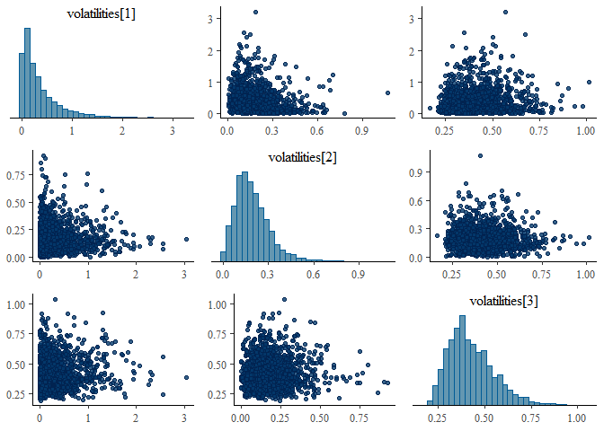<!-- -->

## Plot the posterior estimates of epidemiological quantities

**Visualize the posterior distribution of the random contact matrix:**

``` r
plot_posterior_cm(igbm_fit, y_data = age_specific_mortality_counts)
```

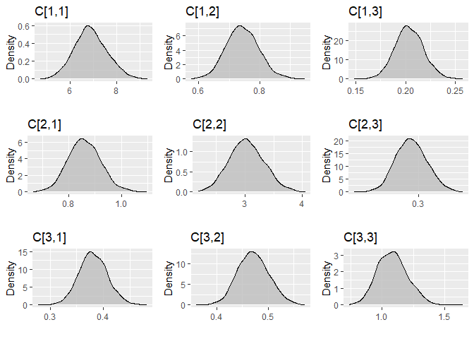<!-- -->

**Visualize the posterior distribution of the age-specific transmission
rate:**

``` r
post_transmrate_summary <- posterior_transmrate(object = igbm_fit,
                                                y_data = age_specific_mortality_counts)
plot_posterior_transmrate(post_transmrate_summary)
```

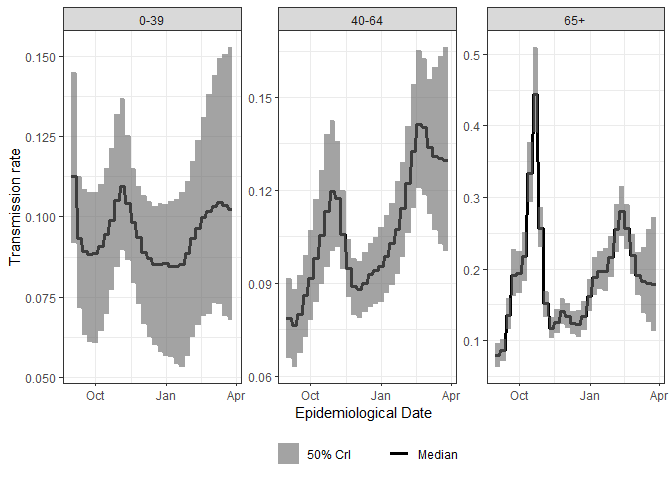<!-- -->

The piecewise-constant behavior in the posterior estimates of the
age-specific transmission rate is caused by the assumption that the
effective contact rate is allowed to change every 7 days. The respective
posterior trajectories will be smoothed when more frequent changes are
allowed.

**Visualize the posterior distribution of the effective reproduction
number:**

``` r
post_rt_summary <- posterior_rt(object                      = igbm_fit,
                                y_data                      = age_specific_mortality_counts,
                                age_distribution_population = aggr_age,
                                infectious_period           = 4)
plot_posterior_rt(post_rt_summary)
```

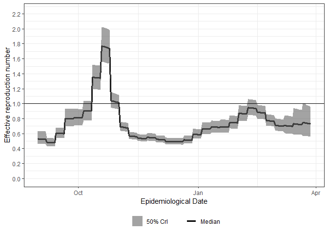<!-- -->

**Visualize the posterior distribution (age-specific or aggregated daily
estimates) of the infection counts:**

``` r
post_inf_summary <- posterior_infections(object = igbm_fit,
                                         y_data = age_specific_mortality_counts)
```

``` r
plot_posterior_infections(post_inf_summary, type = "age-specific")
```

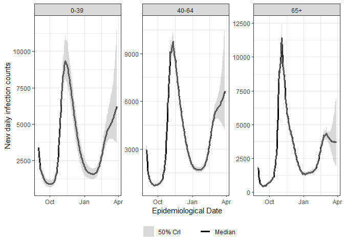<!-- -->

``` r
plot_posterior_infections(post_inf_summary, type = "aggregated")
```

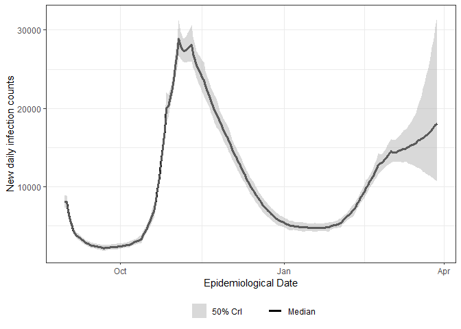<!-- -->

**Visualize the posterior distribution (age-specific or aggregated daily
estimates) of the mortality counts:**

``` r
post_mortality_summary <- posterior_mortality(object = igbm_fit,
                                              y_data = age_specific_mortality_counts)
```

``` r
plot_posterior_mortality(post_mortality_summary, type = "age-specific")
```

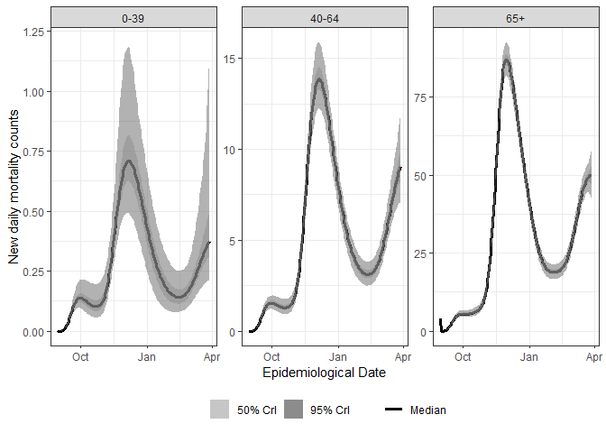<!-- -->

``` r
plot_posterior_mortality(post_mortality_summary, type = "aggregated")
```

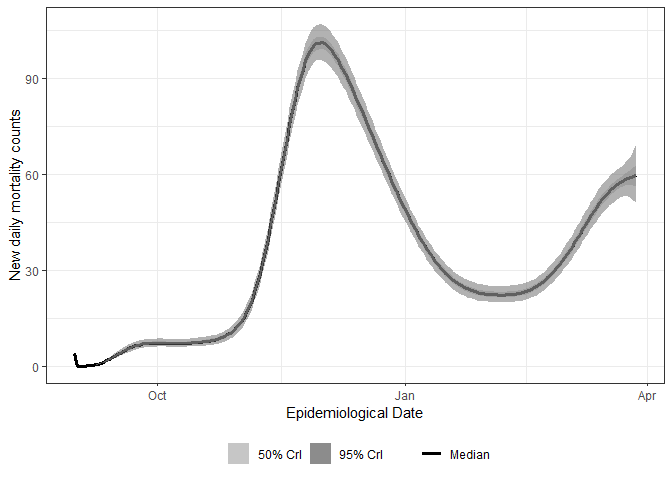<!-- -->

## Model checking and comparison with loo

For more information about the **loo** package visit the [dedicated
website](https://mc-stan.org/loo/).

``` r
# (for bigger models use as many cores as possible)
log_lik_1 <- loo::extract_log_lik(igbm_fit, merge_chains = FALSE)
r_eff_1   <- loo::relative_eff(exp(log_lik_1), cores = 4)
```

The estimated LOO Information Criterion and the respective estimated
effective number of parameters are given by

``` r
loo_1 <- loo::loo(log_lik_1, r_eff = r_eff_1, cores = 4)
```

    ## Warning: Some Pareto k diagnostic values are slightly high. See help('pareto-k-diagnostic') for details.

``` r
print(loo_1)
```

    ## 
    ## Computed from 3000 by 210 log-likelihood matrix
    ## 
    ##          Estimate   SE
    ## elpd_loo  -1251.2 29.1
    ## p_loo        20.3  1.3
    ## looic      2502.3 58.2
    ## ------
    ## Monte Carlo SE of elpd_loo is 0.1.
    ## 
    ## Pareto k diagnostic values:
    ##                          Count Pct.    Min. n_eff
    ## (-Inf, 0.5]   (good)     209   99.5%   1303      
    ##  (0.5, 0.7]   (ok)         1    0.5%   1703      
    ##    (0.7, 1]   (bad)        0    0.0%   <NA>      
    ##    (1, Inf)   (very bad)   0    0.0%   <NA>      
    ## 
    ## All Pareto k estimates are ok (k < 0.7).
    ## See help('pareto-k-diagnostic') for details.

The estimated Widely Applicable Information Criterion and the respective
estimated effective number of parameters are given by

``` r
waic_1 <- loo::waic(log_lik_1)
```

    ## Warning: 
    ## 2 (1.0%) p_waic estimates greater than 0.4. We recommend trying loo instead.

``` r
print(waic_1)
```

    ## 
    ## Computed from 3000 by 210 log-likelihood matrix
    ## 
    ##           Estimate   SE
    ## elpd_waic  -1251.1 29.1
    ## p_waic        20.2  1.3
    ## waic        2502.1 58.2
    ## 
    ## 2 (1.0%) p_waic estimates greater than 0.4. We recommend trying loo instead.

## References

\[1\] Bouranis, L., Demiris, N., Kalogeropoulos, K., & Ntzoufras, I.
(2022). *Bayesian analysis of diffusion-driven multi-type epidemic
models with application to COVID-19*. arXiv.
<https://doi.org/10.48550/arXiv.2211.15229>

## Original Computing Environment

``` r
writeLines(readLines(file.path(Sys.getenv("HOME"), ".R/Makevars")))
```

``` r
CXX14FLAGS=-O3 -Wno-unused-variable -Wno-unused-function
CXX14 = $(BINPREF)g++ -m$(WIN) -std=c++1y
CXX11FLAGS=-O3 -Wno-unused-variable -Wno-unused-function
```

``` r
sessionInfo()
```

``` r
R version 4.1.0 (2021-05-18)
Platform: x86_64-w64-mingw32/x64 (64-bit)
Running under: Windows 10 x64 (build 19045)

Matrix products: default

locale:
  [1] LC_COLLATE=English_United States.1252  LC_CTYPE=English_United States.1252    LC_MONETARY=English_United States.1252
[4] LC_NUMERIC=C                           LC_TIME=English_United States.1252    

attached base packages:
  [1] stats     graphics  grDevices utils     datasets  methods   base     

other attached packages:
  [1] loo_2.4.1            Bernadette_1.1.4     bayesplot_1.8.1      rstan_2.21.3         StanHeaders_2.21.0-7
[6] ggplot2_3.3.5       

loaded via a namespace (and not attached):
  [1] tidyselect_1.1.1   purrr_0.3.4        reshape2_1.4.4     colorspace_2.0-2   vctrs_0.3.8        generics_0.1.0
[7] stats4_4.1.0       utf8_1.2.1         rlang_1.1.1        pkgbuild_1.2.0     pillar_1.6.3       glue_1.4.2    
[13] withr_2.4.2        DBI_1.1.1          matrixStats_0.59.0 lifecycle_1.0.1    plyr_1.8.6         stringr_1.4.0 
[19] munsell_0.5.0      gtable_0.3.0       codetools_0.2-18   labeling_0.4.2     inline_0.3.19      callr_3.7.0   
[25] ps_1.6.0           parallel_4.1.0     fansi_0.5.0        rstantools_2.1.1   Rcpp_1.0.10        scales_1.1.1  
[31] backports_1.2.1    checkmate_2.0.0    RcppParallel_5.1.4 farver_2.1.0       gridExtra_2.3      digest_0.6.28 
[37] stringi_1.6.2      processx_3.5.2     dplyr_1.0.7        grid_4.1.0         cli_3.6.1          tools_4.1.0   
[43] magrittr_2.0.1     tibble_3.1.2       crayon_1.4.1       pkgconfig_2.0.3    ellipsis_0.3.2     prettyunits_1.1.1 
[49] ggridges_0.5.3     assertthat_0.2.1   rstudioapi_0.13    R6_2.5.1           compiler_4.1.0  
```
